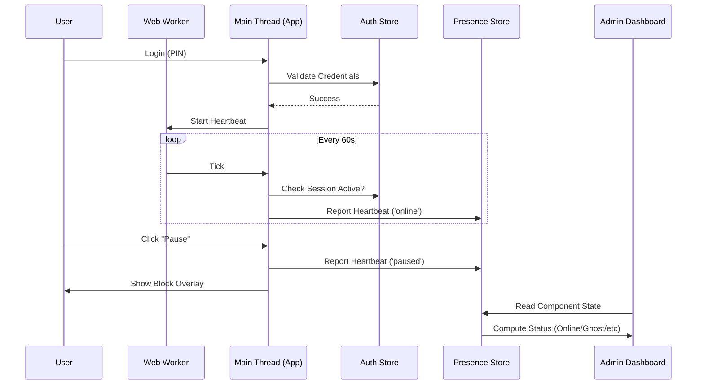

# Arquitectura de Autenticación y Supervisión ("Testigo Silencioso")

## 1. Visión General
El sistema de seguridad de **Tienda de Barrio** ha evolucionado de un modelo restrictivo ("Cerrar Tienda") a un modelo de *Auditoría Continua*. En lugar de bloquear el acceso globalmente, el sistema autentica la identidad, valida el dispositivo y monitorea pasivamente el comportamiento del empleado para detectar anomalías.

---

## 2. Capas de Seguridad

El sistema opera en tres capas concéntricas:

### Capa 1: Identidad y Dispositivo (IAM)
*Responsable: `stores/auth.ts`*

Esta capa responde a: "¿Quién eres y desde dónde te conectas?"

1.  **Autenticación de Usuario:**
    *   **Dueño (Admin):** Credenciales completas (Email + Password). Acceso total.
    *   **Empleado:** Autenticación simplificada (Selección de Perfil + PIN). Acceso restringido.
2.  **Validación de Dispositivo:**
    *   Cada navegador se considera un "Dispositivo".
    *   Estado `deviceApproved`: 'pending' | 'approved' | 'rejected'.
    *   **Regla:** Un empleado NO puede acceder al POS si el dispositivo no está en estado `approved`, incluso con credenciales válidas.

### Capa 2: Control de Acceso (RBAC)
*Responsable: `stores/auth.ts` -> `currentUser.permissions`*

Esta capa responde a: "¿Qué puedes hacer?"

Cada empleado tiene un objeto de permisos granular:
*   `canSell`: Acceso al módulo de ventas.
*   `canFiar`: Permiso para crear deudas.
*   `canOpenCloseCash`: (Nuevo) Permiso para manipular turnos de caja.
*   `canViewReports`: Acceso a métricas.

### Capa 3: Supervisión Continua (Presence)
*Responsable: `stores/presence.ts`, `useHeartbeat.ts`, `heartbeat.worker.ts`*

Esta es la nueva capa "Testigo Silencioso". Responde a: "¿Estás ahí realmente?"

#### Mecanismo de Heartbeat (Latido)
1.  **Generación:** Al iniciar sesión, se lanza un **Web Worker** en segundo plano (`heartbeat.worker.ts`).
2.  **Tick:** Cada 60 segundos, el Worker envía una señal al hilo principal.
3.  **Reporte:** El hilo principal envía un "Latido" al `presenceStore` con el estado actual (`online` o `paused`).
4.  **Resiliencia:**
    *   **Anti-Throttling:** Al usar un Web Worker, el navegador no ralentiza el timer aunque la pestaña esté minimizada.
    *   **Persistencia:** El estado de pausas se guarda en `localStorage` para sobrevivir a recargas de página.

#### Máquina de Estados de Presencia
El sistema infiere el estado del empleado basándose en la última señal recibida (`lastSeen`):

| Estado | Condición | Significado |
|--------|-----------|-------------|
| 🟢 **Online** | Latido < 5 min | Empleado activo y trabajando. |
| 🔵 **Paused** | Botón Pausa activado | Empleado en descanso justificado. |
| ⚪ **Offline** | Sin latido > 5 min | Pérdida de conexión o navegador cerrado. |
| 🔴 **GHOST** | Sin latido > 10 min + Caja Abierta | **ALERTA DE SEGURIDAD**. Posible manipulación o abandono de puesto sin cierre de caja. |

---

## 3. Flujo de Datos

## 5. Ciclo de Vida de la Sesión

### A. Inicio de Sesión (Login)
1.  Usuario introduce credenciales.
2.  Sistema valida y activa `isAuthenticated = true`.
3.  **Heartbeat Start:** Se lanza el Worker y comienza a enviar pulsos 'online'.
4.  **Admin Update:** El panel de control muestra al usuario como 🟢 **Online**.

### B. Durante la Sesión
*   **Actividad:** Pulsos constantes cada 60s.
*   **Pausa:** Usuario activa pausa -> Estado cambia a 🔵 **Paused**.
*   **Inactividad:** Si el usuario no interactúa pero la app sigue abierta, el pulso sigue enviándose (es un heartbeat de sistema, no de actividad de usuario).

### C. Cierre de Sesión (Logout)
Cuando el empleado presiona "Cerrar Sesión" o sale de la aplicación de forma voluntaria:
1.  **Limpieza Local:** Se eliminan credenciales de memoria (`currentUser = null`) y de `localStorage`.
2.  **Detención de Pulso:** `isAuthenticated` pasa a `false`, lo que detiene inmediatamente el envío de señales desde `useHeartbeat`.
3.  **Transición de Estado (Server-Side):**
    *   Al dejar de recibir latidos, el sistema mantiene el último estado conocido (`online` o `paused`) durante el periodo de gracia (5 min).
    *   **Transición a Offline:** Tras 5 minutos de silencio, el sistema marca al usuario como ⚪ **Offline**.
    *   *Nota:* No hay una señal explícita de "Goodbye" para diferenciar un cierre voluntario de una pérdida de red instantánea. Esto es intencional para simplificar la tolerancia a fallos.

## 6. Auditoría y Logs
Todas las transiciones de estado críticas (Inicio de turno, Cierre de caja, Detección Ghost) quedan registradas para su posterior auditoría por el dueño.
