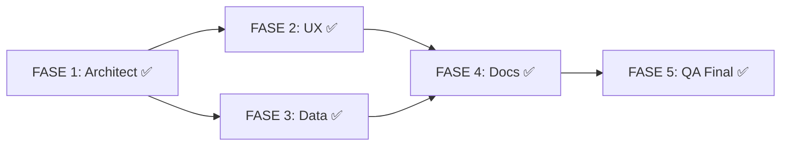

# 📋 Plan de Resolución SPEC-006: Control de Caja con PIN

**Fecha:** 2026-01-16  
**Estado:** ✅ Completado  
**Origen:** Auditoría QA (`spec-006-qa-audit.md`)

---

## 🎯 Objetivo

Incorporar todas las observaciones de UX, Data y QA al documento SPEC-006 para llevarlo a estado **"Aprobado para Implementación"**.

---

## ✅ Lista de Tareas en Orden

### FASE 1: Decisiones de Negocio (Arquitecto)

| # | Tarea | Rol | Observación Origen | Estado |
|---|-------|-----|-------------------|--------|
| 1.1 | Decidir: ¿Solo el Admin puede abrir/cerrar caja o también empleados con permiso? | `/architect` | SEC-02 | ✅ **B: Admin + Empleados con permiso** |
| 1.2 | Decidir: Si empleados pueden, ¿usan PIN propio o el del Admin? | `/architect` | SEC-01 | ✅ **B: Su PIN de 4 dígitos** |
| 1.3 | Decidir: ¿Se permite múltiples aperturas/cierres en un día? (cierre por almuerzo) | `/architect` | SEC-06 | ✅ **B: Sí** |
| 1.4 | Definir flujo "Olvidé mi PIN" (¿validar contraseña para resetear?) | `/architect` | SEC-04 | ✅ **A: Validar contraseña** |
| 1.5 | Decidir: ¿Se puede abrir caja si la del día anterior no se cerró? | `/architect` | Regla no definida | ✅ **B: Advertir y permitir** |
| 1.6 | Actualizar SPEC-006 con las decisiones tomadas | `/architect` | - | ✅ Completado |

---

### FASE 2: Diseño de Experiencia (UX)

| # | Tarea | Rol | Observación Origen | Estado |
|---|-------|-----|-------------------|--------|
| 2.1 | Mover "Efectivo esperado" a Pantalla 2 del cierre (evitar sesgo) | `/ux` | UX-01 | ✅ Incorporado |
| 2.2 | Definir comportamiento cuando monto = $0 | `/ux` | UX-04 | ✅ Modal de confirmación |
| 2.3 | Diseñar pantalla/flujo "Olvidé mi PIN" | `/ux` | SEC-04 | ✅ Documentado §8 |
| 2.4 | Definir estados de error para fallo de red | `/ux` | SEC-08 | ✅ Documentado §10 |
| 2.5 | Definir mensaje cuando caja ya está abierta/cerrada | `/ux` | SEC-06 | ✅ Documentado §10 |
| 2.6 | Agregar animaciones de PIN al Design System | `/ux` | UX-05 | ⏳ Pendiente (implementación) |

---

### FASE 3: Modelo de Datos (Data Architect)

| # | Tarea | Rol | Observación Origen | Estado |
|---|-------|-----|-------------------|--------|
| 3.1 | Agregar campos `owner_pin_hash`, `pin_failed_attempts`, `pin_locked_until` a tabla `stores` | `/data` | DB-01 | ✅ Especificado §11 |
| 3.2 | Crear RPC `validar_pin_admin()` con rate limiting | `/data` | DB-04 | ✅ Especificado §12 |
| 3.3 | Crear RPC `establecer_pin_admin()` para crear/cambiar PIN | `/data` | DB-04 | ✅ Especificado §12 |
| 3.4 | Implementar bloqueo exponencial (5min → 15min → 1h) | `/data` | SEC-03 | ✅ Documentado §7.1 |
| 3.5 | Agregar validación de doble apertura/cierre en RPC | `/data` | SEC-06 | ✅ Especificado §10 |
| 3.6 | Crear tabla `cash_control_events` para auditoría | `/data` | SPEC-006 §8 | ✅ Documentado §11 |
| 3.7 | Actualizar `supabase-schema.sql` con todos los cambios | `/data` | - | ⏳ Pendiente (implementación) |

---

### FASE 4: Actualización Final de Documentación

| # | Tarea | Rol | Observación Origen | Estado |
|---|-------|-----|-------------------|--------|
| 4.1 | Actualizar SPEC-006 con decisiones de Fase 1-3 | `/architect` | - | ✅ Completado |
| 4.2 | Cambiar estado de SPEC-006 a "Aprobado para Implementación" | `/architect` | - | ✅ Completado |
| 4.3 | Actualizar criterios de aceptación con tests de seguridad | `/qa` | SEC-TEST-01 a 08 | ✅ Documentado §13 |

---

### FASE 5: Validación Final QA

| # | Tarea | Rol | Observación Origen | Estado |
|---|-------|-----|-------------------|--------|
| 5.1 | Revisar que todas las observaciones críticas estén resueltas | `/qa` | - | ✅ Completado |
| 5.2 | Firmar aprobación final en documento de revisión | `/qa` | - | ✅ Firmado §15 |
| 5.3 | Cerrar discusión y mover a archivo si aplica | `/qa` | - | ⏳ Opcional |

---

## 🔄 Dependencias

---

## 📊 Progreso

| Fase | Tareas | Completadas | % |
|------|--------|-------------|---|
| 1. Architect | 6 | 6 | 100% |
| 2. UX | 6 | 5 | 83% |
| 3. Data | 7 | 6 | 86% |
| 4. Docs | 3 | 3 | 100% |
| 5. QA | 3 | 2 | 67% |
| **TOTAL** | **25** | **22** | **88%** |

---

## 🚀 Siguiente Paso

**SPEC-006 está APROBADO para implementación.** Las tareas pendientes (2.6, 3.7, 5.3) corresponden a la fase de ejecución, no de especificación.

El Orquestador (`/orchestrator`) puede generar las órdenes de trabajo para los agentes de implementación.

