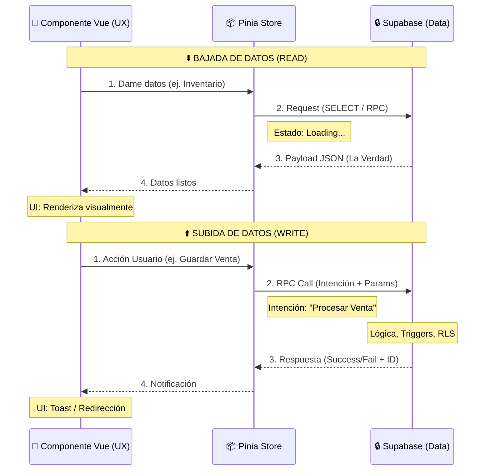

# 📜 Contrato de Flujo de Datos y Responsabilidad

> **Documento Normativo del Sistema**  
> Última actualización: 2026-01-24  
> **Alcance**: Global (Aplica a todos los módulos)

---

## 1. Definición de Roles

Para evitar ambigüedades en la construcción del software, se definen dos roles técnicos con responsabilidades exclusivas:

| Rol | Representante en Código | Responsabilidad Principal | Lema |
|-----|-------------------------|---------------------------|------|
| **Arquitecto de Datos** (Backend) | Supabase (PostgreSQL, RPCs, RLS) | **Definir la Verdad**. Estructura, calcula, valida y asegura el dato. | *"El dato es sagrado y no se negocia"* |
| **Diseñador UX/UI** (Frontend) | Vue Client (Componentes, Stores) | **Definir la Experiencia**. Pide, espera, presenta y comunica el dato. | *"El usuario merece claridad y fluidez"* |

---

## 2. El Contrato de Interfaz

La comunicación se rige por un contrato estricto donde **Backend es la autoridad** y **Frontend es el consumidor**.

### 2.1 Responsabilidades del Backend (@[/data])
1.  **Definir el Payload**: Determina la estructura exacta del JSON (nombres de campos, tipos de datos).
2.  **Cálculos de Negocio**: Realiza TODAS las operaciones matemáticas financieras (totales, impuestos, descuentos, saldos).
    *   *Prohibido*: Que el frontend sume precios para obtener un total de venta.
3.  **Seguridad (RLS)**: Filtra los datos antes de enviarlos. Si el usuario no debe ver algo, el campo no viaja o llega `null`.
4.  **Códigos de Estado**: Retorna códigos de error estandarizados y mensajes técnicos agnósticos de la UI.

### 2.2 Responsabilidades del Frontend (@[/ux])
1.  **Gestión de Estados de Carga**: Decide qué mostrar mientras la promesa del Backend está `pending` (Skeletons, Spinners, Barras de Progreso).
2.  **Visualización**: Decide cómo formatear el dato "crudo" para el humano (Colores, Iconografía, Moneda).
3.  **Manejo de Errores**: Traduce el código de error técnico a un mensaje amigable o una acción correctiva para el usuario.
4.  **Bloqueo de Interacción**: Previene acciones del usuario mientras una operación crítica está en curso (ej. deshabilitar botón "Pagar").

---

## 3. Flujo Unidireccional de Datos

El sistema sigue un flujo de "Una Solas Vía" para garantizar consistencia.



### Reglas de Oro del Flujo
1.  **El Frontend NO "piensa", solo "pide"**: No calcula totales, no valida stock real (solo formato).
2.  **El Store NO es la fuente de verdad**: Es solo una caché temporal de lo que dijo el Backend.
3.  **Datos en Vuelo = Datos Viejos**: Asumimos que cualquier dato en el frontend podría haber cambiado en el servidor milisegundos después. Por eso, las **escrituras** siempre se validan de nuevo en Backend.

---

## 4. Protocolo de Transmisión (Payloads)

### 4.1 Formato de Respuesta de Lista (READ)
```typescript
// Definido por Arquitecto de Datos
type Response = {
  data: items[], // Array puro
  count: number  // Total para paginación (calculado en backend)
}
```

### 4.2 Formato de Respuesta de Acción (WRITE)
```typescript
// Definido por Arquitecto de Datos
type ActionResponse = {
  success: boolean,
  data?: any,       // Si éxito: ID creado, datos resultantes
  error?: string,   // Si fallo: Código de error o mensaje técnico
  code?: string     // Código para que UI decida qué mostrar (ej. 'INSUFFICIENT_FUNDS')
}
```

---

## 5. Gestión de "La Espera" (UX Pattern)

Dado que dependemos de la red, el tiempo de espera es una realidad.

*   **Consultas (GET)**: El Frontend **DEBE** usar *Skeletons* que imiten la estructura definida por el Backend mientras llega la data.
*   **Acciones (POST/RPC)**: El Frontend **DEBE** usar *Loading States* (spinners en botones) y bloquear la re-entrada (doble click) mientras la promesa no se resuelva.
*   **Optimistic UI**: Se permite actualización optimista (asumir éxito visualmente) SOLO en acciones reversibles y banales (ej. "Like", "Marcar leído"). **Nunca en dinero o inventario**.

---

## 6. Resolución de Conflictos

En caso de duda durante el desarrollo:

1.  **¿Dónde pongo este `if`?**
    *   ¿Es para que se vea rojo si es negativo? -> **Frontend**.
    *   ¿Es para impedir la venta si es negativo? -> **Backend**.

2.  **¿Puedo agregar un campo al modelo?**
    *   UX/Frontend **SOLICITA** el campo al Arquitecto.
    *   No se agrega en componentes "mockeados" sin aprobación del esquema.
