# Diagrama Entidad-Relación (ERD)

> **Documento:** Modelo de Datos - Tienda de Barrio Pro v2  
> **Generado desde:** FRDs en `01_REQUIREMENTS/FRD/`  
> **Fecha:** 2026-01-28

---

## Diagrama General

```mermaid
erDiagram
    %% ============================================
    %% MÓDULO: CORE (FRD_002, FRD_003)
    %% ============================================
    
    stores {
        uuid id PK "Identificador único"
        text name "Nombre comercial"
        text slug UK "Identificador amigable único"
        text subscription_plan "Plan: free, pro, enterprise"
        text store_pin_hash "PIN de caja (hasheado)"
        timestamptz created_at "Fecha de creación"
        timestamptz updated_at "Última actualización"
    }
    
    admin_profiles {
        uuid id PK "Referencia a auth.users"
        uuid store_id FK "Tienda asociada"
        text role "owner o manager"
        boolean is_verified "Estado de verificación email"
        timestamptz created_at "Fecha de creación"
    }
    
    employees {
        uuid id PK "Identificador único"
        uuid store_id FK "Tienda (multitenant)"
        text name "Nombre completo"
        text username UK "Alias numérico único global"
        text pin_hash "Hash del PIN 4 dígitos"
        boolean is_active "Estado activo/inactivo"
        jsonb permissions "Permisos adicionales"
        timestamptz created_at "Fecha de creación"
        timestamptz updated_at "Última actualización"
    }
    
    %% ============================================
    %% MÓDULO: INVENTARIO (FRD_006)
    %% ============================================
    
    products {
        uuid id PK "Identificador único"
        uuid store_id FK "Tienda (multitenant)"
        text name "Nombre del producto"
        text plu UK "Código rápido 4 dígitos"
        decimal price "Precio venta (redondeado $50)"
        decimal cost_price "Costo (solo Admin)"
        decimal current_stock "Stock actual"
        decimal min_stock "Stock mínimo para alerta"
        text category "Categoría libre"
        text measurement_unit "unidad, kg, lb, g"
        boolean is_weighable "Requiere peso en POS"
        boolean low_stock_alerted "Alerta ya disparada"
        timestamptz created_at "Fecha de creación"
        timestamptz updated_at "Última actualización"
    }
    
    inventory_movements {
        uuid id PK "Identificador único"
        uuid product_id FK "Producto afectado"
        text movement_type "entrada, salida, ajuste, venta, devolucion"
        decimal quantity "Cantidad movida"
        text reason "Razón del movimiento"
        uuid created_by FK "Empleado que registró"
        timestamptz created_at "Timestamp inmutable"
    }
    
    %% ============================================
    %% MÓDULO: VENTAS (FRD_007)
    %% ============================================
    
    sales {
        uuid id PK "Identificador único"
        uuid store_id FK "Tienda"
        integer ticket_number "Número secuencial UI"
        uuid employee_id FK "Empleado que vendió"
        uuid client_id FK "Cliente (si fiado)"
        decimal total "Total redondeado"
        decimal rounding_difference "Diferencia redondeo"
        text payment_method "efectivo, nequi, daviplata, fiado"
        decimal amount_received "Monto recibido"
        decimal change_given "Vueltas"
        text sync_status "synced, pending, failed"
        boolean is_voided "Si fue anulada"
        uuid voided_by FK "Quien anuló"
        text void_reason "Razón anulación"
        timestamptz created_at "Fecha venta"
    }
    
    sale_items {
        uuid id PK "Identificador único"
        uuid sale_id FK "Venta padre"
        uuid product_id FK "Producto"
        decimal quantity "Cantidad vendida"
        decimal unit_price "Precio unitario al momento"
        decimal subtotal "Subtotal redondeado"
        timestamptz created_at "Timestamp"
    }
    
    %% Relaciones
    admin_profiles ||--o{ stores : "pertenece a"
    employees }o--|| stores : "trabaja en"
    products }o--|| stores : "pertenece a"
    inventory_movements }o--|| products : "afecta"
    inventory_movements }o--|| employees : "registrado por"
    sales }o--|| stores : "pertenece a"
    sales }o--|| employees : "vendido por"
    sales }o--o| clients : "fiado a"
    sale_items }o--|| sales : "parte de"
    sale_items }o--|| products : "producto vendido"
    
    %% ============================================
    %% MÓDULO: CLIENTES (FRD_009)
    %% ============================================
    
    clients {
        uuid id PK "Identificador único"
        uuid store_id FK "Tienda (multitenant)"
        text name "Nombre completo"
        text id_number UK "Cédula única por tienda"
        text phone "Teléfono contacto"
        decimal credit_limit "Cupo de crédito"
        decimal balance "Saldo actual >= 0"
        boolean is_deleted "Soft delete flag"
        timestamptz deleted_at "Fecha borrado lógico"
        timestamptz created_at "Fecha creación"
        timestamptz updated_at "Última actualización"
    }
    
    client_transactions {
        uuid id PK "Identificador único"
        uuid client_id FK "Cliente"
        text transaction_type "compra o pago"
        decimal amount "Monto siempre positivo"
        text description "Descripción"
        uuid sale_id FK "Referencia a venta"
        timestamptz created_at "Timestamp inmutable"
    }
    
    clients }o--|| stores : "pertenece a"
    client_transactions }o--|| clients : "transacción de"
    client_transactions }o--o| sales : "referencia venta"
    
    %% ============================================
    %% MÓDULO: CONTROL DE CAJA (FRD_004)
    %% ============================================
    
    cash_sessions {
        uuid id PK "Identificador único"
        uuid store_id FK "Tienda (1 abierta max)"
        uuid opened_by FK "Empleado que abrió"
        uuid closed_by FK "Empleado que cerró"
        decimal opening_balance "Fondo de cambio"
        decimal expected_balance "Calculado por sistema"
        decimal actual_balance "Declarado por usuario"
        decimal difference "Diferencia esperado-real"
        text status "open o closed"
        timestamptz opened_at "Timestamp apertura"
        timestamptz closed_at "Timestamp cierre"
    }
    
    cash_movements {
        uuid id PK "Identificador único"
        uuid session_id FK "Sesión de caja"
        text movement_type "ingreso o gasto"
        decimal amount "Monto"
        text description "Descripción obligatoria"
        uuid sale_id FK "Ref venta si aplica"
        timestamptz created_at "Timestamp inmutable"
    }
    
    cash_sessions }o--|| stores : "pertenece a"
    cash_sessions }o--|| employees : "abierta por"
    cash_sessions }o--o| employees : "cerrada por"
    cash_movements }o--|| cash_sessions : "parte de"
    cash_movements }o--o| sales : "referencia venta"
    
    %% ============================================
    %% MÓDULO: SEGURIDAD DIARIA (FRD_001)
    %% ============================================
    
    daily_passes {
        uuid id PK "Identificador único"
        uuid employee_id FK "Empleado solicitante"
        date pass_date "Fecha del pase"
        text status "pending, approved, rejected, expired"
        text device_fingerprint "Huella dispositivo"
        integer retry_count "Reintentos 0-3"
        timestamptz requested_at "Timestamp solicitud"
        timestamptz resolved_at "Timestamp resolución"
        uuid resolved_by FK "Admin que resolvió"
    }
    
    daily_passes }o--|| employees : "pertenece a"
    daily_passes }o--o| employees : "resuelto por"
    
    %% ============================================
    %% MÓDULO: AUDITORÍA (QA_ADDENDUM §4.3)
    %% ============================================
    
    audit_logs {
        uuid id PK "Identificador único"
        uuid store_id FK "Tienda"
        text event_type "Tipo de evento"
        text severity "info, warning, critical"
        uuid actor_id FK "Usuario que generó evento"
        text actor_role "admin o employee"
        jsonb metadata "Datos adicionales"
        text ip_address "IP del cliente"
        text user_agent "Navegador/dispositivo"
        timestamptz created_at "Timestamp inmutable"
    }
    
    audit_logs }o--|| stores : "pertenece a"
    
    %% ============================================
    %% MÓDULO: HISTORIAL PRECIOS (FRD_010)
    %% ============================================
    
    price_change_logs {
        uuid id PK "Identificador único"
        uuid product_id FK "Producto"
        decimal previous_price "Precio anterior"
        decimal new_price "Precio nuevo"
        uuid changed_by FK "Empleado que cambió"
        text reason "Motivo opcional"
        timestamptz created_at "Timestamp inmutable"
    }
    
    price_change_logs }o--|| products : "historial de"
    price_change_logs }o--|| employees : "cambiado por"
```

---

## Trazabilidad

| Entidad | FRD Origen | Sección |
|---------|------------|---------|
| `stores` | FRD_002 | Requisitos de Datos - Entidad Tienda |
| `admin_profiles` | FRD_002 | Requisitos de Datos - Entidad Perfil de Admin |
| `employees` | FRD_003 | Requisitos de Datos - Entidad Empleado |
| `products` | FRD_006 | Requisitos de Datos - Entidad Producto |
| `inventory_movements` | FRD_006 | Requisitos de Datos - Entidad Movimientos |
| `sales` | FRD_007 | Requisitos de Datos - Entidad Venta |
| `sale_items` | FRD_007 | Requisitos de Datos - Items de Venta |
| `clients` | FRD_009 | Requisitos de Datos - Entidad Cliente |
| `client_transactions` | FRD_009 | Requisitos de Datos - Transacción de Cliente |
| `cash_sessions` | FRD_004 | Requisitos de Datos - Sesión de Caja |
| `cash_movements` | FRD_004 | Requisitos de Datos - Transacción de Caja |
| `daily_passes` | FRD_001 | Requisitos de Datos - Pase Diario |
| `audit_logs` | QA_ADDENDUM | §4.3 Logs de Seguridad |
| `price_change_logs` | FRD_010 | Historial de Precios |
| `sync_queue` | FRD_012 | Cola de Sincronización Offline |
| `daily_reports` | FRD_008 | Reportes Diarios |
| `error_logs` | QA_ADDENDUM | Manejo de Errores |
