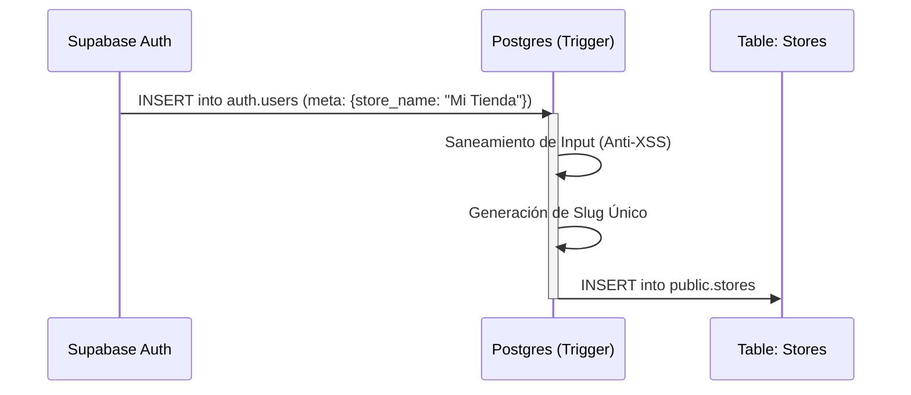

# DSD-001: Registro Nativo (Disparadores)

> **Basado en:** FRD-002 (Alta de Nuevas Tiendas)
> **Rol:** Arquitecto de Datos

### Explicación Lógica
Para garantizar la integridad "1 Usuario = 1 Tienda" sin depender del frontend, utilizaremos un **Trigger de Postgres** que escucha la tabla `auth.users`.
Cuando un usuario se crea, el trigger intercepta los metadatos (`store_name`) y crea la entrada correspondiente en `public.stores`.

---

## Diagrama de Flujo de Datos



---

## Función de Servidor (Trigger)

### Función: `handle_new_user_store()`
- **Evento:** `AFTER INSERT ON auth.users`
- **Lógica:**
    1.  Verificar si existe `raw_user_meta_data->>'store_name'`.
    2.  Si no existe, asumir invitación y terminar (no crear tienda).
    3.  Sanear el nombre (limitar caracteres).
    4.  Generar un `slug` (URL amigable) a partir del nombre.
    5.  Insertar en `public.stores`.
    6.  Asignar el `owner_id` al `new.id`.

---

## Script SQL Definitive

```sql
-- 1. Función para generar slugs (Utilidad)
CREATE OR REPLACE FUNCTION public.slugify(value TEXT)
RETURNS TEXT AS $$
BEGIN
  RETURN lower(regexp_replace(trim(value), '[^a-zA-Z0-9]', '-', 'g'));
END;
$$ LANGUAGE plpgsql IMMUTABLE STRICT;

-- 2. Función Principal del Trigger
CREATE OR REPLACE FUNCTION public.handle_new_user_store()
RETURNS TRIGGER AS $$
DECLARE
  v_store_name TEXT;
  v_slug TEXT;
  v_base_slug TEXT;
  v_counter INT := 1;
BEGIN
  -- Extraer nombre de la tienda de los metadatos
  v_store_name := new.raw_user_meta_data->>'store_name';

  -- Si no hay nombre de tienda, no hacemos nada (puede ser un usuario invitado después)
  IF v_store_name IS NULL THEN
    RETURN new;
  END IF;

  -- Saneamiento Básico (Cortar a 50 chars)
  v_store_name := LEFT(v_store_name, 50);

  -- Generar Slug Base
  v_base_slug := public.slugify(v_store_name);
  v_slug := v_base_slug;

  -- Manejo de Colisiones de Slug (Si "mi-tienda" existe, probar "mi-tienda-1")
  WHILE EXISTS (SELECT 1 FROM public.stores WHERE slug = v_slug) LOOP
    v_slug := v_base_slug || '-' || v_counter;
    v_counter := v_counter + 1;
  END LOOP;

  -- Inserción Atómica
  INSERT INTO public.stores (name, slug, owner_id)
  VALUES (v_store_name, v_slug, new.id);

  RETURN new;
EXCEPTION WHEN OTHERS THEN
  -- En caso de error crítico, loguear pero no impedir la creación del usuario (Resiliencia)
  -- Opcional: RAISE EXCEPTION si queremos que falle todo el registro.
  -- Decisión Arquitecto: RAISE para garantizar consistencia.
  RAISE EXCEPTION 'Error al crear la tienda automática: %', SQLERRM;
END;
$$ LANGUAGE plpgsql SECURITY DEFINER;

-- 3. Definición del Trigger
DROP TRIGGER IF EXISTS on_auth_user_created ON auth.users;
CREATE TRIGGER on_auth_user_created
  AFTER INSERT ON auth.users
  FOR EACH ROW EXECUTE PROCEDURE public.handle_new_user_store();
```

---

## Diccionario de Datos Afectado

### Tabla: `public.stores` (Actualización)
| Columna | Tipo | Descripción |
|---------|------|-------------|
| id | UUID | PK, Default gen_random_uuid() |
| owner_id | UUID | FK -> auth.users.id (NOT NULL) |
| name | TEXT | Nombre comercial saneado |
| slug | TEXT | Identificador único URL (Indice Unique) |
