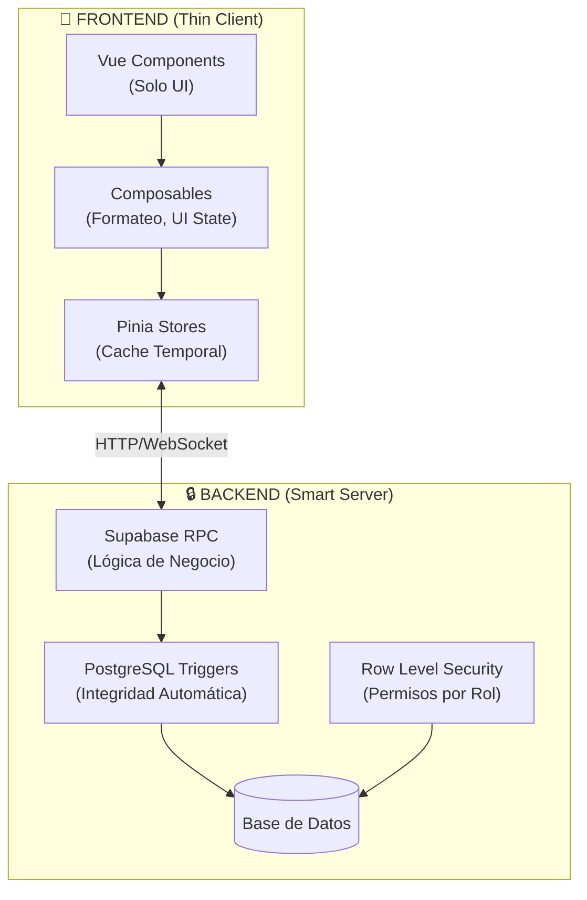
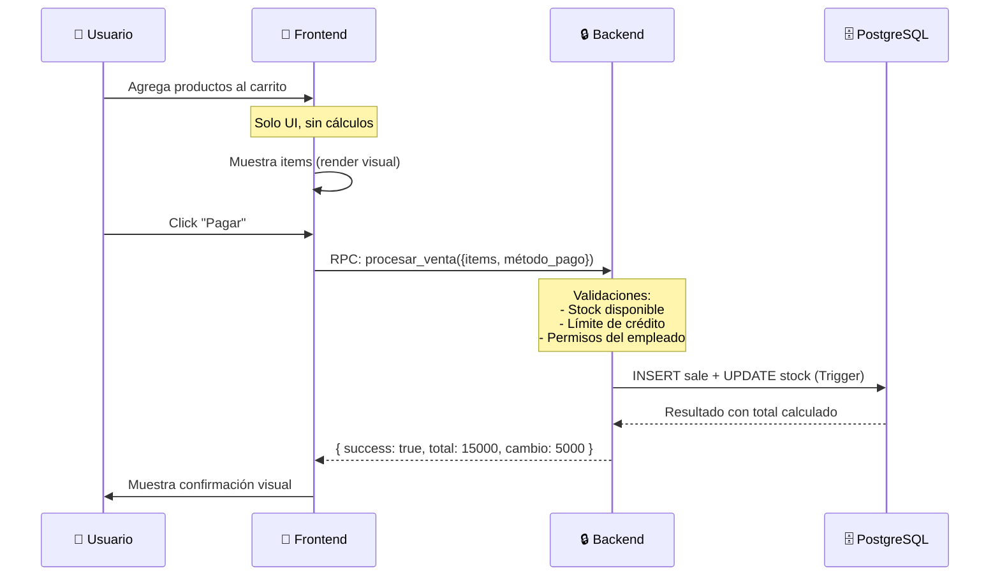

# Arquitectura Thin Client (Frontend Ligero)

> **Documento de Referencia Arquitectónica**  
> Última actualización: 2026-01-19

---

## Resumen Ejecutivo

La arquitectura seleccionada para "Tienda de Barrio Pro" es **Thin Client Architecture** (Cliente Ligero), también conocida como:

- **Backend-First Architecture**
- **Presentation-Tier Pattern**
- **Dumb Frontend / Smart Backend**

Esta arquitectura es óptima para aplicaciones **Mobile-First** donde el frontend actúa exclusivamente como capa de presentación, delegando **toda la lógica de negocio** al backend.

---

## ¿Por Qué Esta Arquitectura?

### Problema con "Fat Clients" (Cliente Grueso)

| Aspecto | Fat Client (Malo para Móvil) | Thin Client (Óptimo para Móvil) |
|---------|------------------------------|----------------------------------|
| **Lógica** | Cálculos en JavaScript del navegador | Cálculos en servidor (PostgreSQL/Supabase) |
| **Batería** | Alto consumo (CPU del celular) | Bajo consumo (servidor procesa) |
| **Seguridad** | Código expuesto en DevTools | Lógica oculta en backend |
| **Sincronización** | "Estado fantasma" entre dispositivos | Una única fuente de verdad |
| **Validaciones** | Duplicadas (frontend + backend) | Centralizadas en backend |

### Caso Real: Tienda de Barrio

```
❌ FAT CLIENT (Anti-patrón):
   Frontend calcula: total = items.reduce((sum, i) => sum + i.price * i.qty, 0)
   → Usuario manipula JavaScript → fraude de precios

✅ THIN CLIENT (Nuestra arquitectura):
   Frontend envía: { items: [...], payment_method: 'cash' }
   Backend calcula: total, stock, crédito, todo validado
   → Frontend solo muestra resultado
```

---

## Diagrama de Capas



---

## Responsabilidades por Capa

### 📱 Frontend (Vue 3 + Vite)

| Responsabilidad | Lo que HACE | Lo que NO HACE |
|-----------------|-------------|----------------|
| **Presentación** | Renderizar HTML/CSS | Calcular totales de venta |
| **Eventos** | Capturar clicks, inputs | Validar reglas de negocio |
| **Navegación** | Vue Router entre vistas | Decidir permisos de acceso |
| **Formateo** | Mostrar `$1,500` formateado | Calcular precios |
| **Cache local** | Almacenar temporalmente en Pinia | Ser fuente de verdad |

#### Estructura de Carpetas Frontend

```
src/
├── views/           # Solo presentación (HTML/CSS)
├── components/      # UI reutilizable
│   └── ui/          # StatCard, Modal, etc.
├── composables/     # Lógica de UI (formateo, animaciones)
├── stores/          # Cache temporal (Pinia)
├── data/
│   ├── repositories/  # Abstracción de fuente de datos
│   └── serializers/   # Conversión JSON ↔ Objetos
└── router/          # Navegación
```

### 🔒 Backend (Supabase/PostgreSQL)

| Responsabilidad | Implementación |
|-----------------|----------------|
| **Lógica de Negocio** | Funciones RPC (`procesar_venta`, `login_empleado`) |
| **Integridad de Datos** | Triggers SQL (actualización automática de stock) |
| **Seguridad** | RLS Policies (roles admin/vendedor) |
| **Validaciones** | Constraints y checks en base de datos |
| **Cálculos Críticos** | Precios, descuentos, créditos calculados en SQL |
| **Reportes** | Funciones RPC que retornan JSON agregado |

---

## Flujo de Datos (Data Flow)

### Ejemplo: Proceso de Venta



---

## Principios de Diseño

### 1. **Frontend como "Vista Tonta"**

```typescript
// ✅ CORRECTO: Frontend solo muestra
const total = computed(() => sale.value?.total ?? 0)

// ❌ INCORRECTO: Frontend calculando
const total = computed(() => 
  items.value.reduce((sum, i) => sum + i.price * i.qty, 0)
)
```

### 2. **Backend como "Cerebro"**

```sql
-- Toda la lógica vive aquí
CREATE FUNCTION procesar_venta(p_items JSON, p_metodo TEXT)
RETURNS JSON AS $$
  -- Calcular total
  -- Validar stock
  -- Validar crédito
  -- Registrar venta
  -- Actualizar inventario (trigger)
  -- Retornar resultado
$$;
```

### 3. **Una Única Fuente de Verdad**

```typescript
// Frontend NO es fuente de verdad
const inventoryStore = defineStore('inventory', () => {
  const products = ref<Product[]>([])
  
  // Siempre cargar desde backend
  const fetchProducts = async () => {
    const { data } = await supabase.from('products').select('*')
    products.value = data ?? []
  }
  
  // Suscripción en tiempo real para sincronización
  const subscribe = () => {
    supabase.channel('products').on('postgres_changes', 
      { event: '*', table: 'products' },
      () => fetchProducts()
    ).subscribe()
  }
  
  return { products, fetchProducts, subscribe }
})
```

---

## Comparación con Otras Arquitecturas

| Arquitectura | Lógica en Frontend | Uso Ideal | Nuestra App |
|--------------|-------------------|-----------|-------------|
| **SPA Tradicional** | Alta | Apps de productividad personal | ❌ |
| **Jamstack** | Media | Blogs, portfolios | ❌ |
| **Thin Client** | Nula | Apps transaccionales/móviles | ✅ |
| **PWA Offline-First** | Alta (sincronizada) | Apps con conectividad limitada | Futuro |

---

## Beneficios para Mobile-First

| Beneficio | Explicación |
|-----------|-------------|
| **🔋 Menor consumo de batería** | El celular no ejecuta cálculos pesados |
| **📶 Menor uso de datos** | Solo se envían/reciben JSONs pequeños |
| **🔒 Seguridad mejorada** | Código de negocio no expuesto |
| **🔄 Sincronización automática** | WebSockets de Supabase |
| **📱 UI más fluida** | El hilo de JS no se bloquea con cálculos |

---

## Stack Tecnológico

### Frontend

| Tecnología | Propósito |
|------------|-----------|
| **Vue 3** | Framework reactivo (Composition API) |
| **Vite** | Bundler y dev server ultrarrápido |
| **Pinia** | Estado global (cache temporal) |
| **Vue Router** | Navegación SPA |
| **TailwindCSS** | Estilos utility-first |
| **Lucide Icons** | Iconografía |
| **Decimal.js** | Precisión numérica (solo formateo) |

### Backend

| Tecnología | Propósito |
|------------|-----------|
| **Supabase** | Backend-as-a-Service |
| **PostgreSQL** | Base de datos + lógica (RPC/Triggers) |
| **RLS** | Seguridad a nivel de fila |
| **Realtime** | Sincronización WebSocket |

---

## Documentos Relacionados

| Documento | Contenido |
|-----------|-----------|
| [architecture.md](./architecture.md) | Estructura de carpetas del frontend |
| [architecture-supabase.md](./architecture-supabase.md) | Implementación detallada del backend |
| [supabase-schema.sql](./supabase-schema.sql) | Schema completo de base de datos |
| [SECURITY_PROTOCOLS.md](./SECURITY_PROTOCOLS.md) | Protocolos de seguridad |

---

## Glosario

| Término | Definición |
|---------|------------|
| **Thin Client** | Frontend que solo presenta datos, sin lógica de negocio |
| **Fat Client** | Frontend que ejecuta lógica de negocio (anti-patrón para móvil) |
| **RPC** | Remote Procedure Call - funciones ejecutadas en el servidor |
| **RLS** | Row Level Security - permisos a nivel de fila en PostgreSQL |
| **Trigger** | Función automática que se ejecuta ante evento en BD |

---

## Conclusión

> **"El frontend es como un cajero automático: muestra la pantalla y captura botones, pero el banco (backend) decide si aprueba la transacción."**

Esta arquitectura garantiza:

1. ✅ **Seguridad**: Lógica inaccesible desde el navegador
2. ✅ **Rendimiento**: Celulares no ejecutan cálculos pesados
3. ✅ **Integridad**: Una única fuente de verdad en PostgreSQL
4. ✅ **Escalabilidad**: Múltiples dispositivos sincronizados
5. ✅ **Mantenibilidad**: Cambios de lógica solo en backend
