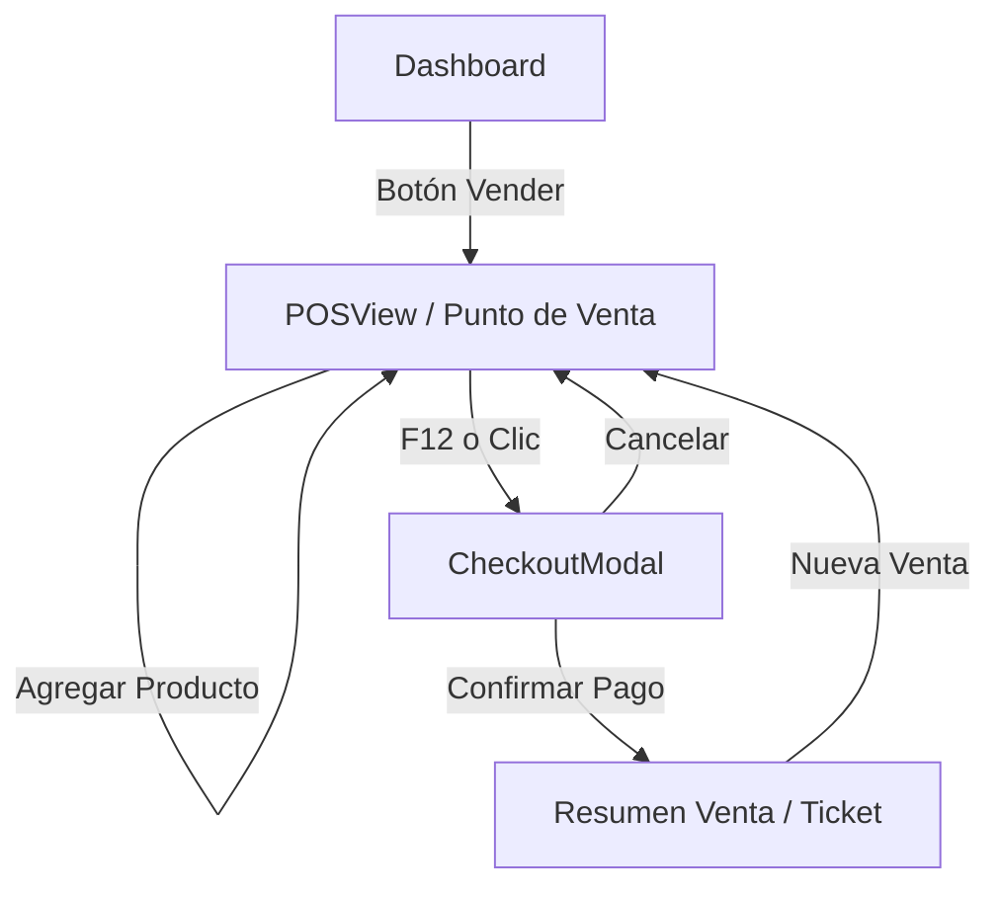

# Diseño UX/UI - Sistema POS y Checkout (WO-PHASE2-002)

## 1. Mapa de Navegación

El flujo de venta se centra en la vista `POSView` y utiliza un modal crítico para la finalización de la transacción.

---

## 2. Detalle de Pantalla: POSView (Refinamiento)

Aunque la estructura base ya existe, se añaden elementos visuales para las nuevas funcionalidades.

### Toolbar Superior
- **Indicador de Atajos**: Pequeño tooltip o texto "F12 Cobrar" junto al total.

### Lista de Carrito
- **Visualización de Redondeo**: Si un item fue ajustado por redondeo (pesables), mostrar un pequeño indicador `≈` o info icon.
- **Validación de Stock**: Si `cantidad > stock`, resaltar la línea en rojo suave con mensaje "Stock insuficiente" (si la configuración bloquea negativos).

### Footer
- **Botón Cobrar**:
  - Estado Default: Azul primario.
  - Estado Empty Cart: Deshabilitado (Gris).
  - Label: "COBRAR $ Total"

---

## 3. Detalle de Pantalla: CheckoutModal

Este es el componente core de esta WO. Debe ser ágil y teclado-friendly.

### Estructura Visual (Grid de 2 Columnas en Desktop / Stack en Mobile)

#### Columna Izquierda: Resumen (Solo Desktop/Tablet large)
- Lista compacta de items: `3x Arroz... $12.000`
- Subtotal
- Total General (Múltiplo de $50)

#### Columna Derecha / Principal: Pago
1.  **Gran Total**:
    -   Tipografía Gigante (4xl).
    -   Color: `text-slate-900` dark: `text-white`.
2.  **Selector de Método de Pago** (Tabs o Grid de botones grandes):
    -   💵 **Efectivo** (Default)
    -   📱 **Transferencia** (Nequi/Daviplata)
    -   🤝 **Crédito** (Fiado)
3.  **Área Dinámica según Método**:
    -   **Efectivo**:
        -   Input "Recibido": Autofocus.
        -   Botones Rápidos: "Exacto", "+$2.000", "+$5.000", "$20.000", "$50.000".
        -   Display "Cambio/Vueltos": Verde si > 0, Rojo si falta.
    -   **Transferencia**:
        -   Input Referencia (Opcional).
        -   Alert: "Verificar recepción en app bancaria".
    -   **Crédito**:
        -   Buscador de Cliente (Autocomplete).
        -   Info del Cliente: "Cupo disponible: $XXX".
4.  **Botonera Inferior**:
    -   Cancelar (Esc).
    -   **CONFIRMAR PAGO** (Enter):
        -   Grande, ancho completo.
        -   Deshabilitado si `Recibido < Total` (Efectivo) o sin Cliente (Fiado).

---

## 4. Lógica de Componentes

### Política de Redondeo (Client-Side)
- **Función**: `roundHybrid50(valor)` en `useCurrencyFormat`.
- **Trigger**:
  - Al agregar item pesable: `subtotal = roundHybrid50(peso * precio)`.
  - Al editar cantidad: `subtotal = roundHybrid50(cantidad * precio)` (aunque en unitarios el precio ya debería ser redondo, doble seguridad).
  - El `Total` del carrito es la suma de subtotales ya redondeados.

### CartStore
- **Acción `addItem`**:
  - Verificar `inventoryStore.getStock(id)`.
  - Si `currentQty + addQty > stock`:
    - Opción A: Bloquear y notificar "Solo quedan X unidades". (Default fase 2).
    - Opción B: Permitir con warning (Configurable futuro).

### CheckoutModal
- **Atajos**:
  - `Esc`: Cerrar.
  - `F1`...`F3`: Cambiar método pago.
  - `Enter`: Confirmar (si es válido).
- **Cálculo de Vueltos**:
  - `vueltos = recibido - total`.
  - Si `vueltos < 0`, mostrar "Faltan $XXX".

---

## 5. Instrucción para el Orquestador

1.  **Utils**: Crear `src/utils/rounding.ts` o actualizar `useCurrencyFormat.ts` con la lógica de 50 pesos.
2.  **Store**: Actualizar `CartStore` para:
    -   Importar utilidad de redondeo.
    -   Validar stock contra `InventoryStore` antes de mutar el estado.
3.  **Componentes**:
    -   Crear `src/components/sales/CheckoutModal.vue`.
    -   Actualizar `POSView.vue` para escuchar teclado (F12) y abrir modal.
4.  **Persistencia**:
    -   Conectar el botón "Confirmar" con `SaleRepository.createSale()`.
    -   Manejar éxito/error (Toast notification).

---
