# Mapa de Lógica Global - Tienda de Barrio Pro

> **Última actualización:** 2026-01-20 (v12 - Backend Verification & Standards)  
> **Rama:** master  
> **Propósito:** Hoja de ruta para sincronización código ↔ documentación

---

## 📁 Estructura de Carpetas del Proyecto

```
prueba/
├── 01_REQUIREMENTS/     # Especificaciones de requisitos
├── 02_ARCHITECTURE/     # Arquitectura técnica y DB
├── 03_UI_UX_DESIGN/     # 🆕 Diseño de interacción (UX/UI)
├── 03_SRC/              # Código fuente (Vue 3 + Pinia)
└── 04_DEV_ORCHESTRATION/# Orquestación y documentación de desarrollo
```

---

## 🎨 Estructura de Carpeta 03_UI_UX_DESIGN (NUEVO)

```
03_UI_UX_DESIGN/
├── README.md                       # Índice y principios de diseño
├── 01_USER_FLOWS.md                # 6 flujos de usuario (Mermaid)
├── 02_INFORMATION_ARCHITECTURE.md  # Mapa de navegación
├── 03_WIREFRAMES_DESCRIPTIVOS.md   # 7 wireframes detallados
├── 04_DESIGN_SYSTEM.md             # Tokens: colores, tipografía, espaciado
└── 05_COMPONENT_LOGIC.md           # Lógica de Numpad, Modales, Estados
```

---

## 📁 Estructura de Carpeta 01_REQUIREMENTS

```
01_REQUIREMENTS/
├── proposals/          # 💡 Borradores (prop-nombre-vX.md)
├── discussions/        # ⚠️ Observaciones (obs-rol-nombre.md)
├── archive/            # 📦 Documentos obsoletos
│   └── stitch_inicio_dashboard/  # Legacy UI mockups
├── README.md           # Índice de la carpeta
├── dashboard.md        # ✅ [FINAL]
├── pos.md              # ✅ [FINAL]
├── decimal-format-standard.md # 🆕 [ESTÁNDAR]
├── rounding-policy.md         # 🆕 [ESTÁNDAR]
└── ... (26 documentos finales)
```

## 📏 Estándares y Estrategias Técnicas (NUEVO)

Documentos transversales que rigen la calidad y arquitectura:

| Documento | Propósito | Estado |
|-----------|-----------|--------|
| `decimal-format-standard.md` | Estandarización de visualización de precios y pesos | ✅ Definido |
| `rounding-policy.md` | Reglas matemáticas de redondeo y almacenamiento | ✅ Definido |
| `cache-strategy.md` | Estrategia de invalidación y persistencia | ✅ Definido |
| `backend-verification-strategy.md` | Plan de pruebas aisladas SQL | ✅ En Ejecución |
| `pin-cash-control.md` | Seguridad en manejo de dineros y PINs | ✅ Auditado |
| `DEPENDENCIES.md` | Arquitectura de librerías y auditoría QA | ✅ Auditado |
| `pwa-strategy.md` | Estrategia Offline-First e Instalación | ✅ Auditado |
| `SECURITY_STANDARDS.md` | Especificación Técnica de Seguridad y Encriptación | ✅ Estándar |

> 📖 Ver **SISTEMA_TRAZABILIDAD.md** para reglas de gobernanza completas.

---

## 📊 Resumen Ejecutivo

| Métrica | Valor |
|---------|-------|
| Vistas en código (`03_SRC/src/views/`) | 15 |
| Módulos documentados (`01_REQUIREMENTS/`) | 26 ⬆️ |
| Módulos sincronizados (100%) | 20 ✅ |
| Documentos de diseño UX/UI (`03_UI_UX_DESIGN/`) | 6 |
| Estándares Técnicos | 5 (Decimal, Rounding, Cache, Security, Verif) 🆕 |
| Especificaciones implementadas | SPEC-005 IAM ✅, Backend RPCs ✅ |
| Vistas sin documentación | 1 (SystemAuditView - solo DEV) |

---

## 🗂️ Tabla de Sincronización por Módulo

| Módulo | Archivo Requisitos | Vista/Componente | Nivel Sync | Estado |
|--------|-------------------|------------------|------------|--------|
| Dashboard | `dashboard.md` | `DashboardView.vue` | 🟢 100% | **Sincronizado** |
| Inventario | `inventory.md` | `InventoryView.vue` | � 100% | **Sincronizado** |
| POS | `pos.md` | `POSView.vue` | 🟢 100% | **Sincronizado** |
| Clientes | `clients.md` | `ClientListView.vue` | � 100% | **Sincronizado** |
| Detalle Cliente | `client-detail.md` | `ClientDetailView.vue` | � 100% | **Sincronizado** |
| Admin Hub | `admin-hub.md` | `AdminHubView.vue` | � 100% | **Sincronizado** |
| Empleados | `employees.md` | `EmployeeManagerView.vue` | � 100% | **Sincronizado** |
| Login | `login.md` | `LoginView.vue` | 🟢 100% | **Sincronizado** |
| Checkout Modal | `checkout-modal.md` | `CheckoutModal.vue` | 🟢 100% | **Sincronizado** |
| Product Form | `product-form-modal.md` | `ProductFormModal.vue` | � 100% | **Sincronizado** |
| Client Form | `client-form-modal.md` | `ClientFormModal.vue` | � 100% | **Sincronizado** |
| Employee Form | `employee-form-modal.md` | `EmployeeFormModal.vue` | � 100% | **Sincronizado** |
| Control de Caja | `cash-control.md` | `CashControlView.vue` | 🟢 100% | **Sincronizado** |
| Gastos | `expenses.md` | `ExpensesView.vue` | 🟢 100% | **Sincronizado** |
| Recuperar Password | `forgot-password.md` | `ForgotPasswordView.vue` | 🟢 100% | **Sincronizado** |
| Notificaciones | `notifications.md` | `NotificationCenterView.vue` | 🟢 100% | **Sincronizado** |
| Registro de Tienda | `register-store.md` | `RegisterStoreView.vue` | 🟢 100% | **Sincronizado** |
| Entrada de Stock | `stock-entry.md` | `StockEntryView.vue` | 🟢 100% | **Sincronizado** |
| **Auth Unificada IAM** | `auth-unificada-iam.md` | `LoginView.vue` + `DeviceApprovalModal.vue` | 🟢 100% | **Implementado** ✅ |
| Auditoría Sistema | ⚙️ Solo DEV | `SystemAuditView.vue` | ⚪ N/A | Herramienta interna |

---

## 🎯 Estado del Proyecto

> [!TIP]
> **🎉 HITOS LOGRADOS (Ene 21):**
> 1. **FASE 2 COMPLETADA:** Lógica de negocio (POS, Inventario, Caja) validada al 100%.
> 2. **Refactorización de Caja:** Implementación de `cashRegisterStore` unificando ingresos/egresos.
> 3. **Backend RPCs:** Funciones críticas SQL operativas.

### ✅ Logros Alcanzados

- POS con reducción de stock y redondeo legal.
- Control de caja con arqueo y registro de gastos integrado.
- Refactorización a Arquitectura de Caja (v2) para mayor robustez.

### 🚀 Próximo Objetivo: Fase 3 (Seguridad y Auditoría)
- Implementar SPEC-005 (IAM avanzado) y SPEC-009 (Sistema de Historiales).

---

## 🔗 Grafo de Dependencias

```mermaid
graph TD
    subgraph "Capa de Autenticación"
        AUTH[authStore]
        LOGIN[LoginView]
        REGISTER[RegisterStoreView]
    end

    subgraph "Capa de Gestión"
        EMP_STORE[employeesStore]
        EMP_VIEW[EmployeeManagerView]
        ADMIN[AdminHubView]
    end

    subgraph "Capa Operativa"
        DASH[DashboardView]
        POS[POSView]
        INV[InventoryView]
        CLIENTS[ClientListView]
    end

    subgraph "Capa de Datos"
        SALES[salesStore]
        INV_STORE[inventoryStore]
        CART[cartStore]
        CLI_STORE[clientsStore]
    end

    subgraph "Capa Financiera"
        CASH[CashControlView]
        EXPENSES[ExpensesView]
    end

    LOGIN --> AUTH
    REGISTER --> AUTH
    
    DASH --> AUTH
    DASH --> SALES
    DASH --> INV_STORE
    
    POS --> AUTH
    POS --> CART
    POS --> INV_STORE
    POS --> SALES
    POS --> CLI_STORE
    
    INV --> AUTH
    INV --> INV_STORE
    
    CLIENTS --> CLI_STORE
    
    ADMIN --> SALES
    ADMIN --> INV_STORE
    
    EMP_VIEW --> EMP_STORE
    
    CASH --> SALES
    EXPENSES --> SALES
    
    style DASH fill:#90EE90
    style CASH fill:#90EE90
    style EXPENSES fill:#90EE90
    style REGISTER fill:#90EE90
```



### Leyenda
- 🟢 Verde: Sincronizado 100%
- 🔴 Rosa: Sin documentar

---

## 📋 Módulos Bloqueantes

| Módulo | Bloquea A | Razón |
|--------|-----------|-------|
| `authStore` | TODOS | Sin auth no hay acceso |
| `salesStore` | Dashboard, POS, CashControl, Reportes | Datos de ventas centrales |
| `inventoryStore` | POS, Dashboard, Reportes | Sin productos no hay ventas |
| `CashControlView` | Cierre de tienda en Dashboard | Toggle depende de arqueo |

---

## 🗓️ Plan de Trabajo (Próximas 4 Semanas)

### Semana 1: Documentación Crítica ✅ COMPLETADA
- [x] Crear `cash-control.md` - Requisitos de CashControlView
- [x] Crear `expenses.md` - Requisitos de ExpensesView
- [x] Crear `register-store.md` - Requisitos de RegisterStoreView

### Semana 2: Sincronización de Módulos Existentes
- [x] Actualizar `login.md` (flujo cascada Admin/Empleado)
- [x] Actualizar `pos.md` (guards, notificaciones, flows A/B)
- [x] Actualizar `checkout-modal.md` (métodos de pago completos)
- [ ] Actualizar `admin-hub.md` (patrón Dashboard)
- [ ] Actualizar `clients.md` (agregar authStore)

### Semana 3: Documentación Secundaria ✅ COMPLETADA
- [x] Crear `stock-entry.md` - Entrada de inventario
- [x] Crear `notifications.md` - Centro de notificaciones
- [x] Crear `forgot-password.md` - Recuperación de contraseña

### Semana 4: Validación y Cierre (EN PROCESO)
- [x] Crear `backend-verification-strategy.md`
- [x] Implementar RPCs faltantes (`procesar_venta`, `validar_pin`)
- [x] Estandarizar formatos (`decimal-format`, `rounding-policy`)
- [ ] Auditoría final de todos los módulos
- [ ] Actualizar PRD principal (`prd_tienda_de_barrio.md`)
- [ ] Generar CHANGELOG de sincronización

---

## 📁 Stores Identificados

| Store | Archivo | Módulos que lo usan |
|-------|---------|---------------------|
| `useAuthStore` | `stores/auth.ts` | Dashboard, POS, Inventory, Employees, Admin |
| `useSalesStore` | `stores/sales.ts` | Dashboard, POS, Admin, CashControl |
| `useInventoryStore` | `stores/inventory.ts` | Dashboard, POS, Inventory, Admin |
| `useCartStore` | `stores/cart.ts` | POS |
| `useClientsStore` | `stores/clients.ts` | POS, Clients, ClientDetail |
| `useEmployeesStore` | `stores/employees.ts` | Employees, Login |
| `useExpensesStore` | `stores/expenses.ts` | Expenses, Admin |
| `useStoreStatusStore` | `stores/storeStatus.ts` | POS, Dashboard |

---

## 🎉 Conclusiones - DOCUMENTACIÓN COMPLETA

1. **10 módulos** al 100%: Dashboard, CashControl, Expenses, RegisterStore, Login, StockEntry, POS, Checkout, Notifications, ForgotPassword.
2. **0 vistas sin documentar** - Todas las vistas tienen requisitos.
3. **6 módulos** parcialmente sincronizados requieren revisión menor (Inventory, Clients, ClientDetail, AdminHub, ProductForm, ClientForm, EmployeeForm).
4. **Fase de Documentación Crítica COMPLETADA**.
5. **Fase de Hardening Backend COMPLETADA**.
6. Próximo objetivo: Ejecución de Verify Scripts y Release v1.0.
