# Mapa de Lógica Global - Tienda de Barrio Pro

> **Última actualización:** 2026-01-15 (v10 - Agregado SPEC-005 IAM)  
> **Rama:** master  
> **Propósito:** Hoja de ruta para sincronización código ↔ documentación

---

## 📁 Estructura de Carpeta 01_REQUIREMENTS

```
01_REQUIREMENTS/
├── proposals/          # 💡 Borradores (prop-nombre-vX.md)
├── discussions/        # ⚠️ Observaciones (obs-rol-nombre.md)
├── archive/            # 📦 Documentos obsoletos
│   └── stitch_inicio_dashboard/  # Legacy UI mockups
├── README.md           # Índice de la carpeta
├── dashboard.md        # ✅ [FINAL]
├── pos.md              # ✅ [FINAL]
├── inventory.md        # ✅ [FINAL]
├── cash-control.md     # ✅ [FINAL]
├── expenses.md         # ✅ [FINAL]
└── ... (16 documentos finales)
```

> 📖 Ver **SISTEMA_TRAZABILIDAD.md** para reglas de gobernanza completas.

---

## 📊 Resumen Ejecutivo

| Métrica | Valor |
|---------|-------|
| Vistas en código (`03_SRC/src/views/`) | 15 |
| Módulos documentados (`01_REQUIREMENTS/`) | 21 |
| Módulos sincronizados (100%) | 19 ✅ |
| Especificaciones pendientes de implementación | 1 (SPEC-005 IAM) |
| Vistas sin documentación | 1 (SystemAuditView - solo DEV) |

---

## 🗂️ Tabla de Sincronización por Módulo

| Módulo | Archivo Requisitos | Vista/Componente | Nivel Sync | Estado |
|--------|-------------------|------------------|------------|--------|
| Dashboard | `dashboard.md` | `DashboardView.vue` | 🟢 100% | **Sincronizado** |
| Inventario | `inventory.md` | `InventoryView.vue` | � 100% | **Sincronizado** |
| POS | `pos.md` | `POSView.vue` | 🟢 100% | **Sincronizado** |
| Clientes | `clients.md` | `ClientListView.vue` | � 100% | **Sincronizado** |
| Detalle Cliente | `client-detail.md` | `ClientDetailView.vue` | � 100% | **Sincronizado** |
| Admin Hub | `admin-hub.md` | `AdminHubView.vue` | � 100% | **Sincronizado** |
| Empleados | `employees.md` | `EmployeeManagerView.vue` | � 100% | **Sincronizado** |
| Login | `login.md` | `LoginView.vue` | 🟢 100% | **Sincronizado** |
| Checkout Modal | `checkout-modal.md` | `CheckoutModal.vue` | 🟢 100% | **Sincronizado** |
| Product Form | `product-form-modal.md` | `ProductFormModal.vue` | � 100% | **Sincronizado** |
| Client Form | `client-form-modal.md` | `ClientFormModal.vue` | � 100% | **Sincronizado** |
| Employee Form | `employee-form-modal.md` | `EmployeeFormModal.vue` | � 100% | **Sincronizado** |
| Control de Caja | `cash-control.md` | `CashControlView.vue` | 🟢 100% | **Sincronizado** |
| Gastos | `expenses.md` | `ExpensesView.vue` | 🟢 100% | **Sincronizado** |
| Recuperar Password | `forgot-password.md` | `ForgotPasswordView.vue` | 🟢 100% | **Sincronizado** |
| Notificaciones | `notifications.md` | `NotificationCenterView.vue` | 🟢 100% | **Sincronizado** |
| Registro de Tienda | `register-store.md` | `RegisterStoreView.vue` | 🟢 100% | **Sincronizado** |
| Entrada de Stock | `stock-entry.md` | `StockEntryView.vue` | 🟢 100% | **Sincronizado** |
| **Auth Unificada IAM** | `auth-unificada-iam.md` | ⏳ Pendiente | 🟡 SPEC | **Por implementar** |
| Auditoría Sistema | ⚙️ Solo DEV | `SystemAuditView.vue` | ⚪ N/A | Herramienta interna |

---

## 🎯 Estado del Proyecto

> [!TIP]
> **🎉 OPERACIÓN VERDE TOTAL COMPLETADA** - Todos los módulos de producción están sincronizados al 100%.

### ✅ Logros Alcanzados

- 19 módulos documentados y sincronizados
- Sistema de trazabilidad implementado
- Estructura de carpetas profesionalizada
- Gobernanza de documentación establecida

### � Notas

- `SystemAuditView.vue` es una herramienta de desarrollo, no requiere documentación de requisitos
- Los modales de formulario están documentados como componentes independientes

---


## 🔗 Grafo de Dependencias

```mermaid
graph TD
    subgraph "Capa de Autenticación"
        AUTH[authStore]
        LOGIN[LoginView]
        REGISTER[RegisterStoreView]
    end

    subgraph "Capa de Gestión"
        EMP_STORE[employeesStore]
        EMP_VIEW[EmployeeManagerView]
        ADMIN[AdminHubView]
    end

    subgraph "Capa Operativa"
        DASH[DashboardView]
        POS[POSView]
        INV[InventoryView]
        CLIENTS[ClientListView]
    end

    subgraph "Capa de Datos"
        SALES[salesStore]
        INV_STORE[inventoryStore]
        CART[cartStore]
        CLI_STORE[clientsStore]
    end

    subgraph "Capa Financiera"
        CASH[CashControlView]
        EXPENSES[ExpensesView]
    end

    LOGIN --> AUTH
    REGISTER --> AUTH
    
    DASH --> AUTH
    DASH --> SALES
    DASH --> INV_STORE
    
    POS --> AUTH
    POS --> CART
    POS --> INV_STORE
    POS --> SALES
    POS --> CLI_STORE
    
    INV --> AUTH
    INV --> INV_STORE
    
    CLIENTS --> CLI_STORE
    
    ADMIN --> SALES
    ADMIN --> INV_STORE
    
    EMP_VIEW --> EMP_STORE
    
    CASH --> SALES
    EXPENSES --> SALES
    
    style DASH fill:#90EE90
    style CASH fill:#90EE90
    style EXPENSES fill:#90EE90
    style REGISTER fill:#90EE90
```



### Leyenda
- 🟢 Verde: Sincronizado 100%
- 🔴 Rosa: Sin documentar

---

## 📋 Módulos Bloqueantes

| Módulo | Bloquea A | Razón |
|--------|-----------|-------|
| `authStore` | TODOS | Sin auth no hay acceso |
| `salesStore` | Dashboard, POS, CashControl, Reportes | Datos de ventas centrales |
| `inventoryStore` | POS, Dashboard, Reportes | Sin productos no hay ventas |
| `CashControlView` | Cierre de tienda en Dashboard | Toggle depende de arqueo |

---

## 🗓️ Plan de Trabajo (Próximas 4 Semanas)

### Semana 1: Documentación Crítica ✅ COMPLETADA
- [x] Crear `cash-control.md` - Requisitos de CashControlView
- [x] Crear `expenses.md` - Requisitos de ExpensesView
- [x] Crear `register-store.md` - Requisitos de RegisterStoreView

### Semana 2: Sincronización de Módulos Existentes
- [x] Actualizar `login.md` (flujo cascada Admin/Empleado)
- [x] Actualizar `pos.md` (guards, notificaciones, flows A/B)
- [x] Actualizar `checkout-modal.md` (métodos de pago completos)
- [ ] Actualizar `admin-hub.md` (patrón Dashboard)
- [ ] Actualizar `clients.md` (agregar authStore)

### Semana 3: Documentación Secundaria ✅ COMPLETADA
- [x] Crear `stock-entry.md` - Entrada de inventario
- [x] Crear `notifications.md` - Centro de notificaciones
- [x] Crear `forgot-password.md` - Recuperación de contraseña

### Semana 4: Validación y Cierre
- [ ] Auditoría final de todos los módulos
- [ ] Actualizar PRD principal (`prd_tienda_de_barrio.md`)
- [ ] Generar CHANGELOG de sincronización

---

## 📁 Stores Identificados

| Store | Archivo | Módulos que lo usan |
|-------|---------|---------------------|
| `useAuthStore` | `stores/auth.ts` | Dashboard, POS, Inventory, Employees, Admin |
| `useSalesStore` | `stores/sales.ts` | Dashboard, POS, Admin, CashControl |
| `useInventoryStore` | `stores/inventory.ts` | Dashboard, POS, Inventory, Admin |
| `useCartStore` | `stores/cart.ts` | POS |
| `useClientsStore` | `stores/clients.ts` | POS, Clients, ClientDetail |
| `useEmployeesStore` | `stores/employees.ts` | Employees, Login |
| `useExpensesStore` | `stores/expenses.ts` | Expenses, Admin |
| `useStoreStatusStore` | `stores/storeStatus.ts` | POS, Dashboard |

---

## 🎉 Conclusiones - DOCUMENTACIÓN COMPLETA

1. **10 módulos** al 100%: Dashboard, CashControl, Expenses, RegisterStore, Login, StockEntry, POS, Checkout, Notifications, ForgotPassword.
2. **0 vistas sin documentar** - Todas las vistas tienen requisitos.
3. **6 módulos** parcialmente sincronizados requieren revisión menor (Inventory, Clients, ClientDetail, AdminHub, ProductForm, ClientForm, EmployeeForm).
4. **Fase de Documentación Crítica COMPLETADA**.
5. Próximo objetivo: Sincronizar módulos restantes al 100% y ejecutar `npm run build` en main.
