# Mapa de Lógica Global - Tienda de Barrio Pro

> **Última actualización:** 2026-01-13 (v6 - Núcleo Operativo Completo)  
> **Rama:** docs/pos-checkout-sync  
> **Propósito:** Hoja de ruta para sincronización código ↔ documentación

---

## 📊 Resumen Ejecutivo

| Métrica | Valor |
|---------|-------|
| Vistas en código (`03_SRC/src/views/`) | 15 |
| Módulos documentados (`01_REQUIREMENTS/`) | 14 |
| Módulos sincronizados (100%) | 8 |
| Módulos parcialmente sincronizados | 6 |
| Vistas sin documentación | 2 |

---

## 🗂️ Tabla de Sincronización por Módulo

| Módulo | Archivo Requisitos | Vista/Componente | Nivel Sync | Estado |
|--------|-------------------|------------------|------------|--------|
| Dashboard | `dashboard.md` | `DashboardView.vue` | 🟢 100% | **Sincronizado** |
| Inventario | `inventory.md` | `InventoryView.vue` | 🟡 85% | Código ≈ Docs |
| POS | `pos.md` | `POSView.vue` | 🟢 100% | **Sincronizado** |
| Clientes | `clients.md` | `ClientListView.vue` | 🟡 80% | Falta authStore |
| Detalle Cliente | `client-detail.md` | `ClientDetailView.vue` | 🟡 75% | Pendiente revisión |
| Admin Hub | `admin-hub.md` | `AdminHubView.vue` | 🟠 60% | todayStats obsoleto |
| Empleados | `employees.md` | `EmployeeManagerView.vue` | 🟡 85% | Código ≈ Docs |
| Login | `login.md` | `LoginView.vue` | 🟢 100% | **Sincronizado** |
| Checkout Modal | `checkout-modal.md` | `CheckoutModal.vue` | 🟢 100% | **Sincronizado** |
| Product Form | `product-form-modal.md` | `ProductFormModal.vue` | 🟡 85% | Código ≈ Docs |
| Client Form | `client-form-modal.md` | `ClientFormModal.vue` | 🟡 85% | Código ≈ Docs |
| Employee Form | `employee-form-modal.md` | `EmployeeFormModal.vue` | 🟡 85% | Código ≈ Docs |
| Control de Caja | `cash-control.md` | `CashControlView.vue` | 🟢 100% | **Sincronizado** |
| Gastos | `expenses.md` | `ExpensesView.vue` | 🟢 100% | **Sincronizado** |
| Recuperar Password | ❌ No existe | `ForgotPasswordView.vue` | 🔴 0% | **Sin documentar** |
| Notificaciones | ❌ No existe | `NotificationCenterView.vue` | 🔴 0% | **Sin documentar** |
| Registro de Tienda | `register-store.md` | `RegisterStoreView.vue` | 🟢 100% | **Sincronizado** |
| Entrada de Stock | `stock-entry.md` | `StockEntryView.vue` | 🟢 100% | **Sincronizado** |
| Auditoría Sistema | ❌ No existe | `SystemAuditView.vue` | 🔴 0% | **Sin documentar** (solo DEV) |

---

## 🎯 Priorización de Tareas

### 🔴 Prioridad Alta - Vistas Críticas Sin Documentar

| Vista | Criticidad | Justificación |
|-------|------------|---------------|
| ~~`CashControlView.vue`~~ | ~~CRÍTICA~~ | ✅ **COMPLETADO** |
| ~~`ExpensesView.vue`~~ | ~~ALTA~~ | ✅ **COMPLETADO** |
| ~~`RegisterStoreView.vue`~~ | ~~ALTA~~ | ✅ **COMPLETADO** |
| ~~`StockEntryView.vue`~~ | ~~MEDIA~~ | ✅ **COMPLETADO** |
| `NotificationCenterView.vue` | **BAJA** | Feature secundario |
| `ForgotPasswordView.vue` | **BAJA** | Flujo de recuperación |

### 🟠 Prioridad Media - Docs Desactualizados

| Módulo | Problema Principal | Acción Requerida |
|--------|--------------------|------------------|
| ~~Login~~ | ~~Flujo dueño/admin no implementado~~ | ✅ **COMPLETADO** |
| Admin Hub | `todayStats` no existe, usa propiedades individuales | Actualizar contrato de datos |

### 🟡 Prioridad Baja - Revisión Menor

| Módulo | Problema | Acción |
|--------|----------|--------|
| Clientes | Falta `useAuthStore` en stores | Agregar |
| Inventario | Verificar todos los métodos | Revisión rápida |
| POS | Verificar modales documentados | Revisión rápida |

---

## 🔗 Grafo de Dependencias

```mermaid
graph TD
    subgraph "Capa de Autenticación"
        AUTH[authStore]
        LOGIN[LoginView]
        REGISTER[RegisterStoreView]
    end

    subgraph "Capa de Gestión"
        EMP_STORE[employeesStore]
        EMP_VIEW[EmployeeManagerView]
        ADMIN[AdminHubView]
    end

    subgraph "Capa Operativa"
        DASH[DashboardView]
        POS[POSView]
        INV[InventoryView]
        CLIENTS[ClientListView]
    end

    subgraph "Capa de Datos"
        SALES[salesStore]
        INV_STORE[inventoryStore]
        CART[cartStore]
        CLI_STORE[clientsStore]
    end

    subgraph "Capa Financiera"
        CASH[CashControlView]
        EXPENSES[ExpensesView]
    end

    LOGIN --> AUTH
    REGISTER --> AUTH
    
    DASH --> AUTH
    DASH --> SALES
    DASH --> INV_STORE
    
    POS --> AUTH
    POS --> CART
    POS --> INV_STORE
    POS --> SALES
    POS --> CLI_STORE
    
    INV --> AUTH
    INV --> INV_STORE
    
    CLIENTS --> CLI_STORE
    
    ADMIN --> SALES
    ADMIN --> INV_STORE
    
    EMP_VIEW --> EMP_STORE
    
    CASH --> SALES
    EXPENSES --> SALES
    
    style DASH fill:#90EE90
    style CASH fill:#90EE90
    style EXPENSES fill:#90EE90
    style REGISTER fill:#90EE90
```

### Leyenda
- 🟢 Verde: Sincronizado 100%
- 🔴 Rosa: Sin documentar

---

## 📋 Módulos Bloqueantes

| Módulo | Bloquea A | Razón |
|--------|-----------|-------|
| `authStore` | TODOS | Sin auth no hay acceso |
| `salesStore` | Dashboard, POS, CashControl, Reportes | Datos de ventas centrales |
| `inventoryStore` | POS, Dashboard, Reportes | Sin productos no hay ventas |
| `CashControlView` | Cierre de tienda en Dashboard | Toggle depende de arqueo |

---

## 🗓️ Plan de Trabajo (Próximas 4 Semanas)

### Semana 1: Documentación Crítica ✅ COMPLETADA
- [x] Crear `cash-control.md` - Requisitos de CashControlView
- [x] Crear `expenses.md` - Requisitos de ExpensesView
- [x] Crear `register-store.md` - Requisitos de RegisterStoreView

### Semana 2: Sincronización de Módulos Existentes
- [x] Actualizar `login.md` (flujo cascada Admin/Empleado)
- [x] Actualizar `pos.md` (guards, notificaciones, flows A/B)
- [x] Actualizar `checkout-modal.md` (métodos de pago completos)
- [ ] Actualizar `admin-hub.md` (patrón Dashboard)
- [ ] Actualizar `clients.md` (agregar authStore)

### Semana 3: Documentación Secundaria
- [x] Crear `stock-entry.md` - Entrada de inventario
- [ ] Crear `notifications.md` - Centro de notificaciones
- [ ] Crear `forgot-password.md` - Recuperación de contraseña

### Semana 4: Validación y Cierre
- [ ] Auditoría final de todos los módulos
- [ ] Actualizar PRD principal (`prd_tienda_de_barrio.md`)
- [ ] Generar CHANGELOG de sincronización

---

## 📁 Stores Identificados

| Store | Archivo | Módulos que lo usan |
|-------|---------|---------------------|
| `useAuthStore` | `stores/auth.ts` | Dashboard, POS, Inventory, Employees, Admin |
| `useSalesStore` | `stores/sales.ts` | Dashboard, POS, Admin, CashControl |
| `useInventoryStore` | `stores/inventory.ts` | Dashboard, POS, Inventory, Admin |
| `useCartStore` | `stores/cart.ts` | POS |
| `useClientsStore` | `stores/clients.ts` | POS, Clients, ClientDetail |
| `useEmployeesStore` | `stores/employees.ts` | Employees, Login |
| `useExpensesStore` | `stores/expenses.ts` | Expenses, Admin |
| `useStoreStatusStore` | `stores/storeStatus.ts` | POS, Dashboard |

---

## ✅ Conclusiones

1. **8 módulos** al 100%: Dashboard, CashControl, Expenses, RegisterStore, Login, StockEntry, POS, Checkout.
2. **Núcleo Operativo COMPLETO** - Todo el flujo de venta está documentado.
3. **Solo 2 vistas** sin documentar: Notifications, ForgotPassword (prioridad BAJA).
4. **6 módulos** parcialmente sincronizados requieren revisión menor.
5. Próximo objetivo: Sincronizar Admin Hub y completar Semana 2.
