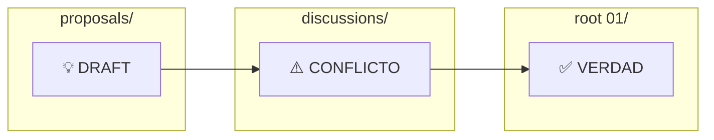

# 🛡️ Sistema de Trazabilidad y Gobernanza de Datos

> Este documento es la **Guía Maestra** para cualquier integrante (humano o IA) que desee leer, proponer o modificar el proyecto **Tienda de Barrio Pro**.

---

## 📂 1. Anatomía de la Estructura

| Carpeta | Propósito | ¿Quién la Lee? | ¿Quién la Escribe? |
|---------|-----------|----------------|-------------------|
| `01_REQUIREMENTS` | Reglas de Negocio | Todos | Líder de Proyecto / Agentes |
| `02_ARCHITECTURE` | Planos Técnicos | Desarrolladores / Arquitectos | Tech Lead / Arquitectos |
| `03_SRC` | Obra Final (Código) | Desarrolladores / QA | Agentes de Código / Devs |
| `04_ORCHESTRATION` | Estrategia y Control | Líder / Tech Lead | Lead Técnico / Agentes |

---

## 🚦 2. Ciclo de Vida de un Documento (Carpeta 01)

Para evitar que se programe algo no aprobado, seguimos este flujo:



| Etapa | Ubicación | Nomenclatura | Descripción |
|-------|-----------|--------------|-------------|
| **DRAFT** | `proposals/` | `prop-nombre-vX.md` | Ideas iniciales sin aprobar |
| **CONFLICTO** | `discussions/` | `obs-rol-nombre.md` | Observaciones de UX o DB |
| **VERDAD** | `raíz de 01/` | `nombre.md` | Documento final aprobado |

> [!IMPORTANT]
> **Solo lo que está en la raíz de `01_REQUIREMENTS/` se programa.**

---

## 🏷️ 3. Nomenclatura y Estándares

### Formato de Archivos
- **Extensión:** Siempre `.md` (Markdown)
- **Nombres:** `kebab-case` (minúsculas y guiones)
  - ✅ `gestion-inventario.md`
  - ❌ `GestionInventario.md`

### Encabezados Obligatorios

Todo documento de requerimientos en `01/` debe contener:

| Sección | Descripción |
|---------|-------------|
| **Título** | Nombre de la función |
| **Contexto** | Por qué se hace |
| **Reglas de Negocio** | Qué debe pasar y qué no |
| **Conexión con Stores** | Qué datos de la carpeta `03` se usan |

---

## ⚙️ 4. Reglas de Trazabilidad (El "Nunca")

> [!CAUTION]
> Estas reglas son **inquebrantables**.

| Regla | Descripción |
|-------|-------------|
| 🚫 **NUNCA** | Se inicia código en `03_SRC` sin un archivo de requerimientos en la raíz de `01` |
| 🚫 **NUNCA** | Se guarda documentación técnica (planos) en `01`; eso va en `02_ARCHITECTURE` |
| ✅ **SIEMPRE** | Se actualiza `MAPA_LOGICA_GLOBAL.md` tras un cambio exitoso |

---

## 🗂️ 5. Estructura de Subcarpetas en 01_REQUIREMENTS

```
01_REQUIREMENTS/
├── proposals/          # Borradores y propuestas (prop-*.md)
├── discussions/        # Discusiones y observaciones (obs-*.md)
├── archive/            # Documentos obsoletos o reemplazados
├── README.md           # Índice de la carpeta
├── dashboard.md        # ✅ Documento final
├── pos.md              # ✅ Documento final
├── inventory.md        # ✅ Documento final
└── ...                 # Otros documentos finales
```

---

## 🎯 6. ¿Cómo Usar Este Sistema?

### Para Nuevos Integrantes
1. Lee este documento (`SISTEMA_TRAZABILIDAD.md`)
2. Ve a `01_REQUIREMENTS/` para entender el negocio
3. Ve a `02_ARCHITECTURE/` para entender la base de datos
4. La carpeta `03_SRC/` es solo la consecuencia de los otros documentos

### Para Proponer Cambios
1. Crea un archivo en `01_REQUIREMENTS/proposals/` con formato `prop-nombre-v1.md`
2. Solicita revisión al Lead
3. Si hay observaciones, se mueven a `discussions/`
4. Una vez aprobado, se mueve a la raíz como documento final

### Para Agentes de IA
1. **Antes de codificar:** Verifica que existe el documento en la raíz de `01/`
2. **Después de codificar:** Actualiza `MAPA_LOGICA_GLOBAL.md`
3. **Usar Conventional Commits:** `docs:`, `feat:`, `fix:`, etc.

---

## 📊 7. Métricas de Salud

El `MAPA_LOGICA_GLOBAL.md` mantiene métricas de sincronización:

| Indicador | Significado |
|-----------|-------------|
| 🟢 100% | Código y documentación sincronizados |
| 🟡 70-99% | Documentación ligeramente desactualizada |
| 🟠 40-69% | Requiere actualización urgente |
| 🔴 0-39% | Sin documentar o muy desactualizado |

---

> **Última actualización:** 2026-01-15  
> **Versión:** 1.0  
> **Autor:** Lead Técnico
