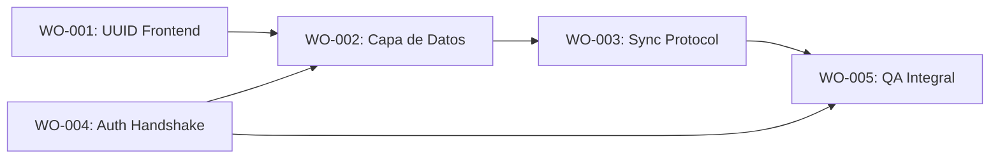

# Órdenes de Trabajo - Fase 1: Migración a UUID y Supabase

> **Fase**: 1 (Preparación de Infraestructura)  
> **Fecha**: 2026-01-21  
> **Estado**: 📋 Listo para Ejecución

---

## Resumen Ejecutivo

Esta fase transforma una App standalone (localStorage) en un sistema multi-dispositivo sincronizado (Supabase). Las órdenes están secuenciadas por dependencias.

---

## Diagrama de Dependencias



---

## WO-PHASE1-001: Refactorización UUID Frontend

| Campo | Valor |
|-------|-------|
| **Agente** | Orquestador |
| **Prioridad** | 🔴 Crítica |
| **Estimación** | 4-6 horas |
| **Dependencias** | `QA_AUDIT_UUID_ADAPTATION.md` aprobado ✅ |

### Tareas

- [ ] **T1.1**: Actualizar `src/types/index.ts`
  - Cambiar `id: number` → `id: string` en todas las interfaces
  - Agregar `created_at: string` y `updated_at: string`

- [ ] **T1.2**: Refactorizar `src/stores/inventory.ts`
  - Cambiar `findProductById(id: number)` → `findProductById(id: string)`
  - Actualizar comparaciones `===` para strings

- [ ] **T1.3**: Refactorizar `src/stores/sales.ts`
  - Actualizar tipo de `sale.id` a string
  - Mantener `ticket_number` como número secuencial

- [ ] **T1.4**: Refactorizar `src/stores/clients.ts`
  - Cambiar `client.id` a string
  - Actualizar búsquedas y referencias

- [ ] **T1.5**: Actualizar vistas que referencian IDs
  - `InventoryView.vue`: Verificar que PLU siga siendo el identificador visible
  - `ClientsView.vue`: Usar cédula como identificador visible
  - `POSView.vue`: Mantener ticket_number para UI

### Criterios de Aceptación

- [ ] `npm run type-check` pasa sin errores
- [ ] Ninguna vista muestra UUIDs al usuario
- [ ] Tests existentes actualizados y pasando

---

## WO-PHASE1-002: Implementación Capa de Datos

| Campo | Valor |
|-------|-------|
| **Agente** | Datos |
| **Prioridad** | 🔴 Crítica |
| **Estimación** | 6-8 horas |
| **Dependencias** | WO-001 Complete, Supabase Project Configurado |

### Tareas

- [ ] **T2.1**: Crear cliente Supabase
  - Archivo: `src/data/supabaseClient.ts`
  - Configurar con variables de entorno `VITE_SUPABASE_URL`, `VITE_SUPABASE_ANON_KEY`

- [ ] **T2.2**: Implementar Repository Pattern
  - `src/data/repositories/productRepository.ts`
  - `src/data/repositories/clientRepository.ts`
  - `src/data/repositories/saleRepository.ts`

- [ ] **T2.3**: Conectar inventoryStore a Supabase
  - Reemplazar localStorage por `productRepository`
  - Mantener fallback a localStorage si Supabase no disponible

- [ ] **T2.4**: Habilitar Realtime Subscriptions
  - Suscribir a cambios en `products`
  - Suscribir a cambios en `sales`
  - Suscribir a cambios en `cash_register`

- [ ] **T2.5**: Implementar flag de source
  - `composables/useDataSource.ts`
  - Leer `VITE_SUPABASE_ENABLED` para toggle

### Criterios de Aceptación

- [ ] Datos persisten en Supabase
- [ ] Cambios en un dispositivo se reflejan en otro
- [ ] Flag de fallback funciona si Supabase está caído

---

## WO-PHASE1-003: Implementación Sync Protocol

| Campo | Valor |
|-------|-------|
| **Agente** | Datos |
| **Prioridad** | 🟠 Alta |
| **Estimación** | 8-10 horas |
| **Dependencias** | WO-002 Complete, `sync_protocol_spec.md` aprobado ✅ |

### Tareas

- [ ] **T3.1**: Implementar Cola Offline
  - Archivo: `src/data/syncQueue.ts`
  - Usar IndexedDB (no localStorage)
  - Límite: 50 transacciones

- [ ] **T3.2**: Implementar useCache.ts (SWR)
  - Integrar con `cache-strategy.md`
  - TTL configurable por entidad

- [ ] **T3.3**: Implementar Dead Letter Queue handling
  - UI en AdminHub para ver transacciones fallidas
  - Opciones: Reintentar, Descartar, Ver Detalle

- [ ] **T3.4**: Crear componentes de UI de sync
  - `SyncBadge.vue`: Badge de pendientes
  - `SyncIndicator.vue`: Spinner en header
  - `OfflineBanner.vue`: Banner cuando sin conexión

- [ ] **T3.5**: Implementar Venta Rechazada Post-Sync
  - Estado `PENDIENTE_REVISION` en sales
  - Toast persistente para conflictos
  - Flujo de resolución manual

### Criterios de Aceptación

- [ ] Ventas funcionan offline
- [ ] Sync automático al reconectar
- [ ] Conflictos van a DLQ y notifican
- [ ] First-Sync-Wins implementado

---

## WO-PHASE1-004: Implementación Auth Handshake

| Campo | Valor |
|-------|-------|
| **Agente** | Orquestador |
| **Prioridad** | 🟠 Alta |
| **Estimación** | 6-8 horas |
| **Dependencias** | `auth-unificada-iam.md` Sección 7 aprobada ✅ |

### Tareas

- [ ] **T4.1**: Crear useDeviceFingerprint.ts
  - Algoritmo SHA-256(userAgent + screen + timezone + lang)
  - Cachear en sessionStorage

- [ ] **T4.2**: Actualizar LoginView
  - Detectar tipo de usuario por presencia de `@`
  - Flujo empleado: PIN → RPC `login_empleado_unificado`
  - Flujo admin: Email/Password → Supabase Auth

- [ ] **T4.3**: Implementar pantalla GatekeeperPending
  - Mensaje: "Dispositivo en espera de aprobación"
  - Polling cada 30s para verificar estado

- [ ] **T4.4**: Implementar Rate Limiting UI
  - 3 intentos → bloqueo 30s
  - Contador visible en UI

- [ ] **T4.5**: Sesión Volátil
  - Usar sessionStorage (no localStorage)
  - Auto-logout tras 30 min inactividad
  - Re-PIN al reabrir navegador

### Criterios de Aceptación

- [ ] Empleado puede loguearse con username + PIN
- [ ] Dispositivo nuevo queda en "pendiente"
- [ ] Admin puede aprobar/rechazar dispositivos
- [ ] Sesión se pierde al cerrar pestaña

---

## WO-PHASE1-005: QA Integral de Fase 1

| Campo | Valor |
|-------|-------|
| **Agente** | QA |
| **Prioridad** | 🔴 Crítica |
| **Estimación** | 4-6 horas |
| **Dependencias** | WO-001, WO-002, WO-003, WO-004 Complete |

### Tareas

- [ ] **T5.1**: Audit de Seguridad
  - Verificar que UUIDs no se muestran en UI
  - Verificar rate limiting funciona
  - Verificar RLS en Supabase

- [ ] **T5.2**: Test de Sincronización
  - Simular venta offline → reconexión → sync
  - Simular conflicto de stock → verificar First-Sync-Wins
  - Verificar DLQ muestra transacciones fallidas

- [ ] **T5.3**: Test de Auth
  - Login empleado → verificar token en sessionStorage
  - Cerrar pestaña → verificar que sesión se pierde
  - Simular dispositivo nuevo → verificar Gatekeeper

- [ ] **T5.4**: Test de Resiliencia
  - Desconectar Supabase → verificar fallback localStorage
  - Superar límite de 50 transacciones offline
  - Verificar rollback plan funciona

### Criterios de Aceptación

- [ ] Puntaje de robustez ≥ 85/100
- [ ] Cero vulnerabilidades críticas
- [ ] Todos los flujos de error tienen UX apropiada

---

## Orden de Ejecución Recomendado

```
Semana 1
├── WO-001: UUID Frontend (Orquestador)
└── WO-004: Auth Handshake (Orquestador) [paralelo]

Semana 2
├── WO-002: Capa de Datos (Datos)
└── [Esperar WO-001 y WO-004]

Semana 3
└── WO-003: Sync Protocol (Datos)

Semana 4
└── WO-005: QA Integral (QA)
```

---

## Referencias

- [sync_protocol_spec.md](file:///c:/Users/Windows%2011/OneDrive/Desktop/prueba/01_REQUIREMENTS/sync_protocol_spec.md)
- [auth-unificada-iam.md](file:///c:/Users/Windows%2011/OneDrive/Desktop/prueba/01_REQUIREMENTS/auth-unificada-iam.md)
- [DATA_MIGRATION_POLICY.md](file:///c:/Users/Windows%2011/OneDrive/Desktop/prueba/02_ARCHITECTURE/DATA_MIGRATION_POLICY.md)
- [07_UUID_ADAPTATION.md](file:///c:/Users/Windows%2011/OneDrive/Desktop/prueba/03_UI_UX_DESIGN/07_UUID_ADAPTATION.md)
