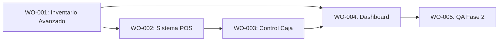

# Órdenes de Trabajo - Fase 2: Lógica de Negocio y Operativa

> **Fase**: 2 (Implementación de Procesos Core)  
> **Fecha**: 2026-01-21  
> **Estado**: 📋 En Planificación

---

## Resumen Ejecutivo

Esta fase implementa los flujos de trabajo críticos del negocio: Gestión de Inventario, Punto de Venta (POS), Control de Caja y Reportes. Se construye sobre la capa de datos offline-first de la Fase 1.

---

## Diagrama de Dependencias

---

## WO-PHASE2-001: Gestión de Inventario Avanzda

| Campo | Valor |
|-------|-------|
| **Agente** | Full Stack |
| **Prioridad** | 🔴 Crítica |
| **Estimación** | 6-8 horas |
| **Dependencias** | `inventory.md`, `stock-entry.md` |

### Tareas

- [ ] **T1.1**: Implementar `StockEntryView.vue`
  - Formulario de entrada/salida/ajuste
  - Selección de motivo (Compra, Pérdida, Ajuste)
  - Cálculo de nuevo costo promedio (si aplica, o FIFO simplificado)

- [ ] **T1.2**: Lógica de Movimientos en `productRepository`
  - Método `registerMovement(type, quantity, reason)`
  - Validación de stock negativo (según política configurada)
  - Actualización atómica de `stock` en tabla `products`

- [ ] **T1.3**: Gestión de Lotes y Vencimiento (Básico)
  - Campo `expiration_date` en entrada
  - Alerta visual en `InventoryView` para próximos a vencer

- [ ] **T1.4**: Kardex (Historial de Movimientos)
  - Vista `ProductHistoryModal.vue`
  - Consulta a tabla `stock_movements` (crearla si no existe en schema)

### Criterios de Aceptación

- [ ] Se pueden registrar entradas y salidas
- [ ] El stock se actualiza correctamente
- [ ] Se genera historial de movimientos (Kardex)

---

## WO-PHASE2-002: Sistema POS y Checkout

| Campo | Valor |
|-------|-------|
| **Agente** | UX/Frontend |
| **Prioridad** | 🔴 Crítica |
| **Estimación** | 8-10 horas |
| **Dependencias** | WO-201 (Stock), `pos.md`, `rounding-policy.md` |

### Tareas

- [ ] **T2.1**: Refactorizar `CartStore` para usar `SaleRepository`
  - Validar stock disponible al agregar
  - Integrar lógica de impuestos (si aplica)

- [ ] **T2.2**: Implementar Política de Redondeo
  - Redondeo a 50 pesos (Colombia) a favor del cliente/tienda según ley
  - Visualización de "Ajuste por redondeo" en ticket

- [ ] **T2.3**: Checkout Modal UX
  - Selección de método de pago (Efectivo, Transferencia, Crédito)
  - Cálculo de cambio (devuelta)
  - Generación de ID de venta (UUID) previo a envío

- [ ] **T2.4**: Integración con "Venta Rápida" (Teclado)
  - Atajos de teclado para cobrar (F12, Enter)

### Criterios de Aceptación

- [ ] Flujo completo: Agregar -> Pagar -> Confirmar -> Reducir Stock
- [ ] Redondeo correcto en totales
- [ ] Soporte para métodos de pago mixtos (opcional fase 2, deseable)

---

## WO-PHASE2-003: Control de Caja (Cash Control)

| Campo | Valor |
|-------|-------|
| **Agente** | Backend/Logic |
| **Prioridad** | 🟠 Alta |
| **Estimación** | 6-8 horas |
| **Dependencias** | WO-202 (Ventas generan ingresos), `cash-control.md` |

### Tareas

- [ ] **T3.1**: Schema de Caja
  - Tabla `cash_registers` (sesiones)
  - Tabla `cash_movements` (ingresos/egresos manuales y automáticos) or `transactions`

- [ ] **T3.2**: Flujo de Apertura de Caja
  - Modal `OpenRegister.vue`: Conteo de base inicial
  - Asignación de cajero responsable

- [ ] **T3.3**: Flujo de Cierre de Caja (Arqueo)
  - Modal `CloseRegister.vue`: Conteo final de efectivo
  - Cálculo de discrepancia (Sobrante/Faltante)
  - Bloqueo de POS si caja cerrada

- [ ] **T3.4**: Gestión de Gastos Menores
  - Vista `ExpensesView.vue`: Registrar salida de efectivo (ej. pago proveedores menor)
  - Impacto en saldo de caja actual

### Criterios de Aceptación

- [ ] No se puede vender sin abrir caja
- [ ] El cierre genera reporte de discrepancias
- [ ] Los gastos descuentan del efectivo teórico

---

## WO-PHASE2-004: Dashboard y Reportes

| Campo | Valor |
|-------|-------|
| **Agente** | Frontend |
| **Prioridad** | 🟡 Media |
| **Estimación** | 4-6 horas |
| **Dependencias** | Todas las anteriores, `dashboard.md` |

### Tareas

- [ ] **T4.1**: Widgets Dashboard Principal
  - "Ventas del Día" (Total $)
  - "Transacciones" (Cantidad #)
  - "Productos Bajo Stock" (Alerta)

- [ ] **T4.2**: Reporte de Ventas Básico
  - Vista `SalesReport.vue`
  - Filtros por fecha, cajero, método de pago

- [ ] **T4.3**: Reporte de Inventario
  - Valor total del inventario (Costo vs Precio Venta)

### Criterios de Aceptación

- [ ] Dashboard carga rápido (optimistic metrics)
- [ ] Datos coinciden con POS y Caja

---

## WO-PHASE2-005: QA Integral Fase 2

| Campo | Valor |
|-------|-------|
| **Agente** | QA |
| **Prioridad** | 🔴 Crítica |
| **Estimación** | 4-6 horas |
| **Dependencias** | Todos los WO Completos |

### Tareas

- [ ] **T5.1**: Pruebas E2E de Flujo de Venta
- [ ] **T5.2**: Validación de Cálculos Contables (Caja)
- [ ] **T5.3**: Pruebas de Estrés de Inventario
- [ ] **T5.4**: Auditoría de Permisos (Cajero vs Admin en reportes)

### Criterios de Aceptación

- [ ] Sin errores de cálculo financiero
- [ ] Flujos bloqueantes (Caja cerrada) funcionan 100%
