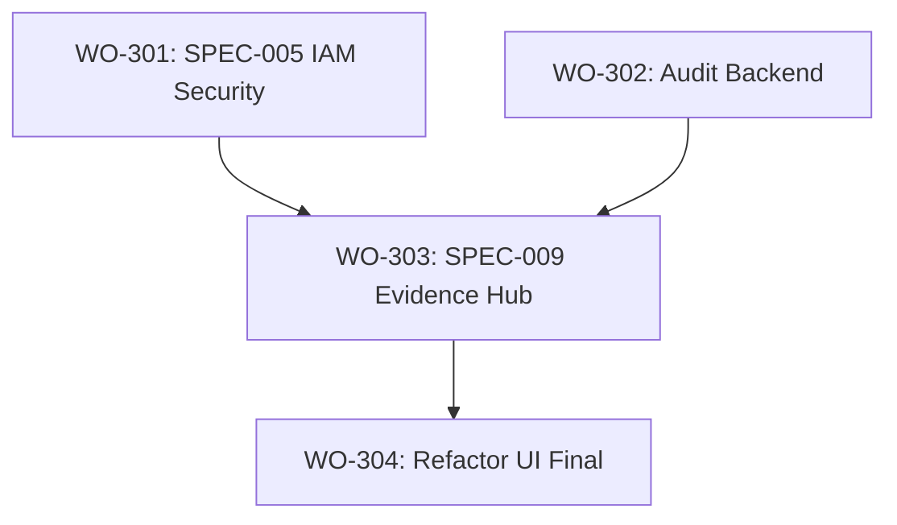

# Órdenes de Trabajo - Fase 3: Seguridad, Auditoría e Integridad

> **Fase**: 3 (Seguridad y Auditoría Avanzada)  
> **Fecha**: 2026-01-21  
> **Estado**: ✅ Completado (Cierre)

---

## Resumen Ejecutivo

Esta fase transforma la aplicación en un sistema robusto preparado para producción. Se implementan los historiales cruzados para garantizar que el dueño tenga evidencia de cada peso y producto movido (Audit), y se blinda el sistema con protocolos de seguridad (IAM).

---

## Diagrama de Dependencias

---

## WO-PHASE3-001: Seguridad Avanzada (SPEC-005)

| Campo | Valor |
|-------|-------|
| **Agente** | Security / Full Stack |
| **Prioridad** | 🔴 Crítica |
| **Documento** | `01_REQUIREMENTS/auth-unificada-iam.md` |

### Tareas
- [x] **T1.1**: **Rate Limiting & Locking**
  - Implementar en Supabase (RPC) y Frontend el bloqueo tras 5 intentos.
- [x] **T1.2**: **Device Fingerprinting**
  - Crear `useDeviceFingerprint.ts` y requerir aprobación para nuevos dispositivos de empleados.
- [x] **T1.3**: **Middleware de Operación**
  - Bloquear acceso a POS si `cashRegisterStore.isOpen === false`.

---

## WO-PHASE3-002: Infraestructura de Auditoría (SPEC-009 Backend)

| Campo | Valor |
|-------|-------|
| **Agente** | Database |
| **Prioridad** | 🔴 Crítica |
| **Documento** | `01_REQUIREMENTS/historiales_sistema.md` |

### Tareas
- [x] **T2.1**: **Tablas de Auditoría**
  - Crear `system_audit_logs` y `price_change_logs` en Supabase (Verificadas en schema).
- [x] **T2.2**: **Kardex (Stock Movements)**
  - Asegurar que cada venta y entrada de stock genere un registro en `inventory_movements` (Verificado en `productRepository`).
- [x] **T2.3**: **Repositorio de Auditoría**
  - Implementado `auditRepository.ts` para exponer logs al frontend.

---

## WO-PHASE3-003: Sistema de Historiales (SPEC-009 UI)

| Campo | Valor |
|-------|-------|
| **Agente** | Frontend |
| **Prioridad** | 🟠 Alta |
| **Documento** | `03_UI_UX_DESIGN/history_ui.md` |

### Tareas
- [x] **T3.1**: **Evidence Hub (`HistoryView.vue`)**
  - Vista centralizada con filtros por tipo (Ventas, Caja, Auditoría, Inventario).
- [x] **T3.2**: **Integración con Dashboard**
  - Acceso desde Reportes (`ReportsContent.vue`) y widgets de auditoría.

---

## WO-PHASE3-004: Refactorización Estética y Atomic Design

| Campo | Valor |
|-------|-------|
| **Agente** | UX / Frontend |
| **Prioridad** | 🟡 Media |
| **Documento** | `02_ARCHITECTURE/REFACTORING_PLAN.md` |

### Tareas
- [x] **T4.1**: Migrar todos los botones a `BaseButton.vue`.
- [x] **T4.2**: Migrar todos los campos de texto a `BaseInput.vue`.
- [x] **T4.3**: Eliminar `storeStatusStore` (Legacy) y unificar lógica restante.

---

## Criterios de Aceptación Global de Fase 3
- [x] El sistema bloquea usuarios malintencionados (brute force).
- [x] El admin puede ver exactamente quién, cuándo y dónde realizó una operación.
- [x] La UI es 100% consistente usando el sistema de componentes atómicos.
