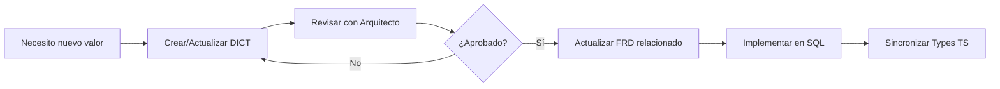

# 📖 Sistema de Diccionarios de Datos (DICT)

## Propósito

Los documentos **DICT (Data Dictionaries)** son especificaciones técnicas que definen la terminología oficial del sistema. Actúan como **única fuente de verdad** para valores enumerados (enums), constantes y dominios de datos.

---

## ¿Por qué existen?

**Problema que resuelven:**
- ❌ Inconsistencias entre Backend (SQL) y Frontend (TypeScript)
- ❌ Bugs por valores no definidos (`'entrada'` vs `'ingreso'`)
- ❌ Ambigüedad en requisitos de negocio
- ❌ Descoordinación entre migraciones

**Solución:**
- ✅ Definición centralizada de términos técnicos
- ✅ Semántica clara para cada valor
- ✅ Versionable en Git
- ✅ Consultable por todo el equipo

---

## Estructura de un DICT

Cada archivo sigue este formato:

```markdown
# DICT-XXX: [Nombre del Dominio]

## Dominio
[Descripción del área funcional]

## Valores Permitidos

### [nombre_campo]

| Valor Técnico | Término de Negocio | Semántica | Ejemplos |
|---------------|-------------------|-----------|----------|
| 'valor_sql' | Nombre descriptivo | ¿Qué significa? | Casos de uso |

## Reglas
1. [Regla de negocio]
2. [Restricción técnica]

## Implementación

**Constraint SQL:**
```sql
CHECK (campo IN ('valor1', 'valor2'))
```

**TypeScript:**
```typescript
export type TipoCampo = 'valor1' | 'valor2';
```
```

---

## Catálogo de Diccionarios

| DICT | Dominio | Estado |
|------|---------|--------|
| [DICT-001](./DICT_001_CASH_MOVEMENTS.md) | Cash Movements | ✅ Activo |
| DICT-002 | Inventory Movements | 🔜 Pendiente |
| DICT-003 | Payment Methods | 🔜 Pendiente |

---

## Proceso de Cambio

### ¿Cuándo crear un nuevo DICT?

Cuando necesites definir:
- Valores enum para una columna SQL
- Constantes compartidas entre Backend/Frontend
- Estados de una máquina de estados
- Tipos de transacciones o eventos

### Flujo de Aprobación



### Checklist de Validación

Antes de aprobar un nuevo valor enum:

- [ ] Está documentado en DICT con semántica clara
- [ ] No se solapa con valores existentes
- [ ] FRD relacionado actualizado
- [ ] Constraint SQL creado/actualizado
- [ ] Types TypeScript sincronizados
- [ ] Tests cubren el nuevo caso

---

## Responsabilidades

| Rol | Responsabilidad |
|-----|-----------------|
| **Arquitecto** | Aprobar nuevos DICT, mantener consistencia |
| **Data** | Implementar constraints SQL según DICT |
| **UX** | Usar valores definidos en interfaces |
| **QA** | Validar que implementación cumple DICT |

---

## Ejemplo Real: DICT-001

**Problema original:**
- RPC usaba `'entrada'` para ventas
- Constraint solo permitía `'ingreso'` o `'gasto'`
- Sistema fallaba al procesar ventas

**Solución con DICT:**
- Definimos oficialmente: `'ingreso'` (entra dinero) y `'gasto'` (sale dinero)
- Corregimos RPC para usar terminología oficial
- Documentamos semántica para prevenir futuros errores

---

## Recursos Adicionales

- [FRD-004: Control de Caja](../FRD/FRD_004_CONTROL_DE_CAJA.md) - Usa DICT-001
- [Contrato Backend/Frontend](../../MEMORY/user_global.md) - Principios de interfaz
