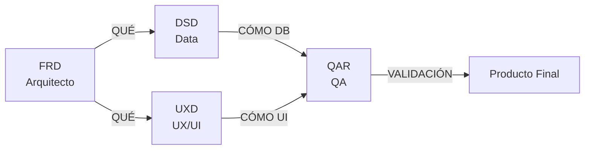
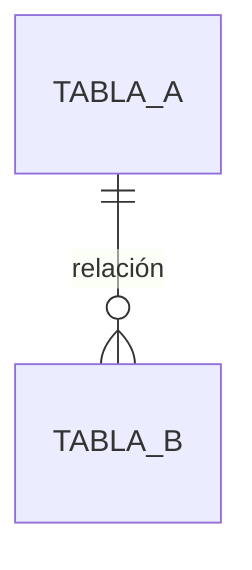
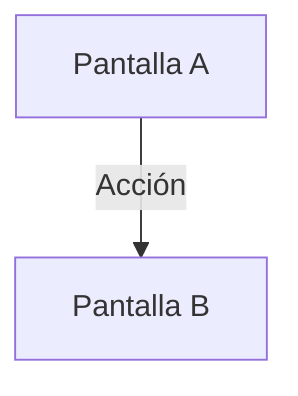
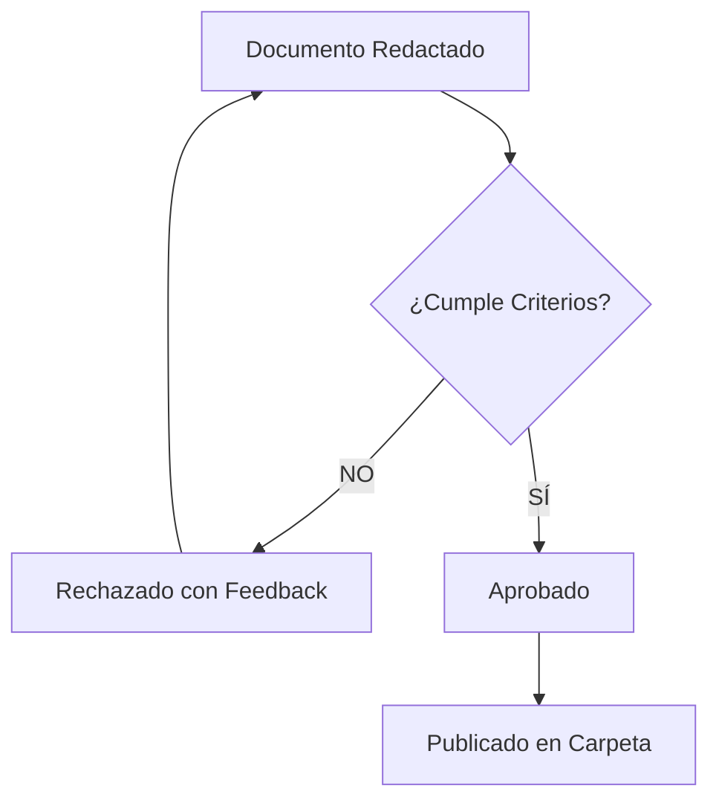

# 📜 Estándar de Documentación del Proyecto

> **Versión:** 1.0
> **Fecha de Vigencia:** 2026-01-27
> **Autor:** Arquitecto de Producto y Requisitos
> **Autoridad:** Este documento es NORMATIVO. Todo documento que no cumpla estos criterios será rechazado.

---

## Propósito

Este documento establece las **reglas inviolables** para la redacción de documentación técnica en el proyecto. Cada rol tiene un tipo de documento específico con estructura y restricciones definidas.

---

## Principio Fundamental: Separación de Responsabilidades



| Rol | Tipo de Documento | Responde a | Prohibido |
|-----|-------------------|------------|-----------|
| **Arquitecto** | FRD (Functional Requirements) | ¿QUÉ hace el sistema? | Código, nombres de archivos, tecnologías específicas |
| **Data** | DSD (Data Specification Document) | ¿CÓMO se estructura el dato? | Decisiones de UI, flujos de usuario |
| **UX/UI** | UXD (User Experience Document) | ¿CÓMO interactúa el usuario? | SQL, lógica de backend, estructuras de datos |
| **QA** | QAR (Quality Assurance Report) | ¿ES SEGURO y CORRECTO? | Nuevos requisitos, cambios de alcance |

---

# Parte I: Documentos FRD (Arquitecto)

## Definición

Un **Functional Requirements Document (FRD)** describe el comportamiento esperado del sistema desde la perspectiva del usuario y las reglas de negocio, **sin prescribir implementación**.

## Estructura Obligatoria

```markdown
# FRD-XXX: [Nombre Descriptivo]

### Nombre de la Funcionalidad
[Título breve y único]

#### Descripción
[Párrafo de 2-4 oraciones explicando el propósito]

---

## Reglas de Negocio
[Lista numerada de reglas prescriptivas]

---

## Casos de Uso

**Caso [Letra]: [Nombre del Caso]**
- **Actor:** [Quién ejecuta la acción]
- **Precondición:** [Estado inicial requerido]
- **Flujo Principal:**
    1. [Paso 1]
    2. [Paso 2]
- **Flujo Alternativo:** [Excepciones]
- **Postcondición:** [Estado final esperado]

---

## Criterios de Aceptación
- [ ] [Criterio verificable y atómico]

---

## Requisitos de Datos (Para Equipo Data)
[Descripción en lenguaje natural de las entidades y campos requeridos]
```

## Reglas de Redacción FRD

### ✅ PERMITIDO

| Elemento | Ejemplo |
|----------|---------|
| Lenguaje natural prescriptivo | "El sistema DEBE validar que el stock no sea negativo" |
| Tablas de reglas | "Si X, entonces Y" |
| Diagramas de flujo conceptuales | Mermaid sin código |
| Referencias a otros FRD | "Ver FRD-007 para definición de Venta" |
| **Referencias a TECH_SPECS** | "[SPEC-010: Política de Redondeo](../TECH_SPECS/rounding-policy.md)" |
| Pseudocódigo algorítmico simple | "Saldo Esperado = Base + Ingresos - Gastos" |

### ❌ PROHIBIDO

| Elemento | Ejemplo Incorrecto | Corrección |
|----------|-------------------|------------|
| **Código fuente** | `const total = items.reduce(...)` | "El total es la suma de subtotales" |
| **Nombres de archivos** | `stores/cart.ts` | "El módulo de carrito" |
| **Nombres de componentes** | `CheckoutModal.vue` | "El modal de checkout" |
| **Funciones específicas** | `roundHybrid50()` | "Redondeo híbrido al múltiplo de $50" |
| **Tecnologías** | `IndexedDB`, `WebSocket` | "Almacenamiento local", "Notificación en tiempo real" |
| **Opcionalidades** | "Puede ser X o Y" | DECIDIR y escribir solo la decisión |
| **Futuras funcionalidades** | "(Opcional futuro)" | ELIMINAR o mover a documento de Roadmap |
| **Especificaciones de UI** | "Botón de 48px color #FF0000" | Delegar a documento UXD |

### Criterios de Aceptación para un FRD Válido

Un FRD es **VÁLIDO** si y solo si:

- [ ] **CA-FRD-01:** Contiene CERO líneas de código fuente en cualquier lenguaje
- [ ] **CA-FRD-02:** No menciona nombres de archivos, componentes o funciones
- [ ] **CA-FRD-03:** Cada regla de negocio es prescriptiva (DEBE, NO PUEDE), nunca sugerente
- [ ] **CA-FRD-04:** No contiene expresiones ambiguas ("puede ser", "opcionalmente", "si se desea")
- [ ] **CA-FRD-05:** Cada caso de uso tiene Actor, Precondición, Flujo y Postcondición
- [ ] **CA-FRD-06:** Los criterios de aceptación son verificables con un SÍ/NO claro
- [ ] **CA-FRD-07:** La sección "Requisitos de Datos" no contiene DDL ni SQL

---

# Parte II: Documentos DSD (Data)

## Definición

Un **Data Specification Document (DSD)** traduce los requisitos funcionales en estructuras de base de datos, políticas de seguridad y lógica de servidor.

## Estructura Obligatoria

```markdown
# DSD-XXX: [Nombre del Módulo de Datos]

> **Basado en:** FRD-XXX

### Explicación del Modelo
[Justificación de las decisiones de diseño]

---

## Diagrama Entidad-Relación



---

## Definición de Tablas

### Tabla: `nombre_tabla`

| Columna | Tipo | Nullable | Default | Descripción |
|---------|------|----------|---------|-------------|
| id | UUID | NO | gen_random_uuid() | Identificador único |

---

## Políticas RLS

### Política: `nombre_politica`
- **Operación:** SELECT / INSERT / UPDATE / DELETE
- **Condición:** [Expresión SQL]
- **Justificación:** [Por qué esta restricción]

---

## RPCs / Funciones

### Función: `nombre_funcion`
- **Parámetros:** [Lista]
- **Retorno:** [Tipo]
- **Lógica:** [Descripción en lenguaje natural]
- **Efectos secundarios:** [Qué más modifica]

---

## Script SQL Completo

```sql
-- Código listo para ejecutar en Supabase
```
```

## Reglas de Redacción DSD

### ✅ PERMITIDO

| Elemento | Justificación |
|----------|---------------|
| SQL completo | Es el entregable principal |
| Diagramas ERD | Comunicación visual del modelo |
| Tipos de datos específicos | `UUID`, `DECIMAL(10,2)`, `TIMESTAMPTZ` |
| Políticas RLS detalladas | Seguridad es responsabilidad de Data |

### ❌ PROHIBIDO

| Elemento | Justificación |
|----------|---------------|
| Decisiones de UI | "El botón debe estar deshabilitado" → Esto va en UXD |
| Flujos de usuario | "El usuario hace clic en..." → Esto va en FRD |
| Colores, tamaños, estilos | Responsabilidad exclusiva de UX |
| Nuevos requisitos no documentados | Siempre referenciar un FRD existente |

### Criterios de Aceptación para un DSD Válido

- [ ] **CA-DSD-01:** Referencia explícita al FRD que implementa
- [ ] **CA-DSD-02:** Toda tabla tiene políticas RLS definidas
- [ ] **CA-DSD-03:** Todo campo tiene tipo, nullabilidad y descripción
- [ ] **CA-DSD-04:** El script SQL es ejecutable sin errores de sintaxis
- [ ] **CA-DSD-05:** No contiene decisiones de interfaz de usuario
- [ ] **CA-DSD-06:** Incluye diccionario de datos completo

---

# Parte III: Documentos UXD (UX/UI)

## Definición

Un **User Experience Document (UXD)** describe la interacción del usuario con el sistema: navegación, componentes visuales, estados de interfaz y comportamientos.

## Estructura Obligatoria

```markdown
# UXD-XXX: [Nombre de la Funcionalidad]

> **Basado en:** FRD-XXX

### Mapa de Navegación



---

## Pantallas

### Pantalla: [Nombre]
- **Ruta:** `/path`
- **Acceso:** [Quién puede ver esta pantalla]

#### Estructura Visual (de arriba hacia abajo)
1. **Header:** [Descripción]
2. **Contenido Principal:** [Descripción]
3. **Footer/Acciones:** [Descripción]

#### Estados de la Interfaz
| Estado | Descripción | Comportamiento Visual |
|--------|-------------|----------------------|
| Loading | Datos cargando | Skeleton de 3 líneas |
| Empty | Sin datos | Mensaje + CTA |
| Error | Fallo de red | Toast + Botón reintentar |
| Success | Operación exitosa | Toast de confirmación |

---

## Componentes

### Componente: [Nombre]
- **Propósito:** [Para qué sirve]
- **Interacción:** [Qué pasa al hacer clic/tap]
- **Validaciones:** [Reglas de input]

---

## Guía de Estilo (Solo si aplica nuevos elementos)

| Elemento | Especificación |
|----------|----------------|
| Color primario | [Valor] |
| Tipografía | [Familia, tamaños] |
```

## Reglas de Redacción UXD

### ✅ PERMITIDO

| Elemento | Justificación |
|----------|---------------|
| Descripciones de componentes | Es el entregable principal |
| Especificaciones visuales | Colores, tamaños, espaciados |
| Diagramas de navegación | Flujos de pantalla |
| Estados de interfaz | Loading, Empty, Error |

### ❌ PROHIBIDO

| Elemento | Justificación |
|----------|---------------|
| SQL o estructuras de datos | Responsabilidad de Data |
| Lógica de negocio | Responsabilidad del Arquitecto |
| Código Vue/TypeScript | Esto es implementación, no diseño |
| Nuevos requisitos | Referenciar FRD existente |

### Criterios de Aceptación para un UXD Válido

- [ ] **CA-UXD-01:** Referencia explícita al FRD que implementa
- [ ] **CA-UXD-02:** Toda pantalla tiene estados definidos (Loading, Empty, Error, Success)
- [ ] **CA-UXD-03:** No contiene SQL ni estructuras de base de datos
- [ ] **CA-UXD-04:** No inventa nuevas reglas de negocio
- [ ] **CA-UXD-05:** Cada componente tiene propósito e interacción documentados
- [ ] **CA-UXD-06:** Sigue principio Mobile-First

---

# Parte IV: Documentos QAR (QA)

## Definición

Un **Quality Assurance Report (QAR)** documenta los resultados de auditoría de seguridad, pruebas funcionales y análisis de resiliencia.

## Estructura Obligatoria

```markdown
# QAR-XXX: [Nombre del Módulo Auditado]

> **Basado en:** FRD-XXX, DSD-XXX, UXD-XXX

### Puntaje de Robustez: XX/100

---

## Matriz de Riesgos

| # | Severidad | Categoría | Descripción | Ubicación | Estado |
|---|-----------|-----------|-------------|-----------|--------|
| 1 | 🔴 CRÍTICO | Seguridad | ... | ... | Pendiente |

---

## Pruebas Ejecutadas

### Prueba: [Nombre]
- **Tipo:** Funcional / Seguridad / Resiliencia
- **Pasos:**
    1. [Paso]
- **Resultado Esperado:** [Qué debería pasar]
- **Resultado Obtenido:** ✅ PASS / ❌ FAIL
- **Evidencia:** [Screenshot o log]

---

## Análisis de Resiliencia

| Escenario | Comportamiento Esperado | Comportamiento Actual | Veredicto |
|-----------|------------------------|----------------------|-----------|
| Sin internet | Modo offline | ... | ✅/❌ |

---

## Plan de Mitigación

| # | Riesgo | Acción Correctiva | Responsable | Prioridad |
|---|--------|-------------------|-------------|-----------|
| 1 | ... | ... | Data/UX/Orquestador | Alta |
```

## Reglas de Redacción QAR

### ✅ PERMITIDO

| Elemento | Justificación |
|----------|---------------|
| Referencias a código específico | Para señalar vulnerabilidades |
| Logs y evidencias | Prueba de los hallazgos |
| Clasificación de severidad | Priorización de correcciones |
| Comandos de prueba | Para reproducibilidad |

### ❌ PROHIBIDO

| Elemento | Justificación |
|----------|---------------|
| Nuevos requisitos | QA valida, no diseña |
| Cambios de alcance | Escalar al Arquitecto |
| Correcciones directas | Solo reportar, no implementar |

### Criterios de Aceptación para un QAR Válido

- [ ] **CA-QAR-01:** Referencia explícita a los documentos auditados
- [ ] **CA-QAR-02:** Toda prueba tiene pasos reproducibles
- [ ] **CA-QAR-03:** Todo riesgo tiene severidad asignada
- [ ] **CA-QAR-04:** Incluye plan de mitigación con responsables
- [ ] **CA-QAR-05:** No introduce nuevos requisitos funcionales

---

# Parte V: Proceso de Validación de Documentos

## Flujo de Aprobación



## Checklist de Validación Rápida

Antes de publicar cualquier documento, verificar:

### Para FRD:
```
□ ¿Cero código fuente?
□ ¿Cero nombres de archivos/componentes?
□ ¿Todas las reglas son prescriptivas (DEBE/NO PUEDE)?
□ ¿Cero ambigüedades (puede ser/opcionalmente)?
□ ¿Casos de uso completos con Actor/Pre/Flujo/Post?
```

### Para DSD:
```
□ ¿Referencia a FRD existente?
□ ¿Todas las tablas tienen RLS?
□ ¿SQL ejecutable sin errores?
□ ¿Diccionario de datos completo?
```

### Para UXD:
```
□ ¿Referencia a FRD existente?
□ ¿Estados de interfaz definidos (Loading/Empty/Error)?
□ ¿Cero lógica de negocio inventada?
□ ¿Mobile-first considerado?
```

### Para QAR:
```
□ ¿Referencias a documentos auditados?
□ ¿Pruebas reproducibles?
□ ¿Plan de mitigación con responsables?
□ ¿Cero nuevos requisitos inventados?
```

---

# Anexo: Glosario de Términos Prohibidos en FRD

| Término Prohibido | Reemplazo Correcto |
|-------------------|-------------------|
| `archivo.ts` | "el módulo de [nombre]" |
| `ComponentName.vue` | "el componente de [función]" |
| `functionName()` | "la operación de [acción]" |
| `WebSocket` | "comunicación en tiempo real" |
| `IndexedDB` | "almacenamiento local" |
| `RPC` | "operación del servidor" |
| `RLS` | "políticas de acceso" |
| `JSONB` | "estructura de datos flexible" |
| `UUID` | "identificador único" |
| "puede ser X o Y" | [DECIDIR: X] o [DECIDIR: Y] |
| "opcionalmente" | ELIMINAR o hacer prescriptivo |
| "en el futuro" | ELIMINAR o mover a Roadmap |

---

## Changelog

| Versión | Fecha | Cambios |
|---------|-------|---------|
| 1.0 | 2026-01-27 | Versión inicial del estándar |
