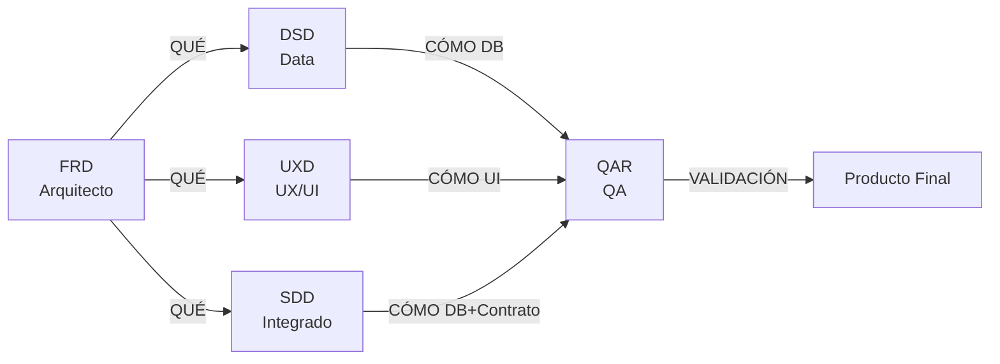
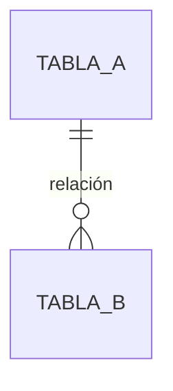
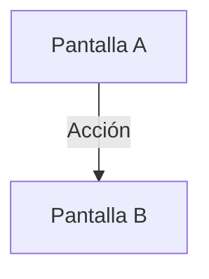
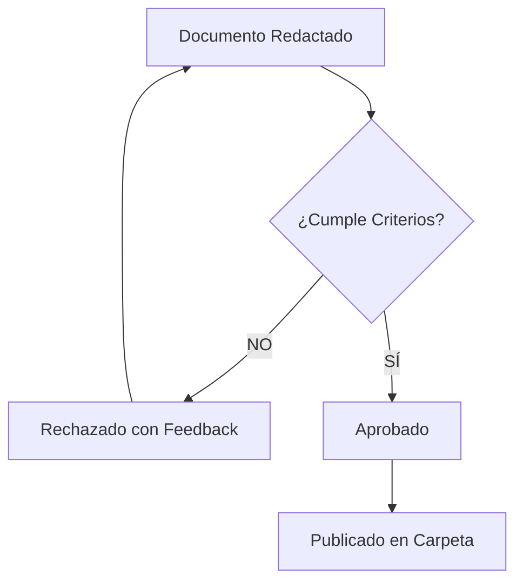

# 📜 Estándar de Documentación del Proyecto

> **Versión:** 2.0
> **Fecha de Vigencia:** 2026-08-07
> **Autor:** Arquitecto de Producto y Requisitos
> **Revisión v2.0:** Alineación Documental — Plan aprobado 2026-08-07
> **Autoridad:** Este documento es NORMATIVO. Todo documento que no cumpla estos criterios será rechazado.

---

## Propósito

Este documento establece las **reglas inviolables** para la redacción de documentación técnica en el proyecto. Cada rol tiene un tipo de documento específico con estructura y restricciones definidas.

---

## Principio Fundamental: Separación de Responsabilidades


```mermaid
graph LR
    A["FRD<br>Arquitecto"] -->|QUÉ| B["DSD<br>Data"]
    A -->|QUÉ| C["UXD<br>UX/UI"]
    A -->|QUÉ| S["SDD<br>Integrado"]
    B -->|"CÓMO DB"| D["QAR<br>QA"]
    C -->|"CÓMO UI"| D
    S -->|"CÓMO DB+Contrato"| D
    D -->|VALIDACIÓN| E[Producto Final]
```

| Rol | Tipo de Documento | Responde a | Prohibido |
|-----|-------------------|------------|-----------|
| **Arquitecto** | FRD (Functional Requirements) | ¿QUÉ hace el sistema? | Código, nombres de archivos, tecnologías específicas |
| **Data** | DSD (Data Specification Document) | ¿CÓMO se estructura el dato? | Decisiones de UI, flujos de usuario |
| **UX/UI** | UXD (User Experience Document) | ¿CÓMO interactúa el usuario? | SQL, lógica de backend, estructuras de datos |
| **Integrado** | SDD (Software Design Document) | ¿CÓMO se integra el dato con el contrato? | Especificaciones visuales, código de componentes, estados `🟢 Aprobado` con hallazgos críticos abiertos |
| **QA** | QAR (Quality Assurance Report) | ¿ES SEGURO y CORRECTO? | Nuevos requisitos, cambios de alcance |

---

# Parte I: Documentos FRD (Arquitecto)

## Definición

Un **Functional Requirements Document (FRD)** describe el comportamiento esperado del sistema desde la perspectiva del usuario y las reglas de negocio, **sin prescribir implementación**.

## Estructura Obligatoria

```markdown
# FRD-XXX: [Nombre Descriptivo]

### Nombre de la Funcionalidad
[Título breve y único]

#### Descripción
[Párrafo de 2-4 oraciones explicando el propósito]

---

## Reglas de Negocio
[Lista numerada de reglas prescriptivas]

---

## Casos de Uso

**Caso [Letra]: [Nombre del Caso]**
- **Actor:** [Quién ejecuta la acción]
- **Precondición:** [Estado inicial requerido]
- **Flujo Principal:**
    1. [Paso 1]
    2. [Paso 2]
- **Flujo Alternativo:** [Excepciones]
- **Postcondición:** [Estado final esperado]

---

## Criterios de Aceptación
- [ ] [Criterio verificable y atómico]

---

## Requisitos de Datos (Para Equipo Data)
[Descripción en lenguaje natural de las entidades y campos requeridos]
```

## Reglas de Redacción FRD

### ✅ PERMITIDO

| Elemento | Ejemplo |
|----------|---------|
| Lenguaje natural prescriptivo | "El sistema DEBE validar que el stock no sea negativo" |
| Tablas de reglas | "Si X, entonces Y" |
| Diagramas de flujo conceptuales | Mermaid sin código |
| Referencias a otros FRD | "Ver FRD-007 para definición de Venta" |
| **Referencias a TECH_SPECS** | "[SPEC-010: Política de Redondeo](../TECH_SPECS/rounding-policy.md)" |
| Pseudocódigo algorítmico simple | "Saldo Esperado = Base + Ingresos - Gastos" |

### ❌ PROHIBIDO

| Elemento | Ejemplo Incorrecto | Corrección |
|----------|-------------------|------------|
| **Código fuente** | `const total = items.reduce(...)` | "El total es la suma de subtotales" |
| **Nombres de archivos** | `stores/cart.ts` | "El módulo de carrito" |
| **Nombres de componentes** | `CheckoutModal.vue` | "El modal de checkout" |
| **Funciones específicas** | `roundHybrid50()` | "Redondeo híbrido al múltiplo de $50" |
| **Tecnologías** | `IndexedDB`, `WebSocket` | "Almacenamiento local", "Notificación en tiempo real" |
| **Opcionalidades** | "Puede ser X o Y" | DECIDIR y escribir solo la decisión |
| **Futuras funcionalidades** | "(Opcional futuro)" | ELIMINAR o mover a documento de Roadmap |
| **Especificaciones de UI** | "Botón de 48px color #FF0000" | Delegar a documento UXD |

### Criterios de Aceptación para un FRD Válido

Un FRD es **VÁLIDO** si y solo si:

- [ ] **CA-FRD-01:** Contiene CERO líneas de código fuente en cualquier lenguaje
- [ ] **CA-FRD-02:** No menciona nombres de archivos, componentes o funciones
- [ ] **CA-FRD-03:** Cada regla de negocio es prescriptiva (DEBE, NO PUEDE), nunca sugerente
- [ ] **CA-FRD-04:** No contiene expresiones ambiguas ("puede ser", "opcionalmente", "si se desea")
- [ ] **CA-FRD-05:** Cada caso de uso tiene Actor, Precondición, Flujo y Postcondición
- [ ] **CA-FRD-06:** Los criterios de aceptación son verificables con un SÍ/NO claro
- [ ] **CA-FRD-07:** La sección "Requisitos de Datos" no contiene DDL ni SQL

---

# Parte II: Documentos DSD (Data)

## Definición

Un **Data Specification Document (DSD)** traduce los requisitos funcionales en estructuras de base de datos, políticas de seguridad y lógica de servidor.

## Estructura Obligatoria

```markdown
# DSD-XXX: [Nombre del Módulo de Datos]

> **Basado en:** FRD-XXX

### Explicación del Modelo
[Justificación de las decisiones de diseño]

---

## Diagrama Entidad-Relación


```mermaid
erDiagram
    TABLA_A ||--o{ TABLA_B : "relación"
```

---

## Definición de Tablas

### Tabla: `nombre_tabla`

| Columna | Tipo | Nullable | Default | Descripción |
|---------|------|----------|---------|-------------|
| id | UUID | NO | gen_random_uuid() | Identificador único |

---

## Políticas RLS

### Política: `nombre_politica`
- **Operación:** SELECT / INSERT / UPDATE / DELETE
- **Condición:** [Expresión SQL]
- **Justificación:** [Por qué esta restricción]

---

## RPCs / Funciones

### Función: `nombre_funcion`
- **Parámetros:** [Lista]
- **Retorno:** [Tipo]
- **Lógica:** [Descripción en lenguaje natural]
- **Efectos secundarios:** [Qué más modifica]

---

## Script SQL Completo

```sql
-- Código listo para ejecutar en Supabase
```
```

## Reglas de Redacción DSD

### ✅ PERMITIDO

| Elemento | Justificación |
|----------|---------------|
| SQL completo | Es el entregable principal |
| Diagramas ERD | Comunicación visual del modelo |
| Tipos de datos específicos | `UUID`, `DECIMAL(10,2)`, `TIMESTAMPTZ` |
| Políticas RLS detalladas | Seguridad es responsabilidad de Data |

### ❌ PROHIBIDO

| Elemento | Justificación |
|----------|---------------|
| Decisiones de UI | "El botón debe estar deshabilitado" → Esto va en UXD |
| Flujos de usuario | "El usuario hace clic en..." → Esto va en FRD |
| Colores, tamaños, estilos | Responsabilidad exclusiva de UX |
| Nuevos requisitos no documentados | Siempre referenciar un FRD existente |

### Criterios de Aceptación para un DSD Válido

- [ ] **CA-DSD-01:** Referencia explícita al FRD que implementa
- [ ] **CA-DSD-02:** Toda tabla tiene políticas RLS definidas
- [ ] **CA-DSD-03:** Todo campo tiene tipo, nullabilidad y descripción
- [ ] **CA-DSD-04:** El script SQL es ejecutable sin errores de sintaxis
- [ ] **CA-DSD-05:** No contiene decisiones de interfaz de usuario
- [ ] **CA-DSD-06:** Incluye diccionario de datos completo

---

# Parte III: Documentos UXD (UX/UI)

## Definición

Un **User Experience Document (UXD)** describe la interacción del usuario con el sistema: navegación, componentes visuales, estados de interfaz y comportamientos.

## Estructura Obligatoria

```markdown
# UXD-XXX: [Nombre de la Funcionalidad]

> **Basado en:** FRD-XXX

### Mapa de Navegación


```mermaid
graph TD
    A[Pantalla A] -->|Acción| B[Pantalla B]
```

---

## Pantallas

### Pantalla: [Nombre]
- **Ruta:** `/path`
- **Acceso:** [Quién puede ver esta pantalla]

#### Estructura Visual (de arriba hacia abajo)
1. **Header:** [Descripción]
2. **Contenido Principal:** [Descripción]
3. **Footer/Acciones:** [Descripción]

#### Estados de la Interfaz
| Estado | Descripción | Comportamiento Visual |
|--------|-------------|----------------------|
| Loading | Datos cargando | Skeleton de 3 líneas |
| Empty | Sin datos | Mensaje + CTA |
| Error | Fallo de red | Toast + Botón reintentar |
| Success | Operación exitosa | Toast de confirmación |

---

## Componentes

### Componente: [Nombre]
- **Propósito:** [Para qué sirve]
- **Interacción:** [Qué pasa al hacer clic/tap]
- **Validaciones:** [Reglas de input]

---

## Guía de Estilo (Solo si aplica nuevos elementos)

| Elemento | Especificación |
|----------|----------------|
| Color primario | [Valor] |
| Tipografía | [Familia, tamaños] |
```

## Reglas de Redacción UXD

### ✅ PERMITIDO

| Elemento | Justificación |
|----------|---------------|
| Descripciones de componentes | Es el entregable principal |
| Especificaciones visuales | Colores, tamaños, espaciados |
| Diagramas de navegación | Flujos de pantalla |
| Estados de interfaz | Loading, Empty, Error |

### ❌ PROHIBIDO

| Elemento | Justificación |
|----------|---------------|
| SQL o estructuras de datos | Responsabilidad de Data |
| Lógica de negocio | Responsabilidad del Arquitecto |
| Código Vue/TypeScript | Esto es implementación, no diseño |
| Nuevos requisitos | Referenciar FRD existente |

### Criterios de Aceptación para un UXD Válido

- [ ] **CA-UXD-01:** Referencia explícita al FRD que implementa
- [ ] **CA-UXD-02:** Toda pantalla tiene estados definidos (Loading, Empty, Error, Success)
- [ ] **CA-UXD-03:** No contiene SQL ni estructuras de base de datos
- [ ] **CA-UXD-04:** No inventa nuevas reglas de negocio
- [ ] **CA-UXD-05:** Cada componente tiene propósito e interacción documentados
- [ ] **CA-UXD-06:** Sigue principio Mobile-First

---

# Parte IV: Documentos QAR (QA)

## Definición

Un **Quality Assurance Report (QAR)** documenta los resultados de auditoría de seguridad, pruebas funcionales y análisis de resiliencia.

## Estructura Obligatoria

```markdown
# QAR-XXX: [Nombre del Módulo Auditado]

> **Basado en:** FRD-XXX, DSD-XXX, UXD-XXX

### Puntaje de Robustez: XX/100

---

## Matriz de Riesgos

| # | Severidad | Categoría | Descripción | Ubicación | Estado |
|---|-----------|-----------|-------------|-----------|--------|
| 1 | 🔴 CRÍTICO | Seguridad | ... | ... | Pendiente |

---

## Pruebas Ejecutadas

### Prueba: [Nombre]
- **Tipo:** Funcional / Seguridad / Resiliencia
- **Pasos:**
    1. [Paso]
- **Resultado Esperado:** [Qué debería pasar]
- **Resultado Obtenido:** ✅ PASS / ❌ FAIL
- **Evidencia:** [Screenshot o log]

---

## Análisis de Resiliencia

| Escenario | Comportamiento Esperado | Comportamiento Actual | Veredicto |
|-----------|------------------------|----------------------|-----------|
| Sin internet | Modo offline | ... | ✅/❌ |

---

## Plan de Mitigación

| # | Riesgo | Acción Correctiva | Responsable | Prioridad |
|---|--------|-------------------|-------------|-----------|
| 1 | ... | ... | Data/UX/Orquestador | Alta |
```

## Reglas de Redacción QAR

### ✅ PERMITIDO

| Elemento | Justificación |
|----------|---------------|
| Referencias a código específico | Para señalar vulnerabilidades |
| Logs y evidencias | Prueba de los hallazgos |
| Clasificación de severidad | Priorización de correcciones |
| Comandos de prueba | Para reproducibilidad |

### ❌ PROHIBIDO

| Elemento | Justificación |
|----------|---------------|
| Nuevos requisitos | QA valida, no diseña |
| Cambios de alcance | Escalar al Arquitecto |
| Correcciones directas | Solo reportar, no implementar |

### Criterios de Aceptación para un QAR Válido

- [ ] **CA-QAR-01:** Referencia explícita a los documentos auditados
- [ ] **CA-QAR-02:** Toda prueba tiene pasos reproducibles
- [ ] **CA-QAR-03:** Todo riesgo tiene severidad asignada
- [ ] **CA-QAR-04:** Incluye plan de mitigación con responsables
- [ ] **CA-QAR-05:** No introduce nuevos requisitos funcionales

---

# Parte V: Documentos SDD (Software Design Document)

## Definición

Un **Software Design Document (SDD)** es un documento de diseño integrado que combina la especificación del modelo de datos (responsabilidad del rol Data) con la definición de los contratos de interfaz entre Backend y Frontend (responsabilidad compartida). **No reemplaza al DSD ni al UXD** — un SDD que contenga especificaciones visuales o un DSD que no tenga contrato de interfaz son ambos documentos incompletos.

> [!NOTE]
> El tipo SDD existe porque en este proyecto la relación entre el esquema de datos y el contrato de API es tan estrecha que separarlos en dos documentos producía más fricción que valor. El SDD es la solución pragmática, pero tiene reglas estrictas para no degenerar en un documento omnibus sin criterios claros.

## Estructura Obligatoria del SDD

```markdown
# SDD-XXX: [Nombre del Módulo]

> **Asociado a:** [FRD-XXX](ruta_al_frd)
> **Fase del Plan:** [Fase N — Nombre]
> **Estado:** [Ver estados válidos abajo]
> **Última Actualización:** YYYY-MM-DD

---

## 0. Contexto y Restricciones Aplicables

### 0.1 Políticas Globales Activadas (ARQ-002)
[Tabla de políticas con impacto específico en este SDD]

### 0.2 Contratos Vecinos que Limitan el Diseño
[Tabla de SDDs vecinos y la restricción que imponen]

### 0.3 Auditoría de BD contra Realidad (Deuda Técnica)
[Lista de brechas entre el diseño del SDD y la BD real. OBLIGATORIO si existe deuda.]

---

## 1. Glosario Local
[Definiciones de términos específicos de este módulo]

---

## 2. Diagramas de Secuencia
[Flujos principales de interacción sistema-usuario-BD]

---

## 3. Diagramas de Estado
[Ciclo de vida de las entidades principales]

---

## 4. Especificación Detallada de Casos de Uso
[TODOS los casos de uso del FRD, con precondiciones, flujo principal, flujos alternativos y postcondiciones]

---

## 5. Contrato de Interfaz
[Por cada operación: nombre, entradas, reglas de transformación, salida esperada, catálogo de errores]

---

## 6. Análisis de Seguridad
[Control de acceso, funciones centralizadas usadas (assert_store_access), superficie de amenazas, mitigaciones]

---

## 7. Modelo de Datos Lógico
[ERD en Mermaid + diccionario de datos. Solo columnas verificadas en BD real.]
```

## Estados Válidos de un SDD

| Estado | Significado | Requisito para asignarlo |
|--------|-------------|-------------------------|
| `🔴 Borrador` | Redactado, sin verificación | Ninguno |
| `🟡 Validado Localmente` | PAC ejecutado, sin verificación de BD | PAC-SDD Bloques 0-6 completados |
| `🟠 Aprobado con Deuda` | PAC completo, hay deuda técnica documentada pero la decisión fue deliberada | Todos los hallazgos de §0.3 tienen decisión documentada con trade-off y condición de revisión |
| `🟢 Aprobado` | PAC completo, BD alineada, sin hallazgos críticos abiertos | BD real refleja el diseño. §0.3 vacío o con deuda exclusivamente de baja severidad. |

> [!CAUTION]
> **Prohibición absoluta:** Un SDD NO puede ser marcado `🟢 Aprobado` si su sección §0.2 o §0.3 contiene hallazgos críticos (`🔴`) abiertos. Hacerlo invalida la validación.

## Reglas de Redacción SDD

### ✅ PERMITIDO

| Elemento | Justificación |
|----------|---------------|
| Diagramas de secuencia UML | Comunicación de flujos |
| Diagramas de estado | Ciclo de vida de entidades |
| Nombres de operaciones RPC | Es el contrato de interfaz |
| Nombres de tablas y columnas (verificadas en BD) | Es el modelo de datos |
| Descripción de políticas RLS | Seguridad es responsabilidad del Data |
| Deuda técnica declarada en §0.3 | La deuda oculta es más peligrosa que la declarada |

### ❌ PROHIBIDO

| Elemento | Justificación |
|----------|---------------|
| Nombres de archivos `.vue`, `.ts`, `.py` | Responsabilidad de implementación, no de diseño |
| Nombres de stores, componentes o vistas | Igual que anterior |
| Especificaciones visuales (colores, tamaños, layouts) | Responsabilidad exclusiva del UXD |
| Estados `🟢 Aprobado` con hallazgos críticos abiertos | Viola el principio de honestidad documental |
| Listas de tareas de implementación | Pertenecen al Orquestador o al plan de trabajo |
| Implantar lógica de negocio no especificada en el FRD | El SDD implementa el FRD, no lo reescribe |

## Criterios de Aceptación para un SDD Válido

- [ ] **CA-SDD-01:** Referencia explícita al FRD que implementa (en el encabezado)
- [ ] **CA-SDD-02:** Todos los casos de uso del FRD están cubiertos en §4 (ninguno omitido)
- [ ] **CA-SDD-03:** El contrato de interfaz §5 incluye catálogo de errores completo
- [ ] **CA-SDD-04:** El modelo de datos §7 solo referencia columnas verificadas en BD real
- [ ] **CA-SDD-05:** La sección §6 cita explícitamente las funciones de seguridad centralizadas usadas
- [ ] **CA-SDD-06:** La sección §0.3 declara toda deuda técnica conocida (no la oculta)
- [ ] **CA-SDD-07:** El estado del documento refleja la realidad (no se marca 🟢 con hallazgos críticos abiertos)
- [ ] **CA-SDD-08:** No contiene nombres de archivos de código ni especificaciones de UI

---

# Parte VI: Proceso de Validación de Documentos

## Flujo de Aprobación


```mermaid
graph TD
    A[Documento Redactado] --> B{¿Cumple Criterios?}
    B -->|NO| C[Rechazado con Feedback]
    C --> A
    B -->|SÍ| D[Aprobado]
    D --> E[Publicado en Carpeta]
```

## Checklist de Validación Rápida

Antes de publicar cualquier documento, verificar:

### Para FRD:
```
□ ¿Cero código fuente?
□ ¿Cero nombres de archivos/componentes/stores?
□ ¿Cero rutas de código (src/..., stores/..., views/...)?
□ ¿Todas las reglas son prescriptivas (DEBE/NO PUEDE)?
□ ¿Cero ambigüedades (puede ser/opcionalmente)?
□ ¿Casos de uso completos con Actor/Pre/Flujo/Post?
□ ¿Cero listas de tareas de implementación?
□ ¿Sin sección "Impacto en el Sistema" con nombres de archivos?
```

### Para DSD:
```
□ ¿Referencia a FRD existente?
□ ¿Todas las tablas tienen RLS?
□ ¿SQL ejecutable sin errores?
□ ¿Diccionario de datos completo?
```

### Para SDD:
```
□ ¿Referencia a FRD en el encabezado?
□ ¿Todos los casos de uso del FRD cubiertos en §4?
□ ¿Contrato de interfaz §5 con catálogo de errores?
□ ¿Modelo de datos §7 con columnas verificadas en BD?
□ ¿Seguridad §6 cita assert_store_access o equivalente?
□ ¿Deuda técnica declarada en §0.3 (no oculta)?
□ ¿Estado del documento es honesto con la realidad?
□ ¿Cero nombres de archivos .vue/.ts/.py?
```

### Para UXD:
```
□ ¿Referencia a FRD existente?
□ ¿Estados de interfaz definidos (Loading/Empty/Error)?
□ ¿Cero lógica de negocio inventada?
□ ¿Mobile-first considerado?
```

### Para QAR:
```
□ ¿Referencias a documentos auditados?
□ ¿Pruebas reproducibles?
□ ¿Plan de mitigación con responsables?
□ ¿Cero nuevos requisitos inventados?
```

---

# Anexo A: Glosario de Términos Prohibidos en FRD

| Término Prohibido | Reemplazo Correcto |
|-------------------|-------------------|
| `archivo.ts` | "el módulo de [nombre]" |
| `ComponentName.vue` | "la interfaz de [función]" |
| `stores/nombre.ts` | "el gestor de [entidad]" |
| `AuthStore`, `DeviceStore` | "el gestor de [entidad]" |
| `src/views/Vista.vue` | "la vista de [nombre]" |
| `functionName()` | "la operación de [acción]" |
| `rpc_nombre_funcion` | "la operación del servidor de [acción]" |
| `WebSocket` | "comunicación en tiempo real" |
| `IndexedDB` | "almacenamiento local" |
| `RPC` | "operación del servidor" |
| `RLS` | "políticas de acceso" |
| `JSONB` | "estructura de datos flexible" |
| `UUID` | "identificador único" |
| Nombre de tabla SQL (`supplier_invoices`) | "el registro de facturas de proveedor" |
| Nombre de columna SQL (`payment_type`) | "el tipo de pago" |
| "puede ser X o Y" | [DECIDIR: X] o [DECIDIR: Y] |
| "opcionalmente" | ELIMINAR o hacer prescriptivo |
| "en el futuro" | ELIMINAR o mover a Roadmap |
| Lista de tareas de implementación | Mover al plan de trabajo del Orquestador |
| Sección "Impacto en el Sistema" con rutas | Mover al SDD o DSD correspondiente |

---

# Anexo B: Glosario de Términos Prohibidos en SDD

| Término Prohibido | Ubicación correcta |
|-------------------|-----------------|
| Nombres de archivos `.vue`, `.ts` | No pertenece al SDD |
| Nombres de stores o componentes | No pertenece al SDD |
| Colores, tamaños, estilos visuales | Pertenece al UXD |
| Rutas de navegación (`/ruta/pantalla`) | Pertenece al UXD |
| Listas de tareas de implementación | Pertenece al plan del Orquestador |
| Decisiones de UX (qué botón, qué mensaje) | Pertenece al UXD |

---

## Changelog

| Versión | Fecha | Cambios |
|---------|-------|---------|
| 1.0 | 2026-01-27 | Versión inicial del estándar |
| 2.0 | 2026-08-07 | Formalización del tipo SDD: estructura obligatoria, estados válidos (🔴/🟡/🟠/🟢), criterios de aceptación CA-SDD-01 a CA-SDD-08, prohibiciones explícitas. Ampliación del glosario de términos prohibidos en FRDs y SDDs. Actualización del diagrama de roles para incluir SDD. Renumeración de Parte V→VI. |
