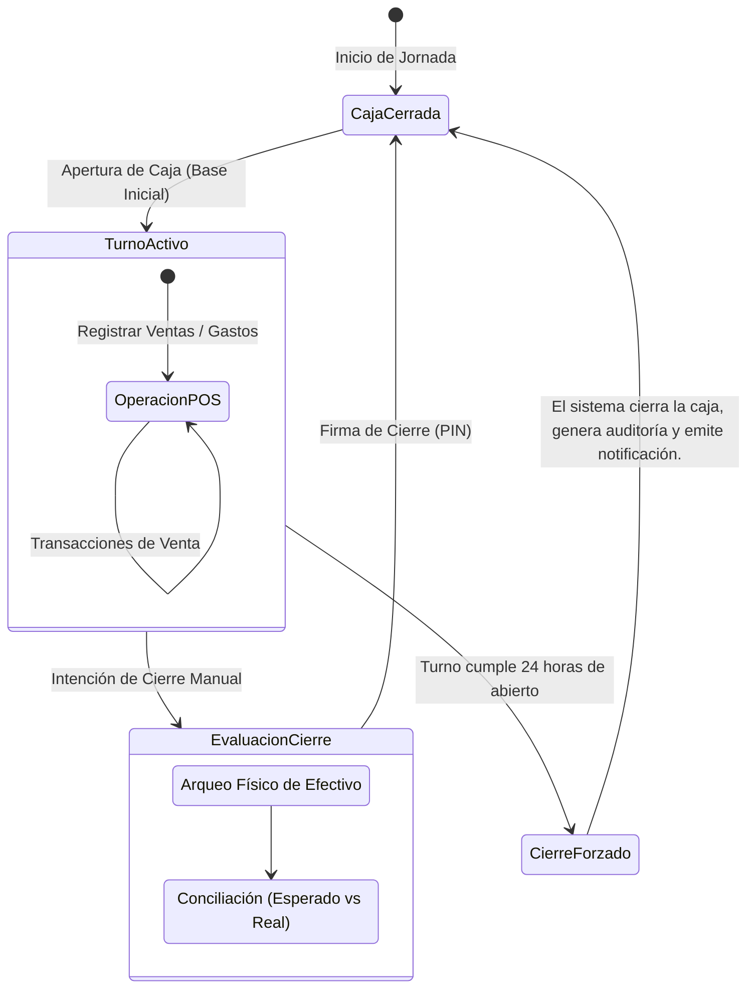

# FRD-017: Alineación del Ciclo Contable de Caja y Ciclo de Vida de Sesiones

> **Módulo:** Contabilidad / Control de Caja / Autenticación  
> **Rol:** Arquitecto de Producto y Requisitos (Desarrollador-Economista Senior)  
> **Versión:** 3.0  
> **Fecha:** 2026-07-25  
> **Estado:** ✅ Especificación Aprobada con Límite 24h

---

## 1. Evaluación Económico-Contable (Análisis de Dominio)

En la economía del comercio minorista, la unidad de medida de un período contable de caja es el **Hecho Económico** continuo (el turno de trabajo), no el reloj astronómico. Un turno de 10:00 PM a 2:00 AM es un solo hecho económico continuo con un solo arqueo físico.

Sin embargo, para evitar la negligencia operativa de turnos que queden abiertos indefinidamente, se establece un **techo temporal estricto de 24 horas**. Este límite es generoso para permitir operaciones continuas o turnos dobles, pero evita el riesgo contable de acumular descuadres por abandono de caja.

---

## 2. Definición del Ciclo Contable Oficial con Techo de 24 Horas

---

## 3. Reglas de Negocio Duras (RN)

### RN-017-01: Continuidad del Turno (Cruce de Medianoche)
Un turno de caja puede cruzar libremente la medianoche sin interrupciones. Las sesiones de usuario operativas se mantienen activas siempre y cuando el turno de caja siga abierto (y no se haya alcanzado el techo de 24 horas). El sistema **NUNCA** ejecuta `logout()` automático solo por el cambio de día calendario.

### RN-017-02: Cierre Forzado por Techo de 24 Horas
Si un turno de caja permanece abierto exactamente 24 horas después de su apertura:
1. El sistema fuerza el estado de la caja a `closed` (Cierre Forzado).
2. El sistema sella el turno con los totales calculados hasta ese instante.
3. Las sesiones vinculadas caducan inmediatamente.

### RN-017-03: Auditoría y Notificación de Cierre Forzado
Cuando ocurre un Cierre Forzado:
1. **Auditoría:** Se documenta automáticamente en el registro de auditoría (`audit_logs`) que el cierre fue accionado por el sistema debido a negligencia de tiempo.
2. **Notificación:** Se genera una notificación persistente para el Administrador.
3. **Verificación:** Antes de permitir la apertura de una NUEVA caja, el usuario debe acusar recibo de la notificación y realizar los ajustes manuales si el dinero físico difiere del cálculo del sistema. El sistema se exime de responsabilidad.

### RN-017-04: Inmutabilidad de la Asignación Contable
Todas las ventas y gastos registrados durante un turno quedan irrevocablemente asociados al `cash_register_id` de ese turno, garantizando el Principio de Devengo.

---

## 4. Casos de Uso

### CU-017-A: Operación Nocturna (Cruce de Medianoche)
- **Actor:** Tendero
- **Flujo:** Abre caja a las 10:00 PM con $50,000. Realiza ventas a las 11:30 PM y a la 1:30 AM.
- **Postcondición:** Todas las ventas se imputan al mismo ciclo contable. El usuario nunca fue interrumpido a medianoche. Cierra manualmente a las 2:00 AM y realiza el arqueo correcto.

### CU-017-B: Olvido de Cierre y Ejecución Forzada
- **Actor:** Sistema (Backend) / Tendero
- **Flujo Principal:**
  1. El tendero abre caja el Lunes a las 8:00 AM.
  2. Termina su turno el Lunes a las 6:00 PM y se va sin cerrar la caja.
  3. El sistema opera normalmente. El Martes a las 8:00 AM (24 horas exactas después), el sistema (vía Cron o validación perezosa) detecta que el turno cumplió 24 horas.
  4. El sistema sella la caja, expira sesiones, registra en auditoría y crea una notificación.
  5. El Martes a las 9:00 AM, el tendero ingresa.
  6. El sistema muestra la alerta bloqueante de Cierre Forzado.
  7. El tendero debe confirmar estar enterado antes de iniciar un nuevo turno.
- **Postcondición:** Contabilidad protegida sin cortar los flujos operativos legítimos. Trazabilidad de mala práctica registrada.

---

## 5. Impacto en el Sistema (Insumo para Orquestador y Datos)

| Componente | Tipo de Modificación | Descripción |
| :--- | :--- | :--- |
| `src/stores/auth.ts` | **MODIFY** | Eliminar toda lógica de expiración astronómica pura. La sesión vive mientras el turno viva (< 24h). |
| `src/stores/cashRegister.ts` | **MODIFY** | Integrar validación de antigüedad del turno. Flujo de notificación y bloqueo post-cierre forzado. |
| Backend (Supabase RPC/Cron) | **NEW** | Lógica automatizada que detecte cajas abiertas con `created_at < NOW() - INTERVAL '24 hours'` y ejecute el Cierre Forzado con auditoría. |
