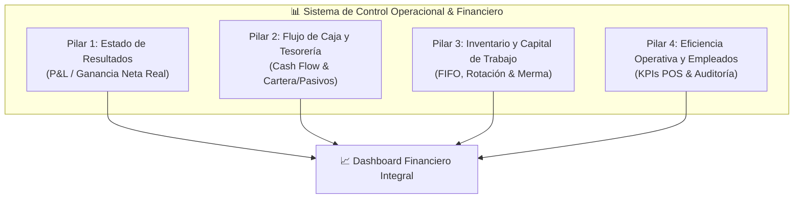

# FRD-018: Marco de Control Operacional Completo y Análisis Financiero Integral

> **Módulo:** Finanzas / Operaciones / Analítica de Negocio  
> **Rol:** Arquitecto de Producto y Requisitos (Desarrollador-Economista Senior)  
> **Versión:** 1.0  
> **Fecha:** 2026-07-25  
> **Estado:** ✅ Propuesta Estratégica para Implementación

---

## 1. Visión y Diagnóstico Estratégico

El objetivo de esta extensión es evolucionar *Tienda de Barrio Pro* de un registrador transaccional de ventas (POS) a una **Plataforma de Control Operacional e Inteligencia Financiera Ligera (ERP Micro-Retail)**.

Actualmente, el sistema registra ventas, inventario FIFO y movimientos de caja. Sin embargo, para responder a un **Análisis Financiero Completo**, el tendero debe poder ver en todo momento la salud financiera de su negocio bajo los 4 pilares de la economía operativa.



---

## 2. Los 4 Pilares del Análisis Financiero e Impacto en Datos

### 📊 Pilar 1: Estado de Resultados Operativo (P&L / Profit & Loss)

Mide la rentabilidad real del negocio en un periodo seleccionado (Hoy, Semana, Mes, Año, Rango Personalizado).

#### Fórmulas Financieras Clave:
$$\text{Ingresos Netos} = \text{Ventas Brutas} - \text{Devoluciones/Anulaciones}$$
$$\text{Costo de Ventas (COGS)} = \sum (\text{Cantidad Vendida} \times \text{Costo FIFO Histórico del Lote})$$
$$\text{Margen Bruto} = \text{Ingresos Netos} - \text{COGS}$$
$$\text{Gastos Operativos (OPEX)} = \text{Gastos Fijos} + \text{Gastos Variables} + \text{Nómina/Retiros} + \text{Mermas}$$
$$\mathbf{\text{Ganancia Neta Real}} = \text{Margen Bruto} - \text{OPEX}$$

#### Requisitos de Datos:
- Captura estricta de `unit_cost` en cada `sale_item` consumiendo lotes FIFO (`FRD_010`).
- Categorización de `expenses` en OPEX: `Servicios`, `Arriendo`, `Nómina/Personal`, `Transporte/Fletes`, `Mantenimiento`, `Merma/Deterioro`.

---

### 💵 Pilar 2: Flujo de Caja, Tesorería y Capital de Trabajo (Working Capital)

Controla la liquidez inmediata del tendero y previene crisis de efectivo.

#### Componentes:
1. **Conciliación de Canales de Cobro:**
   - **Efectivo en Caja:** Dinero físico auditado por arqueo.
   - **Bancos / Digital (Nequi, Daviplata, Bancolombia, Puntos de Pago):** Fondos ingresados por transferencia pendientes de verificación.
2. **Gestión de Cartera (Cuentas por Cobrar - Fiados):**
   - **Envejecimiento de Saldo (Aging Report):** Alertas por cartera en mora (0-15 días, 16-30 días, 31-60 días, 60+ días).
   - **Índice de Incobrabilidad:** Provisión de cartera vencida que afecta la utilidad.
3. **Gestión de Cuentas por Pagar (Pasivos con Proveedores):**
   - Registro de facturas de compra a crédito recibidas de proveedores.
   - Calendario de vencimientos de facturas para evitar mora con distribuidores.

#### Requisitos de Datos:
- Tabla `supplier_invoices` (Facturas por pagar a proveedores con fecha de vencimiento).
- Tabla `client_ledger` (Rastreabilidad de deudas y abonos con envejecimiento).

---

### 📦 Pilar 3: Control Operacional de Inventario y Activos (Asset Ops)

Evita la inmovilización de capital y las pérdidas invisibles por robo/deterioro.

#### Métricas e Indicadores:
1. **Valoración de Inventario a Costo (Capital Inmovilizado):**
   $$\text{Valor del Inventario} = \sum (\text{Stock Actual} \times \text{Costo FIFO})$$
2. **Rotación de Inventario (Inventory Turnover Ratio):**
   $$\text{Días de Inventario (DIO)} = \frac{\text{Inventario Promedio}}{\text{COGS Diario}}$$
3. **Categorización ABC:**
   - **Clase A (Alta rotación / Alto margen):** 20% de productos que generan el 80% de las ventas.
   - **Clase B (Rotación media):** Productos de consumo regular.
   - **Clase C / Estancados (Capital Muerto):** Productos sin venta en >30 días.
4. **Índice de Mermas y Ajustes:**
   - Registro de pérdidas por vencimiento, daño o discrepancia de conteo físico vs sistémico.

---

### 👥 Pilar 4: Eficiencia Operativa y Auditoría de Empleados

Mide la productividad y mitiga el fraude o fugas de dinero en el Punto de Venta.

#### Métricas de Eficiencia:
- **Ventas y Margen por Empleado / Turno:** Compara qué cajero genera mayor volumen y margen.
- **Historial de Descuadres de Arqueo:** Registro de sobrantes y faltantes de caja atribuidos por cajero (`cash_register.difference`).
- **Ticket Promedio y Unidades por Transacción (UPT):** Valor medio de cada venta por hora/turno.
- **Auditoría de Anulaciones:** Alertas sobre cajeros con alto porcentaje de ventas anuladas o ítems eliminados del carrito.

---

## 3. Especificación de la Solución Técnica (Nuevos RPCs y Vistas)

### 3.1. RPC Consolidado: `rpc_get_comprehensive_financial_report`

Devuelve en un solo payload optimizado la radiografía financiera y operacional completa de la tienda.

```sql
CREATE OR REPLACE FUNCTION rpc_get_comprehensive_financial_report(
    p_store_id UUID,
    p_start_date TIMESTAMPTZ,
    p_end_date TIMESTAMPTZ
)
RETURNS JSONB
LANGUAGE plpgsql
SECURITY DEFINER
AS $$
DECLARE
    v_result JSONB;
BEGIN
    SELECT jsonb_build_object(
        'period', jsonb_build_object('start', p_start_date, 'end', p_end_date),
        'p_and_l', (
            SELECT jsonb_build_object(
                'gross_sales', COALESCE(SUM(total), 0),
                'cogs', COALESCE(SUM(total_cost), 0),
                'gross_margin', COALESCE(SUM(total - total_cost), 0),
                'opex', (SELECT COALESCE(SUM(amount), 0) FROM expenses WHERE store_id = p_store_id AND created_at BETWEEN p_start_date AND p_end_date),
                'net_profit', COALESCE(SUM(total - total_cost), 0) - (SELECT COALESCE(SUM(amount), 0) FROM expenses WHERE store_id = p_store_id AND created_at BETWEEN p_start_date AND p_end_date)
            )
            FROM sales
            WHERE store_id = p_store_id AND is_voided = FALSE AND created_at BETWEEN p_start_date AND p_end_date
        ),
        'working_capital', (
            SELECT jsonb_build_object(
                'cash_in_hand', (SELECT COALESCE(SUM(closing_balance_real), 0) FROM cash_registers WHERE store_id = p_store_id AND status = 'closed'),
                'accounts_receivable', (SELECT COALESCE(SUM(total_debt), 0) FROM clients WHERE store_id = p_store_id),
                'accounts_payable', (SELECT COALESCE(SUM(pending_amount), 0) FROM supplier_invoices WHERE store_id = p_store_id AND status = 'pending'),
                'inventory_valuation', (SELECT COALESCE(SUM(stock * cost), 0) FROM products WHERE store_id = p_store_id AND is_active = TRUE)
            )
        ),
        'operational_kpis', (
            SELECT jsonb_build_object(
                'total_transactions', COUNT(*),
                'average_ticket', CASE WHEN COUNT(*) > 0 THEN ROUND(SUM(total) / COUNT(*), 2) ELSE 0 END,
                'stagnant_products_count', (SELECT COUNT(*) FROM products WHERE store_id = p_store_id AND id NOT IN (SELECT DISTINCT product_id FROM sale_items WHERE created_at > NOW() - INTERVAL '30 days'))
            )
            FROM sales
            WHERE store_id = p_store_id AND is_voided = FALSE AND created_at BETWEEN p_start_date AND p_end_date
        )
    ) INTO v_result;

    RETURN v_result;
END;
$$;
```

---

## 4. Hoja de Ruta de Implementación (Roadmap)

| Fase | Alcance | Entregables Clave |
| :--- | :--- | :--- |
| **Fase 1: P&L Real (Ganancia Neta)** | Consolidación del Costo de Ventas (COGS) FIFO e integración con Gastos Categorizados | RPC `rpc_get_comprehensive_financial_report` + Vista de P&L |
| **Fase 2: Tesorería y Cartera** | Módulo de Cuentas por Cobrar (Fiado) con Envejecimiento y Cuentas por Pagar (Proveedores) | Tabla `supplier_invoices` + Reporte de Cartera por Edades |
| **Fase 3: Analítica de Inventario** | Clasificación ABC, Valoración de Inventario y Días de Inventario (DIO) | Reporte de Rotación + Alertas de Capital Estancado |
| **Fase 4: Auditoría y KPIs POS** | Medición de rendimiento por cajero, auditoría de descuadres de caja y anulaciones | Dashboard Operativo de Personal |

---

## 5. Requisitos de Interfaz de Usuario (UX)

- **Diseño Móvil-First con Tarjetas Ejecutivas:** Los indicadores complejos (COGS, Margen Bruto, OPEX) se traducen en un lenguaje claro para el tendero:
  - *"Ventas Totales"*, *"Costo de Mercancía"*, *"Gastos del Negocio"*, *"Dinero Libre Real"*.
- **Semáforos de Salud Financiera:**
  - 🟢 Verde: Margen de Utilidad > 20% y Flujo de caja positivo.
  - 🟡 Amarillo: Cartera vencida > 15% de las ventas del mes.
  - 🔴 Rojo: OPEX supera el Margen Bruto (Operando en Pérdida).
