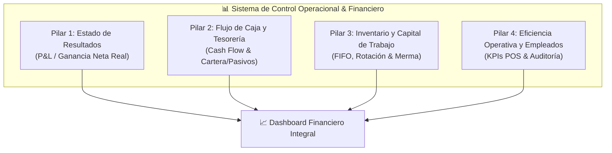

# FRD-018: Marco de Control Operacional Completo y Análisis Financiero Integral

> **Módulo:** Finanzas / Operaciones / Analítica de Negocio  
> **Versión:** 2.0 (Saneamiento documental 2026-08-07 — eliminado código SQL y especificaciones UI)
> **Fecha Original:** 2026-07-25
> **Estado:** ✅ Aprobado

---

## 1. Visión y Diagnóstico Estratégico

El objetivo de esta extensión es evolucionar *Tienda de Barrio Pro* de un registrador transaccional de ventas (POS) a una **Plataforma de Control Operacional e Inteligencia Financiera Ligera (ERP Micro-Retail)**.

Actualmente, el sistema registra ventas, inventario FIFO y movimientos de caja. Sin embargo, para responder a un **Análisis Financiero Completo**, el tendero debe poder ver en todo momento la salud financiera de su negocio bajo los 4 pilares de la economía operativa.

```mermaid
graph TD
    subgraph "📊 Sistema de Control Operacional & Financiero"
        P1["Pilar 1: Estado de Resultados<br/>(P&L / Ganancia Neta Real)"]
        P2["Pilar 2: Flujo de Caja y Tesorería<br/>(Cash Flow & Cartera/Pasivos)"]
        P3["Pilar 3: Inventario y Capital de Trabajo<br/>(FIFO, Rotación & Merma)"]
        P4["Pilar 4: Eficiencia Operativa y Empleados<br/>(KPIs POS & Auditoría)"]
    end
    
    P1 --> Dash["📈 Dashboard Financiero Integral"]
    P2 --> Dash
    P3 --> Dash
    P4 --> Dash
```

---

## 2. Los 4 Pilares del Análisis Financiero e Impacto en Datos

### 📊 Pilar 1: Estado de Resultados Operativo (P&L / Profit & Loss)

Mide la rentabilidad real del negocio en un periodo seleccionado (Hoy, Semana, Mes, Año, Rango Personalizado).

#### Fórmulas Financieras Clave:
$$\text{Ingresos Netos} = \text{Ventas Brutas} - \text{Devoluciones/Anulaciones}$$
$$\text{Costo de Ventas (COGS)} = \sum (\text{Cantidad Vendida} \times \text{Costo FIFO Histórico del Lote})$$
$$\text{Margen Bruto} = \text{Ingresos Netos} - \text{COGS}$$
$$\text{Gastos Operativos (OPEX)} = \text{Gastos Fijos} + \text{Gastos Variables} + \text{Nómina/Retiros} + \text{Mermas}$$
$$\mathbf{\text{Ganancia Neta Real}} = \text{Margen Bruto} - \text{OPEX}$$

#### Requisitos de Datos:
- Registro del costo unitario en cada línea de venta consumiendo lotes FIFO (ver FRD_016 y FRD_010).
- Categorización de gastos en tipos de OPEX: Servicios, Arriendo, Nómina/Personal, Transporte/Fletes, Mantenimiento, Merma/Deterioro.

---

### 💵 Pilar 2: Flujo de Caja, Tesorería y Capital de Trabajo (Working Capital)

Controla la liquidez inmediata del tendero y previene crisis de efectivo.

#### Componentes:
1. **Conciliación de Canales de Cobro:**
   - **Efectivo en Caja:** Dinero físico auditado por arqueo.
   - **Bancos / Digital (Nequi, Daviplata, Bancolombia, Puntos de Pago):** Fondos ingresados por transferencia pendientes de verificación.
2. **Gestión de Cartera (Cuentas por Cobrar - Fiados):**
   - **Envejecimiento de Saldo (Aging Report):** Alertas por cartera en mora (0-15 días, 16-30 días, 31-60 días, 60+ días).
   - **Índice de Incobrabilidad:** Provisión de cartera vencida que afecta la utilidad.
3. **Gestión de Cuentas por Pagar (Pasivos con Proveedores):**
   - Registro de facturas de compra a crédito recibidas de proveedores.
   - Calendario de vencimientos de facturas para evitar mora con distribuidores.

#### Requisitos de Datos:
- Gestión de facturas pendientes de pago con fechas de vencimiento programadas.
- Registro centralizado de deudas de clientes y abonos realizados, incluyendo antigüedad de saldo.

---

### 📦 Pilar 3: Control Operacional de Inventario y Activos (Asset Ops)

Evita la inmovilización de capital y las pérdidas invisibles por robo/deterioro.

#### Métricas e Indicadores:
1. **Valoración de Inventario a Costo (Capital Inmovilizado):**
   $$\text{Valor del Inventario} = \sum (\text{Stock Actual} \times \text{Costo FIFO})$$
2. **Rotación de Inventario (Inventory Turnover Ratio):**
   $$\text{Días de Inventario (DIO)} = \frac{\text{Inventario Promedio}}{\text{COGS Diario}}$$
3. **Categorización ABC:**
   - **Clase A (Alta rotación / Alto margen):** 20% de productos que generan el 80% de las ventas.
   - **Clase B (Rotación media):** Productos de consumo regular.
   - **Clase C / Estancados (Capital Muerto):** Productos sin venta en >30 días.
4. **Índice de Mermas y Ajustes:**
   - Registro de pérdidas por vencimiento, daño o discrepancia de conteo físico vs sistémico.

---

### 👥 Pilar 4: Eficiencia Operativa y Auditoría de Empleados

Mide la productividad y mitiga el fraude o fugas de dinero en el Punto de Venta.

#### Métricas de Eficiencia:
- **Ventas y Margen por Empleado / Turno:** Compara qué cajero genera mayor volumen y margen.
- **Historial de Descuadres de Arqueo:** Registro de sobrantes y faltantes de caja atribuidos por cajero (`cash_register.difference`).
- **Ticket Promedio y Unidades por Transacción (UPT):** Valor medio de cada venta por hora/turno.
- **Auditoría de Anulaciones:** Alertas sobre cajeros con alto porcentaje de ventas anuladas o ítems eliminados del carrito.

---

## 3. Requisito de Consulta Consolidada

El sistema DEBE proveer una operación del servidor que entregue en una sola respuesta la radiografía financiera y operacional completa de la tienda para un período de tiempo dado. Esta operación DEBE recibir como parámetros mínimos:

- Identificador de la tienda
- Fecha y hora de inicio del período
- Fecha y hora de fin del período

El resultado DEBE contener los datos de los 4 pilares descritos en la sección 2, estructurados de forma que el consumidor pueda acceder a cada pilar de forma independiente sin procesamiento adicional.

> **Nota para Equipo Data:** La especificación técnica completa de esta operación (incluyendo el esquema de respuesta exacto, manejo de casos borde y políticas de acceso) corresponde al SDD_018 y al DSD correspondiente. Este FRD establece el requisito funcional; el cómo implementarlo no es responsabilidad de este documento.

---

## 4. Hoja de Ruta de Implementación (Roadmap)

| Fase | Alcance | Entregables Clave |
| :--- | :--- | :--- |
| **Fase 1: P&L Real (Ganancia Neta)** | Consolidación del Costo de Ventas (COGS) FIFO e integración con Gastos Categorizados | Operación de reporte financiero integral + Vista de P&L |
| **Fase 2: Tesorería y Cartera** | Módulo de Cuentas por Cobrar (Fiado) con Envejecimiento y Cuentas por Pagar (Proveedores) | Tabla `supplier_invoices` + Reporte de Cartera por Edades |
| **Fase 3: Analítica de Inventario** | Clasificación ABC, Valoración de Inventario y Días de Inventario (DIO) | Reporte de Rotación + Alertas de Capital Estancado |
| **Fase 4: Auditoría y KPIs POS** | Medición de rendimiento por cajero, auditoría de descuadres de caja y anulaciones | Dashboard Operativo de Personal |

---

## 5. Criterios de Aceptación

- [ ] **CA-018-01:** El sistema provee una consulta consolidada que retorna los indicadores de los 4 pilares en una sola llamada, para un período dado.
- [ ] **CA-018-02:** Los datos del Pilar 1 (Ganancia Neta) se calculan usando el costo real de venta registrado, no un costo de cero.
- [ ] **CA-018-03:** Los datos del Pilar 2 incluyen el saldo de cuentas por cobrar (clientes) y cuentas por pagar (proveedores) a la fecha de corte.
- [ ] **CA-018-04:** Los datos del Pilar 3 incluyen la valoración del inventario usando el método FIFO.
- [ ] **CA-018-05:** Los datos del Pilar 4 diferencian las operaciones por empleado o turno.
- [ ] **CA-018-06:** Solo el Administrador puede acceder al reporte financiero consolidado. Los empleados no tienen acceso.
