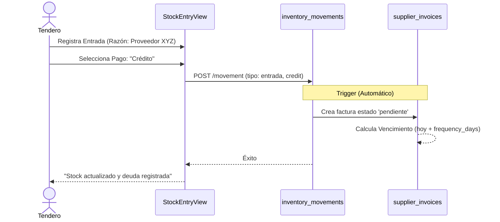
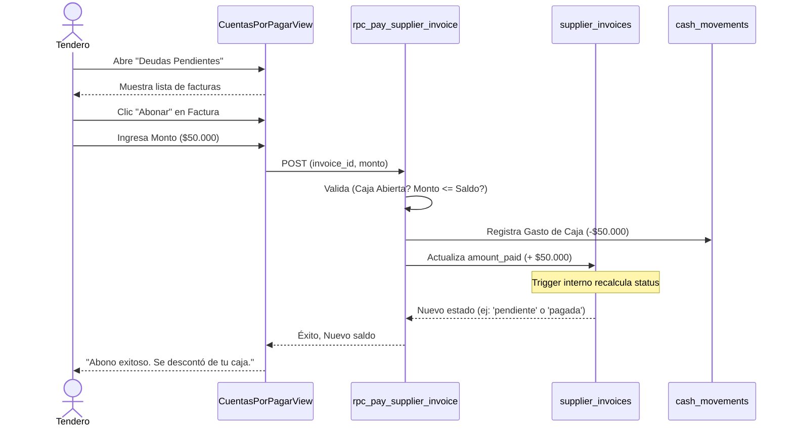

# FRD-019: Módulo de Cuentas por Pagar (Proveedores)

> **Módulo:** Finanzas / Inventario  
> **Rol:** Arquitecto de Producto y Requisitos (Desarrollador-Economista Senior)  
> **Estado:** 🟡 En Revisión (Flujos base)

## Descripción
Este módulo cierra la brecha existente en la recepción de mercancía a crédito. Permite al tendero llevar un control exacto de sus obligaciones (pasivos) con los proveedores, visualizar fechas de vencimiento, realizar abonos parciales o totales, y asegurar que dichos pagos afecten correctamente el flujo de caja del negocio (Pilar 2 del FRD-018).

---

## 🔄 Flujos del Sistema y del Usuario

### 1. Flujo de Generación de Deuda (Automático)

Este flujo se integra de forma transparente con el proceso actual de entrada de stock. El usuario no tiene que ir a una pantalla separada para registrar la factura.

### 2. Flujo de Pago/Abono a Proveedor

Este flujo ocurre cuando el proveedor visita la tienda para cobrar, o el tendero decide hacer un pago proactivo.

---

## Reglas de Negocio

1. **Creación Automática:** Toda entrada de mercancía (`inventory_movements`) categorizada con `payment_type = 'credito'` generará automáticamente un registro en `supplier_invoices`. No requiere intervención manual.
2. **Fecha de Vencimiento Estimada:** Si no se provee fecha manual al momento de la entrada, el sistema tomará la fecha actual y le sumará el valor de `suppliers.frequency_days` para calcular el vencimiento.
3. **Abonos Parciales:** Se permite realizar abonos parciales. Una factura solo cambia a estado `pagada` cuando `amount_paid >= total_amount`.
4. **Vínculo con Caja:** Todo abono a un proveedor se considera una salida de dinero en efectivo. **DEBE** existir una sesión de caja abierta (`status = 'open'`) para registrar el abono; de lo contrario, la operación se bloquea.
5. **Estado Inmutable (Vía Consulta):** La tabla física no almacena la columna `status` para evitar errores de falta de actualización por reloj. El estado (`pendiente`, `vencida`, `pagada`) se calcula dinámicamente al vuelo en las consultas (RPC o View) comparando `amount_paid` vs `total_amount` y `due_date` vs `CURRENT_DATE`.
6. **Integridad Contable (Doble Conteo):** El pago a un proveedor NO es un gasto operativo (OPEX), ya que su impacto en P&L ocurre vía el costo de mercancía (COGS). Los pagos de facturas deben registrarse en `cash_movements` bajo un nuevo tipo dedicado: `pago_proveedor`, evitando inflar artificialmente el OPEX.
7. **Resolución de Devoluciones (Trazabilidad Híbrida FIFO/Explícita con Cascada):** Para resolver a qué factura pertenece una devolución de mercancía (`movement_type = 'devolucion'` o `salida` a proveedor):
   - **Selección Explícita:** Si el movimiento registra `reference_invoice_id` (FK a `supplier_invoices`), la deducción inicia en esa factura específica.
   - **Fallback Automático (FIFO):** Si no se especifica factura, la deducción se busca en las facturas activas del proveedor que **NO estén pagadas** (`amount_paid < total_amount`), ordenadas por vencimiento próximo (`ORDER BY due_date ASC, created_at ASC`).
   - **Aplicación en Cascada (Manejo de Excedentes):** Si el monto devuelto supera el saldo pendiente de la factura seleccionada o más antigua, la factura queda en saldo cero (`amount_paid = total_amount`) y el monto excedente se aplica automáticamente en **cascada transaccional atómica** a la siguiente factura con saldo pendiente del mismo proveedor, siguiendo el mismo orden de vencimiento próximo (`ORDER BY due_date ASC, created_at ASC`).
   - **Remanente Final y Sin Facturas Pendientes:** Si no existen facturas con saldo pendiente (`amount_paid < total_amount`), o si tras aplicar la cascada a todas las facturas aún resta un saldo devuelto, el movimiento de inventario se registra exitosamente (la mercancía sale físicamente del stock), pero el remanente no altera ninguna factura adicional. Se emitirá una notificación auditada de forma estructurada que incluya obligatoriamente el `supplier_id` y el monto, para permitir consultas históricas (ej: *"Remanente a favor: $[Monto] | Proveedor: [UUID]"*).

---

#### Deuda Técnica Conocida (Para futuras iteraciones)
- **Idempotencia en Movimientos de Inventario:** El sistema confía en la capa de UI (`isSubmitting = true`) para evitar doble consumo por clics repetidos. Sin embargo, no existe un mecanismo de idempotencia en Backend (ej. `idempotency_key` o `external_reference_id`) que proteja contra reintentos automáticos de red por latencia en el POS. Si se detectan duplicaciones en producción, se deberá priorizar la implementación de llaves de idempotencia en el esquema de la base de datos y la API.

## Casos de Uso

### Caso 1: Generación de Factura por Entrada de Inventario
- **Actor:** Empleado o Admin
- **Precondición:** Recepción física de mercancía de un proveedor.
- **Flujo Principal:**
  1. El usuario navega a `StockEntryView`.
  2. Selecciona el proveedor, ingresa productos y marca "Pago a Crédito".
  3. Guarda la entrada.
  4. El sistema registra el movimiento de inventario.
  5. El sistema, vía Trigger, detecta el crédito y crea una factura en `supplier_invoices` por el valor total de los productos ingresados.
- **Flujo Alternativo:** Si el usuario marca "Al Contado", el trigger lo ignora y no se genera deuda.

### Caso 2: Registro de Abono a Proveedor
- **Actor:** Admin (o empleado con permisos financieros)
- **Precondición:** Existe una factura pendiente y la Caja está abierta.
- **Flujo Principal:**
  1. El usuario entra a la vista de Proveedores > Cuentas por Pagar.
  2. Selecciona una deuda de $200.000 y pulsa "Abonar".
  3. Ingresa un monto (Ej: $50.000).
  4. El sistema valida que la caja actual tiene fondos suficientes (Opcional, pero recomendado generar alerta si queda en rojo).
  5. El sistema registra un egreso (`cash_movements`) por $50.000 bajo el tipo `pago_proveedor` (¡No como gasto general!).
  6. El sistema suma $50.000 a la factura. El saldo baja a $150.000.
- **Flujo Alternativo (Falta de caja):** Si no hay turno de caja abierto, el sistema deniega la operación con un error explícito.

### Caso 3: Registro de Devolución de Mercancía a Proveedor
- **Actor:** Empleado o Admin
- **Precondición:** Existe mercancía a devolver y un proveedor seleccionado.
- **Flujo Principal:**
  1. El usuario entra a `StockEntryView` (o vista de movimientos de inventario) y selecciona "Salida" / "Devolución".
  2. Selecciona el proveedor. El sistema carga opcionalmente la lista de facturas activas (`amount_paid < total_amount`) de ese proveedor.
  3. El usuario puede elegir una factura específica (alimentando `reference_invoice_id`) o dejar el campo en blanco.
  4. Confirma la salida de inventario.
  5. El sistema inserta el movimiento en `inventory_movements`.
  6. El Trigger ejecuta la deducción: si se especificó `reference_invoice_id`, descuenta de esa factura; si no, ejecuta el algoritmo FIFO descontando de las facturas pendientes más antiguas. Si hay un excedente, lo aplica en cascada atómica a las siguientes facturas.
- **Flujo Alternativo (Sin Facturas Pendientes):** El movimiento de inventario se registra exitosamente (la mercancía sale del stock), pero el saldo de facturas permanece inalterado y se crea una nota de auditoría.

---

## Criterios de Aceptación
- [ ] Todo movimiento de inventario de tipo `entrada` con proveedor y tipo `credito` debe reflejarse en `supplier_invoices`.
- [ ] Todo movimiento de devolución a proveedor debe reducir el saldo adeudado de la factura explícitamente seleccionada (`reference_invoice_id`), o en su defecto de la factura activa más antigua que no esté pagada (`amount_paid < total_amount`).
- [ ] En devoluciones cuyo monto supere el saldo pendiente de una factura, el excedente debe aplicarse en cascada a la siguiente factura no pagada del mismo proveedor. Si no hay facturas pendientes o queda un remanente final, el movimiento de stock no falla y el remanente se registra en el log de auditoría.
- [ ] La operación de cascada de ajuste a múltiples facturas debe ser atómica (dentro del mismo bloque transaccional del trigger); si ocurre algún fallo, ninguna factura debe resultar alterada (rollback completo).
- [ ] No es posible abonar manualmente un monto que supere el saldo restante de la factura (Monto Pendiente = `total_amount` - `amount_paid`).
- [ ] Toda consulta (RPC o vista) que exponga facturas debe reflejar el estado `vencida` dinámicamente cuando `due_date` esté superado y `amount_paid < total_amount`, sin necesidad de un job de actualización ni estado almacenado.
- [ ] Todo abono genera un registro auditable en `cash_movements` (tipo `pago_proveedor`) enlazado a la sesión actual.

---

## Lista de Tareas de Alto Nivel
1. [ ] **DDL / Esquema:** Crear migración SQL para tabla `supplier_invoices` y ejecutar `ALTER TABLE inventory_movements ADD COLUMN reference_invoice_id UUID REFERENCES supplier_invoices(id) ON DELETE RESTRICT`.
2. [ ] **Trigger Rama A (Creación de Deuda):** Desarrollar trigger `AFTER INSERT` en `inventory_movements` para crear automáticamente `supplier_invoices` en entradas a crédito (`movement_type = 'entrada'`, `payment_type = 'credito'`).
3. [ ] **Trigger Rama B (Deducción en Cascada FIFO):** Desarrollar lógica del trigger `AFTER INSERT` para procesar devoluciones (`movement_type = 'devolucion'` o `salida` a proveedor): aplicar saldo a `reference_invoice_id` o cascada FIFO sobre facturas no pagadas, manejando remanentes atómicamente.
4. [ ] **RPC de Abono:** Crear RPC `rpc_pay_supplier_invoice` que maneje transaccionalmente el aumento de `amount_paid` y la generación del egreso en `cash_movements` (tipo `pago_proveedor`).
5. [ ] **Ajustes Cruzados en RPCs Existentes:**
   - Modificar `rpc_check_and_force_close_shifts` y cierre de caja para restar `pago_proveedor` del `expected_balance`.
   - Modificar `rpc_get_comprehensive_financial_report` para asegurar que `pago_proveedor` NO se sume al OPEX.
6. [ ] **Frontend (UI & Selectores):** 
   - Añadir selector opcional de factura (`reference_invoice_id`) en `StockEntryView` al registrar devoluciones.
   - Construir vista `PayablesView.vue` (o sub-sección en Proveedores) para listar facturas con estado dinámico (Pendiente, Vencida, Pagada).
   - Construir Modal de "Nuevo Abono a Factura".

---

## Impacto en el Sistema
| Componente | Modificación |
|------------|--------------|
| **Base de Datos** | Nueva tabla `supplier_invoices` (sin columna status almacenada). Nuevo trigger en `inventory_movements`. Nuevo RPC `rpc_pay_supplier_invoice`. **Modificación a 2 RPCs existentes (`rpc_check_and_force_close_shifts`, `rpc_get_comprehensive_financial_report`)** para soportar el nuevo movimiento `pago_proveedor`. |
| **Store Pinia** | Expansión de `suppliers.ts` o creación de `payables.ts` para consumir el estado de facturas y llamar al RPC de abonos. |
| **Views** | Nueva pestaña o ruta `PayablesView.vue` dentro de la sección de Proveedores o Finanzas. |
| **StockEntryView** | Ligeras modificaciones de UX: añadir selector opcional de factura origen (`reference_invoice_id`) al registrar devoluciones a crédito. |
