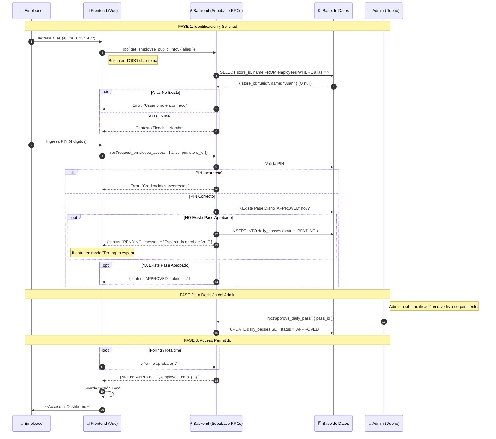

# Estrategia de Simplificación: Acceso de Empleados "Zero-Auth" con Control Estricto

> **Contexto**: Ante la complejidad excesiva de implementar usuarios autenticados (Supabase Auth/RLS) para empleados transitorios, cambiamos a un modelo de "Confianza en el Dispositivo" gestionado por lógica de aplicación simple, pero **reforzado con Aprobación Explicita del Admin**.

## 1. El Cambio de Paradigma

Abandonamos el intento de mapear cada Empleado a un `auth.users` de Supabase.
En su lugar:
1.  **Identidad Global**: El empleado se identifica con un **Alias Numérico Único Global** (ej. Cédula/Teléfono). El sistema infiere su tienda automáticamente.
2.  **Autenticación**: Validación de PIN (Prueba de Conocimiento).
3.  **Autorización (El Candado)**: Validación de **Pase Diario Activo**. Si no existe, se bloquea el acceso y se solicita aprobación al Admin.

> ⚠️ **Nota de Arquitectura**: La unicidad del Alias es CRÍTICA. No pueden existir dos empleados con el mismo alias en ninguna tienda del sistema.

---

## 2. Diagrama de Secuencia: Flujo de Aprobación Obligatoria

Este flujo describe cómo el sistema impide el acceso "silencioso" y fuerza la intervención del Admin.

## 3. Implicaciones Técnicas

### Base de Datos
- **Constraint**: `ALTER TABLE employees ADD CONSTRAINT unique_alias_global UNIQUE (alias);`
- **Tabla `daily_passes`**: Es la pieza central. Debe tener `employee_id`, `store_id`, `status` (PENDING, APPROVED, REJECTED, CLOSED), `created_at`.

### Frontend
- **Login View**: Debe manejar 3 estados:
    1.  Credenciales Incorrectas.
    2.  Credenciales OK + **Esperando Aprobación** (Bloqueante con spinner/mensaje).
    3.  Credenciales OK + Aprobado (Entra).
- **Persistencia**: Solo se guarda la sesión UNA VEZ que el estado es `APPROVED`.

### Backend (RPCs)
- `get_employee_public_info(alias)`: Retorna nombre y tienda (público).
- `request_employee_access(alias, pin)`: Valida PIN y crea/retorna estado del pase.
- `approve_daily_pass(pass_id)`: Solo ejecutable por Admin (RLS o check de rol).

## 4. Próximos Pasos (Plan de Acción)
1. [ ] **BD**: Aplicar constraint de unicidad global al alias.
2. [ ] **RPC**: Crear `get_employee_public_info` para resolver tienda por alias.
3. [ ] **RPC**: Crear `request_employee_access` que gestione la lógica de PIN + Creación de Pase PENDING.
4. [ ] **Frontend**: Actualizar flujo de Login para soportar la pantalla de "Esperando Aprobación".
