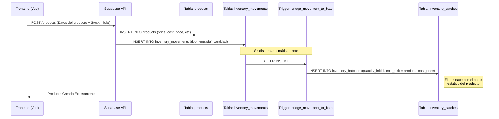
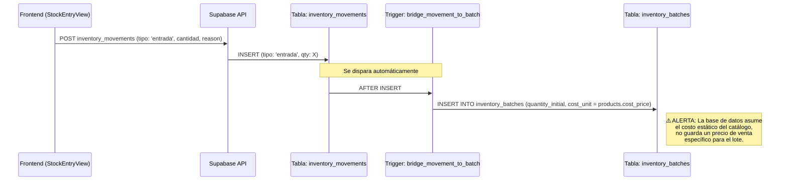
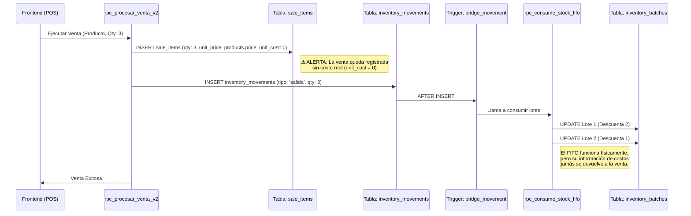

# Documento de Requisitos Funcionales (FRD)

## 016. Estado Actual del Sistema FIFO y Lógica de Precios

> **Fecha de Documentación:** Julio 2026
> **Propósito:** Dejar registro oficial de cómo funciona actualmente el sistema y cuáles son sus falencias arquitectónicas antes de la refactorización (Plan Maestro FIFO).

### 1. Proceso de Guardado de un Nuevo Producto

Cuando se crea un producto por primera vez en el sistema, el costo de compra se transfiere estáticamente al nuevo lote.

### 2. Proceso de Agregar Cantidades a un Producto (Nueva Compra)

Cuando llega mercancía nueva, el usuario solo ingresa el costo unitario de esa compra.

### 3. Proceso de Venta (Consumo de múltiples lotes con costos distintos)

El motor actual maneja las cantidades FIFO correctamente, pero destruye la trazabilidad de los costos.

### 4. Análisis del "Error Contable del Precio de Venta"

**Falla Estructural:** El precio de venta (`price`) es una columna global en la tabla `products`.

**¿Por qué genera un error contable?**
1. Un tendero compra un producto a $1000 y lo vende a $1500 (Lote 1).
2. Sube la inflación. El tendero compra más stock a $1200 (Lote 2) y actualiza el precio de venta global a $1700.
3. El POS automáticamente forzará a que el Lote 1 (viejo) se venda a $1700.
4. Contablemente, el margen del Lote 1 se infla artificialmente. El sistema anula la capacidad del tendero de aplicar una estrategia de precios respetando el stock original adquirido a menor costo.

**Conclusión:** Un sistema FIFO real en retail debe amarrar el "Precio de Compra" y el "Precio de Venta" directamente al lote (`inventory_batches`), de modo que el POS pueda despachar el producto respetando las políticas de precio de la partida física exacta que el cliente se está llevando.
