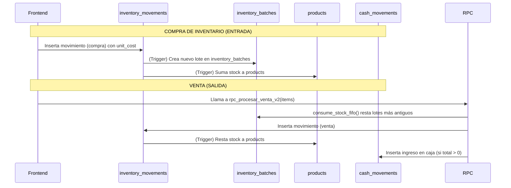

# FRD: Sistema de Inventario - Flujo de Lotes (Fase 4 y 5)

## 1. Descripción General
Este documento detalla la arquitectura actual del sistema de inventario (Fase 4 y 5 de implementación), el cual abandonó el escaneo automático para adoptar un enfoque pragmático basado en la captura explícita de costos en la creación de productos y el consumo por lotes (FIFO).

## 2. Flujo de Datos Arquitectónico

### 2.1. Fuentes de Verdad
1. **`products` (Tabla Principal)**: Define el catálogo, el `current_stock` y el precio general de venta actual (`price`).
2. **`inventory_batches` (Fuente de Verdad Financiera)**: Cada entrada de inventario genera un lote con su propia cantidad, `cost_unit` y `sale_price` en el momento de la entrada.
3. **`inventory_movements` (Registro Histórico)**: Registra el qué, el por qué y el quién del movimiento de mercancía, pero la rentabilidad exacta se determina consumiendo `inventory_batches`.

### 2.2. Interacción de Componentes
El sistema funciona bajo el principio de "Una Sola Vía" donde la autoridad reside en el Backend (Supabase RPCs y Triggers).

## 3. Reglas de Negocio Implementadas (Fase 4 & 5)

1. **Gestión de Precios (FIFO Split):** Si un usuario intenta vender N unidades de un producto, y la venta abarca dos lotes distintos con diferente precio de venta (`sale_price`), el frontend debe separar automáticamente ese producto en dos líneas en el carrito.
2. **Autoridad del Precio:** El precio de venta que rige la transacción financiera no es el de `products.price`, sino el almacenado en el lote `inventory_batches.sale_price`.
3. **Manejo de Déficits (Force Sale):** Si el inventario reporta insuficiencia, pero el cajero tiene el producto físico, se permite la venta forzada (`rpc_force_sale`). El sistema agrupa los ítems solicitados, verifica el déficit contra `products.current_stock` e inyecta un movimiento de "CORRECCION_SISTEMA" para crear un lote de emergencia con costo 0 antes de procesar la venta.
4. **Ventas de Costo $0:** Si un lote está configurado con `sale_price = 0` o se regala el producto, el flujo no falla por la restricción de caja de "ingreso > 0". Simplemente salta el inserto en `cash_movements` porque no ingresó dinero físico.
5. **Corrección Retroactiva de Lotes:** El administrador puede editar el costo y el precio de un lote activo a través del `BatchHistoryModal`. Esto se registra en `audit_logs` con categoría `INVENTORY_BATCH_UPDATE`.
