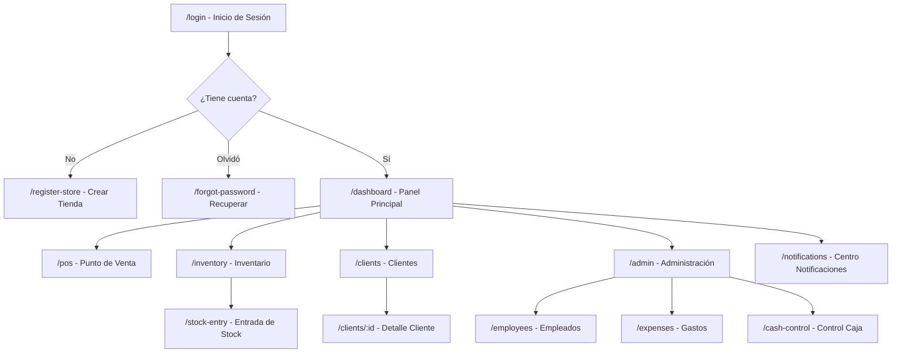

# Documento de Requisitos del Producto (PRD)
## Tienda de Barrio Pro

> **Estado de Sincronización:** ⚠️ LEGACY / OBSOLETO
> **Nota del Arquitecto:** Este documento se mantiene solo como referencia histórica de la visión del producto. Para especificaciones técnicas y funcionales vigentes, consultar la carpeta `01_REQUIREMENTS/FRD/` (FRD-001 al FRD-005). Los detalles aquí descritos pueden no coincidir con la implementación actual.
> **Última Auditoría:** 2026-01-22 | Actualización basada en Código Fuente (`src/types`)

---

## 1. Resumen del Producto

### ¿Qué hace la aplicación?

**Tienda de Barrio Pro** es un **sistema de Punto de Venta (POS) móvil** diseñado específicamente para pequeños comercios minoristas latinoamericanos ("tiendas de barrio"). La aplicación funciona como una Progressive Web App (PWA) que permite:

- **Gestión de ventas** con soporte para productos por unidad y por peso (balanza)
- **Control de caja diario** con apertura, cierre y arqueo
- **Sistema de crédito ("fiado")** para clientes frecuentes con límites de crédito y seguimiento de deudas
- **Gestión de inventario** con alertas de stock bajo
- **Administración de empleados** con sistema de permisos granular
- **Registro de gastos operativos** diarios
- **Reportes básicos** de ventas por período

### User Personas Inferidas

| **El Dueño (Admin)** | Propietario del negocio. Accede con email + contraseña validado en servidor. | Acceso completo (Bypass RLS) |
| **El Empleado (Vendedor)** | Personal. Accede con username + PIN + Huella de Dispositivo. | Acceso limitado por `permissions` JSON y RLS. |

---

## 2. Arquitectura de Navegación (Site Map)



### Detalle de Rutas

| Ruta | Vista | Propósito Funcional |
|------|-------|---------------------|
| `/login` | LoginView | Autenticar usuario (admin con email/password, empleado con username/PIN) |
| `/register-store` | RegisterStoreView | Onboarding de nueva tienda: datos del negocio, credenciales del dueño, PIN de seguridad de 6 dígitos |
| `/forgot-password` | ForgotPasswordView | Flujo de recuperación de contraseña |
| `/` (dashboard) | DashboardView | Panel principal: estado de caja (abierta/cerrada), métricas del día (ventas, efectivo, fiado), accesos rápidos |
| `/pos` | POSView | **Core del negocio**: interfaz de venta con teclado numérico, carrito, checkout multi-pago |
| `/inventory` | InventoryView | Catálogo de productos con búsqueda, filtros por categoría, alertas de stock bajo |
| `/stock-entry` | StockEntryView | Registro de entrada de mercancía al inventario |
| `/clients` | ClientListView | Listado de clientes con deudas y créditos disponibles |
| `/clients/:id` | ClientDetailView | Historial de transacciones del cliente, registro de abonos |
| `/employees` | EmployeeManagerView | CRUD de empleados, asignación de permisos |
| `/admin` | AdminHubView | Hub administrativo con tabs: **Reportes** (ventas por período) y **Gestión** (caja, empleados, gastos) |
| `/expenses` | ExpensesView | Registro de gastos/salidas de dinero del día |
| `/cash-control` | CashControlView | Arqueo de caja: resumen del día, cierre de jornada |
| `/notifications` | NotificationCenterView | Centro de notificaciones y alertas |

---

## 3. Desglose de Funcionalidades (Feature Breakdown)

### 3.1 Vista: Login (`/login`)

**Acciones del Usuario:**
1. Ingresar usuario o correo electrónico
2. Ingresar contraseña o PIN (4 dígitos para empleados)
3. Mostrar/ocultar contraseña
4. Acceder a recuperación de contraseña
5. Navegar a registro de nueva tienda

**Lógica de Autenticación (Cascada):**
```
1. ¿Existe tienda registrada? → No → Error "No se detecta tienda"
                              ↓ Sí
2. ¿Es Admin (email+password)? → Sí → loginAsAdmin() → Dashboard
                              ↓ No
3. ¿Es Empleado (username+pin)? → Sí → loginAsEmployee() → Dashboard
                              ↓ No
4. Error "Credenciales inválidas"
```

---

### 3.2 Vista: Registrar Tienda (`/register-store`)

**Acciones del Usuario:**
1. Ingresar nombre de la tienda (mín. 3 caracteres)
2. Ingresar nombre del dueño
3. Ingresar correo electrónico
4. Crear contraseña (mín. 6 caracteres)
5. Crear PIN de seguridad de 6 dígitos mediante teclado numérico

**Validaciones Visibles:**
- ✅ Check visual cuando nombre de tienda tiene 3+ caracteres
- Botón "Abrir mi Tienda" deshabilitado hasta que todos los campos sean válidos
- Error: *"Este correo ya está registrado"*

---

### 3.3 Vista: Dashboard (`/`)

**Acciones del Usuario:**
1. **Abrir/Cerrar Caja**: Slider visual para iniciar jornada con monto base
2. Ver métricas del día:
   - Caja Real (efectivo actual)
   - Ventas Hoy (total + cantidad)
   - Por Cobrar (fiado del día)
   - Inventario (productos + alertas stock bajo)
3. Acceso rápido a POS, Inventario, Clientes
4. [Solo Admin] Gestionar Empleados, Configuración
5. Ver perfil de usuario (sidebar)
6. Cerrar sesión

**Lógica de Interfaz:**
- Banner de onboarding si inventario vacío: *"¡Bienvenido! Tu tienda está lista. Paso 1: Agrega tu primer producto"*
- Indicador visual de estado: ABIERTO (verde) / CERRADO (gris)

---

### 3.4 Vista: Punto de Venta - POS (`/pos`)

**Acciones del Usuario:**
1. Ingresar PLU (código rápido) mediante teclado numérico
2. Buscar productos por nombre (modal de búsqueda)
3. Agregar productos al carrito
4. **Flujo de Cantidad:**
   - Flujo A: [cantidad] → CANT.× → [PLU] → AGREGAR
   - Flujo B: [PLU] → CANT.× → [cantidad] → AGREGAR
5. Agregar notas/productos personalizados con precio manual
6. Para productos por peso: abrir calculadora de peso
7. Eliminar items del carrito
8. Vaciar carrito completo
9. **COBRAR**: Abrir modal de checkout

**Validaciones y Bloqueos:**
- Overlay *"No tienes permiso para realizar ventas"* si empleado sin permiso `canSell`
- Overlay *"Tienda Cerrada - No se pueden realizar ventas"* si tienda fuera de servicio
- Botón COBRAR deshabilitado si carrito vacío

---

### 3.5 Modal: Checkout

**Métodos de Pago:**

| Método | Flujo | Validaciones |
|--------|-------|--------------|
| **Efectivo** | Ingresar monto recibido → calcular vueltos | No permite completar si falta dinero |
| **Nequi/Daviplata** | Confirmación simple, referencia opcional (últimos 4 dígitos) | Ninguna validación estricta |
| **Fiado** | Seleccionar cliente de lista → verificar crédito disponible | Advertencia si excede límite de crédito (pero permite continuar) |

**Acciones del Usuario (Efectivo):**
1. Ingresar monto recibido con teclado numérico
2. Ver cálculo de vueltos en tiempo real
3. Usar "monto exacto" como shortcut
4. Confirmar venta

**Acciones del Usuario (Fiado):**
1. Buscar cliente por nombre o cédula
2. Ver crédito disponible del cliente seleccionado
3. Ver advertencia si excederá límite
4. Confirmar venta a crédito

---

### 3.6 Vista: Inventario (`/inventory`)

**Acciones del Usuario:**
1. Buscar productos por nombre, marca, categoría o PLU
2. Filtrar por categoría (tags horizontales)
3. Ver listado con scroll virtual (optimización de rendimiento)
4. Crear nuevo producto (FAB +)
5. Editar producto existente (click en tarjeta)
6. Eliminar producto (con confirmación)
7. Navegar a entrada de stock (FAB secundario)

**Validaciones:**
- Overlay de permisos para empleados sin `canViewInventory`
- Stock en rojo si está por debajo del mínimo
- Confirmación antes de eliminar: *"¿Estás seguro de eliminar este producto?"*

---

### 3.7 Modal: Formulario de Producto

**Campos:**
- Nombre del producto (requerido)
- Marca (opcional, con autocompletado)
- Código Rápido / PLU (máx. 4 dígitos)
- Categoría (selector con opciones predefinidas + personalizada)
- **Modo de Venta**: Por Unidad / Por Peso (toggle)
- Unidad de medida: un, kg, lb, g (según modo)
- Precio (requerido, numérico > 0)
- Costo (opcional)
- Stock actual
- Stock mínimo

**Validaciones:**
- Botón guardar deshabilitado si nombre vacío o precio <= 0

---

### 3.8 Vista: Clientes (`/clients`)

**Acciones del Usuario:**
1. Buscar cliente por nombre, cédula o teléfono
2. Ver lista con balance actual (debe/al día)
3. Crear nuevo cliente
4. Acceder a detalle de cliente

---

### 3.9 Vista: Detalle de Cliente (`/clients/:id`)

**Acciones del Usuario:**
1. Ver información del cliente (nombre, cédula, teléfono)
2. Ver balance actual y límite de crédito
3. Ver historial de transacciones (compras y abonos)
4. Registrar abono/pago
5. Editar información del cliente
6. Eliminar cliente

---

### 3.10 Vista: Gestión de Empleados (`/employees`)

**Acciones del Usuario (Solo Admin):**
1. Ver lista de empleados con estado (activo/inactivo)
2. Crear nuevo empleado
3. Editar empleado existente
4. Activar/desactivar empleado
5. Cambiar PIN de empleado

**Permisos Configurables por Empleado:**
| Permiso | Descripción |
|---------|-------------|
| `canSell` | Puede realizar ventas en el POS |
| `canViewInventory` | Puede acceder al módulo de inventario |
| `canViewReports` | Puede ver reportes de ventas |
| `canFiar` | Puede realizar ventas a crédito |

---

### 3.11 Vista: Administración (`/admin`)

**Tabs disponibles:**

**Tab Reportes:**
- Resumen de ventas por período (hoy, semana, mes)
- Desglose por método de pago

**Tab Gestión:**
- **Control de Caja**: Ver estado, ir a arqueo
- **Gastos del Día**: Ver y registrar salidas
- **Empleados y Permisos**: Gestionar equipo
- **Configuración del Negocio**: (parcialmente implementado)
- **Dispositivos Autorizados**: (UI presente, funcionalidad no implementada)
- **Historial de Ventas**: (UI presente, funcionalidad no implementada)
- **Cerrar Tienda**: Toggle para poner tienda fuera de servicio temporalmente

---

### 3.12 Vista: Gastos (`/expenses`)

**Categorías Predefinidas:**
- Servicios
- Proveedores
- Transporte
- Salarios
- Otro

**Acciones del Usuario:**
1. Ver lista de gastos del día con total acumulado
2. Agregar nuevo gasto:
   - Descripción (requerida)
   - Monto mediante numpad
   - Categoría (dropdown)
   - Nota adicional (opcional)
3. Eliminar gasto existente

**Lógica de Reset:**
> Los gastos del día se limpian automáticamente al ejecutar `closeStore()` en el control de caja.

---

### 3.13 Vista: Control de Caja (`/cash-control`)

**Estados de la Vista:**
| Estado | Condición | Acción Disponible |
|--------|-----------|-------------------|
| Apertura | `!salesStore.isStoreOpen` | Ingresar base inicial |
| Cierre | `salesStore.isStoreOpen` | Realizar arqueo |

**Fórmula de Efectivo Esperado:**
```
expectedCash = openingCash + todayCash - todayExpenses
difference = closingAmount - expectedCash
```

**Acciones del Usuario (Apertura):**
1. Ingresar monto base con teclado numérico
2. Click "Abrir Caja" → Activa tienda en salesStore
3. Redirige a Dashboard

**Acciones del Usuario (Cierre):**
1. Ver resumen del día:
   - Base inicial (openingCash)
   - Ventas en efectivo (todayCash)
   - Ventas Nequi (todayNequi)
   - Ventas fiado (todayFiado)
   - Gastos del día (todayExpenses)
   - Efectivo esperado vs conteo real
2. Ingresar conteo real de caja
3. Ver diferencia (verde positiva, roja negativa)
4. Click "Cerrar Caja" → Ejecuta:
   - `salesStore.closeStore()`
   - `expensesStore.clearTodayExpenses()`
5. Redirige a Dashboard

---

## 4. Modelo de Datos Inferido (Data Dictionary)

### Entidad: Tienda (`StoreAccount`)
| Campo | Tipo | Descripción |
|-------|------|-------------|
| id | string | Identificador único |
| storeName | string | Nombre comercial de la tienda |
| ownerName | string | Nombre del propietario |
| email | string | Correo electrónico (único) |
| password | string | Contraseña del admin |
| pin | string | PIN de 6 dígitos para acceso rápido |
| createdAt | ISO date | Fecha de creación |

---

### Entidad: Usuario Autenticado (`CurrentUser`)
| Campo | Tipo | Descripción |
|-------|------|-------------|
| id | string | Identificador único |
| name | string | Nombre para mostrar |
| email | string | Correo o username |
| type | 'admin' \| 'employee' | Tipo de usuario |
| storeId | string | FK a tienda |
| employeeId | number (opcional) | FK a empleado si aplica |
| permissions | object (opcional) | Permisos si es empleado |

---

### Entidad: Producto (`Product`) - Mapeado a DB
| Campo | Tipo | Descripción |
|-------|------|-------------|
| id | UUID | Identificador único global |
| name | string | Nombre del producto |
| price | Decimal | Precio de venta |
| cost_price | Decimal | Costo (Protegido por RLS, null para empleados sin permiso) |
| current_stock | Decimal | Stock sincronizado |
| min_stock | number | Alerta de reabastecimiento |
| is_weighable | boolean | Manejo de balanza |
| plu | string | Código rápido (nullable) |

---

### Entidad: Venta (`Sale`) - Atomic Transaction
| Campo | Tipo | Descripción |
|-------|------|-------------|
| id | UUID | Identificador único de transacción |
| ticketNumber | number | Secuencial legible para el humano (UI) |
| items | JsonB | Snapshot de items vendidos (preserva precio histórico) |
| total | Decimal | Total monetario |
| payment_method | enum | 'cash', 'nequi', 'fiado' |
| syncStatus | enum | 'synced', 'pending', 'failed' (Control Offline) |

---

### Entidad: Cliente (`Client`)
| Campo | Tipo | Descripción |
|-------|------|-------------|
| id | UUID | Identificador único |
| balance | Decimal | Deuda actual (Calculada o Sincronizada) |
| credit_limit | Decimal | Tope de fiado |
| created_at | IOS8601 | Fecha registro |

---

### Entidad: Auditoría (`InventoryMovement`)
| Campo | Tipo | Descripción |
|-------|------|-------------|
| id | UUID | ID del movimiento |
| movement_type | enum | 'entrada', 'salida', 'venta', 'ajuste' |
| quantity | Decimal | Cantidad afectada |
| sale_id | UUID | FK Opcional a venta |
| created_by | UUID | Usuario responsable (Auditoría) |

---

## 5. Dependencias y Conectividad

### Estado Actual: Arquitectura Híbrida (Offline-First + Supabase)

> [!IMPORTANT]
> **La aplicación utiliza un patrón de Repositorio Híbrido.** Prioriza la operación offline pero sincroniza activamente con **Supabase (PostgreSQL)** cuando hay conexión.

**Capa de Datos Implementada (`src/data/repositories`):**
| Repositorio | Estrategia | Conexión |
|-------------|------------|----------|
| `saleRepository` | **Atomic RPC / Sync Queue** | Usa `procesar_venta` (RPC) si hay red. Si no, encola en IndexedDB. |
| `authRepository` | **Gatekeeper Unificado** | Usa `login_empleado_unificado` (RPC) para validar credenciales y dispositivo. |
| `productRepository` | **Sync-on-Demand** | Caché local persistente con sincronización de fondo. |

**Conectividad Backend:**
- **Base de Datos:** PostgreSQL (Supabase)
- **Seguridad:** Row Level Security (RLS) activo para aislamiento de datos entre tiendas.
- **Autenticación:** Gestión de sesiones segura con JWT.
- **RPCs Activos:** `procesar_venta`, `login_empleado_unificado`.

---

## 6. Análisis de Brechas (Gap Analysis)

### 🟢 Brechas de Seguridad Resueltas

| Brecha Anterior | Estado | Solución Implementada |
|-----------------|--------|-----------------------|
| Contraseñas en texto plano | **RESUELTO** | Gestión delegada a Supabase Auth + Hashing. |
| Sin autenticación real | **RESUELTO** | RPC `login_empleado_unificado` + fingerprinting de dispositivo. |
| Datos financieros expuestos | **MITIGADO** | Políticas RLS (Row Level Security) estrictas en PostgreSQL. |
| Sin auditoría | **RESUELTO** | Tablas `system_audit_logs` y `inventory_movements` activas. |

---

### 🟠 Funcionalidades Incompletas

| Feature | Estado | Brecha |
|---------|--------|--------|
| Configuración del Negocio | UI presente | No tiene lógica implementada |
| Dispositivos Autorizados | UI presente | No tiene lógica implementada |
| Historial de Ventas | UI presente | No tiene lógica implementada |
| Recuperar Contraseña | Vista existe | Flujo de email no implementado (sin backend) |
| Notificaciones | Vista vacía | Sin lógica de notificaciones implementada |
| Reportes avanzados | Parcial | Solo totales básicos por período |

---

| Área | Estado real (Validado) |
|------|------------------------|
| **Procesamiento Offline** | Queue en IndexedDB que reintenta sincronización automática. |
| **Historiales** | Módulo completo (`HistoryView`) con filtros por tipo (Venta, Auditoría). |
| **Notificaciones** | Sistema activo (`notificationsStore`) para Stock Bajo y Auditoría. |

---

### 🟢 Funcionalidades Completas

- ✅ Flujo de registro de tienda
- ✅ Login dual (admin / empleado)
- ✅ Gestión de productos (CRUD completo)
- ✅ Ventas con 3 métodos de pago
- ✅ Sistema de crédito con límites
- ✅ Gestión de empleados con permisos
- ✅ Control de caja básico
- ✅ Registro de gastos
- ✅ Soporte para productos por peso
- ✅ Búsqueda y filtros de inventario
- ✅ Arquitectura modular con stores Pinia

---

## Apéndice: Stack Tecnológico

| Capa | Tecnología |
|------|------------|
| Framework | Vue 3.5 (Composition API) |
| Routing | Vue Router 4 |
| Estado | Pinia + pinia-plugin-persistedstate |
| Building | Vite 6 |
| Estilos | TailwindCSS 4 |
| Iconos | Lucide Vue + Material Symbols |
| Cálculos | Decimal.js (precisión financiera) |
| Virtualización | vue-virtual-scroller |
| Lenguaje | TypeScript |

---

*Documento mantenido sincronizado mediante orquestación automatizada.*  
*Última auditoría completa: 2026-01-13 - Ver CHANGELOG_SYNC.md para historial de cambios.*
