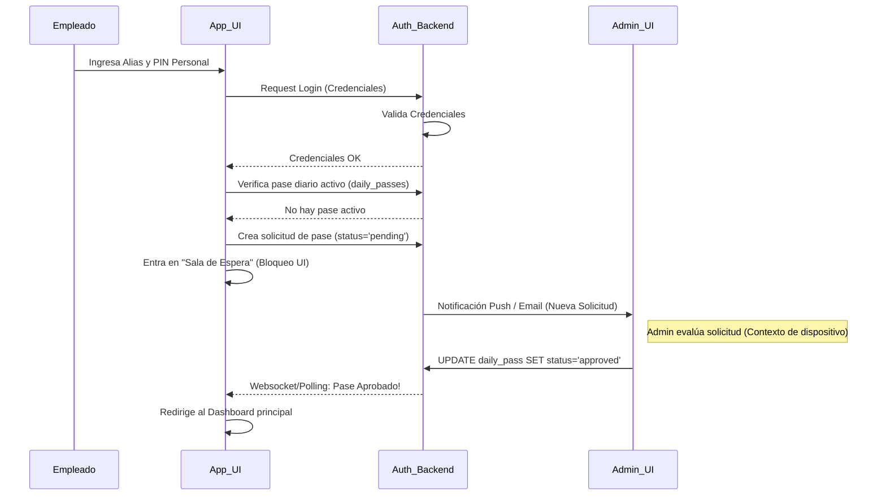
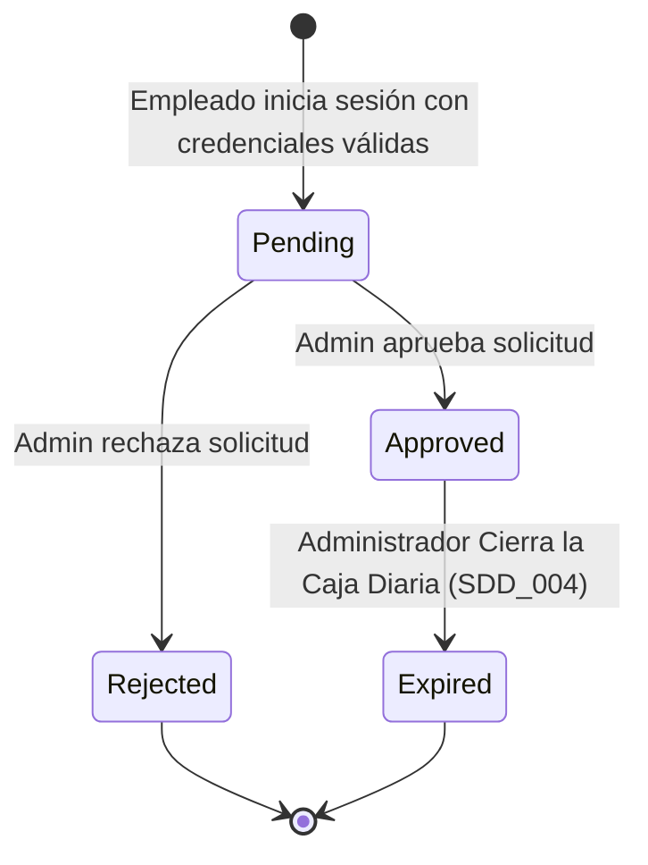

# SDD-001: Protocolo de Seguridad en Capas ("Zero Trust Daily")

> **Asociado a:** [FRD-001](../FRD/FRD_001_SEGURIDAD_DIARIA.md)  
> **Fase del Plan:** Fase 5 (Seguridad y Sesiones)  
> **Estado:** 🟢 Consolidado  
> **Última Actualización:** 2026-08-04

---

## 0. Contexto y Restricciones Aplicables (PEA-N)

### 0.1 Políticas Globales Activadas (ARQ-002)
| Política | Dominio | Impacto Específico en este SDD |
|----------|---------|-------------------------------|
| **POL-SEC-02** | Seguridad | Principio de Cero Confianza ("Zero Trust"). Ningún empleado (excluyendo el owner/admin) puede iniciar operaciones en el sistema sin una autorización explícita del día. Las credenciales base no bastan. |
| **SPEC-006** | Seguridad | **ERRADICACIÓN DEL PIN DE CAJA:** Se sobreescribe la directiva del FRD que sugería un "PIN de Caja". Todo acceso a módulos financieros se delega estrictamente al token JWT generado al aprobar el Pase Diario. |

### 0.2 Contratos Vecinos que Limitan el Diseño (Consulta RVC)
| SDD Vecino / Entidad | Restricción que impone al diseño de este SDD |
|----------------------|----------------------------------------------|
| **SDD_004 (Control de Caja)** | El cierre de caja es el evento maestro que provoca la expiración forzada de todos los pases diarios vigentes. |
| **SDD_027 (Caja Diaria)** | Para abrir una caja o registrar ventas, el `rpc_procesar_venta_v3` valida que el `auth.uid()` posea un `daily_pass` en estado `approved`. |

---

## 1. Glosario Local
* **Pase Diario (`daily_pass`):** Certificado lógico temporal que autoriza a un empleado específico a operar el sistema durante un turno. 
* **Sala de Espera:** Pantalla de bloqueo (UI) donde el usuario permanece tras validar sus credenciales correctas, a la espera de que el administrador conceda el Pase Diario.

---

## 2. Diagrama de Secuencia (UML - Mermaid)

### Caso de Uso: Autenticación con Sala de Espera y Aprobación

---

## 3. Diagrama de Estados

---

## 4. Especificación Detallada de Casos de Uso

### 4.1 Ingreso Diario a Sala de Espera
- **Precondiciones:** El empleado tiene credenciales válidas y no existe un `daily_pass` en estado `approved` para la fecha/turno actual.
- **Reglas de Negocio Aplicables:** Regla 1 (Cero Confianza), Regla 4 (Sala de Espera).
- **Flujo Principal:**
  1. El actor ingresa sus credenciales en el login.
  2. El sistema valida las credenciales base (Auth de Supabase).
  3. El sistema inserta un registro en `daily_passes` con estado `pending`.
  4. El sistema bloquea la navegación y renderiza la vista "Sala de Espera".
  5. El sistema notifica al administrador de la tienda.
- **Flujos Alternativos:** 
  - Si el empleado ya tenía un pase en estado `pending`, el sistema no crea uno nuevo, sino que retoma la pantalla de espera.
- **Flujos de Excepción:**
  - *Límite de Reintentos:* Si el empleado presiona "Reenviar Notificación" más de 3 veces, el sistema congela la solicitud y pide contactar por teléfono.
- **Postcondiciones (Éxito):** La solicitud queda registrada y el administrador notificado.

### 4.2 Aprobación / Rechazo Remoto
- **Precondiciones:** Existe un `daily_pass` en estado `pending`.
- **Reglas de Negocio Aplicables:** Regla 2 (Aprobación Obligatoria), Regla 5 (Huella Dispositivo).
- **Flujo Principal:**
  1. El Administrador recibe la alerta (con datos del empleado y dispositivo).
  2. El Administrador oprime "Aprobar".
  3. El sistema actualiza el estado del `daily_pass` a `approved`.
  4. El frontend del empleado detecta el cambio de estado (vía realtime o polling) y le da acceso al sistema.
- **Postcondiciones (Éxito):** El empleado queda facultado para interactuar con los módulos operativos (POS, Inventario) según su rol base.

---

## 5. Contrato de Interfaz

### 5.1 Operación: `solicitar_pase_diario`
- **Entrada esperada:** Ninguna explícita (se deduce del token JWT del usuario logueado en modo restringido). Opcionalmente se envía el `device_fingerprint` (String).
- **Reglas de transformación:** 
  - Validar que no exista ya un pase pendiente que exceda los límites de reintento.
  - Generar registro con `status = 'pending'`.
- **Salida esperada:** 
  - Éxito: Objeto `daily_pass` recién creado.

### 5.2 Operación: `resolver_pase_diario`
- **Entrada esperada:** 
  - `pass_id` (UUID, Obligatorio).
  - `resolution` (Enum: `'approved'`, `'rejected'`).
- **Reglas de transformación:**
  - Solo roles con permiso `admin` pueden invocarlo.
  - Actualiza el estado y sella el timestamp `resolved_at`.
- **Salida esperada:**
  - Éxito: Confirmación de actualización.
  - Fallo: `UNAUTHORIZED`.

---

## 6. Análisis de Seguridad

- **Control de Acceso:** 
  - Crear pase: Cualquier usuario con credenciales base válidas.
  - Resolver pase: Estrictamente restringido al Dueño/Administrador.
- **Protección de Datos:** La huella del dispositivo (`device_fingerprint`) es solo informativa para prevenir ataques de suplantación si las credenciales fueron robadas. No es información altamente confidencial pero solo es visible para el Admin.
- **Superficie de Amenazas:**
  - *Amenaza:* Abuso del botón "Reenviar notificación" (Ataque de denegación de servicio a la bandeja del Admin).
  - *Mitigación:* Limitador (Rate Limiting) forzado en backend que congela la solicitud en el tercer intento.
- **Trazabilidad de Auditoría:** Cada solicitud queda en la base de datos indicando la hora en que el empleado quiso entrar, y la hora exacta en que el Admin lo dejó entrar.

---

## 7. Modelo de Datos Lógico

### 7.1 Entidad: `daily_passes`

| Atributo | Tipo Lógico | Restricciones | Descripción |
|----------|-------------|---------------|-------------|
| `id` | UUID | PK. | Identificador único del pase. |
| `employee_id` | UUID | FK a `profiles`. | Empleado solicitante. |
| `status` | Enum | `'pending'`, `'approved'`, `'rejected'`, `'expired'`. | Estado del ciclo de vida. |
| `device_fingerprint` | Texto | Opcional. | Cadena identificadora del dispositivo/navegador. |
| `requested_at` | Timestamp | Default `NOW()`. | Cuándo se hizo la petición. |
| `resolved_at` | Timestamp | Nulo hasta resolución. | Cuándo el Admin tomó la decisión. |
| `expires_at` | Timestamp | Nulo hasta cierre de caja. | Marcado por el motor del SDD_004 al culminar el turno. |
