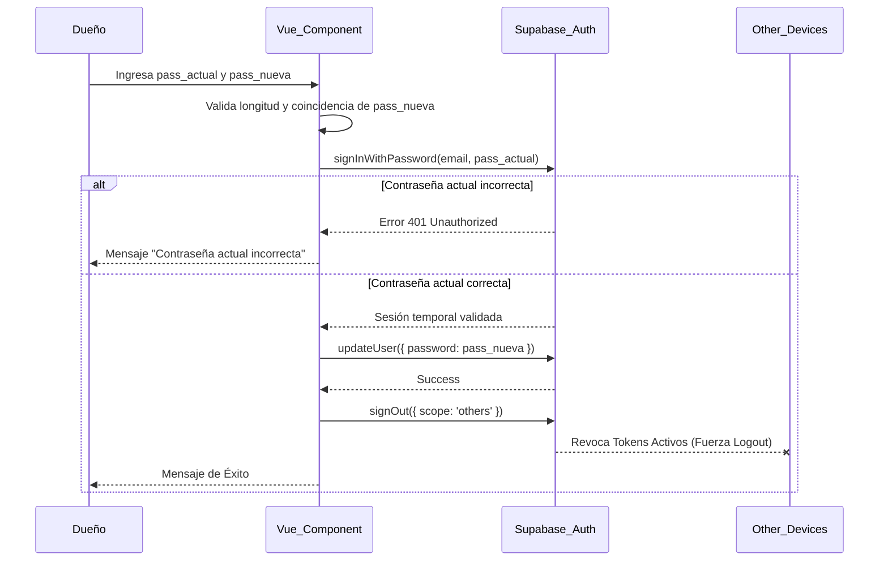
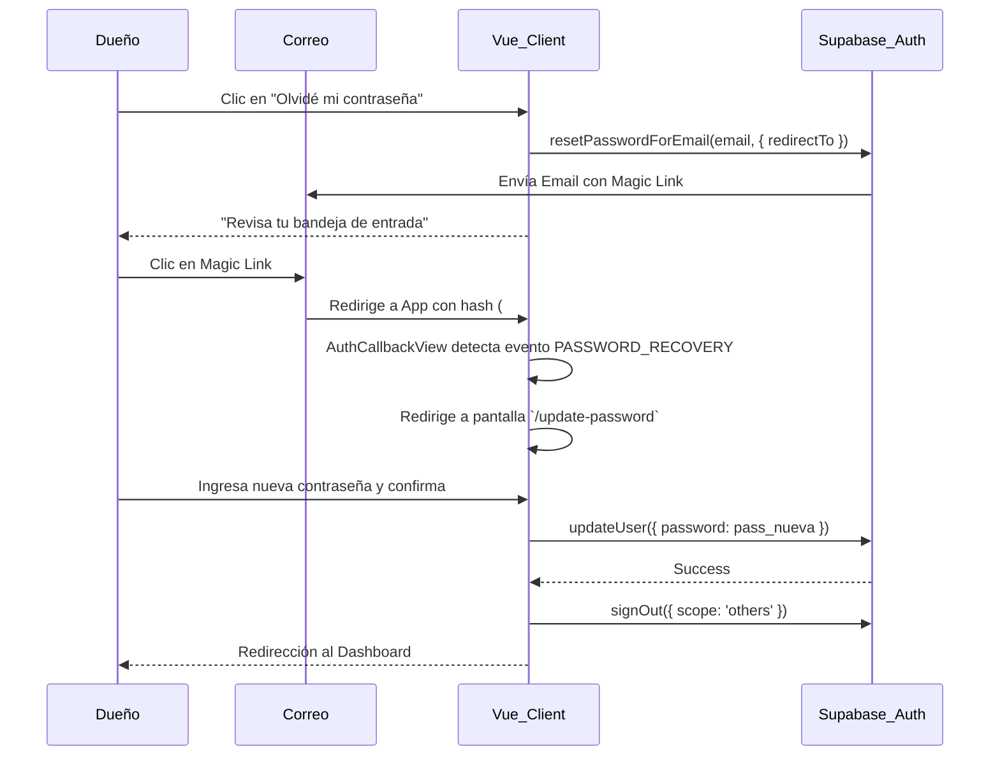
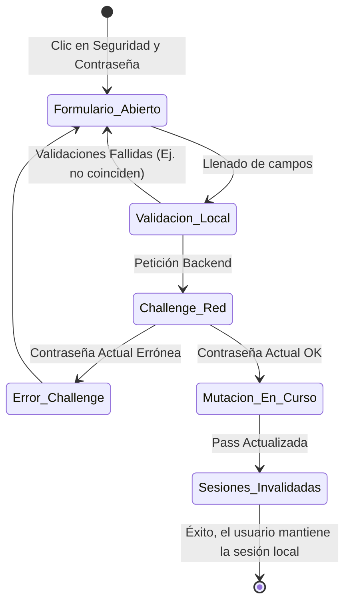

# SDD-002.1: Gestión y Recuperación de Contraseñas

> **Asociado a:** [FRD-002.1](../FRD/FRD_002_1_CAMBIO_CONTRASENA.md)  
> **Fase del Plan:** Fase 5 (Seguridad y Sesiones)  
> **Estado:** 🟢 Consolidado (Auditado en Código)  
> **Última Actualización:** 2026-08-05

---

## 0. Contexto y Restricciones Aplicables (PEA-N)

### 0.1 Políticas Globales Activadas (ARQ-002)
| Política | Dominio | Impacto Específico en este SDD |
|----------|---------|-------------------------------|
| **POL-SEC-03** | Seguridad de Sesiones | **Doble Verificación en Vivo:** Exige la re-autenticación de la contraseña anterior en tiempo real (`signInWithPassword`) para evitar secuestros si la terminal quedó desbloqueada. |
| **POL-SEC-04** | Invalidación | **Cierre Masivo de Sesiones:** Todo cambio de credencial maestra obliga a purgar los JWT en el resto de los dispositivos, previniendo ventanas de exposición si una laptop antigua fue comprometida. |

### 0.2 Resultados de Auditoría de Código
La auditoría del código actual reveló la existencia de dos flujos de mutación de identidad distintos:
1. **Flujo Interno:** Cambio autenticado desde el perfil (`changePassword`), validado mediante un *Challenge* de contraseña actual.
2. **Flujo Externo:** Recuperación por olvido (`recoverPassword`), validado mediante el envío de un Magic Link (`resetPasswordForEmail`) y un enrutamiento especial gestionado por `AuthCallbackView` al detectar el evento `PASSWORD_RECOVERY`.

Ambos flujos convergen en la misma política de seguridad: la invalidación de sesiones ajenas tras el cambio.

---

## 1. Glosario Local
* **Alcance de Invalidación (`scope: 'others'`):** Comando específico de Supabase Auth que destruye todas las sesiones asociadas al UUID del usuario activo, excepto la sesión desde la cual se invocó el comando.
* **Challenge:** El acto de solicitar al usuario que demuestre que conoce un secreto (en este caso, la contraseña actual) antes de autorizar un cambio crítico.
* **Magic Link de Recuperación:** Enlace criptográfico de un solo uso enviado por correo que, al ser clickeado, inyecta un token temporal en la URL para autorizar el cambio de contraseña.

---

## 2. Diagrama de Secuencia (UML - Mermaid)

### Caso de Uso: Mutación de Contraseña con Invalidación de Sesiones

### Caso de Uso 2: Recuperación Externa por Correo (Olvido)

---

## 3. Diagrama de Estados

---

## 4. Especificación Detallada de Casos de Uso

### 4.1 Modificación de Credenciales (Flujo Principal)
- **Precondiciones:** El usuario tiene una sesión válida en el sistema (JWT activo).
- **Reglas de Negocio Aplicables:** Regla 1 (Challenge), Regla 2 (Validación de Fuerza), Regla 3 (Invalidación).
- **Flujo Principal:**
  1. El Administrador llena `Contraseña Actual`, `Nueva Contraseña` y `Confirmar Contraseña`.
  2. Frontend valida que `Nueva Contraseña` tenga ≥ 6 caracteres y coincida con `Confirmar`.
  3. Frontend invoca `authRepository.changePassword`.
  4. El repositorio realiza el *Challenge* contra la base de datos de Auth.
  5. Una vez validada, el repositorio empuja la nueva contraseña.
  6. El repositorio ejecuta la limpieza de sesiones huérfanas o remotas.
  7. El modal se cierra y notifica éxito.
- **Flujos Alternativos:**
  - Si el *Challenge* falla, se muestra error "Contraseña actual incorrecta" y se aborta el flujo. No hay invalidación de sesiones.
- **Postcondiciones:** Credencial actualizada. La sesión donde se hizo la solicitud sigue viva; el resto debe volver a loguearse.

### 4.2 Recuperación Externa por Olvido
- **Precondiciones:** El usuario no está autenticado en la aplicación y ha perdido su credencial de acceso.
- **Reglas de Negocio Aplicables:** Validar propiedad del correo. Regla 2 (Fuerza de Contraseña). Regla 3 (Invalidación Masiva).
- **Flujo Principal:**
  1. El Administrador introduce su correo en la pantalla de "Olvidé mi contraseña".
  2. El sistema invoca `recoverPassword`.
  3. El proveedor envía un Magic Link por email.
  4. El administrador hace clic en el enlace, abriendo la app en el navegador.
  5. El observador de autenticación global (`onAuthStateChange`) detecta el evento `PASSWORD_RECOVERY`.
  6. El sistema enruta automáticamente a la pantalla de reinicio de contraseña.
  7. El usuario digita la nueva credencial.
  8. El sistema invoca una actualización estándar (`updateUser`).
  9. Al culminar, el sistema DEBE invalidar sesiones (`signOut({ scope: 'others' })`) por prevención ante posibles equipos perdidos/robados.
- **Postcondiciones:** Credencial restablecida. Usuario adquiere una sesión activa local, y todas las sesiones de otros dispositivos se invalidan.

---

## 5. Contrato de Interfaz

### 5.1 Capa Frontend: `authRepository.changePassword`
- **Entrada esperada:** 
  - `email` (Identificador del usuario).
  - `current` (Contraseña actual para el *Challenge*).
  - `newPass` (Nueva credencial validada).
- **Reglas de transformación (El Contrato Interno):**
  - La ejecución DEBE ser estrictamente secuencial y abortar ante cualquier fallo:
  1. Validar `current` contra el proveedor de identidad.
  2. Emitir orden de actualización con `newPass`.
  3. Emitir orden de destrucción masiva de sesiones (`scope: 'others'`).
- **Salida esperada:** 
  - **Éxito:** Confirmación de mutación y limpieza completada.
  - **Fallo:** Error por credencial actual inválida, u otro error de red.

### 5.2 Capa Frontend: `authRepository.recoverPassword` (Recuperación)
- **Entrada esperada:** 
  - `email` (Dirección del usuario).
- **Reglas de transformación:** 
  - Enviar solicitud de recuperación al proveedor, indicando la URL de retorno base (`redirectTo: /`).
- **Salida esperada:** 
  - **Éxito:** Confirmación de que el correo de recuperación fue encolado o enviado. No expone si el usuario existe o no (Protección contra enumeración).

### 5.3 Capa Interceptora: Captura de `PASSWORD_RECOVERY`
- **Condición de Disparo:** Evento nativo emitido por `onAuthStateChange` al regresar mediante un Magic Link de recuperación.
- **Reglas de transformación:** 
  - Capturar el evento antes de procesar el renderizado normal.
  - Redirigir el enrutador Vue hacia la vista forzada de `/update-password`.
  - Bloquear la salida de esa vista hasta que el usuario complete el ciclo o cierre la pestaña.

---

## 6. Análisis de Seguridad

1. **Defensa contra XSS y Secuestro Físico:** Al forzar el ingreso de la contraseña actual, aunque un atacante lograra control del navegador (vía script o dejándolo desbloqueado), no puede cambiar la contraseña ni bloquear al dueño sin conocer el secreto original.
2. **Exposición en Memoria:** Las variables reactivas (`ref`) que guardan la contraseña en `ChangePasswordModal.vue` deben ser limpiadas (reseteadas a string vacío) inmediatamente después de que la promesa de backend se resuelve (sea con éxito o fallo) para reducir el tiempo en el Heap de memoria.
3. **Persistencia:** En ningún escenario la contraseña plana pasa a ninguna tabla del esquema `public`.

---

## 7. Modelo de Datos Lógico

Este módulo es una extensión de seguridad y **no posee entidades lógicas en el esquema de base de datos público** (`public`). Interactúa únicamente de manera opaca con el microservicio de identidades (`auth.users`) provisto por Supabase, consumiendo su API REST y sin almacenar trazas, salvo en los logs de auditoría de red del proveedor de nube.
