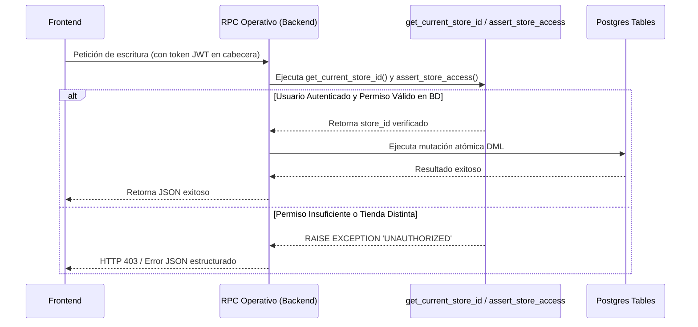
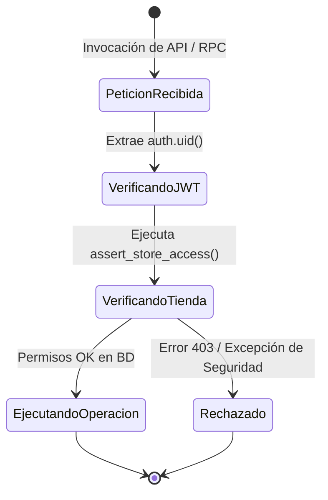
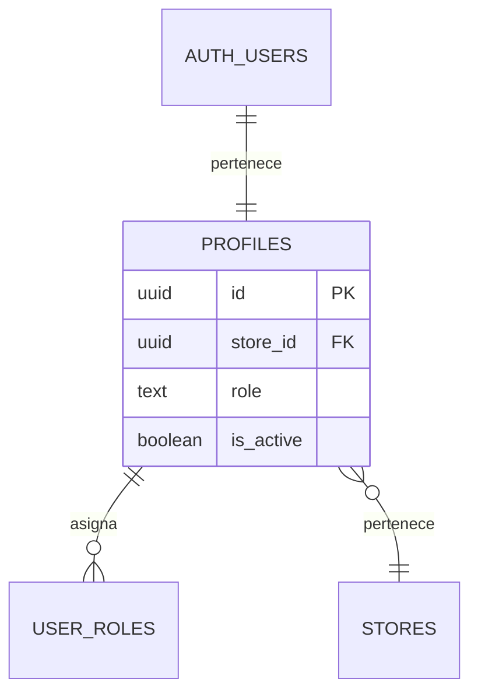

# SDD-002: Autorización Estricta (Protección End-to-End)

> **Asociado a:** [FRD-002](../FRD/FRD_002_AUTORIZACION_ESTRICTA.md)  
> **Fase del Plan:** Fase 3 (Prioridad 1 — SDDs Faltantes)  
> **Estado:** 🟡 Validado Localmente (Post Alineación Documental 2026-08-07)  
> **Última Actualización:** 2026-08-07

---

## 0. Contexto y Restricciones Aplicables

### 0.1 Políticas Globales Activadas (ARQ-002)
| Política ID | Dominio | Impacto Concreto en este SDD |
|-------------|---------|------------------------------|
| **POL-SEC-01** | Seguridad | **Backend Authority:** Ningún parámetro de autorización (rol, permisos, id de tienda, estado de caja) enviado desde el Frontend es confiable. La base de datos valida todo mediante `auth.uid()` y funciones de verificación. |
| **ARQ-002-R4** | Seguridad | **Reutilización Obligatoria:** Todas las políticas RLS y RPCs de escritura DEBEN llamar a `assert_store_access()` y/o `get_current_store_id()`. Prohibido reimplementar subconsultas de tienda. |

### 0.2 Contratos Vecinos que Limitan el Diseño
| SDD Origen | Restricción Inyectada | Impacto en Autorización |
|------------|-----------------------|-------------------------|
| **SDD_001 (Zero Trust)** | Requiere `daily_pass` en estado `approved`. | Las RPCs operativas validan que el usuario autenticado tenga un pase diario activo para la tienda actual. |

### 0.3 Auditoría de BD contra Realidad
- **Verificación de Funciones Centralizadas (`pg_proc`):**
  - `get_current_store_id()` retorna el `store_id` del usuario autenticado consultando `auth.uid()`.
  - `assert_store_access(target_store_id)` lanza excepción `UNAUTHORIZED_STORE_ACCESS` (código `42501`) si el usuario no pertenece a la tienda o no posee el rol requerido.

---

## 1. Glosario Local

- **Guardia de Servidor (Server Guard):** Bloque inicial de verificación en funciones PL/pgSQL que valida la identidad, tienda y permisos del invocador antes de ejecutar cualquier sentencia DML.
- **Autoridad del Backend:** Principio según el cual el cliente (Vue) es solo un presentador visual. Toda regla de negocio, permiso o validación de estado es impuesta y ejecutada por PostgreSQL.

---

## 2. Diagramas de Secuencia

### 2.1 Flujo de Verificación Ciega de Autorización en RPC



---

## 3. Diagramas de Estado



---

## 4. Especificación Detallada de Casos de Uso

### Caso A: Bloqueo de Invocación Manipulada desde el Cliente
- **Actor:** Usuario con rol 'empleado' (sin permisos administrativos).
- **Precondición:** El empleado intenta invocar directamente un RPC restringido a Administrador mediante consola o script.
- **Flujo Principal:**
  1. El usuario envía la petición a la API de Supabase invocando `rpc_operacion_admin`.
  2. El servidor captura la petición y extrae `auth.uid()` del token JWT validado por Postgres.
  3. El bloque inicial de la función ejecuta `PERFORM assert_store_access(v_store_id);` e inspecciona la tabla `user_roles`.
  4. El servidor detecta que el rol en BD es 'empleado' y la operación exige 'admin'.
  5. El servidor aborta inmediatamente con `RAISE EXCEPTION 'UNAUTHORIZED: Requiere rol de Administrador'`.
- **Postcondiciones (Fallo Esperado):** Ninguna tabla es modificada; la transacción hace rollback completo.

---

## 5. Contrato de Interfaz

### Operación: Patrón Estándar de Guardia RPC
- **Entrada esperada:** Parámetros propios de la operación (ningún parámetro de rol o tienda enviado por el cliente es confiable).
- **Patrón de Guardia Obligatorio (PL/pgSQL):**
  ```sql
  DECLARE
      v_store_id UUID;
  BEGIN
      v_store_id := get_current_store_id();
      PERFORM assert_store_access(v_store_id);
      -- Lógica de negocio continúa solo si la guardia pasa
  ```
- **Salida esperada:**
  - Catálogo de Errores Estándar: `UNAUTHENTICATED`, `UNAUTHORIZED_STORE_ACCESS`, `INSUFFICIENT_PERMISSIONS`.

---

## 6. Análisis de Seguridad

- **Control de Acceso:** Uso exclusivo del contexto del servidor (`auth.uid()`, `get_current_store_id()`). Veto total a confiar en `p_store_id` o `p_user_role` pasados como argumentos.
- **Protección contra Bypass:** Ninguna interfaz de cliente puede deshabilitar la seguridad de la base de datos, ya que las políticas RLS y los guardias PL/pgSQL son inmutables para el cliente HTTP.
- **Superficie de Amenazas:**
  - *Amenaza:* Inyección de parámetros de tienda ajena (IDOR).
  - *Mitigación:* `assert_store_access()` valida que la tienda solicitada coincida exactamente con la tienda registrada para ese `auth.uid()` en la base de datos.

---

## 7. Modelo de Datos Lógico

### ERD Mermaid



### Diccionario de Datos

| Atributo | Entidad | Tipo | Restricciones | Descripción |
|----------|---------|------|---------------|-------------|
| `id` | `profiles` | UUID | PK, FK `auth.users(id)` | Identificador del usuario autenticado. |
| `store_id` | `profiles` | UUID | FK `stores(id)`, NOT NULL | Tienda a la que pertenece el usuario. |
| `role` | `profiles` | TEXT | NOT NULL | Rol oficial registrado en BD ('admin', 'employee'). |
