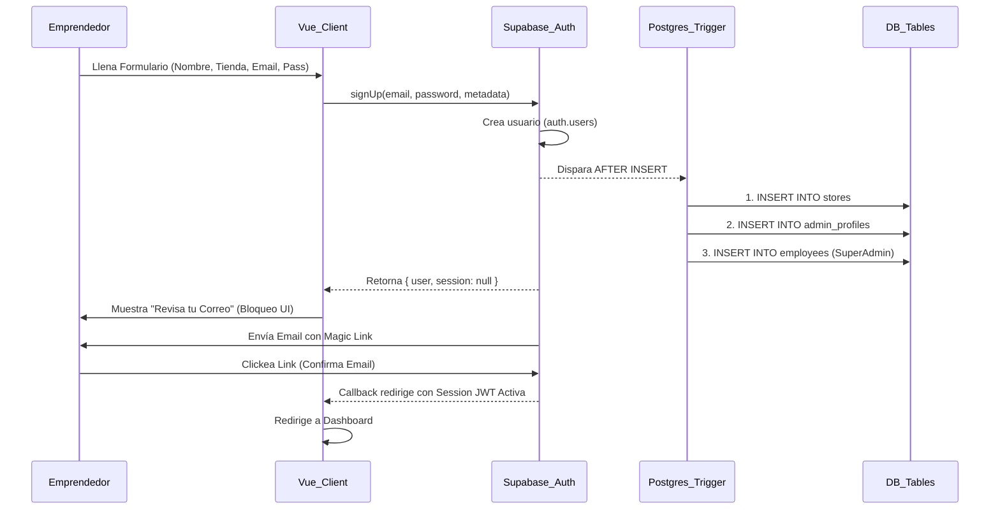
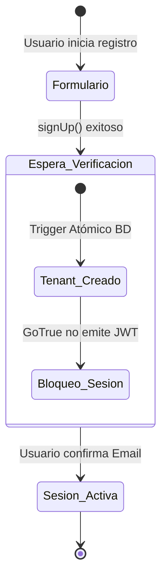

# SDD-002: Registro y Gestión de Cuentas Administrativas

> **Asociado a:** [FRD-002](../FRD/FRD_002_REGISTRO_ADMIN.md)  
> **Fase del Plan:** Fase 5 (Seguridad y Sesiones)  
> **Estado:** 🟢 Consolidado (Auditado en Código)  
> **Última Actualización:** 2026-08-04

---

## 0. Contexto y Restricciones Aplicables (PEA-N)

### 0.1 Resultados de Auditoría de Código y PAC (Agosto 2026)
Tras auditar la base de código activa, se identificaron las siguientes realidades arquitectónicas que rigen este SDD:

| Componente | Hallazgo de Auditoría (Estado Actual del Código) | Impacto en el Diseño |
|------------|------------------------------------------------|----------------------|
| **Frontend AuthRepo** | Utiliza `supabase.auth.signUp()` delegando el cifrado y validación. Valida contraseñas (1 mayúscula, 1 número, min 8). | Cumple FRD. El **PIN de Caja** fue erradicado del sistema (SPEC-006). Adicionalmente, la configuración del **PIN de Empleado (Alias/Auth)** para el dueño se extrajo del flujo de registro y se postergó para ser configurada después en el AdminHub. |
| **Backend Trigger** | La función `handle_new_user_atomic()` intercepta el `AFTER INSERT` en `auth.users` y crea *atómica y sincrónicamente* la Tienda (`stores`), el Perfil Admin (`admin_profiles`) y el Registro de Empleado con permisos SuperAdmin. | **CRÍTICO:** La base de datos aprovisiona todo el Tenant ANTES de que el usuario verifique su correo. |
| **Protección Zero-Access** | Las políticas RLS no verifican explícitamente el campo `is_verified`. La seguridad recae 100% en que Supabase Auth (GoTrue) está configurado para **no devolver una sesión válida** hasta que el email sea confirmado. | Cumple FRD, pero delega el "Bloqueo" a la capa de Red/Sesión (JWT) en lugar de la capa de Datos (RLS). |

---

## 1. Glosario Local
* **Tenant (Tienda):** El espacio lógico de base de datos aislado por RLS, vinculado a un `store_id`.
* **Dueño Propietario (Owner):** Usuario ancla de un Tenant, cuyo UUID en `auth.users` coincide con el `id` en `admin_profiles` y en `employees`.
* **Phantom Data:** Registros huérfanos generados si la creación atómica falla o si usuarios anónimos disparan el trigger (ya mitigado en BD).

---

## 2. Diagrama de Secuencia (UML - Mermaid)

### Caso de Uso: Registro Atómico y Verificación

---

## 3. Diagrama de Estados

---

## 4. Especificación Detallada de Casos de Uso

### 4.1 Registro de Nueva Tienda (Onboarding)
- **Precondiciones:** El correo ingresado no existe en `auth.users`.
- **Reglas de Negocio Aplicables:** Regla 1 (Identidad Única), Regla 3 (Vinculación de Tienda).
- **Flujo Principal:**
  1. Frontend valida formato de email y fortaleza de contraseña (Regex).
  2. Frontend envía `signUp` con metadatos: `store_name` y `owner_name`.
  3. Supabase crea identidad.
  4. Trigger de BD genera un `slug` único para la tienda, inserta en `stores`, `admin_profiles` y `employees`.
  5. Supabase retorna respuesta sin sesión (email confirmation required).
  6. Frontend enruta a vista de "Esperando Verificación".
- **Postcondiciones:** Tenant aprovisionado en BD, pero inaccesible por falta de firma JWT.

### 4.2 Verificación y Primer Login
- **Precondiciones:** Usuario existe en Auth, pero sin email confirmado.
- **Reglas de Negocio Aplicables:** Regla 2 (Acceso Cero Antes de Verificar).
- **Flujo Principal:**
  1. Usuario hace clic en el enlace de su correo.
  2. Supabase GoTrue valida el hash y marca `email_confirmed_at`.
  3. El navegador es redirigido a la URL base de la app con el `#access_token`.
  4. El interceptor del Frontend extrae el token y construye la sesión Pinia.
  5. Usuario accede al Dashboard.
- **Postcondiciones:** Usuario posee un JWT válido que le permite superar las políticas RLS.

---

## 5. Contrato de Interfaz

### 5.1 Capa Frontend: `authRepository.registerStore`
- **Entrada esperada:** 
  - `storeName` (Cadena de texto, nombre del negocio).
  - `ownerName` (Cadena de texto, nombre del dueño).
  - `email` (Formato de correo válido).
  - `password` (Cadena validada por expresión regular de fortaleza).
- **Reglas de transformación:** 
  - Transmitir la petición al proveedor de identidad inyectando `storeName` y `ownerName` como metadatos efímeros.
- **Salida esperada:** 
  - **Éxito:** Confirmación de creación de usuario, obligatoriamente con una sesión nula (`session: null`). Esto es el cerrojo lógico que garantiza que no haya paso al Dashboard sin verificación.
  - **Fallo:** Código de error estandarizado (Ej. usuario ya existe).

### 5.2 Capa Backend: `handle_new_user_atomic()` (Trigger Postgres)
- **Condición de Disparo:** `AFTER INSERT ON auth.users`.
- **Filtro de Seguridad:** `IF new.is_anonymous IS TRUE THEN RETURN new;` (Evita que logins de empleados vía PIN generen tiendas fantasma).
- **Mutaciones Atómicas:**
  - `stores`: Genera `slug` basado en metadatos y asegura unicidad con sufijo `-N`.
  - `admin_profiles`: Asigna rol `owner`, asocia a la tienda.
  - `employees`: Asigna permisos en JSONB (`canSell=true`, `isSuperAdmin=true`) y encripta un PIN de Empleado genérico o temporal (a ser actualizado luego por el usuario para su ingreso diario).

---

## 6. Análisis de Riesgos y Seguridad

1. **Gestión de Credenciales (Regla 4):**
   - El código fuente no procesa el Hashing. La contraseña viaja en texto plano por TLS directo al endpoint nativo de Supabase Auth, donde es hasheada con bcrypt.
2. **Superficie de Ataque RLS vs JWT:**
   - Como la base de datos se aprovisiona *antes* de verificar el correo, los datos existen y el RLS los protege. 
   - Si un atacante lograra obtener un JWT de alguna manera sin verificar el correo (falla en configuración de Supabase), el RLS le permitiría ver su propia tienda falsa. 
   - **Mitigación Activa:** Supabase Cloud bloquea por defecto la emisión de JWTs a correos no confirmados si "Confirm email" está activo.
3. **Límite de Tasa (Rate Limiting):**
   - El reenvío de correos (`resendConfirmationEmail`) está protegido por el error `HTTP 429` del lado de GoTrue, el cual es manejado en el Frontend para prevenir abuso de Spam.

---

## 7. Modelo de Datos Lógico (Impactado)

| Entidad | Campo Clave Modificado en este Flujo | Rol en Onboarding |
|---------|--------------------------------------|-------------------|
| `auth.users` | `raw_user_meta_data` | Transporta el nombre de tienda de forma efímera. |
| `stores` | `slug` | Calculado recursivamente en backend para asegurar unicidad (`mi-tienda-1`). |
| `admin_profiles` | `role`, `is_verified` | `role` forzado a `'owner'`. |
| `employees` | `permissions` | Sembrado con un JSONB de permisos totales (`isSuperAdmin: true`). |
