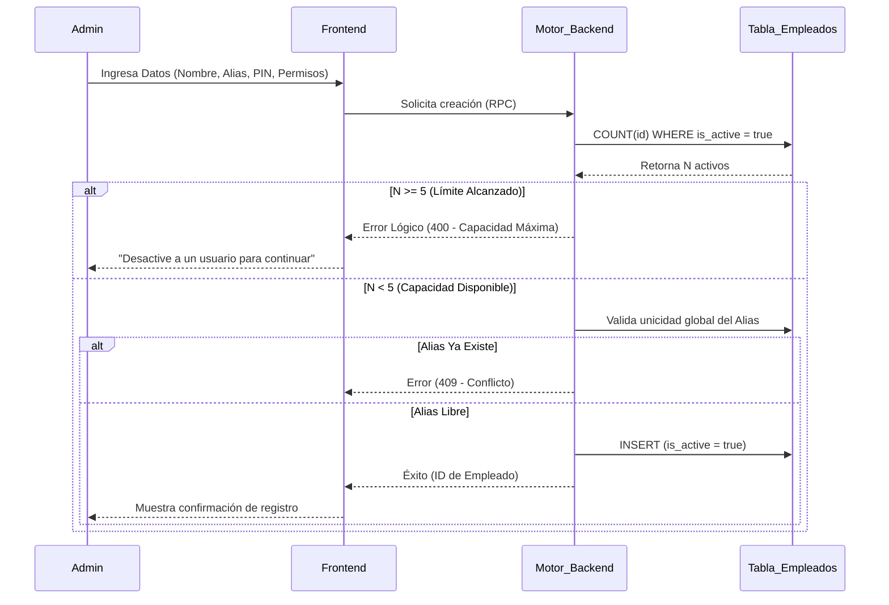
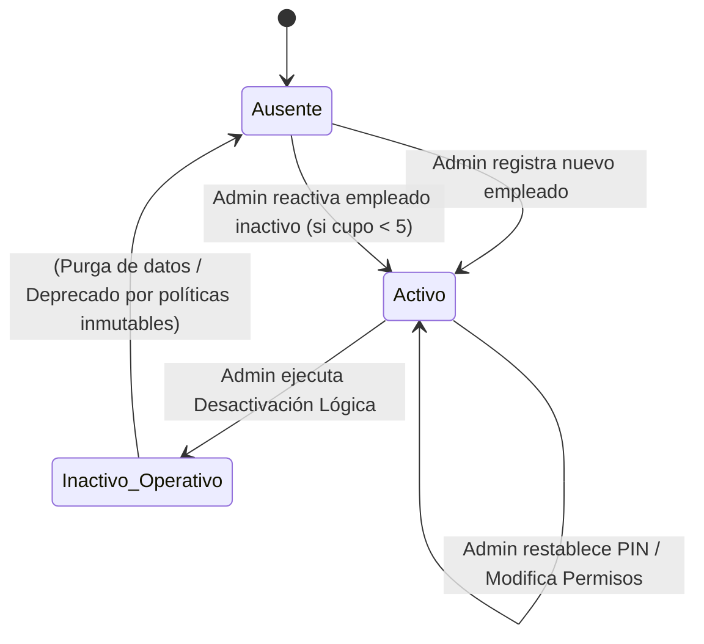

# SDD-003: Gestión de Empleados y Permisos

> **Asociado a:** [FRD-003](../FRD/FRD_003_GESTION_EMPLEADOS.md)  
> **Fase del Plan:** Fase 6 (Operaciones y Soporte)  
> **Estado:** 🟢 Consolidado (Auditoría PAC Ejecutada)  
> **Última Actualización:** 2026-08-05

---

## 0. Contexto y Restricciones Aplicables (PEA-N)

### 0.1 Políticas Globales Activadas
| Política | Impacto Específico en este SDD |
|----------|-------------------------------|
| **Zero Trust** | La creación de un perfil y la asignación de un PIN no otorgan derecho automático de acceso diario. El sistema asume incondicionalmente que el derecho caduca, requiriendo validación mediante el Pase Diario (FRD_001). |
| **Integridad Transaccional Inmutable** | Prohibida la eliminación física (`DELETE`) de registros de personal. La retención de las relaciones de auditoría (quién cobró qué) exige que la baja sea exclusivamente de tipo lógico (Soft-Delete). |

### 0.2 Resultados de Auditoría de Código
La auditoría del código actual validó la alineación de la infraestructura con el contrato lógico:
1. **Límites de Uso:** El motor de base de datos impone estrictamente un máximo de 5 empleados activos, abortando la transacción de inserción/activación si se vulnera.
2. **Nomenclatura (Brecha de Documentación):** El FRD designa el término lógico "Alias numérico". En la capa de infraestructura, este campo se denomina `username`. El presente SDD consolida que ambas nomenclaturas refieren a la misma entidad.
3. **Mapeo de Permisos:** La capa de persistencia soporta flexibilidad delegando los permisos en un documento JSON (`permissions`).

---

## 1. Glosario Local
* **Alias Funcional:** Número de identificación o teléfono único por el cual un empleado es conocido a nivel global. Mapado en infraestructura como `username`.
* **Soft-Delete (Baja Lógica):** Proceso de revocar derechos de acceso alterando una bandera de estado (`is_active = false`) en lugar de borrar el registro maestro.

---

## 2. Diagrama de Secuencia (UML - Mermaid)

### Caso de Uso: Alta de Empleado (Inyección de Reglas)

---

## 3. Diagrama de Estados

### Ciclo de Vida del Perfil de Empleado

*Nota: El estado `Inactivo_Operativo` suspende el ingreso al sistema pero mantiene viva la clave foránea para el historial contable.*

---

## 4. Especificación Detallada de Casos de Uso

### 4.1 Desactivación Reactiva de Personal (Baja Lógica)
- **Precondiciones:** Dispositivo operado por un Administrador en el panel de equipo. El empleado objetivo posee estado `is_active = true`.
- **Reglas de Negocio Aplicables:** RN-003-06 (Conservación Histórica), RN-013-05 (Cierre Forzado).
- **Flujo Principal:**
  1. El Administrador invoca la orden de suspensión de un empleado.
  2. El sistema requiere confirmación explícita informando la pérdida inmediata de acceso.
  3. Tras confirmar, el frontend remite el comando de mutación de estado.
  4. El backend altera la bandera a `is_active = false`.
  5. Automáticamente, los interceptores de sesión central (ver SDD-013) entran en vigencia reactiva, causando que cualquier token emitido previamente a nombre del empleado sea repudiado.
- **Postcondiciones:** Empleado incapacitado para iniciar nuevos turnos o interactuar en turnos vivos. El cupo de la tienda se reduce en 1.

### 4.2 Restablecimiento de Credenciales (PIN)
- **Precondiciones:** El usuario es Administrador. El empleado objetivo existe en el sistema.
- **Reglas de Negocio Aplicables:** RN-003-03 (Acceso Controlado).
- **Flujo Principal:**
  1. Administrador selecciona al empleado y asigna un nuevo código numérico.
  2. El sistema cifra (hash) el código localmente o en el motor (dependiendo de la arquitectura criptográfica).
  3. El sistema sobreescribe el hash anterior.
- **Postcondiciones:** Credencial restaurada. No se requiere invalidación masiva, ya que el empleado es subordinado y su uso depende del pase diario presencial.

---

## 5. Contrato de Interfaz

### 5.1 Operación: `crear_perfil_empleado`
- **Entrada esperada:** 
  - `name` (Cadena de texto, descriptiva).
  - `username` (Cadena numérica, fungirá como Alias).
  - `pin_hash` (Huella criptográfica, string opaco).
  - `permissions` (Objeto JSON estructurado, define los toggles booleanos).
- **Reglas de transformación:** 
  - Bloqueo en Nivel Servidor si `COUNT(is_active = true) >= 5`.
  - Bloqueo de Nivel Servidor si el `username` vulnera la clave de unicidad global.
- **Salida esperada:** 
  - **Éxito:** Objeto de confirmación con el UUID autogenerado.
  - **Fallo:** Códigos de exceso de cupo o colisión de alias.

### 5.2 Operación: `mutar_estado_empleado`
- **Entrada esperada:** 
  - `employee_id` (UUID objetivo).
  - `is_active` (Booleano de nuevo estado).
- **Reglas de transformación:** 
  - Si el estado muta de `false` a `true` (Reactivación), se DEBE re-aplicar la comprobación estricta de cupos (`COUNT < 5`), evitando reactivaciones masivas que vulneren la cuota de la tienda.
- **Salida esperada:** 
  - Conformidad de mutación.

---

## 6. Análisis de Seguridad

| Dimensión | Detalle Contractual |
|-----------|---------------------|
| **Control de Acceso** | Toda mutación del diccionario de empleados está subordinada estrictamente al rol de `admin` u `owner`. Prohibida la auto-gestión de permisos. |
| **Protección de Datos** | El campo `pin_hash` debe permanecer unidireccionalmente ilegible. Un administrador puede sobreescribir el PIN, pero jamás debe poder revelarlo o recuperarlo. |
| **Superficie de Amenazas** | **Vulnerabilidad (Extorsión de Cupo):** Reactivar perfiles inactivos saltándose la restricción.  **Mitigación:** La protección de cupo máximo protege la base de datos a nivel de gatillo / RPC, imposibilitando la explotación desde la API pública del frontend. |
| **Trazabilidad de Auditoría** | La fecha de última modificación (`updated_at`) registrará cada actualización de credenciales. La identidad creadora (Dueño) debe garantizarse por contexto criptográfico (sesión del autorizador). |

---

## 7. Modelo de Datos Lógico (Impactado)

### Entidad Principal: `employees`
- **Atributos Estructurales (Mapeo a Infraestructura):**
  - `username` [UNIQUE]: Actúa funcionalmente como el Alias de Ingreso global.
  - `is_active` [BOOLEAN]: Bandera matriz para la habilitación de operaciones de baja lógica.
  - `permissions` [JSONB]: Matriz de control (RBAC). Soporta las llaves requeridas por el Front-end: `canManageInventory`, `canFiar`, `canOpenCloseCash`, `canViewInventory`, `canViewReports`. No impone jerarquías fijas, facilitando la adición horizontal de futuros roles sin modificar el DDL del motor de bases de datos.
