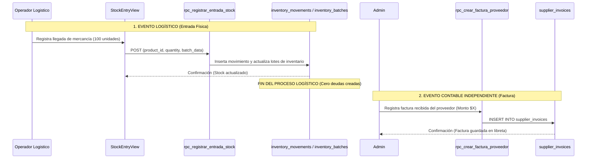
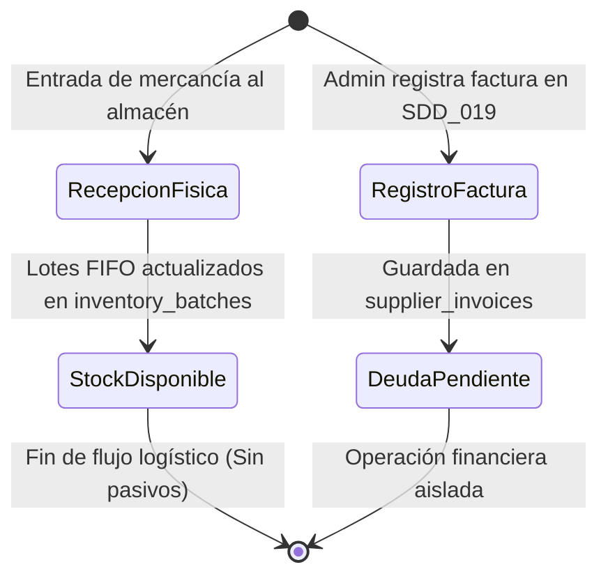
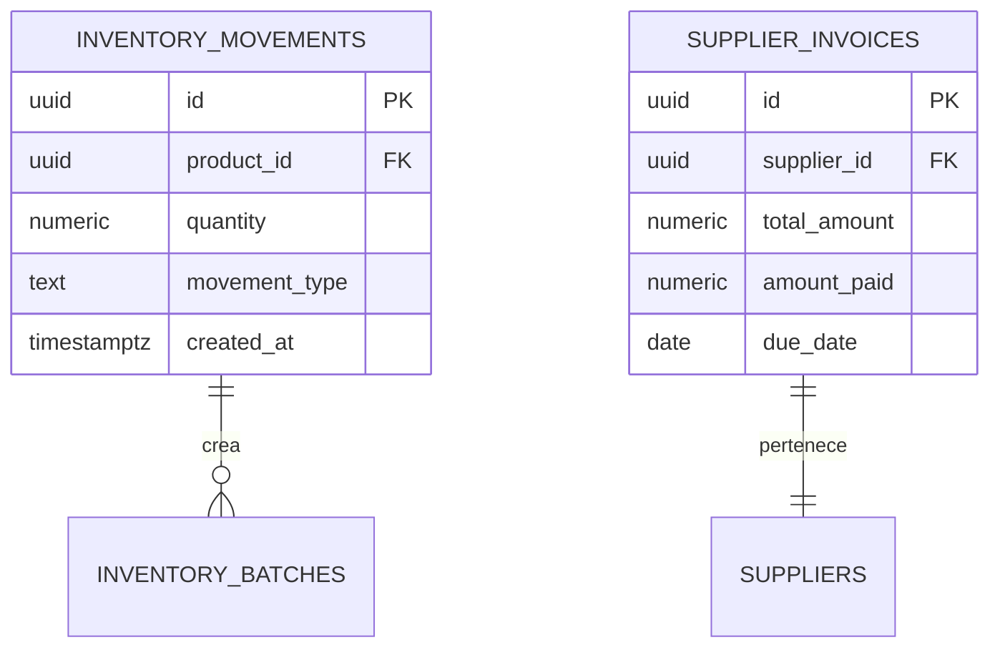

# SDD-003: Independencia Logística y Contable (ILC)

> **Asociado a:** [FRD-003](../FRD/FRD_003_INDEPENDENCIA_LOGISTICA_CONTABLE.md)  
> **Fase del Plan:** Fase 3 (Prioridad 1 — SDDs Faltantes)  
> **Estado:** 🟡 Validado Localmente (Post Alineación Documental 2026-08-07)  
> **Última Actualización:** 2026-08-07

---

## 0. Contexto y Restricciones Aplicables

### 0.1 Políticas Globales Activadas (ARQ-002)
| Política ID | Dominio | Impacto Concreto en este SDD |
|-------------|---------|------------------------------|
| **POL-LOG-02** | Logística | **Desacoplamiento Financiero:** La entrada física de mercancía al almacén tiene prohibido activar triggers o funciones automáticas que generen pasivos financieros o deudas en la base de datos. |
| **POL-FIN-02** | Financiero | **Reconocimiento Deliberado:** El registro de facturas de proveedores opera de forma autónoma e independiente a través del módulo aislado `SDD_019`. |

### 0.2 Contratos Vecinos que Limitan el Diseño
| SDD Origen | Restricción Inyectada | Impacto en Logística |
|------------|-----------------------|----------------------|
| **SDD_006_01_01 (Entradas Stock)** | Registra movimientos físicos de entrada (`inventory_movements`). | La inserción en `inventory_movements` solo afecta lotes de stock (`inventory_batches`), NUNCA a `supplier_invoices`. |
| **SDD_019 (Cuentas por Pagar)** | Módulo de registro aislado de facturas. | Permite asociar opcionalmente la referencia de una entrada para trazabilidad informativa, sin dependencia funcional. |

### 0.3 Auditoría de BD contra Realidad
- **Verificación en Esquema y Triggers:**
  - El trigger `bridge_movement_to_batch` gestiona exclusivamente la asignación de lotes FIFO. No existen ni deben crearse triggers que comuniquen `inventory_movements` con `supplier_invoices`.

---

## 1. Glosario Local

- **Operación Logística Pura:** Registro físico de movimiento de mercancía (cantidades, productos, lotes) cuyo único efecto sistémico es la actualización de inventarios disponibles.
- **Operación Contable Isolada:** Registro administrativo deliberado de compromisos financieros (facturas, cuentas por pagar) sin dependencia de eventos logísticos del servidor.

---

## 2. Diagramas de Secuencia

### 2.1 Flujo Desacoplado: Recepción Física vs. Registro de Factura

---

## 3. Diagramas de Estado

---

## 4. Especificación Detallada de Casos de Uso

### Caso A: Recepción Logística Pura sin Generación de Deuda
- **Actor:** Empleado de Almacén / Administrador.
- **Precondición:** Llega mercancía física a la tienda.
- **Flujo Principal:**
  1. El usuario registra la entrada de productos en el módulo de inventario.
  2. El backend procesa el movimiento (`movement_type = 'entrada'`) y actualiza las existencias disponibles mediante el motor FIFO.
  3. El backend culmina la transacción de forma exitosa.
  4. Ningún registro es insertado en la tabla `supplier_invoices`.
- **Postcondiciones (Éxito):** Inventario incrementado de forma precisa; balance de pasivos inalterado.

---

## 5. Contrato de Interfaz

### Regla de Aislamiento en RPC de Inventario (`rpc_registrar_entrada_stock`)
- **Entrada esperada:** `p_product_id`, `p_quantity`, `p_unit_cost`, `p_supplier_id` (opcional).
- **Garantía de Aislamiento:** La función tiene prohibido ejecutar sentencias `INSERT` o `UPDATE` sobre la tabla `supplier_invoices` o invocar RPCs contables.
- **Salida esperada:** Resumen de stock incrementado y lotes creados.

---

## 6. Análisis de Seguridad

- **Control de Acceso:** Uso de `assert_store_access()` en los RPCs de inventario.
- **Separación de Funciones (SoD):** Un empleado operativo puede registrar entradas físicas al almacén sin tener privilegios para manipular el registro de deudas o cuentas por pagar.

---

## 7. Modelo de Datos Lógico

### ERD Mermaid (Demostración de Aislamiento)

> **Nota Arquitectónica:** No existen llaves foráneas ni triggers de dependencia entre `INVENTORY_MOVEMENTS` y `SUPPLIER_INVOICES`.
