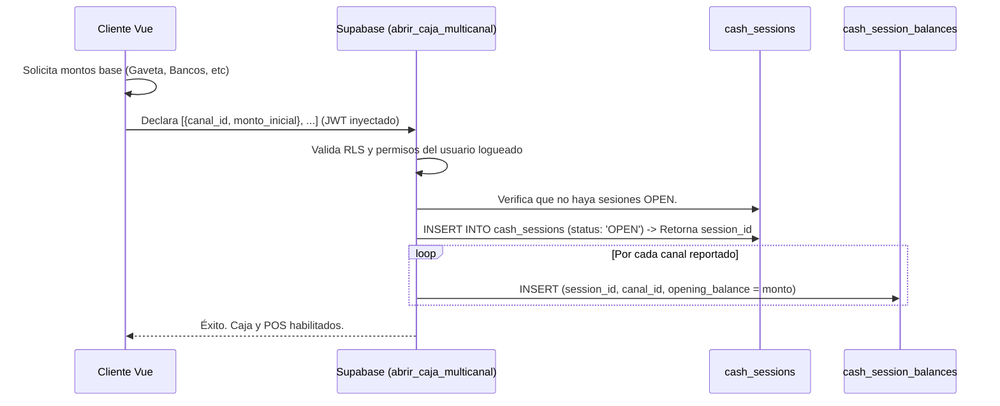
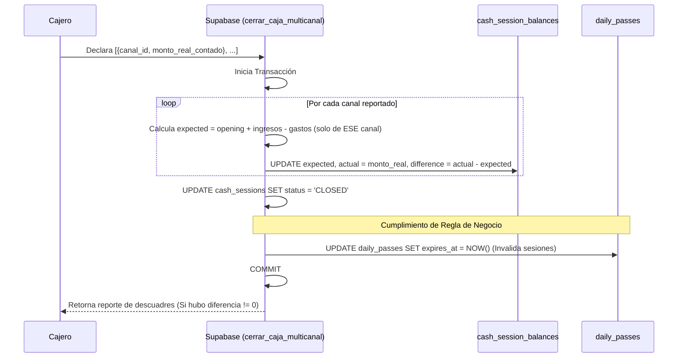

# SDD-004: Control Operativo de Caja (Sesiones Multicanal)

> **Asociado a:** [FRD-004](../FRD/FRD_004_CONTROL_DE_CAJA.md)  
> **Fase del Plan:** Fase 2 (Caja y Liquidez)  
> **Estado:** 🟡 Validado Localmente (Post PEA-N v1.0)  
> **Última Actualización:** 2026-08-04

---

## 0. Contexto y Restricciones Aplicables (PEA-N)

### 0.1 Políticas Globales Activadas (ARQ-002)
| Política ID | Dominio | Impacto Concreto en este SDD |
|-------------|---------|------------------------------|
| **POL-SEG-01** | Seguridad | Arqueo Ciego Obligatorio. El Frontend no debe mostrar (ni pedir al servidor) el saldo esperado de ningún canal al cerrar. |
| **POL-AUD-01** | Auditoría | Inmutabilidad de los cierres. Tras cerrar, ni el admin puede reabrir o modificar la sesión. |
| **POL-AUTH-01** | Seguridad | **Eliminación del PIN de Caja (Decisión D-01, 2026-08-07).** Por decisión arquitectónica transversal previa y formalizada por el Arquitecto, se erradicó el "PIN de Caja" para unificar la seguridad en el Token JWT principal del usuario. Todo control de acceso se basa en el Session Token y las políticas RLS. FRD_004_1 queda deprecado. |

### 0.2 Restricciones Transversales Inyectadas (Fase 0)
| SDD Origen | Restricción Inyectada | Impacto en el Control de Caja |
|------------|-----------------------|-------------------------------|
| **SDD_027 (Caja Multicanal)** | El pozo único (gaveta física) es solo UN canal. Existen múltiples. | Las funciones de `abrir` y `cerrar` caja TIENEN PROHIBIDO recibir un escalar (ej. `p_opening_balance = 5000`). Deben recibir un JSON/Array con el saldo inicial/final declarado por cada `payment_method_id`. |

### 0.3 Auditoría de BD contra Realidad (Deuda Técnica Crítica)
La auditoría revela que las funciones actuales que operan la caja están completamente rotas respecto a los contratos de Fase 0.
| Hallazgo / Función | Brecha Descubierta | Solución Obligatoria (DSD/SQL) |
|--------------------|--------------------|--------------------------------|
| 🔴 `abrir_caja` (RPC) | Recibe `p_opening_balance` e inserta en la tabla padre depreciada. | Reescribir a `abrir_caja_multicanal` que reciba un Array de canales y pueble `cash_session_balances`. |
| 🔴 `cerrar_caja` (RPC) | Calcula un saldo monolítico e inserta en la tabla padre. | Reescribir a `cerrar_caja_multicanal` que asigne el saldo esperado independientemente por cada canal, respetando Arqueo Ciego. |
| 🔴 Expiración de Pases | El FRD exige: "Al cerrar la caja, todos los pases diarios expiran". El RPC actual no hace nada con la tabla `daily_passes`. | Inyectar en el RPC de cierre un `UPDATE daily_passes SET expires_at = NOW() WHERE store_id = p_store_id`. |

---

## 1. Responsabilidad Lógica de las Sesiones

El "Control de Caja" es el director de orquesta de la liquidez. Su única responsabilidad es crear una ventana temporal (Sesión) válida, sobre la cual los módulos periféricos (POS, Cuentas por Pagar) puedan inyectar o extraer dinero.

**Regla de Oro de Bloqueo:**
Ningún registro que afecte a `cash_movements` (incluso si es un pago a crédito que genera liquidez) puede procesarse si el sistema no encuentra una sesión en estado `OPEN` para la tienda. La base de datos es la última línea de defensa contra esto.

---

## 2. Modelado de Flujos (Arquitectura Refactorizada)

### 2.1 Flujo de Apertura Multicanal

Dado que el PIN fue erradicado, el backend confía en la huella JWT del empleado (siempre que tenga el rol/permiso adecuado configurado en sus claims o tablas de acceso).

### 2.2 Flujo de Cierre, Arqueo Ciego y Expiración de Pases

El cierre de caja no solo concilia dinero, sino que funciona como un "Cierre de Jornada Operativa", revocando el acceso temporal al resto de empleados (Pases Diarios).

---

## 3. Contrato de Interfaz Frontend (UI)

El Frontend debe ajustarse a las políticas de seguridad (Arqueo Ciego y sin PIN).

1. **Pantalla de Apertura:**
   - Debe listar dinámicamente los métodos de pago habilitados para la tienda (desde la tabla `payment_methods`).
   - Por defecto, el usuario solo declarará base en "Efectivo", pero la UI debe permitir declarar base inicial en transferencia/tarjeta si es necesario operativamente.
2. **Pantalla de Cierre:**
   - **Prohibido:** Mostrar un texto como *"El sistema espera $200.000"*.
   - El formulario debe ser limpio, exigiendo ingresar el dinero contado físicamente en la gaveta y lo verificado en bancos (si aplica).
   - El botón de confirmación NO solicita PIN, procesa directamente usando el token activo de Supabase Auth.
3. **Bloqueo Global (Guard de Rutas):**
   - El cliente Vue debe escuchar los cambios de estado de la caja. Si la caja se cierra forzosamente (Cron) o localmente, cualquier intento de navegar a la ruta del `/pos` debe ser redirigido a una pantalla de `"Caja Cerrada"`.
