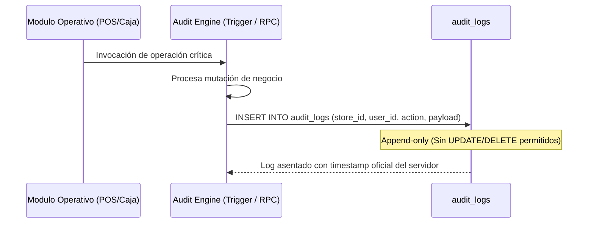
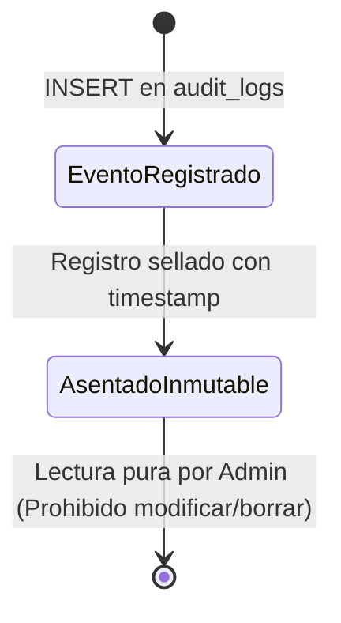
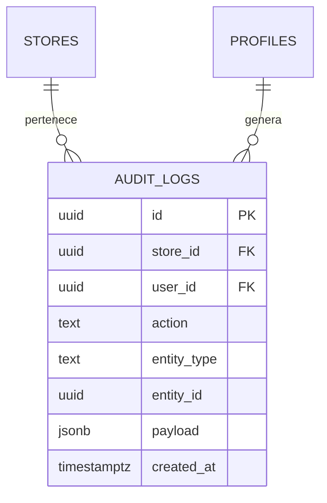

# SDD-005: Sistema de Auditoría, Evidence Hub e Inmutabilidad

> **Asociado a:** [FRD-005](../FRD/FRD_005_AUDITORIA_TRAZABILIDAD.md) y [FRD-005 (Inviolable)](../FRD/FRD_005_AUDITORIA_INVIOLABLE.md)  
> **Fase del Plan:** Fase 3 (Prioridad 3 — SDDs Faltantes)  
> **Estado:** 🟡 Validado Localmente (Post Alineación Documental 2026-08-07)  
> **Última Actualización:** 2026-08-07

---

## 0. Contexto y Restricciones Aplicables

### 0.1 Políticas Globales Activadas (ARQ-002)
| Política ID | Dominio | Impacto Concreto en este SDD |
|-------------|---------|------------------------------|
| **POL-AUD-01** | Auditoría | **Inmutabilidad Inviolable:** Prohibido usar `UPDATE` o `DELETE` sobre registros financieros/auditables. Toda corrección exige movimientos de contrapeso. |
| **POL-AUD-02** | Auditoría | **Evidence Hub Centralizado:** Registro cronológico append-only con payload flexible, timestamp de servidor y usuario responsable. |

### 0.2 Contratos Vecinos que Limitan el Diseño
| SDD Origen | Restricción Inyectada | Impacto en Auditoría |
|------------|-----------------------|----------------------|
| **SDD_004 (Caja)** | Cierres inmutables. | Los reportes de cierre de caja generan eventos de auditoría no editables. |
| **SDD_001 (Zero Trust)** | Registro de accesos. | Auditoría de solicitudes de pase diario, logins y revocaciones. |

### 0.3 Auditoría de BD contra Realidad
- **Verificación Real en Esquema:**
  - Migración `20260718130000_audit_remediation.sql` y `20260413043000_update_audit_logs_schema.sql` definen la tabla `audit_logs` con columnas: `id`, `store_id`, `user_id`, `action`, `entity_type`, `entity_id`, `payload` (JSONB), `created_at`.

---

## 1. Glosario Local

- **Evidence Hub:** Repositorio centralizado de logs de auditoría estructurados donde se asienta la evidencia inalterable de operaciones críticas.
- **Movimiento de Contrapeso:** Transacción matemáticamente opuesta que neutraliza un error previo sin borrar el registro original.

---

## 2. Diagramas de Secuencia

### 2.1 Flujo de Inserción de Evento en el Evidence Hub

---

## 3. Diagramas de Estado

---

## 4. Especificación Detallada de Casos de Uso

### Caso A: Auditoría Forense de Operación Sospechosa
- **Actor:** Administrador.
- **Precondición:** Sospecha de faltante o anomalía operativa.
- **Flujo Principal:**
  1. El Admin accede al centro de auditoría.
  2. Filtra por rango de fecha, usuario o tipo de entidad.
  3. El sistema consulta `audit_logs` llamando a `assert_store_access()`.
  4. El sistema despliega el rastro cronológico con la huella de usuario y el payload del evento.
- **Postcondiciones (Éxito):** Evidencia visualizada sin posibilidad de alteración.

---

## 5. Contrato de Interfaz

### Operación: `rpc_registrar_evento_auditoria`
- **Entrada esperada:** `p_action` (TEXT), `p_entity_type` (TEXT), `p_entity_id` (UUID), `p_payload` (JSONB).
- **Reglas de transformación:** `INSERT` directo en `audit_logs` con `user_id = auth.uid()` y `store_id = get_current_store_id()`.

---

## 6. Análisis de Seguridad

- **Restricción de Acceso:** La consulta de `audit_logs` está estrictamente reservada para el Administrador de la tienda.
- **Inviolabilidad:** Las políticas RLS prohíben `UPDATE` y `DELETE` a todos los roles sobre `audit_logs`.

---

## 7. Modelo de Datos Lógico

### ERD Mermaid

