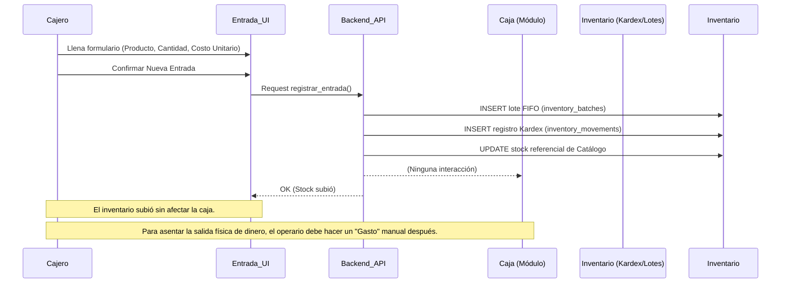

# SDD-006-01-01: Movimientos de Entrada de Inventario

> **Asociado a:** [FRD-006-01-01](../FRD/FRD_006_01_01_MOVIMIENTOS_ENTRADA_INVENTARIO.md)  
> **Fase del Plan:** Fase 4 (Inventario Detallado)  
> **Estado:** 🟢 Auditado y Corregido  
> **Última Actualización:** 2026-08-06

---

## 0. Contexto y Restricciones Aplicables (PEA-N)

### 0.1 Políticas Globales Activadas (ARQ-002)
| Política | Dominio | Impacto Específico en este SDD |
|----------|---------|-------------------------------|
| **POL-LOG-01** | Logístico / Financiero | Independencia Absoluta: La entrada de inventario TIENE ESTRICTAMENTE PROHIBIDO mover dinero de la caja, generar deudas con proveedores (Cuentas por Pagar) o generar gastos (OPEX). Es una acción puramente física. |

### 0.2 Contratos Vecinos que Limitan el Diseño (Consulta RVC)
| SDD Vecino / Entidad | Restricción que impone al diseño de este SDD |
|----------------------|----------------------------------------------|
| **SDD_010_016 (FIFO)** | Todo ingreso físico DEBE generar forzosamente un nuevo registro en `inventory_batches`. Queda prohibido "mezclar" o simplemente sumar cantidades al stock sin desglosar el lote. |
| **SDD_006_01 (Kardex)**| Todo ingreso DEBE registrar una entrada inmutable en `inventory_movements` justificando el cambio de stock con un tipo de movimiento (`purchase`, `adjustment_in`). |

---

## 1. Glosario Local
*No se introducen términos lógicos propios que requieran definición estricta en este módulo.*

---

## 2. Diagrama de Secuencia (UML - Mermaid)

### Caso de Uso: Recepción de Mercancía Pagada de Contado

---

## 3. Diagrama de Estados
*Esta entidad no tiene un ciclo de vida complejo posterior a su registro. Una entrada queda inmutable.*

---

## 4. Especificación Detallada de Casos de Uso

### 4.1 Registro Logístico de Ingreso Físico
- **Precondiciones:** El operario tiene una sesión activa y permiso para gestionar inventario. El producto debe existir y estar activo.
- **Reglas de Negocio Aplicables:** 
  - Regla 1 (Naturaleza Logística Pura).
  - Regla 2 (Ceguera Financiera Absoluta).
  - Regla 4 (Registro de Costo Referencial).
- **Flujo Principal:**
  1. El actor selecciona "Nueva Entrada".
  2. El actor busca y selecciona un producto activo.
  3. El actor ingresa la cantidad recibida (mayor a cero) y el costo unitario por artículo.
  4. El actor selecciona el motivo (Compra o Ajuste).
  5. El sistema procesa la solicitud aislando el inventario.
  6. El sistema crea el nuevo lote FIFO y actualiza el Kardex.
  7. El sistema confirma la operación en pantalla.
- **Flujos Alternativos:** 
  - *Ingreso a Crédito:* El flujo es exactamente el mismo; el sistema de inventario no registra la deuda. El operario debe ir a "Proveedores" para asentar la factura pendiente.
- **Flujos de Excepción:**
  - *4.a. Cantidad Inválida:* Si la cantidad es `<= 0`, el sistema rechaza la operación informando que la entrada debe incrementar el stock.
- **Postcondiciones (Éxito):** Se genera el lote FIFO, la trazabilidad del Kardex queda asentada y el stock referencial se incrementa.
- **Postcondiciones (Fallo):** Ninguna tabla es modificada (rollback transaccional).

---

## 5. Contrato de Interfaz

### 5.1 Operación: `registrar_movimiento_entrada`
- **Entrada esperada:**
  - `product_id` (UUID, Obligatorio): Identificador del producto a recibir.
  - `quantity` (Decimal, Obligatorio): Cantidad de unidades (debe ser `> 0`).
  - `unit_cost` (Decimal, Obligatorio): Costo de adquisición unitario.
  - `movement_type` (Enum, Obligatorio): Motivo logístico (`purchase` o `adjustment_in`).
  - `reason` (String, Opcional): Detalle (ej. número de factura en papel).
- **Reglas de transformación / cálculo:**
  - Se genera una transacción atómica.
  - Se bloquea la fila del producto (para evitar race conditions).
  - Se inserta el nuevo `inventory_batch`.
  - Se asienta el `inventory_movement`.
  - Se incrementa el saldo total en la tabla `products` y se sobreescribe el costo nominal si corresponde.
- **Salida esperada:**
  - Éxito: Objeto JSON con confirmación y el ID del movimiento logístico generado.
  - Fallo: Código `INVALID_QUANTITY` o `PRODUCT_NOT_FOUND`.

---

## 6. Análisis de Seguridad

- **Control de Acceso:** Rol `admin` o cajeros con permiso `inventory_entry`. Es estrictamente obligatorio el uso de las funciones centralizadas de validación de acceso (`assert_store_access()` / `get_current_store_id()`).
- **Protección de Datos:** Los costos de adquisición en el inventario no deben ser visibles para cajeros rasos en la pantalla de cobro normal.
- **Superficie de Amenazas:**
  - *Amenaza:* "Blanqueo de Caja". El usuario declara que pagó la mercancía con dinero del negocio para cuadrar un robo de efectivo previo.
  - *Mitigación:* Al ser el RPC ciego al ámbito financiero y carecer de los parámetros `payment_method_id` o `closure_type`, el sistema previene estructuralmente que esta operación deduzca fondos del turno de caja del empleado.
- **Trazabilidad de Auditoría:** Toda inserción en `inventory_movements` deja un rastro del `user_id` del empleado que ejecutó la entrada, la cantidad exacta y el costo, garantizando la inmutabilidad histórica del Kardex.

---

## 7. Modelo de Datos Lógico
*Este módulo no introduce nuevas entidades lógicas. Reutiliza las tablas `inventory_batches` e `inventory_movements` previamente definidas en SDD_006_01.*
