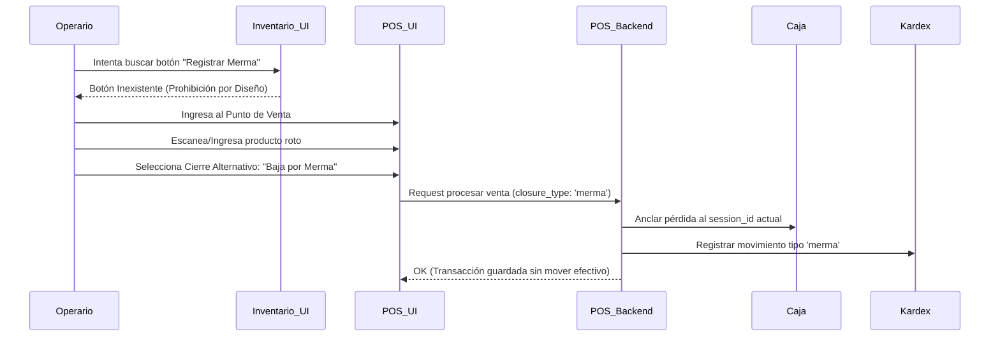

# SDD-006-01-02: Movimientos de Salida (Prohibición y Delegación)

> **Asociado a:** [FRD-006-01-02](../FRD/FRD_006_01_02_MOVIMIENTOS_SALIDA_INVENTARIO.md)  
> **Fase del Plan:** Fase 4 (Inventario Detallado)  
> **Estado:** 🟢 Consolidado  
> **Última Actualización:** 2026-08-04

---

## 0. Contexto y Restricciones Aplicables (PEA-N)

### 0.1 Políticas Globales Activadas (ARQ-002)
| Política | Dominio | Impacto Específico en este SDD |
|----------|---------|-------------------------------|
| **POL-LOG-03** | Arquitectura | **El POS como Embudo Único:** Todo egreso de mercancía que implique pérdida de valor operativo (Mermas, Consumo Interno, Devolución a Proveedor) TIENE ESTRICTAMENTE PROHIBIDO ejecutarse como un movimiento aislado en el módulo de Inventario. Debe obligatoriamente ser procesado por el Motor de Transacciones (POS) para asegurar su anclaje a un Turno de Caja auditable. |

### 0.2 Contratos Vecinos que Limitan el Diseño (Consulta RVC)
| SDD Vecino / Entidad | Restricción que impone al diseño de este SDD |
|----------------------|----------------------------------------------|
| **SDD_007_01 (POS)** | El RPC `rpc_procesar_venta_v3` expone la variable `closure_type` que acepta explícitamente `'merma'`, `'consumo_interno'` y `'devolucion_proveedor'`. |
| **SDD_027_01 (Reportes Caja)** | El reporte `get_daily_summary` espera leer las salidas por mermas directamente vinculadas al `session_id` del turno actual de caja. |

---

## 1. Diagrama de Secuencia (UML - Mermaid)

### Caso de Uso: Redirección del Flujo de Salida al POS

---

## 2. Especificación Detallada de Casos de Uso

### 2.1 Prohibición de Registro de Salidas en Módulo Inventario
- **Precondiciones:** N/A.
- **Reglas de Negocio Aplicables:** Regla 1 (Prohibición de Egresos Ciegos), Regla 2 (POS como Motor Único).
- **Flujo Principal:** 
  1. El módulo de inventario NO EXPONDRÁ opciones para registrar manualmente mermas, consumos internos o devoluciones a proveedor.
  2. El flujo debe ser guiado operativamente hacia el módulo POS.
- **Flujos Alternativos:** El único momento en que el inventario aplica un ajuste negativo es a través del flujo de Ajuste Físico de Inventario (proceso global).
- **Flujos de Excepción:** Si por API se intenta invocar un endpoint suelto de "salida de inventario", este DEBE ser rechazado.
- **Postcondiciones (Éxito):** El sistema mantiene la integridad del cajero.

---

## 3. Contrato de Interfaz

### 3.1 Operación (Inexistente)
- Se prohíbe la existencia de endpoints como `rpc_registrar_salida` o `rpc_registrar_merma` independientes de la caja. Toda invocación debe realizarse consumiendo el contrato establecido en el `SDD_007_01_NUCLEO_POS`.

---

## 4. Análisis de Seguridad

- **Control de Acceso:** La ejecución de mermas y salidas no monetarias sigue las reglas de permisos del módulo POS. Un cajero estándar puede reportar una botella rota durante su turno usando el POS.
- **Protección de Datos:** La información de pérdidas se considera crítica y está restringida en los reportes a roles gerenciales.
- **Superficie de Amenazas:** 
  - *Amenaza:* "Agujero Negro Contable". Un empleado extrae mercancía y la declara como merma por un endpoint suelto para no afectar su propio arqueo de caja.
  - *Mitigación:* Al obligar el uso del POS, la transacción requiere forzosamente un `session_id`. Si el empleado reporta 10 mermas en su turno, estas quedan amarradas inmutablemente a su reporte Z. El dueño puede ver exactamente qué empleado reportó la merma, a qué hora exacta, y sumarlo a sus indicadores de desempeño.
- **Trazabilidad de Auditoría:** Todas las mermas dejan un rastro en `sales` y `sale_items`, valoradas a costo o cero, permitiendo auditar el volumen de pérdidas operativas vinculadas a los empleados.
