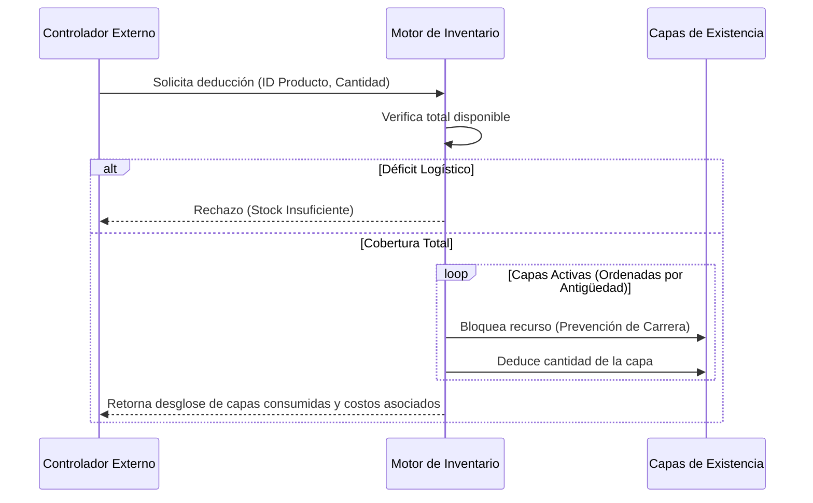
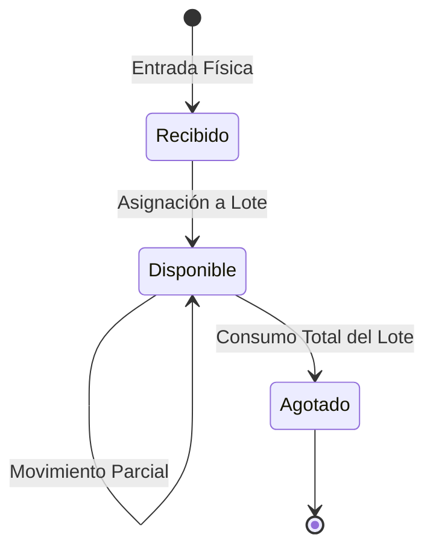

# SDD-006-01: Núcleo de Inventario Desacoplado

> **Asociado a:** [FRD-006-01](../FRD/FRD_006_01_NUCLEO_INVENTARIO.md)  
> **Fase del Plan:** Fase 1 (Núcleo Transaccional)  
> **Estado:** 🟢 Auditado y Corregido (QA Manual)  
> **Última Actualización:** 2026-08-05

---

## § 0. Contexto y Restricciones Aplicables (PEA-N)

### 0.1 Políticas Globales Activadas
| Política | Impacto Específico en este SDD |
|----------|-------------------------------|
| **Independencia Logística-Financiera (POL-LOG-01)** | El inventario ignora si la venta fue fiada o pagada; el stock se descuenta en base a la cantidad física. |
| **Auditoría Inviolable (POL-SEG-02)** | Todo movimiento físico debe reflejarse en la Bitácora de Movimientos (Kardex). |

---

## § 1. Glosario Local

* **Frontera Logística:** Límite arquitectónico del inventario. El inventario conoce existencias y movimientos, pero es ciego a los canales de pago o deudas.
* **Bitácora Logística:** Registro inmutable que asienta la historia de todo lo que entra y sale. 
* **Bloqueo de Déficit:** Regla de validación que aborta de inmediato cualquier transacción de salida que intente dejar el stock físico por debajo de cero (0).
* **Operación Asíncrona:** Capacidad del inventario para recibir mercancía independientemente del estado de los turnos de caja.

---

## § 2. Diagrama de Secuencia

### Caso de Uso: Deducción Lógica y Bloqueo Concurrente

---

## § 3. Diagrama de Estados

### Ciclo de Vida de Disponibilidad

---

## § 4. Especificación Detallada de Casos de Uso

### Caso A: Entrada de Mercancía
- **Precondiciones:** El operario tiene permisos logísticos.
- **Flujo Principal:**
  1. El operario transmite la cantidad física y el costo de adquisición unitario.
  2. El servidor valida que ambas variables sean mayores a cero.
  3. El servidor crea una nueva capa de existencia (lote) congelando el costo.
  4. El servidor asienta un registro de "Ingreso" en la bitácora logística.
- **Postcondiciones:** Existencia física incrementada.

### Caso B: Deducción Logística (Despacho)
- **Precondiciones:** Se invoca a través de un controlador superior (Ej. Ventas).
- **Flujo Principal:**
  1. El controlador superior solicita "N" cantidad de un producto.
  2. El motor logístico verifica la suma de todas las capas activas.
  3. Al confirmar suficiencia, el motor bloquea el recurso para lectura concurrente.
  4. El motor itera desde la capa más antigua, restando la cantidad hasta satisfacer la demanda.
  5. Retorna al controlador la colección de sustracciones.
- **Postcondiciones:** Capas reducidas. El controlador superior es responsable de asentar el egreso.

### Caso C: Devolución y Reingreso
- **Precondiciones:** Un producto despachado es retornado.
- **Flujo Principal:**
  1. El administrador emite la instrucción de reingreso referenciando el movimiento original.
  2. El servidor no reabre la capa original; crea una nueva capa de estado "Devuelto", heredando el costo exacto con el que salió.
  3. El servidor asienta un registro de "Reingreso" en la bitácora logística.
- **Postcondiciones:** Existencia física incrementada bajo una capa de retorno.

---

## § 5. Contrato de Interfaz

### Operación: Deducción Estricta por Capas
- **Entrada esperada:** 
  - Identificador lógico del producto.
  - Cantidad demandada (Estrictamente > 0).
- **Reglas de transformación / cálculo:**
  - El motor DEBE aplicar candados de exclusividad en las capas físicas procesadas para prevenir que dos deducciones concurrentes consuman la misma unidad.
  - El motor NO DEBE asentar el movimiento de salida final en la bitácora logística; esa responsabilidad recae en el controlador invocador (quien conoce la razón: venta, merma, etc.) para mantener un solo bloque transaccional.
- **Salida esperada:** Un arreglo desglosado de identificadores de capa, cantidades extraídas por cada capa y el costo unitario de las mismas.

---

## § 6. Análisis de Seguridad

- **Control de Acceso:** Las operaciones logísticas puras de ingreso asumen la validación territorial del servidor.
- **Protección de Datos:** La bitácora logística es estrictamente de adición (append-only); no admite mutaciones ni borrados para garantizar la inviolabilidad de las auditorías.
- **Superficie de Amenazas:** 
  - *Amenaza:* Agotamiento concurrente (Dos ventas simultáneas sobre la última unidad).
  - *Mitigación:* Se previene empleando bloqueos lógicos a nivel de fila durante la fase de deducción, encolando la segunda solicitud hasta que la primera finalice.

---

## § 7. Modelo de Datos Lógico

- **Capas de Existencia (Lotes):** Deben rastrear la cantidad original, la cantidad remanente y el costo de adquisición inmutable.
- **Bitácora Logística:** Debe enlazar obligatoriamente el tipo de movimiento, la cantidad neta mutada, el actor, y referencias opcionales a operaciones de facturación externa.
