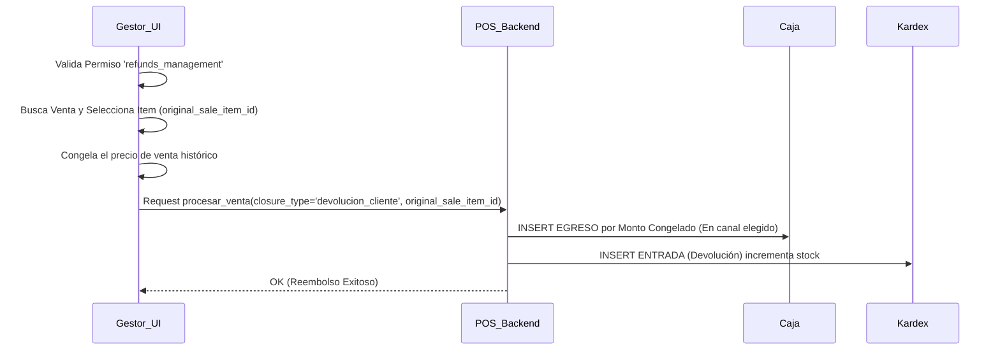

# SDD-006-02: Gestor de Reembolsos (Devoluciones de Clientes)

> **Asociado a:** [FRD-006-02](../FRD/FRD_006_02_GESTOR_REEMBOLSOS.md)  
> **Fase del Plan:** Fase 4 (Inventario Detallado)  
> **Estado:** 🟢 Consolidado  
> **Última Actualización:** 2026-08-04

---

## 0. Contexto y Restricciones Aplicables (PEA-N)

### 0.1 Políticas Globales Activadas (ARQ-002)
| Política | Dominio | Impacto Específico en este SDD |
|----------|---------|-------------------------------|
| **POL-SEC-02** | Seguridad | El módulo exige una capa estricta de Roles y Permisos (`RBAC`). Un cajero normal no puede ejecutar devoluciones de efectivo a menos que el dueño le otorgue explícitamente el permiso. |

### 0.2 Contratos Vecinos que Limitan el Diseño (Consulta RVC)
| SDD Vecino / Entidad | Restricción que impone al diseño de este SDD |
|----------------------|----------------------------------------------|
| **SDD_007_01 (POS)** | El motor `rpc_procesar_venta_v3` absorbió la responsabilidad lógica del reembolso bajo el `closure_type = 'devolucion_cliente'`. Este motor exige que se envíe obligatoriamente el `original_sale_item_id` y el `payment_method_id` (para asentar el egreso del dinero). |
| **SDD_027 (Caja Multicanal)** | Todo reembolso de dinero TIENE PROHIBIDO descontar un "saldo global". Se debe especificar a qué canal (Efectivo, Nequi) pertenece el dinero que se devuelve al cliente. |
| **SDD_004 (Control de Caja)** | Prohibido usar "PIN" temporal de administrador. Se validará la sesión JWT activa del usuario autenticado y sus permisos embebidos. |

---

## 1. Glosario Local
*No se introducen términos lógicos propios que requieran definición estricta en este módulo.*

---

## 2. Diagrama de Secuencia (UML - Mermaid)

### Caso de Uso: Reembolso por Producto Devuelto (Integración con POS Unificado)

---

## 3. Diagrama de Estados
*Esta entidad no tiene un ciclo de vida complejo en este módulo. La devolución es un evento atómico final.*

---

## 4. Especificación Detallada de Casos de Uso

### 4.1 Devolución de Dinero por Ticket
- **Precondiciones:** Cajero tiene sesión activa, posee el rol o permiso `refunds_management`. El ticket original debe existir.
- **Reglas de Negocio Aplicables:** Regla 1 (Control Acceso), Regla 3 (Monto Estricto Inmutable).
- **Flujo Principal:**
  1. El actor entra a la pantalla administrativa del Gestor de Reembolsos.
  2. El actor busca el ticket original usando el identificador o fecha.
  3. El actor selecciona el producto exacto devuelto (obteniendo `original_sale_item_id`).
  4. El sistema inyecta en la UI la cantidad devuelta y calcula el monto inmutable a reembolsar (basado en el histórico, no en el precio de hoy).
  5. El actor selecciona de qué canal de pago sacará el dinero (ej. Cajón de Efectivo).
  6. El sistema envía la transacción al backend del POS unificado.
  7. El backend procesa el doble asiento: resta efectivo y suma stock.
- **Flujos Alternativos:** Ninguno.
- **Flujos de Excepción:**
  - *4.a. Sin Permisos:* La ruta de frontend `/admin/refunds` redirige al home o bloquea el renderizado.
  - *4.b. Caja Cerrada:* El RPC rechaza la operación porque no se puede asentar el egreso si el turno ya culminó.
- **Postcondiciones (Éxito):** Inventario arriba, Caja abajo, Cuadre intacto.

---

## 5. Contrato de Interfaz

### 5.1 Operación (Delegada a `rpc_procesar_venta_v3`)
El frontend del Gestor de Reembolsos actúa estrictamente como consumidor del contrato unificado definido en `SDD_007_01`.

- **Entrada esperada (Específica para reembolsos):**
  - `closure_type`: Fijo en `'devolucion_cliente'`.
  - `original_sale_item_id`: UUID, Obligatorio para trazar el costo histórico.
  - `payment_method_id`: String, Obligatorio para asentar el egreso.
- **Reglas de transformación / cálculo:**
  - Ver `SDD_007_01` (El motor asienta la salida de dinero y la entrada física en lotes).
- **Salida esperada:**
  - Éxito: Confirmación de reembolso.
  - Fallo: Errores del motor transaccional.

---

## 6. Análisis de Seguridad

- **Control de Acceso:** Exclusivo para administradores o perfiles con permiso `refunds_management`.
- **Protección de Datos:** La UI debe prohibir (estado `readonly` o `disabled`) la manipulación manual del precio a devolver.
- **Superficie de Amenazas:**
  - *Amenaza:* Triangulación Fraude (El cajero inventa una devolución de la nada para justificar el robo físico del billete de la gaveta).
  - *Mitigación:* Se previene mediante un "Triple Candado":
    1. Permiso estricto (no puede hacerlo solo).
    2. Enlace al ticket original (no puede inventarlo).
    3. Validación de límite en backend (no puede devolver 2 unidades si solo vendió 1).
- **Trazabilidad de Auditoría:** El evento queda registrado permanentemente como un Egreso en `cash_movements` atado a la venta original en el historial de transacciones.

---

## 7. Modelo de Datos Lógico
*Este módulo no introduce nuevas entidades lógicas. Reutiliza el modelo base documentado en SDD_007_01 (Ventas y Movimientos de Caja).*
