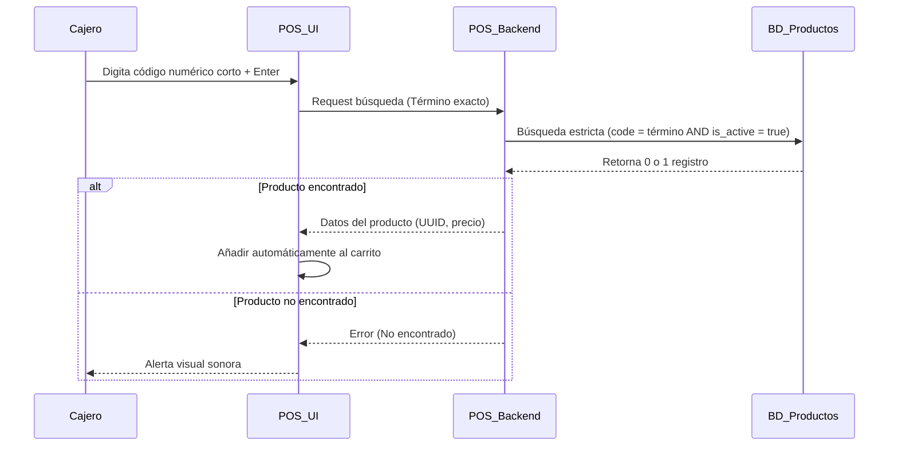
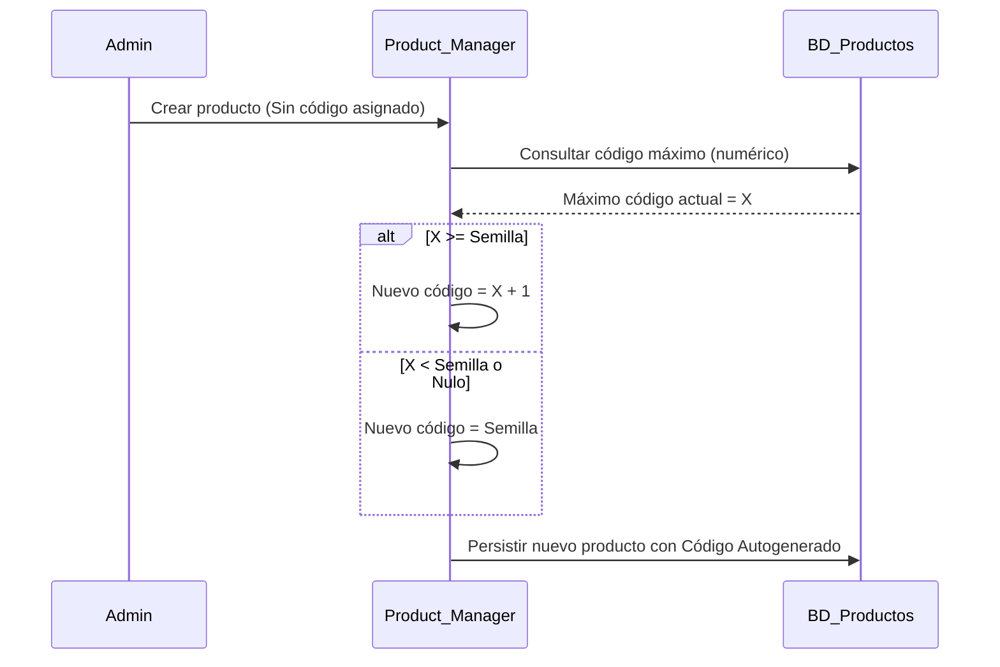

# SDD-006-03: Código de Producto (PLU Optimizada)

> **Asociado a:** [FRD-006-03](../FRD/FRD_006_03_CODIGO_PRODUCTO.md)  
> **Fase del Plan:** Fase 4 (Inventario Detallado)  
> **Estado:** 🟢 Consolidado  
> **Última Actualización:** 2026-08-04

---

## 0. Contexto y Restricciones Aplicables (PEA-N)

### 0.1 Políticas Globales Activadas (ARQ-002)
| Política | Dominio | Impacto Específico en este SDD |
|----------|---------|-------------------------------|
| **N/A** | Diseño UX/DB | Las directivas de este FRD imponen restricciones a nivel de base de datos (Índice Único Parcial) y de usabilidad en el POS. |

### 0.2 Contratos Vecinos que Limitan el Diseño (Consulta RVC)
| SDD Vecino / Entidad | Restricción que impone al diseño de este SDD |
|----------------------|----------------------------------------------|
| **SDD_007_01 (POS)** | El POS depende de la velocidad de este código. Exige una búsqueda exacta (`=`) y rechaza el escáner físico. |
| **SDD_006_01 (Inventario)**| Toda la trazabilidad descansa sobre el `UUID` interno (`id`). El `code/sku` es estrictamente visual y operativo, permitiendo su reasignación y liberación. |

---

## 1. Diagrama de Secuencia (UML - Mermaid)

### Caso de Uso: Búsqueda Rápida en POS

### Caso de Uso: Autogeneración de Código

---

## 2. Especificación Detallada de Casos de Uso

### 2.1 Búsqueda de Producto por Código
- **Precondiciones:** Cajero autenticado, turno de caja activo, producto registrado y activo en el sistema.
- **Reglas de Negocio Aplicables:** Regla 1 (Unicidad Operativa), Regla 6 (Búsqueda Exacta y Rápida).
- **Flujo Principal:**
  1. El actor digita un código alfanumérico corto en el sistema.
  2. El sistema realiza una consulta de coincidencia exacta sobre los productos activos.
  3. El sistema ubica el producto único.
  4. El sistema inyecta el producto al flujo que originó la búsqueda (ej. el carrito del POS).
- **Flujos Alternativos:** Ninguno permitido. No existe autocompletado para el código.
- **Flujos de Excepción:** Si el código no coincide exactamente, el sistema rechaza la operación y notifica al usuario.
- **Postcondiciones (Éxito):** El producto es identificado de manera inequívoca.

---

## 3. Contrato de Interfaz

### 3.1 Operación: `buscar_producto_por_codigo`
- **Entrada esperada:** 
  - `termino_busqueda` (String, Obligatorio): El código digitado por el usuario.
- **Reglas de transformación:** 
  - El sistema ejecutará una búsqueda de igualdad absoluta ignorando búsquedas parciales (`LIKE`).
  - La consulta debe incluir el filtro restrictivo de estado activo (`is_active = true`).
- **Salida esperada:** 
  - Éxito: Objeto de datos del producto (`UUID`, nombre, precio).
  - Fallo: Código de error `PRODUCT_NOT_FOUND`.

---

## 4. Análisis de Seguridad

- **Control de Acceso:** La asignación y reasignación de códigos está restringida al rol Administrador o usuarios con permiso explícito de gestión de inventario.
- **Protección de Datos:** El código de producto no es información sensible, no requiere enmascaramiento.
- **Superficie de Amenazas:** 
  - *Amenaza:* Reasignación maliciosa para alterar historial. 
  - *Mitigación:* Al estar el modelo completamente desacoplado y anclado al `UUID` para fines contables (Kardex, Facturas), la alteración del código no rompe la trazabilidad histórica de ningún ticket emitido.
- **Trazabilidad de Auditoría:** Todo cambio de código de producto se registra en la bitácora de modificaciones del catálogo, indicando quién hizo el cambio y cuándo.

---

## 5. Modelo de Datos Lógico

### 5.1 Diccionario de Datos Restringido
El atributo de código (`code` o `sku`) dentro de la entidad Producto debe someterse a las siguientes restricciones lógicas:

| Atributo | Tipo Lógico | Restricciones | Descripción |
|----------|-------------|---------------|-------------|
| `code` | Texto (String) | Longitud Máxima: 6 caracteres. | Preserva ceros a la izquierda. Su formato debe optimizar la digitación humana. |
| `is_active` | Booleano | N/A | Bandera de estado lógico. |

### 5.2 Restricción de Integridad (Índice Único Parcial)
La capa de base de datos DEBE garantizar de forma nativa que no existan dos registros que compartan el mismo `code` mientras su bandera `is_active` sea Verdadera. Esta regla lógica permite el reciclaje de códigos de productos inactivos, cumpliendo la Regla 4 del FRD.
