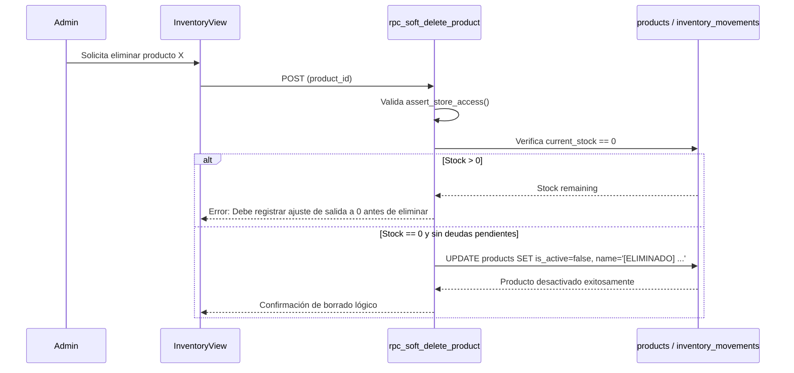
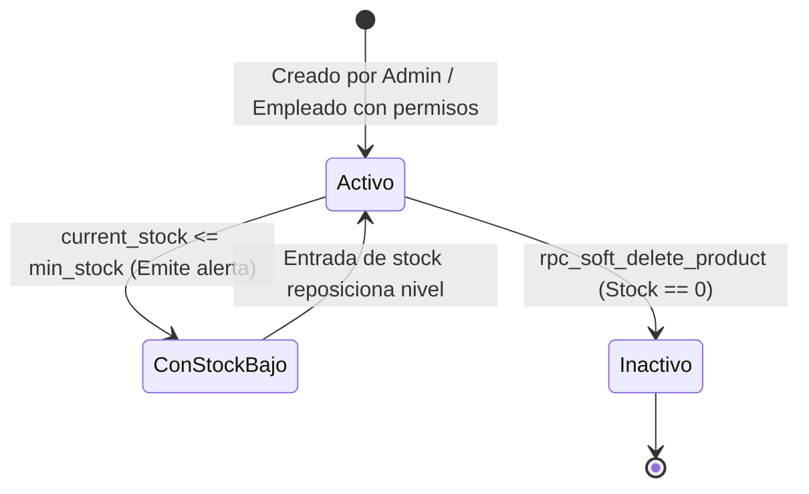
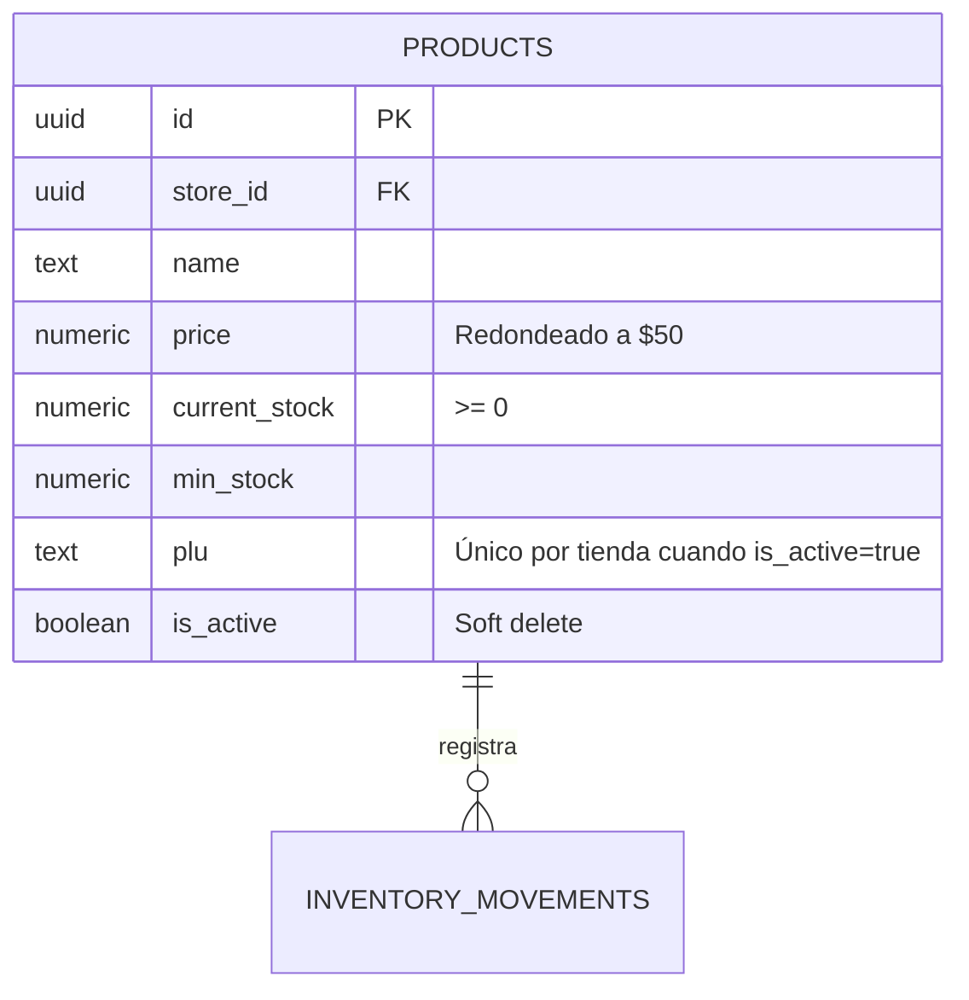

# SDD-006: Gestión de Inventario y Catálogo (Módulo Primario)

> **Asociado a:** [FRD-006](../FRD/FRD_006_INVENTARIO.md)  
> **Fase del Plan:** Fase 3 (Prioridad 3 — SDDs Faltantes)  
> **Estado:** 🟡 Validado Localmente (Post Alineación Documental 2026-08-07)  
> **Última Actualización:** 2026-08-07

---

## 0. Contexto y Restricciones Aplicables

### 0.1 Políticas Globales Activadas (ARQ-002)
| Política ID | Dominio | Impacto Concreto en este SDD |
|-------------|---------|------------------------------|
| **SPEC-010 / 011** | Financiero | **Redondeo y Formato:** Precios guardados al múltiplo de $50 más cercano. Montos sin decimales. Cantidades pesables con máx 2 decimales. |
| **POL-LOG-02** | Logística | **Prohibición de Stock Negativo:** El backend bloquea con `STOCK_INSUFFICIENT` cualquier operación que reduzca el stock disponible por debajo de cero. |
| **POL-SEC-01** | Seguridad | **Protección de Costo:** El campo `unit_cost` / `purchase_price` está oculto para roles `employee` vía RLS / sanitización de columnas en consultas. |

### 0.2 Contratos Vecinos que Limitan el Diseño
| SDD Origen | Restricción Inyectada | Impacto en Inventario |
|------------|-----------------------|-----------------------|
| **SDD_010_016 (FIFO)** | El costo de venta es calculado dinámicamente sobre lotes `inventory_batches`. | El catálogo maneja `current_stock` como sumatoria de lotes activos. |
| **SDD_007_01 (POS)** | Consumo de inventario por venta. | El POS descuenta del Kardex mediante `movement_type = 'venta'`. |

### 0.3 Auditoría de BD contra Realidad
- **Verificación Real en Esquema (`20260727020000_soft_delete_products.sql`):**
  - Tabla `products` verificada con columnas: `id`, `store_id`, `name`, `price`, `current_stock`, `min_stock`, `plu`, `is_active`.
  - Función de borrado lógico verificada: `rpc_soft_delete_product(p_product_id)`. Valida que `current_stock == 0` y que no existan cuentas por pagar pendientes atadas antes de marcar `is_active = false`.

---

## 1. Glosario Local

- **Kardex:** Registro auditable e inmutable de todos los movimientos de entrada, salida y ajuste de mercancía (`inventory_movements`).
- **PLU:** Código rápido numérico/alfanumérico único por tienda para agilizar búsquedas en la UI del POS.
- **Borrado Lógico de Producto (`rpc_soft_delete_product`):** Desactivación de un producto previa comprobación de stock cero y deudas pendientes, cambiando su PLU para liberar la clave única.

---

## 2. Diagramas de Secuencia

### 2.1 Flujo de Borrado Lógico Seguro de Producto

---

## 3. Diagramas de Estado

---

## 4. Especificación Detallada de Casos de Uso

### Caso A: Crear Producto en Catálogo
- **Actor:** Admin o Empleado con `canManageInventory`.
- **Precondición:** Sesión activa con permisos requeridos.
- **Flujo Principal:**
  1. El usuario ingresa datos del producto (Nombre, Precio, PLU, Unidad, Es Pesable).
  2. El backend redondea el precio al múltiplo de $50 más cercano.
  3. El backend verifica unicidad de PLU dentro de la tienda para productos activos.
  4. Inserta el producto con `current_stock = 0` o el stock inicial provisto.
- **Postcondiciones (Éxito):** Producto creado y disponible para catálogo.

### Caso B: Borrado Lógico de Producto
- **Actor:** Administrador (Exclusivo).
- **Precondición:** El producto no posee existencias físicas (`current_stock == 0`).
- **Flujo Principal:**
  1. El Admin presiona "Eliminar Producto".
  2. La UI llama a `rpc_soft_delete_product`.
  3. El backend valida stock cero y ausencia de deudas pendientes atadas.
  4. Si cumple, ejecuta `is_active = false`, muta el PLU para liberar la clave única y renombra el producto con el sufijo `[ELIMINADO]`.
- **Postcondiciones:** El producto deja de aparecer en el POS y catálogo activo sin romper la trazabilidad histórica de ventas pasadas.

---

## 5. Contrato de Interfaz

### Operación: `rpc_soft_delete_product`
- **Entrada esperada:** `p_product_id` (UUID, obligatorio).
- **Reglas de transformación:**
  - `PERFORM assert_store_access(store_id)`.
  - Exige `current_stock == 0`.
  - Retorna `PENDING_PAYABLES` si el producto está atado a facturas no pagadas.
- **Salida esperada:** `{ "success": true, "data": p_product_id }` o error estructurado.

---

## 6. Análisis de Seguridad

- **Protección de Campos Sensibles:** El campo `unit_cost` es filtrado por la vista/RPC según la función de seguridad centralizada `is_admin()`.
- **Control de Acceso:** La eliminación física está prohibida; la desactivación lógica exige rol de Administrador.

---

## 7. Modelo de Datos Lógico

### ERD Mermaid

