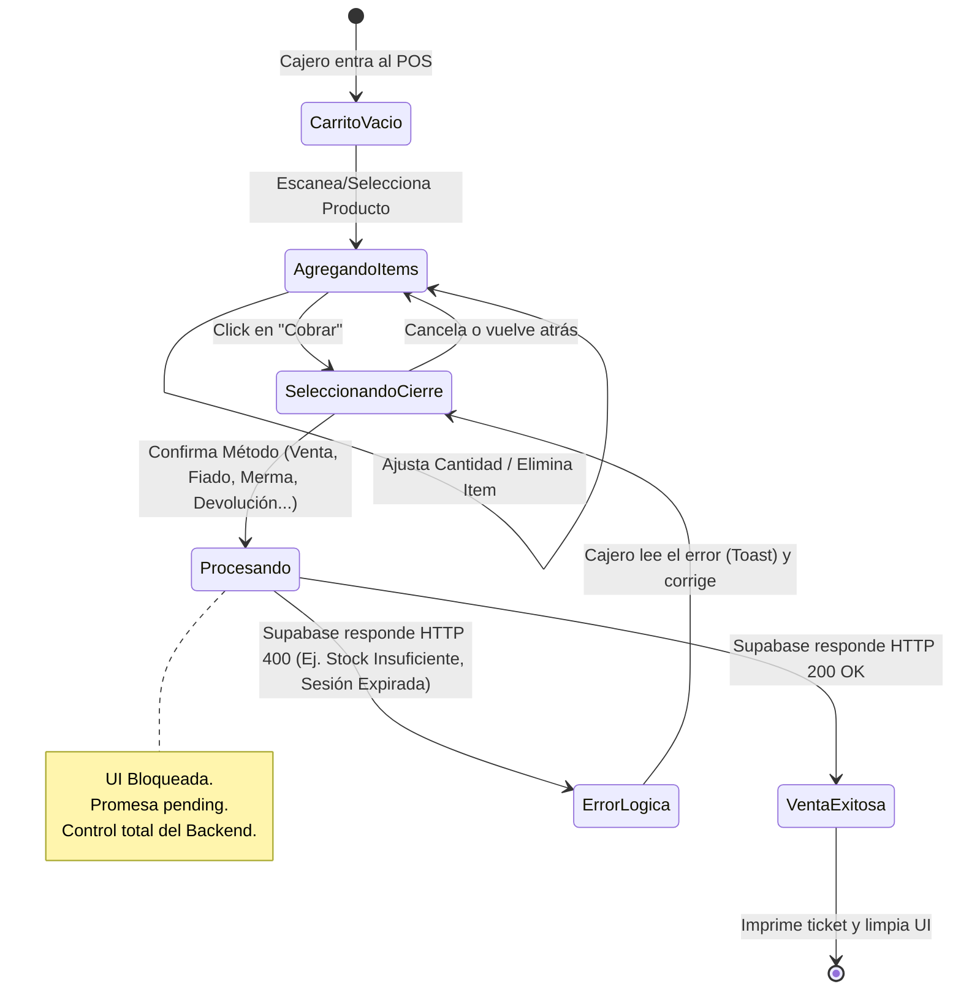
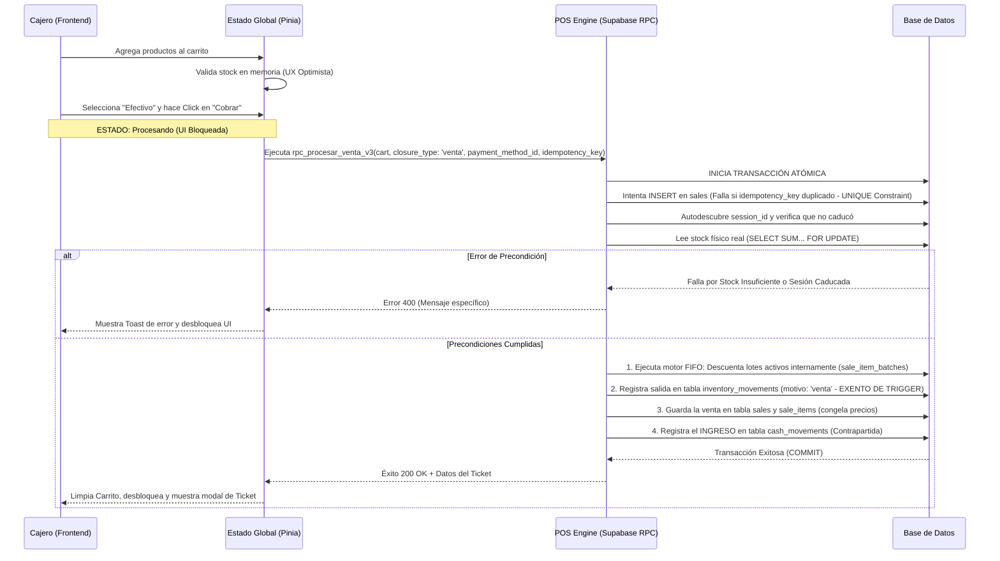

# SDD-007-01: Núcleo del Punto de Venta (POS) Desacoplado

> **Asociado a:** [FRD-007-01](../FRD/FRD_007_01_NUCLEO_POS.md)  
> **Estado:** 🟠 Aprobado con Deuda Técnica Documentada (Deuda: Migración SQL `rpc_procesar_venta_v3` pendiente)  
> **Última Actualización:** 2026-08-07

---

## 0. Auditoría Contextual PAC-R

> **Fecha de auditoría:** 2026-08-04  
> **Resultado:** 🔴 Diseño Funcional Aprobado / Deuda Técnica Crítica en BD

### 0.1 Restricciones Transversales Inyectadas (Fase 0)
Las siguientes restricciones fueron generadas por los módulos base de Fase 0 y son de cumplimiento obligatorio para este documento:
| SDD Origen | Restricción Inyectada | Impacto en el POS |
|------------|-----------------------|-------------------|
| **SDD_027 (Caja Multicanal)** | Prohibido usar saldos globales. Todo movimiento debe especificar `payment_method_id` hacia `cash_movements`. | El POS no puede inyectar efectivo en caja sin declarar explícitamente el canal de pago en el payload. |
| **SDD_010_016 (FIFO)** | Prohibido calcular costo de venta sobre `purchase_price`. Obligatorio desglosar ventas en `sale_item_batches`. | El motor del POS debe llamar a `consume_stock_fifo` y volcar el resultado íntegro por lote para proteger la utilidad. |

### 0.2 Hallazgos Críticos Históricos (🔴)
| # | Descripción del hallazgo | Sección afectada | Corrección requerida |
|---|--------------------------|-----------------|----------------------|
| 1 | **Ausencia de Flujo de Devolución de Cliente:** Según `POL-LOG-03`, el POS es el embudo único. | 2, 3 y 5.1 | Crear el estado y flujo "Devolución Cliente". |
| 2 | **Fuga de Verdad en Payload de Salida:** El backend recalcula precios pero no los retorna. | 5.2 | Retornar el total cobrado oficial y el arreglo de ítems procesados. |
| 3 | **Falta de Idempotencia en el Contrato:** Prevención de doble deducción por latencia. | 5.1 | Agregar `idempotency_key` como campo obligatorio. |
| 4 | **Trazabilidad de Cuentas por Pagar Rota:** Falta `supplier_id` y `reference_invoice_id` (FRD-019). | 5.1 | Agregar estos campos al payload para `devolucion_proveedor`. |
| 5 | **Trazabilidad de Devolución de Cliente Rota:** Falta enlazar a la venta original para validar precio devuelto. | 5.1 y 6.3 | Requerir `original_sale_item_id` en el carrito y validar contra el precio congelado. |
| 6 | **Ambigüedad de Consumo FIFO (Riesgo Doble Consumo):** No aclara si rpc consume directo o delega a trigger. | 3.1 y 7 | Explicitar que el RPC consume FIFO directo y usa `movement_type = 'venta'` (exento de trigger). |
| 7 | **Canal de Pago Omitido en Devolución:** Falta especificar el origen de los fondos al reembolsar. | 5.1 y 3.2 | Hacer `payment_method_id` obligatorio también para `devolucion_cliente`. |
| 8 | **Alucinación de Nombres de Tabla:** Usa `caja_diaria` y `daily_cash_movements` en vez del real. | 3 y 7 | Unificar todo a la tabla `cash_movements`. |

### 0.2 Hallazgos de Mejora (🟡)
| # | Descripción del hallazgo | Sección afectada | Corrección requerida |
|---|--------------------------|-----------------|----------------------|
| 1 | **Bloqueo Transaccional Débil:** Falta `FOR UPDATE`. | 3.1 | Explicitar uso de `FOR UPDATE` en stock. |
| 2 | **Falta Tipología en Bitácora:** `POL-AUD-02`. | 3.1 y 3.2 | Explicitar motivo de movimiento de inventario. |
| 3 | **Enum payment_type Hardcodeado:** Mezcla cierre contable con canal y no es extensible (FRD-020, FRD-022). | 5.1 y 3 | Separar `closure_type` de `payment_method_id`. |
| 4 | **Validación "Teórica" Multitenant:** Falla el patrón de seguridad, propiciando BUG-001. | 6.1 | Nombrar explícitamente `get_current_store_id()` y `assert_store_access()`. |
| 5 | **Idempotencia sin Constraint Fuerte:** La validación lógica es insuficiente contra race conditions reales. | 6.3 | Exigir `UNIQUE(idempotency_key)` en tabla `sales` y capturar la excepción. |

### 0.3 Hallazgos Capa E y Etapa 1.5 (Auditoría contra Realidad DB)
> **Advertencia de Deuda Técnica:** Las correcciones funcionales agregadas en las rondas previas de PAC-R rediseñaron teóricamente el POS (creando `rpc_procesar_venta_v3`), pero **no se implementaron en la base de datos**.

| # | Descripción del hallazgo | Sección afectada | Acción requerida (Deuda Técnica) |
|---|--------------------------|-----------------|----------------------|
| 1 | **Alucinación de RPC y Payload:** El SDD exige `rpc_procesar_venta_v3` con `closure_type`, `idempotency_key`, `supplier_id`, etc. La BD real sigue en `v2` recibiendo solo 5 parámetros básicos. | 5.1, 3.1, 3.2 | **Deuda Técnica Crítica:** Construir la migración SQL para el `rpc_procesar_venta_v3` que soporte los nuevos cierres (mermas, devoluciones). |
| 2 | **Alucinación de `idempotency_key`:** El SDD requiere `UNIQUE(idempotency_key)`. La tabla `sales` real no tiene esta columna. | 5.1, 6.3 | **Deuda Técnica:** Agregar columna `idempotency_key` (UUID, UNIQUE) a `sales`. |
| 3 | **Tipado del Canal de Pago:** El SDD exige FK `payment_method_id` hacia `payment_methods`. La BD actual lo mapea a un `TEXT` con un CHECK enum en `sales`. | 5.1 | **Deuda Técnica:** Alinear el código del RPC v3 para manejar el ID foráneo del sistema multicanal (FRD-022). |
| 4 | **Spoofing de Sesión:** El SDD exigía que el Frontend envíe el `session_id`. El RPC actual (`v2`) lo descubre desde la BD por seguridad. | 5.1 | **Corregido en Documento:** Se eliminó `session_id` del payload de entrada. El backend mantiene la autoridad de descubrimiento. |

---

## 1. Glosario Técnico y Entidades

Este glosario define los conceptos estandarizados para que Frontend y Backend hablen el mismo idioma durante la implementación, eliminando ambigüedades.

| Término / Entidad | Definición en el Contexto de este SDD |
|-------------------|---------------------------------------|
| **POS Engine (Motor)** | Función RPC atómica en Supabase (`rpc_procesar_venta`) que recibe el carrito, descuenta inventario (vía FIFO) y enruta el flujo financiero a la caja o deudas. |
| **Cart Payload (Carrito)** | Arreglo JSON in-memory en el Frontend (Store) que contiene únicamente `product_id` y `quantity`. No maneja costos. |
| **Transacción Atómica** | Propiedad obligatoria de la venta. Si falla el descuento de inventario o falla el registro de caja, NADA se guarda (Rollback total). |
| **Bloqueo Logístico** | Regla de validación en Backend que rechaza la transacción si `cantidad_solicitada > stock_actual`. |
| **Cierre de Efectivo / Nequi** | Venta comercial normal. Backend descuenta inventario y registra un INGRESO en Caja Diaria por el valor cobrado. Contrapartida: Activo (Caja). |
| **Cierre de Fiado** | Venta a crédito. Backend descuenta inventario y genera una DEUDA en Cuentas por Cobrar. No toca la caja ($0 efectivo). Contrapartida: Activo (Cuentas por Cobrar). |
| **Cierre de Merma / Consumo Interno** | Pérdida operativa. Backend descuenta inventario y genera un EGRESO en Gastos Operativos por el costo del bien perdido. No toca la caja ($0 efectivo). Contrapartida: Gasto. |
| **Cierre de Devolución a Proveedor** | Ajuste de inventario. Backend descuenta inventario y genera un AJUSTE (nota crédito) en Cuentas por Pagar. No toca la caja ($0 efectivo). Contrapartida: Pasivo (Cuentas por Pagar). |
| **Cierre de Devolución de Cliente** | Reversión de venta. Backend ingresa inventario (crea lote 'returned') y genera un EGRESO en Caja Diaria por el dinero devuelto. Contrapartida: Activo (Caja). |

---

## 2. Máquina de Estados (Ciclo de Vida de la Venta)

El flujo del POS es una máquina de estados finita. El Frontend controla la experiencia (UX), pero el estado crítico de transición (`Procesando`) pertenece enteramente al Backend.



> **Nota de Arquitectura (Clean Code Guard):** El estado `Procesando` exige protección contra reentradas. El botón de confirmación en Vue debe pasar a `disabled=true` (o mostrar un spinner) inmediatamente después del primer click para mitigar el riesgo de doble cobro por latencia de red.

---

## 3. Modelado de Flujos (Secuencia de Eventos)

### 3.1. Flujo Principal (Venta Comercial)

Este es el camino feliz de una venta estándar pagada de inmediato (Efectivo o Nequi). Muestra cómo el POS interactúa con la base de datos de manera atómica.



### 3.2. Enrutamiento de Contrapartidas (Flujos Alternativos)

El paso 4 del diagrama anterior cambia drásticamente dependiendo de la tipología de cierre que seleccionó el usuario, garantizando siempre una contrapartida contable (partida doble).

```mermaid
sequenceDiagram
    participant API as rpc_procesar_venta
    participant Inv as Módulo Inventario
    participant Caja as Módulo Caja Diaria (cash_movements)
    participant Deuda as Módulo Cuentas (Por Cobrar / Por Pagar)
    participant Gasto as Módulo Gastos Operativos
    
    alt closure_type == 'devolucion_cliente'
        API->>Inv: 1. Ingresa Stock (Crea Lote 'returned') validando original_sale_item_id
        API->>Caja: 2a. Registra EGRESO ($) en cash_movements usando payment_method_id
    else
        API->>Inv: 1. Descuenta Stock (FIFO Lotes)
        
        alt closure_type == 'venta'
            API->>Caja: 2b. Registra INGRESO ($) en cash_movements usando payment_method_id
        else closure_type == 'fiado'
            API->>Deuda: 2c. Verifica Cupo del Cliente
            API->>Deuda: 3c. Registra DEUDA (Cuentas por Cobrar)
        else closure_type == 'merma'
            API->>Gasto: 2d. Registra EGRESO (Gasto Operativo) por costo FIFO
        else closure_type == 'devolucion_proveedor'
            API->>Deuda: 2e. Registra AJUSTE (Nota Crédito en Cuentas por Pagar)
        end
    end
    
    API-->>-Frontend: Retorna OK
```

---

## 4. Responsabilidades del Frontend (UI/UX)

Siguiendo el principio de **Autoridad del Backend**, el Frontend actúa exclusivamente como un recolector de intención y visualizador de datos, sometido a las siguientes reglas estrictas:

1. **Cálculo de Previsualización:** El Frontend debe calcular el `Total = Precio * Cantidad` en tiempo real **únicamente para mostrarle al cajero cuánto cobrar**. Este cálculo en el navegador es manipulable, por lo que **TIENE PROHIBIDO** enviarse al backend. El backend ignora el total visual y recalcula todo desde cero consultando los precios seguros en la base de datos. Se hace en el frontend solo para garantizar una interfaz rápida sin tiempos de carga por cada clic.
2. **Formato Visual (SPEC-011):** Toda presentación de dinero en el carrito DEBE mostrarse sin decimales y con separador de miles (ej. `$5.000`).
3. **Bloqueo Interactivo (Loading State):** Al hacer click en procesar, el botón DEBE deshabilitarse instantáneamente. El estado de la UI permanece en "Cargando" (Spinner) hasta que el motor retorne una respuesta.
4. **UX Optimista Prohibida:** Está **estrictamente prohibido** limpiar el carrito o mostrar un mensaje de éxito asumiendo que la venta pasará. La UI solo puede mostrar éxito si el backend confirma la creación del registro.

---

## 5. Contrato de Interfaz Backend (RPC Payload)

La comunicación se centraliza en un único Remote Procedure Call (RPC) de Supabase.

**Nombre del RPC:** `rpc_procesar_venta_v3`

### 5.1. Payload de Entrada (Request)

El Frontend envía la intención de venta. **Observe que no se envían precios, totales ni costos**, evitando cualquier manipulación desde el navegador.

| Propiedad Lógica | Requisito | Descripción |
|------------------|-----------|-------------|
| `idempotency_key`| Obligatorio | UUID generado por el Frontend para prevenir doble deducción. Protegido por `UNIQUE` en BD. |
| `closure_type` | Obligatorio | El método de cierre contable (`venta`, `fiado`, `merma`, `devolucion_proveedor`, `devolucion_cliente`). |
| `payment_method_id`| Condicional | Obligatorio si `closure_type IN ('venta', 'devolucion_cliente')`. FK a `payment_methods` (Efectivo, Nequi, Daviplata...). |
| `client_id` | Condicional | Identificador del cliente. Obligatorio ÚNICAMENTE si `closure_type == 'fiado'`. |
| `supplier_id` | Condicional | Obligatorio si `closure_type == 'devolucion_proveedor'` (Fallback FIFO). |
| `reference_invoice_id`| Opcional | Opcional si `closure_type == 'devolucion_proveedor'` para selección explícita. |
| `cart_items` | Obligatorio | Lista de productos a despachar (o reingresar). |
| ↳ `product_id` | Obligatorio | Identificador del producto específico. |
| ↳ `quantity` | Obligatorio | Cantidad física a despachar (o reingresar). |
| ↳ `original_sale_item_id` | Condicional | Obligatorio si `closure_type == 'devolucion_cliente'` para validar precio de egreso. |

*(Nota de Seguridad: El `session_id` ya no se envía desde el Frontend; el backend lo autodescubre consultando la caja abierta del empleado autenticado).*

### 5.2. Payload de Salida (Response)

Si la transacción atómica es exitosa, el backend retorna los datos mínimos necesarios para que la UI pueda imprimir el ticket de venta.

| Propiedad Lógica | Requisito | Descripción |
|------------------|-----------|-------------|
| `success` | Obligatorio | Bandera de éxito (verdadero). |
| `data` | Obligatorio | Objeto con la información resultante. |
| ↳ `sale_id` | Obligatorio | Identificador único de la venta generada en la base de datos. |
| ↳ `created_at` | Obligatorio | Marca de tiempo oficial dictada por el servidor, no por el navegador. |
| ↳ `total_charged`| Obligatorio | Valor monetario total calculado y registrado oficialmente en el backend. |
| ↳ `items`        | Obligatorio | Arreglo de los productos procesados para impresión del ticket (`SDD_007_02`). |
| ↳↳ `product_id`  | Obligatorio | Identificador del producto. |
| ↳↳ `quantity`    | Obligatorio | Cantidad física despachada. |
| ↳↳ `unit_price`  | Obligatorio | Precio de venta congelado oficial con el que se cobró este ítem. |

### 5.3. Códigos de Error (Manejo de Excepciones)

Si ocurre un fallo, la transacción hace rollback y el backend emite un error estructurado. El Frontend debe mapear el `code` a un mensaje amigable.

| Code | Razón Técnica | Comportamiento UI Esperado |
|------|---------------|----------------------------|
| `SESSION_INVALID` | El `session_id` no existe, no pertenece a la tienda, o el turno ya excedió las 24 horas (FRD-027-02). | Mostrar: "Turno cerrado o caducado. Debe abrir caja nuevamente." Bloquear el POS. |
| `STOCK_INSUFFICIENT` | Un producto en el carrito tiene cantidad física menor a la solicitada. | Mostrar: "Inventario insuficiente para: [Nombre Producto]. Ajuste la cantidad." |
| `CREDIT_LIMIT_EXCEEDED` | El cliente seleccionado no tiene cupo para absorber el total de la venta por fiado. | Mostrar: "Cupo de crédito insuficiente para el cliente." |
| `MISSING_CLIENT` | Se intentó hacer un "Fiado" sin proveer el `client_id`. | Mostrar: "Debe seleccionar un cliente para vender a crédito." |

---

## 6. Análisis de Seguridad

De acuerdo a las Políticas Globales (ARQ-002), el POS es un embudo crítico que debe estar protegido contra fraudes y errores operativos.

### 6.1. Control de Acceso y RLS (Implementación Explícita)
- La función de procesamiento (`rpc_procesar_venta_v3`) exige un JWT válido (usuario autenticado).
- **Validación de Propiedad:** El sistema DEBE llamar explícitamente a `assert_store_access()` y usar `get_current_store_id()` para verificar que el `session_id` proporcionado pertenezca a la tienda del usuario actual. No se asume contexto implícito (Mitigación BUG-001).

### 6.2. Protección de Datos (Costos Ocultos)
- Como se evidenció en la especificación del payload, el margen de ganancia (Precio Venta - Costo FIFO) es un cálculo 100% interno del servidor.
- El costo de adquisición de la mercancía JAMÁS viaja hacia el Frontend durante la operación del POS para evitar fugas de información financiera sensible hacia empleados de rango bajo.

### 6.3. Superficie de Amenazas y Mitigaciones
| Amenaza | Vector de Ataque / Error | Mitigación en el Diseño |
|---------|--------------------------|-------------------------|
| **Venta Fantasma (Stock Negativo)** | Dos cajeros venden la última Coca-Cola al mismo tiempo. | El backend verifica el stock físico *dentro* de la transacción atómica. Si la consulta concurrente agota el stock, la segunda transacción falla con `STOCK_INSUFFICIENT`. |
| **Doble Cobro** | El cajero presiona "Cobrar" 5 veces rápidamente por lentitud del internet. | **Decisión D-04 (Autoridad del Backend):** La idempotencia no recae en la UI. A nivel de Base de Datos, el `idempotency_key` es una restricción `UNIQUE` obligatoria en la tabla `sales`. El backend es la única fuente de verdad y rechaza transacciones duplicadas por constraint de BD. El Frontend colabora bloqueando el botón, pero no es la última línea de defensa. |
| **Manipulación de Precios** | Un atacante modifica el payload JSON enviando `total: 0.50` a la API. | Mitigado por diseño de payload. El backend no acepta totales, recalcula basándose en `product_id` y su precio vigente en base de datos. |
| **Fraude de Devolución / Evasión** | Un cajero inventa una devolución por un monto superior al real para robar efectivo. | El payload exige `original_sale_item_id`. El backend valida el monto de egreso estrictamente contra el `unit_price` congelado de la venta original, imposibilitando montos libres. |

---

## 7. Modelo de Datos Lógico (Tablas Impactadas)

La consolidación de un carrito en el POS es la operación más interconectada del sistema. Afecta lógicamente a las siguientes entidades (sin definir SQL):

| Entidad Lógica | Acción | Descripción del Impacto |
|----------------|--------|-------------------------|
| **Sesión de Caja** | Lectura | Validar que el turno está abierto y vigente (< 24h). |
| **Lotes de Inventario (FIFO)** | Actualización | El RPC descuenta directamente la cantidad de los lotes (`inventory_batches`) e inserta en `sale_item_batches`. |
| **Cabecera de Venta** | Creación | Se registra el identificador global de la venta (`sales`). |
| **Detalle de Venta** | Creación | Se registra línea por línea lo vendido. **Crucial:** Aquí el backend asienta el Precio Real de Venta y Costo Promedio consumido, congelándolos (`sale_items`). |
| **Movimientos Logísticos** | Creación | Se asienta la salida física (`inventory_movements`). **Importante:** El tipo exacto es `venta`, el cual está en la lista de exclusión del trigger `bridge_movement_to_batch` para evitar un doble consumo accidental de stock. |
| **Movimientos de Caja** | Creación (Condicional) | Si la operación requiere un canal, se inserta el registro de ingreso/egreso en `cash_movements`. |
| **Cuentas por Cobrar** | Creación (Condicional) | Si el pago fue Fiado, se genera un registro de deuda al cliente. |
| **Gastos Operativos** | Creación (Condicional) | Si fue Merma/Consumo, se registra el gasto por pérdida. |
