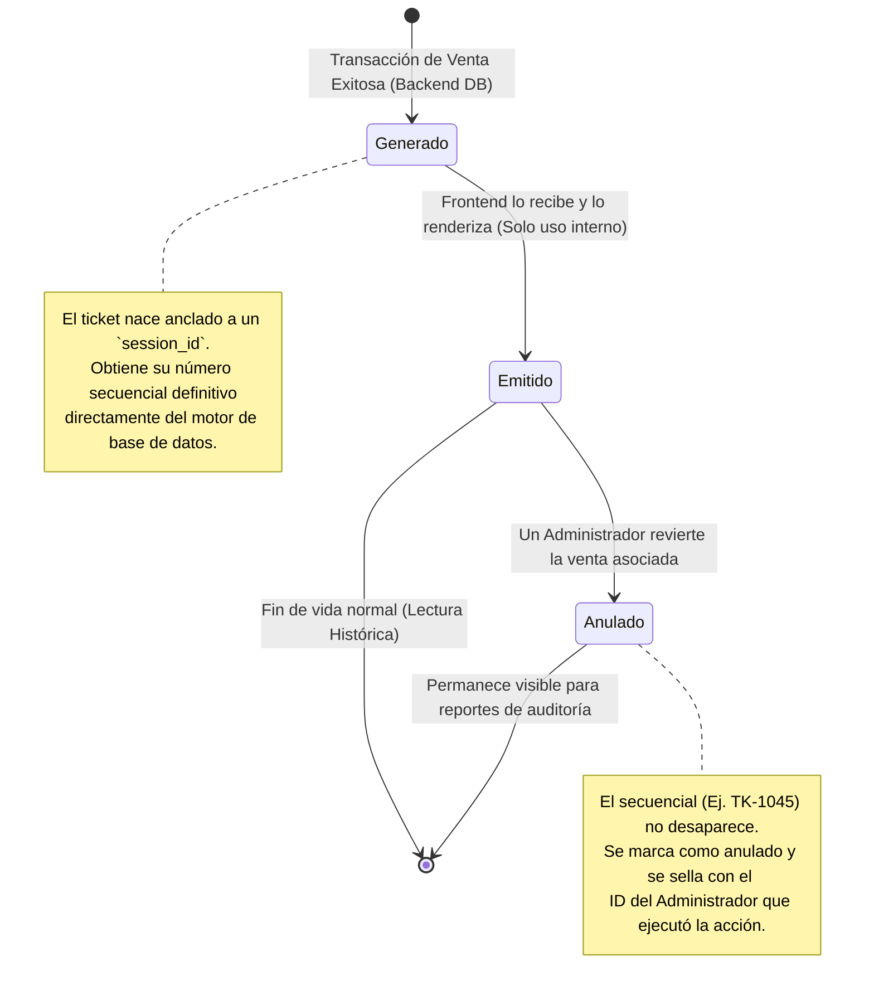
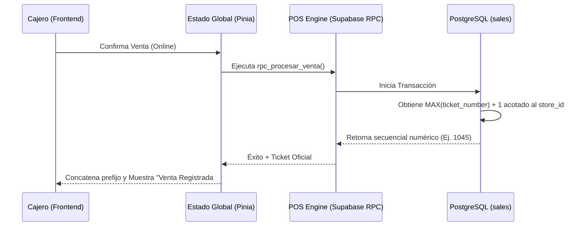
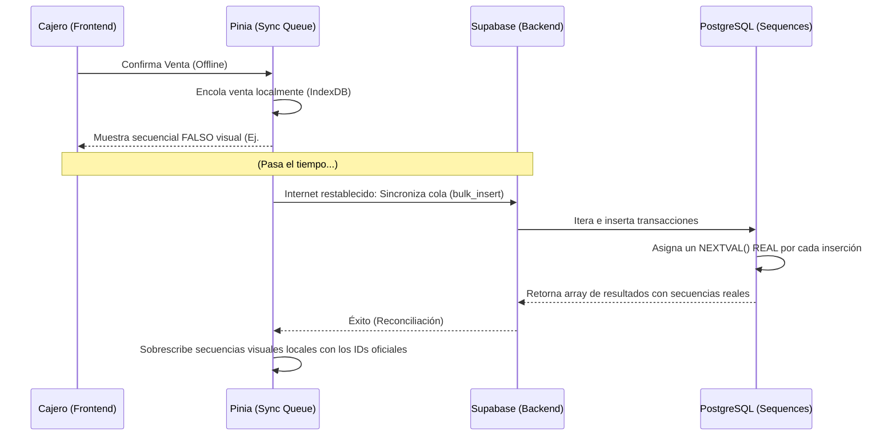
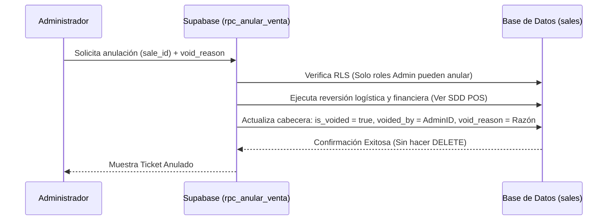

# SDD-007-02: Ticket de Venta (Trazabilidad y Comprobante)

> **Asociado a:** [FRD-007-02](../FRD/FRD_007_02_TICKET_DE_VENTA.md)  
> **Estado:** 🟢 Aprobado y Consolidado (Post PAC-R v1.1)  
> **Última Actualización:** 2026-08-04

---

## 0. Auditoría Contextual PAC-R (Etapa 1.5 - Mapa de Dependencias)

> **Fecha de auditoría:** 2026-08-04  
> **Resultado:** 🔴 Requiere correcciones inmediatas (aplicadas en esta versión)

### 0.1 Restricciones Transversales Inyectadas (Fase 0)
| SDD Origen | Restricción Inyectada | Impacto en el Ticket |
|------------|-----------------------|----------------------|
| **SDD_027 (Caja Multicanal)** | El pago pertenece a un canal específico (desnormalizado como `payment_method`). | El ticket refleja el canal de liquidez real (Efectivo, Transferencia) mediante este campo de texto fijo. |
| **SDD_010_016 (FIFO)** | El costo contable es confidencial y varía por lote. | El ticket **TIENE PROHIBIDO** mostrar o recibir el `unit_cost`. Solo muestra `sale_price`. |

### 0.2 Hallazgos Críticos Históricos (🔴)
| # | Descripción del hallazgo | Sección afectada | Corrección aplicada |
|---|--------------------------|-----------------|----------------------|
| 1 | **Contradicción Arquitectónica (Multitenant vs Secuencia):** El SDD prohibía usar `MAX() + 1` y exigía secuencias nativas. En multitenant, una secuencia global genera huecos por tienda. El esquema real usa `COALESCE(MAX(ticket_number), 0) + 1` transaccional. | 6.2, 3.1 | Se corrigió la restricción: se aprueba el uso de `MAX() + 1` acotado por `store_id` dentro del bloqueo transaccional para garantizar continuidad. |
| 2 | **Alucinación de Campos de Estado (Anulación):** Se inventó un enum `status = 'annulled'` y timestamps abstractos. El esquema real usa `is_voided` (boolean), `voided_by` (uuid), y `void_reason` (text). | 3.3, 5.1 | Se ajustó el contrato lógico a los campos reales del esquema. |
| 3 | **Alucinación de Nombres de Tabla y Parámetros:** Menciona "Tabla de Tickets", "Detalle" y "Tabla de Parámetros" para un `P_TICKET_PREFIX`. | 1, 7 | Se normalizó a `sales` y `sale_items`. Se eliminó la tabla de parámetros: el prefijo "POS-" es responsabilidad exclusiva de la vista (UI). |

### 0.2 Hallazgos de Mejora (🟡)
| # | Descripción del hallazgo | Sección afectada | Corrección aplicada |
|---|--------------------------|-----------------|----------------------|
| 4 | **Responsabilidad Logística Acoplada:** El SDD del ticket se hacía responsable de describir la reversión del stock (FIFO), lo cual es competencia del SDD del POS (`rpc_anular_venta`). | 3.3 | Se aclaró que el módulo de Ticket solo refleja el estado, delegando la logística al `rpc_anular_venta` del POS. |
| 5 | **Formato del Número:** El payload prometía devolver "POS-0015" (string), cuando la BD es la fuente de verdad y devuelve un `INTEGER`. | 5.1 | Se ajustó para que el backend retorne el `INTEGER` puro, y la concatenación visual ocurra en la UI. |

---

## 1. Glosario Técnico y Entidades

| Término / Entidad | Definición en el Contexto de este SDD |
|-------------------|---------------------------------------|
| **Ticket (Comprobante)** | Entidad de solo lectura que representa la fotografía inmutable de una venta completada. No tiene valor fiscal directo, pero es la base de auditoría operativa. |
| **Secuencia Segura** | Mecanismo exclusivo de la Base de Datos que garantiza que los números (1, 2, 3...) sean estrictamente consecutivos por tienda, sin importar la concurrencia. **Prohibido calcularlo en Frontend.** |
| **Ticket Anulado** | Un ticket cuya venta asociada fue revertida logística y financieramente. El registro del ticket **jamás se borra** (protegido por RLS/Triggers), solo cambia su estado lógico (`is_voided`) para mantener la auditoría secuencial intacta. |
| **Prefijo Configurable** | Cadena de texto visual (ej. "POS-"). Es una regla de presentación (Frontend/UX), **no existe en la base de datos**. El Frontend concatena esto al secuencial numérico para el humano (ej. "POS-0015"). |
| **Provisional Offline** | Estado temporal de un comprobante emitido sin conexión. El Frontend incrementa un número visualmente solo para dar retroalimentación al cajero. Al volver la conexión, el servidor sobrescribe estos números visuales con el secuencial oficial definitivo. Ningún ticket se imprime. |

---

## 2. Ciclo de Vida del Ticket (Estados de Inmutabilidad)

A diferencia de la transacción de venta (que tiene estados efímeros como "Procesando"), el Ticket nace inmutable. Su ciclo de vida es una vía de un solo sentido para garantizar el no repudio.

---

## 3. Modelado de Flujos (Secuencia de Eventos)

### 3.1. Generación Segura (Online)

En modo conectado, la base de datos es la única fuente de verdad para el consecutivo, mitigando colisiones si dos cajas operan en paralelo.

### 3.2. Operación Offline y Sincronización en Bulk

Cuando no hay red, la UI mantiene la ilusión de continuidad secuencial para el cajero (UX), pero asume que el backend dictará la realidad final al reconectar.

### 3.3. Flujo de Anulación de Ticket

El ticket es inmutable, por lo que una anulación se gestiona mediante una bandera lógica (`is_voided = true`), protegiendo el historial.

---

## 4. Responsabilidades del Frontend (UI/UX)

El Frontend no genera la verdad, pero es responsable de representarla con absoluta claridad para propósitos de auditoría visual.

1. **Indicador de Sincronización (Offline):** Cuando una venta se realiza sin conexión, el ticket visual DEBE mostrar un indicativo claro (ej. ícono de nube tachada o texto "No Sincronizado"). Una vez el backend responda con el ID real, la UI debe actualizarse inmediatamente.
2. **Visibilidad de Anulados:** El historial de tickets TIENE PROHIBIDO ocultar los tickets anulados. Deben permanecer en la lista con un estado visual prominente (ej. fondo rojo, texto tachado, o etiqueta "ANULADO").
3. **Bloqueo de Modificación:** La vista de detalle de un ticket debe ser estrictamente de **Solo Lectura**. No puede existir ningún botón de "Editar", "Modificar" o "Eliminar" (DELETE). La única acción permitida (si el usuario tiene rol de Administrador) es "Anular".

---

## 5. Contrato de Interfaz Backend (Estructura Lógica)

Cuando el Frontend consulta un Ticket (o el historial de tickets), el Backend retorna una estructura inmutable. 

*Nota: Se omite el código TypeScript por estándar de arquitectura; se define el Diccionario de Datos.*

### 5.1. Entidad: Ticket (Lectura)

| Propiedad Lógica | Requisito | Descripción |
|------------------|-----------|-------------|
| `ticket_number` | Obligatorio | El número secuencial puro de la base de datos (Ej. `15`). De tipo `INTEGER`. |
| `is_voided` | Obligatorio | Estado booleano: `true` si la venta fue anulada, `false` si es válida. |
| `session_id` | Obligatorio | Referencia a la sesión de caja durante la cual se emitió. |
| `cashier_name` | Obligatorio | Nombre del empleado que generó el ticket (desnormalizado o unido por JOIN a `employees`). |
| `created_at` | Obligatorio | Timestamp exacto de creación generado por la Base de Datos. |
| `total` | Obligatorio | Sumatoria total de la venta para ese instante en el tiempo. |
| `items` | Obligatorio | **Arreglo (Array) de líneas de venta.** Contiene el desglose exacto de los productos vendidos (Ver 5.2). |
| `voided_by` | Condicional | Identificador del Administrador que anuló el ticket (Nulo si `is_voided = false`). |
| `void_reason` | Condicional | Texto con la justificación de la anulación (Nulo si `is_voided = false`). |
| `payment_method` | Obligatorio | Texto que describe el canal de liquidez con el que se concretó la venta (Ej. 'Efectivo', 'Transferencia'). |

### 5.2. Entidad: Detalle del Ticket (Líneas)

La fotografía exacta de los productos en el momento de la venta.

| Propiedad Lógica | Requisito | Descripción |
|------------------|-----------|-------------|
| `product_name` | Obligatorio | Nombre del producto en ese instante temporal. |
| `quantity` | Obligatorio | Cantidad vendida. |
| `historical_price` | Obligatorio | El precio unitario de venta que tenía el producto **exactamente en ese milisegundo**. Si el producto cambia de precio mañana, este ticket no se altera. |

---

## 6. Análisis de Seguridad

El ticket es el comprobante maestro de la auditoría. Su diseño está orientado a la **inmutabilidad absoluta** y la prevención de fraudes.

### 6.1. Inmutabilidad y Bloqueo de Edición (Anti-Fraude)
- **Bloqueo de Borrado (DELETE):** Estrictamente prohibido. La base de datos debe implementar una política RLS o un Trigger (`trigger_prevent_ticket_delete`) que rechace cualquier intento de hacer `DELETE` sobre la tabla de tickets, incluso si la petición proviene de un rol de Administrador.
- **Bloqueo de Edición (UPDATE):** Una vez insertado, el `ticket_number`, la fecha, el cajero y las líneas de productos quedan congelados permanentemente. El único campo que el sistema permite modificar (vía RPC protegido) es la bandera lógica (`is_voided` a `true`) junto con las firmas de quién lo anuló (`voided_by`, `void_reason`).

### 6.2. Generación Concurrente Segura (Anti-Colisión)
- **Cálculo Transaccional por Tienda (`MAX + 1`):** Dado el diseño multitenant, utilizar `CREATE SEQUENCE` global generaría huecos en la numeración de una tienda específica si otra tienda realiza una venta en el mismo segundo. Por tanto, el número se obtiene calculando `COALESCE(MAX(ticket_number), 0) + 1` filtrando estrictamente por `store_id`.
- **Aislamiento de Transacción:** Para prevenir colisiones (*Race Conditions*) si dos cajeros de la misma tienda cobran al mismo tiempo, el cálculo de `MAX + 1` DEBE estar encapsulado dentro de la transacción del `rpc_procesar_venta`, el cual mantiene la garantía de atomicidad (el lock se produce a nivel de row o table scan bajo Read Committed con bloqueos secundarios, o gestionado directamente en el RPC).

---

## 7. Modelo de Datos Lógico (Entidades Impactadas)

La emisión y gestión de un ticket requiere interacción con las siguientes entidades abstractas (sin definir el SQL final):

| Entidad Lógica | Acción | Descripción del Impacto |
|----------------|--------|-------------------------|
| **Cabecera (sales)** | Inserción / Lectura | Cabecera del ticket. Sujeta a la regla Anti-DELETE. Alberga el `ticket_number`. |
| **Líneas (sale_items)** | Inserción / Lectura | Líneas de productos. Sujeta a regla Anti-UPDATE y Anti-DELETE total. |
| **Rol de Administrador** | Validación | Solo este rol puede ejecutar la mutación de estado marcando `is_voided = true` vía el RPC de anulación. |
