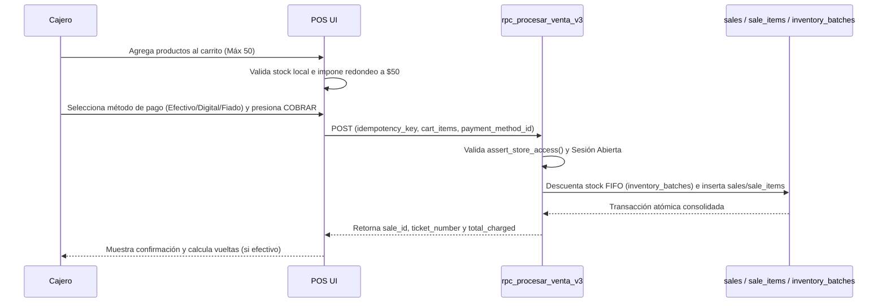
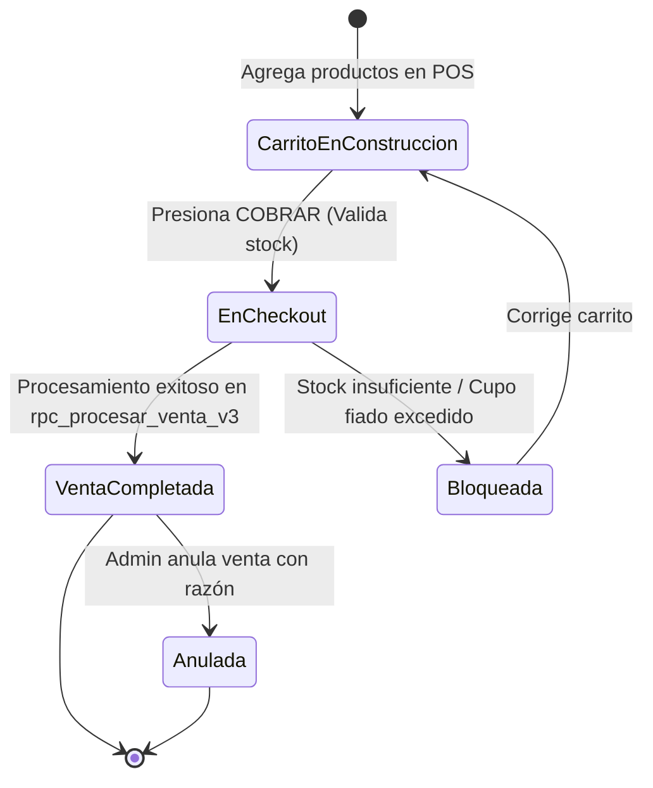
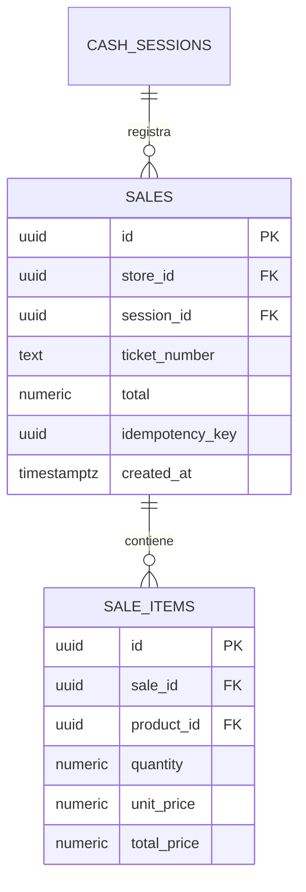

# SDD-007: Sistema de Ventas (Módulo Primario)

> **Asociado a:** [FRD-007](../FRD/FRD_007_VENTAS.md)  
> **Fase del Plan:** Fase 3 (Prioridad 3 — SDDs Faltantes)  
> **Estado:** 🟡 Validado Localmente (Post Alineación Documental 2026-08-07)  
> **Última Actualización:** 2026-08-07

---

## 0. Contexto y Restricciones Aplicables

### 0.1 Políticas Globales Activadas (ARQ-002)
| Política ID | Dominio | Impacto Concreto en este SDD |
|-------------|---------|------------------------------|
| **SPEC-010 / 011** | Financiero | **Redondeo e Inmutabilidad:** Subtotales y totales redondeados al múltiplo de $50 más cercano (empate hacia abajo). Formato entero sin decimales para montos. |
| **POL-SEC-01** | Seguridad | **Backend Authority:** Los precios y calculo de totales son dictados exclusivamente por la función `rpc_procesar_venta_v3` en la base de datos. |

### 0.2 Contratos Vecinos que Limitan el Diseño
| SDD Origen | Restricción Inyectada | Impacto en Ventas |
|------------|-----------------------|-------------------|
| **SDD_007_01 (POS Engine)** | Especificación técnica del RPC de procesamiento (`rpc_procesar_venta_v3`). | `SDD_007` define la interfaz primaria de experiencia de usuario y contratos lógicos generales. |
| **SDD_004 (Control de Caja)** | Bloqueo si caja cerrada. | No se permite iniciar o cerrar ventas si la sesión de caja no está `OPEN`. |
| **SDD_009 (Clientes)** | Validación de cupo en ventas a crédito. | Método de pago `fiado` ejecuta comprobaciones sobre `clients.credit_limit`. |

### 0.3 Auditoría de BD contra Realidad
- **Verificación Real en Esquema:**
  - Tablas `sales` y `sale_items` verificadas con campos de total, ticket_number, idempotency_key, etc.
  - RPC de ventas V3 documentado con migración de respaldo `DSD_007_01_v3_MIGRATION.md`.

---

## 1. Glosario Local

- **Carrito de Venta:** Colección de items seleccionados localmente en el POS (máximo 50 productos por transacción).
- **Ticket de Venta:** Comprobante físico/digital con número secuencial generado por el servidor al consolidar la venta.
- **Anulación de Venta:** Proceso exclusivo de Administrador que inyecta un contra-movimiento de reversión en el Kardex y auditoría.

---

## 2. Diagramas de Secuencia

### 2.1 Flujo General de Venta en el POS

---

## 3. Diagramas de Estado

---

## 4. Especificación Detallada de Casos de Uso

### Caso A: Venta Rápida en Efectivo con Vueltas Redondeadas
- **Actor:** Cajero / Empleado con `canSell`.
- **Precondición:** Caja abierta y productos con stock disponible.
- **Flujo Principal:**
  1. El cajero agrega productos al carrito utilizando teclado numérico (PLU) o buscador.
  2. El sistema aplica redondeo a $50 en subtotales pesables.
  3. El cajero pulsa "COBRAR" y selecciona Efectivo.
  4. Ingresa el dinero recibido de parte del cliente.
  5. El backend procesa la venta a través de `rpc_procesar_venta_v3`.
  6. El sistema calcula y muestra las vueltas redondeadas (empate hacia abajo).
- **Postcondiciones (Éxito):** Venta asentada, ticket generado, stock reducido.

---

## 5. Contrato de Interfaz

### Operación: Delegación al POS Engine (`rpc_procesar_venta_v3`)
- Ver especificación técnica detallada en [`SDD_007_01_NUCLEO_POS.md`](SDD_007_01_NUCLEO_POS.md) y [`DSD_007_01_v3_MIGRATION.md`](../DSD_007_01_v3_MIGRATION.md).

---

## 6. Análisis de Seguridad

- **Control de Acceso:** Restringido a usuarios con permiso `canSell` o rol Administrador. Bloqueado si no hay sesión de caja abierta.
- **Inmutabilidad:** Las ventas completadas no se pueden editar ni borrar; la anulación genera eventos de contrapeso.

---

## 7. Modelo de Datos Lógico

### ERD Mermaid

