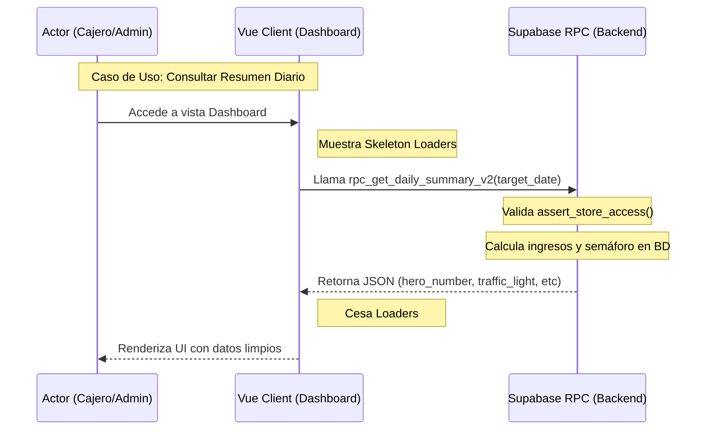

# SDD-008: Resumen Diario Inteligente (Reportes)

## § Cabecera

- **FRDs de origen:** [FRD-008](../FRD/FRD_008_REPORTES.md)
- **Fase del Plan:** Fase 6 (Operaciones y Soporte)
- **Estado:** 🟡 Validado PAC-N (Auto-Auditado)
- **Políticas Aplicables:** 
  - **SPEC-011:** Formateo de moneda (todo se muestra como entero).
  - **QA_008_REPORTES.md:** Restricción Mandatoria de Frontend Tonto (cero cálculos matemáticos en la UI, todo lo resuelve el motor SQL).
  - **ARQ-002:** Seguridad centralizada (`assert_store_access`).

## § Glosario Local

- **Número Héroe:** Indicador principal de la pantalla que muestra el total de ingresos por ventas puras (revenue) del día actual.
- **Semáforo de Rendimiento:** Indicador visual (Verde, Amarillo, Rojo) que compara el ingreso del día con promedios históricos.
- **Frontend Tonto:** Patrón arquitectónico donde el cliente Vue solo itera y renderiza las propiedades recibidas en el payload JSON, sin realizar sumas o cálculos de negocio (`reduce()`).

## § Diagrama de Secuencia

## § Especificación Detallada de Casos de Uso

### Caso A: Consultar el Estado del Negocio (Resumen Diario)
- **Precondiciones:** Usuario autenticado y activo en la tienda actual.
- **Reglas de Negocio Aplicables:** Frontend Tonto (Cálculos en BD), SPEC-011 (Formato numérico sin decimales).
- **Flujo Principal:**
  1. El usuario navega al Dashboard principal.
  2. El sistema (UI) solicita al backend los datos operativos diarios para la fecha de consulta (por defecto hoy).
  3. El backend verifica acceso, suma ingresos por método de pago y calcula desviaciones.
  4. El sistema presenta el Héroe, Desglose de Caja y alertas críticas.
- **Flujos Alternativos:** 
  - 3a. Si no hay datos históricos para promediar, el semáforo se omite o queda en estado neutral (gris).
- **Flujos de Excepción:**
  - 3b. Fallo de red: El sistema muestra un mensaje de error y un botón de reintento.
- **Postcondiciones (Éxito):** El usuario visualiza la liquidez del día y el estado de rendimiento sin saltos visuales (CLS=0).

### Caso B: Gestión de Reabastecimiento Crítico
- **Precondiciones:** Acceso al módulo de inventario / reportes logísticos.
- **Flujo Principal:**
  1. El sistema solicita al backend el reporte inteligente de suministro.
  2. El backend calcula días de inventario (DOI) basado en la velocidad de venta (últimos 30 días) y el stock actual.
  3. El sistema lista los productos categorizados (Crítico, Advertencia, OK) con sugerencias de compra en lenguaje natural.
- **Postcondiciones (Éxito):** La lista procesada se muestra para facilitar la decisión de compra al administrador.

### Caso C: Asignación Masiva de Proveedores
- **Precondiciones:** Usuario Administrador.
- **Flujo Principal:**
  1. Desde la tabla de reabastecimiento, el usuario selecciona múltiples productos huérfanos (sin proveedor).
  2. El sistema solicita el ID del proveedor objetivo.
  3. El usuario confirma.
  4. El backend asigna el proveedor masivamente a los productos indicados.
- **Flujos de Excepción:**
  - 4a. El proveedor o algún producto no pertenece a la tienda actual (Fallo de seguridad). La operación es abortada por el backend.

## § Contrato de Interfaz

### Operación: Obtener Resumen Diario (`rpc_get_daily_summary_v2`)
- **Entrada esperada:** 
  - `target_date` (Date, opcional, asume `CURRENT_DATE`).
- **Reglas de transformación / cálculo:**
  - El ingreso diario ("hero") es la suma de `amount_received` en `cash_movements` (tipo 'ingreso' asociado a ventas) O la agregación equivalente de ventas cerradas para ese día.
  - El desglose agrupa las ventas según `payment_method`.
  - El semáforo compara el ingreso actual vs el promedio de los 30 días anteriores del mismo día de la semana.
- **Salida esperada (JSON):**
  - Éxito: `{ hero_number: 150000, traffic_light: { status: "green", message: "..." }, money_breakdown: { cash: 80000, transfer: 50000, fiado: 20000 }, alerts: [...] }`
  - Fallo: Formato estándar de error de Supabase/PostgREST.

### Operación: Obtener Suministro Inteligente (`rpc_get_smart_supply`)
- **Entrada esperada:** Ninguna explícita (usa `auth.uid()`).
- **Salida esperada:** Arreglo de objetos (Tabla SQL virtual).
  - Éxito: `[{ product_id, current_stock, velocity, doi, status, suggestion }]`

### Operación: Asignación Masiva de Proveedores (`rpc_mass_assign_supplier`)
- **Entrada esperada:** `supplier_id` (UUID), `product_ids` (Arreglo de UUIDs).
- **Reglas de cálculo:** Validación estricta de pertenencia de cada UUID (proveedor y productos) al `store_id` del token invocador.
- **Salida esperada:**
  - Éxito: `{ success: true, updated_count: integer }`
  - Errores (Catálogo): `NOT_FOUND` (Algún ID no existe o no pertenece a la tienda).

## § Análisis de Seguridad

- **Control de Acceso:** 
  - Las consultas operativas (Resumen, Suministro) pueden ser ejecutadas por Empleados y Administradores.
  - La operación de Asignación Masiva (`rpc_mass_assign_supplier`) requiere estrictamente que el rol de `auth.uid()` exista en `admin_profiles` para la tienda.
  - Toda función DEBE invocar `assert_store_access(v_store_id)` o basarse en RLS.
- **Protección de Datos:**
  - Los reportes cruzan datos de ventas e inventario, por lo tanto, el tenant isolation (por `store_id`) es crítico para evitar filtraciones de ingresos a tiendas vecinas.
- **Superficie de Amenazas:**
  - *Vector:* Parámetros de fecha abusivos buscando forzar escaneos masivos en BD (Denial of Service).
  - *Mitigación:* Se limitará la ventana temporal del cálculo a una fecha puntual para el reporte diario, e índices adecuados (`created_at`, `store_id`) prevendrán escaneos completos de tabla.
  - *Vector:* Asignación masiva (Caso C) inyectando IDs de productos de otra tienda (Inseguridad de Referencia Directa a Objetos - IDOR).
  - *Mitigación:* La función debe validar que `COUNT(*)` de los productos pasados y cruzados con `store_id = current_store` coincide con el tamaño del array de entrada.
- **Trazabilidad de Auditoría:**
  - No aplica inmutabilidad para endpoints de lectura (Casos A y B). Para el Caso C (Asignación Masiva), se asume que las actualizaciones disparan el trigger `update_updated_at_column`. No se requiere log forense para cambio de proveedor por no ser transaccional/financiero.

## § Modelo de Datos Lógico

*(No se introducen tablas físicas nuevas en este módulo. Se consumen `sales`, `cash_movements`, `products`, y `inventory_batches` mediante Vistas o RPCs).*
