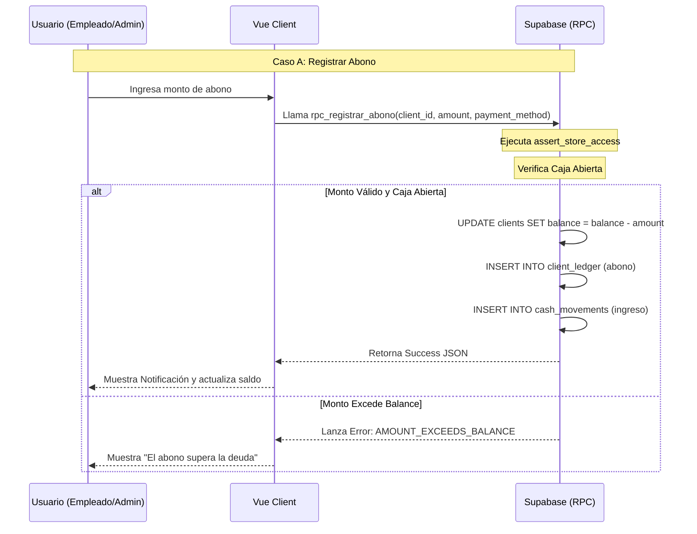
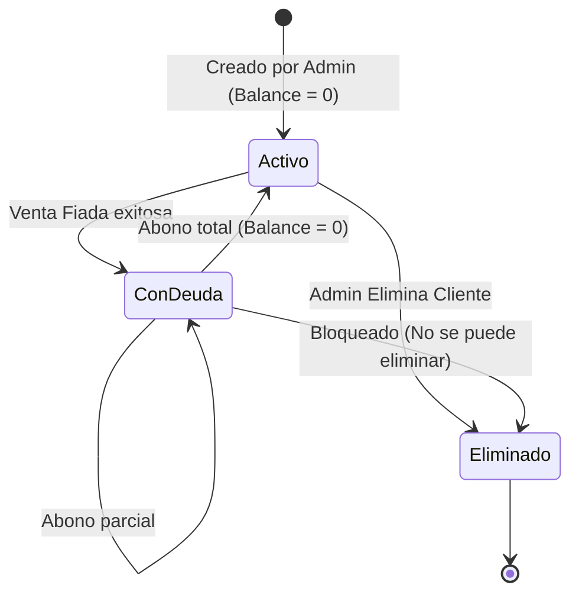

# SDD-009: Gestión de Clientes y Cartera

## § Cabecera

- **FRDs de origen:** [FRD-009](../FRD/FRD_009_CLIENTES.md)
- **Fase del Plan:** Fase 6 (Operaciones y Soporte)
- **Estado:** 🟡 Validado PAC-N (Auto-Auditado)
- **Políticas Aplicables:** 
  - **ARQ-002 (Regla #4):** Reutilización Obligatoria de Funciones de Seguridad Centralizadas (uso estricto de `assert_store_access`).
  - **SPEC-011:** Formato de moneda sin decimales.
  - **Política de Borrado Lógico:** No se permiten eliminaciones físicas para preservar integridad histórica y auditoría fiscal.

## § Glosario Local

- **Balance:** El saldo actual de deuda que tiene el cliente con la tienda. Un valor > 0 significa que debe dinero. NUNCA puede ser negativo.
- **Cupo de Crédito:** El límite máximo de deuda (balance) que se le permite tener al cliente en un momento dado.
- **Borrado Lógico (Soft Delete):** Mecanismo donde un cliente se oculta en la interfaz estableciendo la bandera `is_deleted = true`, manteniendo los registros asociados intactos en base de datos.

## § Diagrama de Secuencia



## § Diagrama de Estados



## § Especificación Detallada de Casos de Uso

### Caso A: Registrar Abono
- **Precondiciones:** El cliente debe tener `balance > 0`. Debe existir una sesión de caja abierta (`status = 'open'`).
- **Reglas de Negocio Aplicables:** El balance no puede quedar < 0.
- **Flujo Principal:**
  1. El Empleado ingresa un monto.
  2. El sistema (UI) invoca `rpc_registrar_abono`.
  3. El backend verifica acceso, verifica caja abierta y valida monto.
  4. El backend deduce el monto del `balance`, registra en `client_ledger` y registra un `ingreso` en caja.
- **Flujos Alternativos:** Ninguno.
- **Flujos de Excepción:**
  - 3a. El monto es mayor que el balance: El sistema rechaza con `AMOUNT_EXCEEDS_BALANCE`.
  - 3b. No hay caja abierta: El sistema rechaza con `NO_OPEN_CASH_SESSION`.
- **Postcondiciones (Éxito):** La deuda del cliente disminuye y la caja refleja la inyección de liquidez.

### Caso B: Venta Fiado Bloqueada por Cupo
- **Precondiciones:** El usuario está en el flujo de POS e intenta cerrar venta con método 'fiado'.
- **Reglas de Negocio Aplicables:** `Total venta ≤ (Cupo - Balance)`.
- **Flujo Principal:**
  1. El sistema POS llama a `rpc_procesar_venta_v3` (ver SDD-007).
  2. El backend intercepta el método 'fiado' y calcula el disponible.
  3. Al excederse, lanza excepción.
- **Postcondiciones (Fallo Esperado):** La venta es bloqueada de forma segura (`CREDIT_LIMIT_EXCEEDED`).

### Caso C: Eliminar Cliente (Bloqueado por Deuda)
- **Precondiciones:** Usuario Administrador.
- **Reglas de Negocio Aplicables:** `balance == 0`. Soft Delete.
- **Flujo Principal:**
  1. El Admin solicita eliminar al cliente en la UI.
  2. Dado que `balance > 0`, la UI bloquea el botón nativamente (`disabled`).
- **Flujos de Excepción:**
  - 2a. Si el Admin evade el frontend y llama directamente a la API, el backend valida y lanza `CLIENT_HAS_DEBT`.

### Caso D: Crear Nuevo Cliente
- **Precondiciones:** Usuario Administrador.
- **Flujo Principal:**
  1. El Admin envía datos del cliente a la BD (nombre, teléfono, cédula, cupo de crédito opcional).
  2. El backend inserta en `clients` con `balance = 0`.
  3. Si no se especifica `credit_limit`, el backend hereda automáticamente el cupo global configurado para la tienda (`store_settings.default_credit_limit`).
- **Postcondiciones:** Cliente nuevo en estado 'Activo'.

### Caso E: Búsqueda Rápida de Clientes (POS / Módulo Clientes)
- **Precondiciones:** Usuario autenticado.
- **Flujo Principal:**
  1. El usuario ingresa un término de búsqueda (nombre o teléfono) en la UI de cobro o de clientes.
  2. La UI invoca `rpc_buscar_clientes(p_query)`.
  3. El backend realiza una búsqueda insensible a mayúsculas/minúsculas por coincidencia parcial (`ILIKE`) sobre los campos `name` y `phone`.
  4. Retorna el listado de clientes activos (`is_deleted = false`) que coinciden con el término.
- **Postcondiciones:** Resultados mostrados para selección inmediata.

## § Contrato de Interfaz

### Operación: Registrar Abono (`rpc_registrar_abono`)
- **Entrada esperada:** 
  - `p_client_id` (UUID, requerido)
  - `p_amount` (Numeric, requerido, > 0)
  - `p_payment_method` (Text, requerido)
- **Reglas de transformación / cálculo:**
  - Resta aritmética estricta sobre la tabla `clients` (`balance = balance - p_amount`).
  - Creación de eventos inmutables en dos libros mayores: `client_ledger` y `cash_movements`.
- **Salida esperada (JSON):**
  - Éxito: `{ "success": true }`
  - Catálogo de Errores: `INVALID_AMOUNT`, `CLIENT_NOT_FOUND`, `AMOUNT_EXCEEDS_BALANCE`, `NO_OPEN_CASH_SESSION`.

### Operación: Buscar Clientes (`rpc_buscar_clientes`)
- **Entrada esperada:** `p_query` (Text, requerido, min 2 caracteres).
- **Reglas de transformación:**
  - `PERFORM assert_store_access(get_current_store_id())`.
  - `SELECT * FROM clients WHERE store_id = current_store AND is_deleted = false AND (name ILIKE '%' || p_query || '%' OR phone ILIKE '%' || p_query || '%')`.
- **Salida esperada (JSON):**
  - Arreglo de objetos cliente conteniendo `id`, `name`, `phone`, `id_number`, `balance`, `credit_limit`.

### Operación: Eliminar Lógicamente Cliente (`rpc_soft_delete_client`)
- **Entrada esperada:** `p_client_id` (UUID).
- **Reglas de transformación:**
  - Update a la tabla `clients`: `is_deleted = true`, `deleted_at = NOW()`.
- **Salida esperada (JSON):**
  - Catálogo de Errores: `CLIENT_HAS_DEBT` (si balance > 0).

## § Análisis de Seguridad

- **Control de Acceso:** 
  - Las operaciones de mutación exigen `PERFORM assert_store_access(v_client.store_id);`. Queda erradicada la validación manual de tienda (IDOR Check manual) de versiones previas.
  - La creación y eliminación exigen que el usuario esté en la tabla `admin_profiles` para la tienda (RLS).
- **Protección de Datos:**
  - El Soft Delete previene la eliminación accidental o maliciosa de información financiera ligada a transacciones y facturas históricas.
- **Superficie de Amenazas:**
  - *Vector:* Múltiples peticiones simultáneas de abono intentando saltar la regla de balance negativo (Race Condition).
  - *Mitigación:* Se añade a nivel BD un `CHECK (balance >= 0)`. Las operaciones de actualización en el RPC adquieren un bloqueo de fila de manera transaccional.
- **Trazabilidad de Auditoría:**
  - Toda mutación de saldo (arriba o abajo) genera de manera atómica un registro en la tabla en modo solo adición (append-only) `client_ledger`. Nunca se sobreescribe historia financiera.

## § Modelo de Datos Lógico

### Diagrama Entidad-Relación

```mermaid
erDiagram
    CLIENTS ||--o{ CLIENT_LEDGER : registra
    CLIENT_LEDGER }o--|| CASH_MOVEMENTS : impacta (opcional)
    
    CLIENTS {
        uuid id PK
        uuid store_id FK
        text name
        text phone "Teléfono de contacto"
        text id_number "Cédula"
        numeric credit_limit "Cupo de crédito (hereda global si es nulo)"
        numeric balance "Deuda actual, >= 0"
        boolean is_deleted "Soft delete flag"
    }
    
    CLIENT_LEDGER {
        uuid id PK
        uuid client_id FK
        numeric amount "Positivo(deuda)/Negativo(abono)"
        text transaction_type "Ej: 'abono', 'venta_fiado'"
        uuid reference_id "Referencia a venta origen si aplica"
    }
```

### Diccionario de Datos

| Atributo | Entidad | Tipo Lógico | Restricciones | Descripción |
|---|---|---|---|---|
| `balance` | `clients` | Monetario Entero | `>= 0` | Deuda total acumulada viva del cliente. |
| `phone` | `clients` | Alfanumérico | Opcional | Número de teléfono de contacto para búsquedas. |
| `id_number` | `clients` | Alfanumérico | UNIQUE (por tienda) | Identificación oficial del cliente. |
| `credit_limit` | `clients` | Monetario Entero | `>= 0` | Límite máximo de deuda. Si es NULO al crear, hereda el valor global de la tienda. |
| `transaction_type` | `client_ledger` | Enumeración | `venta_fiado`, `abono`, `anulacion_fiado` | Naturaleza inmutable de la alteración de saldo. |
