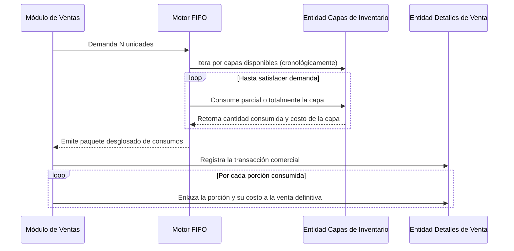
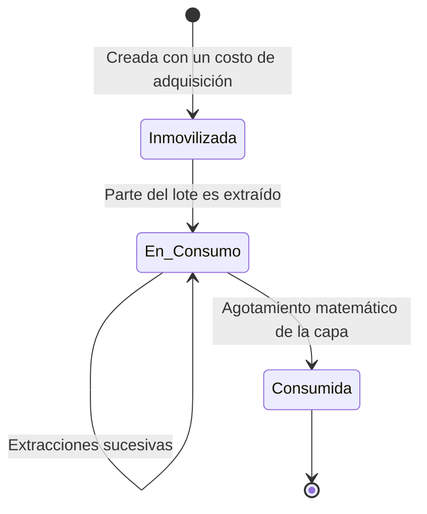

# SDD-010-016: Motor Contable de Valoración FIFO

> **Asociado a:** [FRD-010](../FRD/FRD_010_HISTORIAL_PRECIOS.md) y Reglas FIFO  
> **Fase del Plan:** Fase 0 (Contratos Transversales)  
> **Estado:** 🟢 Auditado y Corregido (QA Manual)  
> **Última Actualización:** 2026-08-05

---

## § 0. Contexto y Restricciones Aplicables (PEA-N)

### 0.1 Políticas Globales Activadas
| Política | Impacto Específico en este SDD |
|----------|-------------------------------|
| **Auditoría Inviolable (POL-AUD-01)** | La alteración del precio en el catálogo de productos NO DEBE alterar retroactivamente los márgenes de las ventas cerradas. El costo queda sellado. |
| **Conservación Numérica (SPEC-011)** | Los cálculos matemáticos para deducir ganancias no pueden sufrir pérdida de precisión al multiplicarse. |

---

## § 1. Glosario Local

* **Valoración FIFO:** Estrategia contable de Primero en Entrar, Primero en Salir. Garantiza que el costo reportado provenga exactamente de la capa de inventario consumida.
* **Capa Congelada (Lote):** Representación del stock entrante con un costo de adquisición adherido y permanente.
* **COGS (Cost of Goods Sold):** Costo exacto de la mercancía vendida, extraído al sumar el valor de todas las capas consumidas por una venta.

---

## § 2. Diagrama de Secuencia

### Caso de Uso: Despiece y Enlace del Costo a la Venta

---

## § 3. Diagrama de Estados

### Ciclo de Vida de la Capa de Costo

---

## § 4. Especificación Detallada de Casos de Uso

### Caso A: Inyección de Capa Valorizada
- **Precondiciones:** Proceso de ingreso logístico.
- **Flujo Principal:**
  1. El controlador externo notifica el ingreso de X unidades y el costo acordado.
  2. El servidor registra la entidad de Capa (Lote).
  3. El costo adherido se vuelve inmutable, incluso si los administradores cambian los valores nominales en el futuro.
- **Postcondiciones:** El activo se inmoviliza y es detectable para el motor FIFO.

### Caso B: Auditoría Continua de Precios
- **Precondiciones:** Un administrador actualiza el precio de compra o venta de un producto en el catálogo matriz.
- **Flujo Principal:**
  1. El administrador envía las mutaciones.
  2. El servidor procesa la actualización nominal.
  3. De forma automática y silenciosa, el servidor captura la discrepancia insertando un registro en el historial de precios, marcando quién y cuándo realizó la alteración.
- **Postcondiciones:** Modificación aplicada sin impacto en el histórico financiero.

### Caso C: Despiece Contable por Venta
- **Precondiciones:** El flujo comercial inicia y requiere liquidar inventario.
- **Flujo Principal:**
  1. El orquestador solicita una cantidad.
  2. El servidor aplica exclusión concurrente a las capas activas.
  3. Extrae la cantidad demandada de la capa más antigua.
  4. Si la capa no suple la demanda, la agota y continúa con la siguiente capa.
  5. Retorna al orquestador una colección con los consumos parciales.
- **Postcondiciones:** La venta queda costeada fraccionalmente de acuerdo a la historia de adquisiciones.

---

## § 5. Contrato de Interfaz

### Operación: Interrogatorio FIFO
- **Entrada esperada:** 
  - Identificador lógico del producto.
  - Cantidad demandada (Estrictamente > 0).
- **Reglas de transformación / cálculo:**
  - El motor ES CIEGO respecto a los movimientos de salida y a la venta misma. Su único propósito es desgarrar las capas lógicas y reportar la cuenta matemática exacta de los costos involucrados en ese volumen extraído.
  - Todo controlador que invoque este motor ASUME la obligación de asentar la vinculación entre la venta realizada y las capas reportadas, garantizando el COGS.
- **Salida esperada:** Un paquete que describe porciones consumidas vinculadas a la capa de origen y su valor unitario original.

---

## § 6. Análisis de Seguridad

- **Control de Acceso:** La mutación del catálogo maestro restringe la alteración nominal a perfiles administrativos autorizados, protegiendo las reglas de margen futuro.
- **Protección de Datos:** Para prevenir la ingeniería inversa de márgenes, el servidor jamás revelará al operario de caja el costo real de los bienes que despacha. Este proceso ocurre de forma invisible en la profundidad de la arquitectura.
- **Superficie de Amenazas:** 
  - *Amenaza:* Destrucción del balance de rentabilidad histórico debido a alteraciones del catálogo nominal.
  - *Mitigación:* Se proscribe terminantemente la lectura del precio del catálogo nominal para liquidar el margen de una transacción comercial. La única fuente de verdad contable admitida reside en las capas inmovilizadas.

---

## § 7. Modelo de Datos Lógico

- **Historial Contable Nominal:** Bitácora independiente que registra transiciones pasadas del valor base de un producto (quién lo cambió, valor anterior, valor nuevo).
- **Capas de Costo (Lotes):** Representan inyecciones físicas reales en instantes temporales y cargan consigo su propia dimensión económica irreemplazable.
- **Lazos de Consumo (Detalle Puente):** Entidad relacional que une una venta despachada con la porción exacta de la Capa de Costo consumida, consolidando la trazabilidad absoluta del Costo de Venta.
