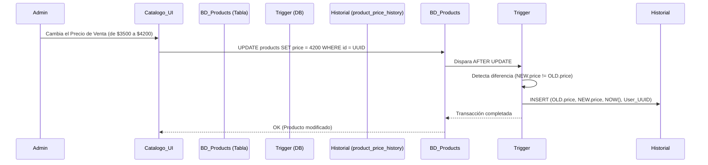

# SDD-010: Historial de Precios

> **Asociado a:** [FRD-010](../FRD/FRD_010_HISTORIAL_PRECIOS.md)  
> **Fase del Plan:** Fase 4 (Inventario Detallado)  
> **Estado:** 🟢 Consolidado  
> **Última Actualización:** 2026-08-04

---

## 0. Contexto y Restricciones Aplicables (PEA-N)

### 0.1 Políticas Globales Activadas (ARQ-002)
| Política | Dominio | Impacto Específico en este SDD |
|----------|---------|-------------------------------|
| **POL-SEC-01** | Seguridad/Auditoría | Inmutabilidad de Logs. Los registros creados en el historial de precios NO pueden ser alterados (UPDATE) ni borrados (DELETE). Son evidencia de auditoría estricta. |
| **SPEC-011** | UX/Formatos | Los precios base y nuevo deben servirse como valores numéricos precisos, pero el Frontend debe presentarlos como números enteros (sin decimales visuales). |

### 0.2 Contratos Vecinos que Limitan el Diseño (Consulta RVC)
| SDD Vecino / Entidad | Restricción que impone al diseño de este SDD |
|----------------------|----------------------------------------------|
| **SDD_010_016 (FIFO)** | El verdadero "Costo de Ventas" de un producto (COGS) reside en `inventory_batches`. El registro en este historial rastrea únicamente los cambios en la **tarifa nominal o sugerida** (precio de compra referencial y precio de venta de catálogo). No afecta el balance de costos. |

---

## 1. Glosario Local
* **Precio Nominal (Catálogo):** Valor visual (`purchase_price` o `price`) que figura en la ficha del producto y que alimenta por defecto al POS y al Kardex en la siguiente transacción.
* **Costo Real (FIFO):** Valor inmutable incrustado en `inventory_batches` por cada entrada logística, totalmente ajeno a este historial.

---

## 2. Diagrama de Secuencia (UML - Mermaid)

### Caso de Uso: Autogeneración Inmutable de Log

---

## 3. Diagrama de Estados
*Esta entidad no tiene un ciclo de vida. Los registros nacen en estado `inmutable` (Solo Lectura) y permanecen en él perpetuamente.*

---

## 4. Especificación Detallada de Casos de Uso

### 4.1 Registro Automático del Cambio de Precio
- **Precondiciones:** El actor debe estar autenticado con permiso para editar productos (`canManageInventory`). Debe existir un cambio real en el monto numérico del `price` o `purchase_price`.
- **Reglas de Negocio Aplicables:** Regla 1 (Registro Automático), Regla 5 (Inmutabilidad).
- **Flujo Principal:**
  1. El actor emite un UPDATE sobre la tabla `products`.
  2. La base de datos intercepta el UPDATE mediante un trigger de bajo nivel.
  3. El trigger verifica si hubo una mutación real en las columnas financieras.
  4. El trigger extrae el ID del usuario del contexto (JWT de Supabase).
  5. El sistema inyecta un nuevo registro en `product_price_history`.
- **Flujos Alternativos:**
  - *Actualización sin cambio de precio:* Si el UPDATE modifica el "nombre" pero no el "precio", el trigger aborta la inserción del log silenciosamente.
- **Flujos de Excepción:**
  - *Pérdida de Contexto JWT:* Si el `auth.uid()` no está presente en la transacción, la base de datos aborta el UPDATE del producto por completo (Protección de Auditoría Inviolable).
- **Postcondiciones (Éxito):** El historial refleja el evento con milisegundos de precisión.

### 4.2 Visualización Restringida del Historial
- **Precondiciones:** El usuario tiene permiso explícito de lectura de inventario (`canViewInventory`).
- **Reglas de Negocio Aplicables:** Regla 3 (Control de Acceso).
- **Flujo Principal:**
  1. El usuario accede a la ficha del producto.
  2. El frontend invoca la vista o consulta la tabla `product_price_history`.
  3. El sistema valida la política RLS.
  4. El sistema retorna la cadena cronológica descendente de cambios.
- **Flujos de Excepción:**
  - *Acceso Denegado:* Si un cajero raso (sin `canViewInventory`) inspecciona la red o fuerza el UI, RLS devuelve 0 registros.

---

## 5. Contrato de Interfaz

### 5.1 Interfaz de Escritura (Trigger DB)
- **Operación Lógica:** La captura ocurre a nivel base de datos (`AFTER UPDATE` en `products`), no requiere RPC. El contrato se honra forzando a que cualquier endpoint que haga `UPDATE` a `products` exponga el token JWT.

### 5.2 Interfaz de Lectura (Endpoint REST)
- **Operación:** Lectura Directa sobre `product_price_history`.
- **Entrada Esperada:** `product_id` (UUID).
- **Reglas de Transformación:** 
  - Orden cronológico inverso (`ORDER BY changed_at DESC`).
- **Salida Esperada:**
  - Arreglo de objetos (precio viejo, precio nuevo, fecha, usuario responsable, justificación opcional).

---

## 6. Análisis de Seguridad

- **Control de Acceso:** RLS `SELECT` restringido a perfiles con `canViewInventory = true`. RLS `INSERT` restringido estrictamente al rol `service_role` o al trigger interno; ningún cliente puede hacer un `POST` directo a esta tabla. RLS `UPDATE/DELETE` bloqueado universalmente (incluso para admins).
- **Protección de Datos:** La evolución de precios revela la estrategia comercial y el margen nominal del negocio. Debe estar segregado de los operadores de caja.
- **Superficie de Amenazas:**
  - *Amenaza:* Manipulación directa de API. Un administrador intenta alterar el registro histórico para ocultar un alza de precios que benefició a su turno y afectó márgenes.
  - *Mitigación:* Privilegios de BD. Las reglas de RLS en Supabase no permiten `UPDATE` o `DELETE` bajo ninguna circunstancia, garantizando que el log es de adición exclusiva (Append-Only).
- **Trazabilidad de Auditoría:** Absoluta. Cada salto de precio está firmado por el `auth.uid()`.

---

## 7. Modelo de Datos Lógico

### 7.1 Diccionario de Datos: `product_price_history`

| Atributo | Tipo Lógico | Restricciones | Descripción |
|----------|-------------|---------------|-------------|
| `id` | UUID | Llave Primaria. | Identificador único del evento. |
| `product_id` | UUID | FK `products(id)`. | Anclaje referencial al catálogo. |
| `previous_price` | Numérico | Requerido. | Costo o Precio nominal original. |
| `new_price` | Numérico | Requerido. Diferente a previous_price. | Costo o Precio nominal actual. |
| `price_type` | Enum | `'venta'` o `'costo_referencial'`. | Indica cuál de las dos métricas fue mutada. |
| `changed_at` | Timestamp | Default `NOW()`. | Reloj interno del servidor, no falsificable. |
| `changed_by` | UUID | FK `profiles(id)`. | Identificador del empleado (recuperado de JWT). |
| `reason` | Texto | Opcional (Máx 200). | Justificación administrativa. |
