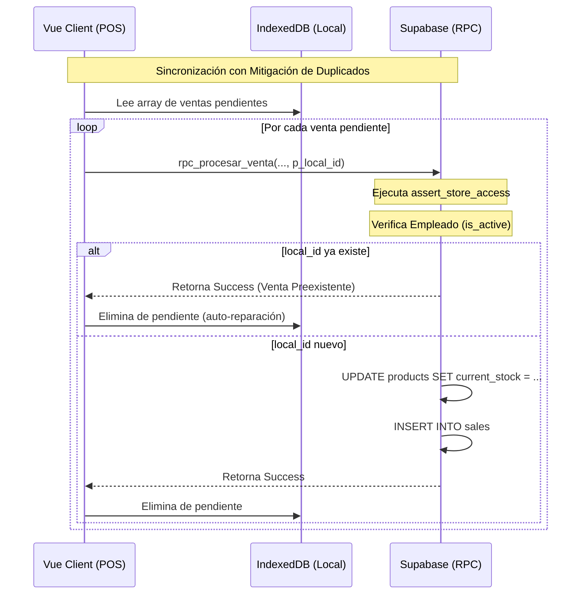
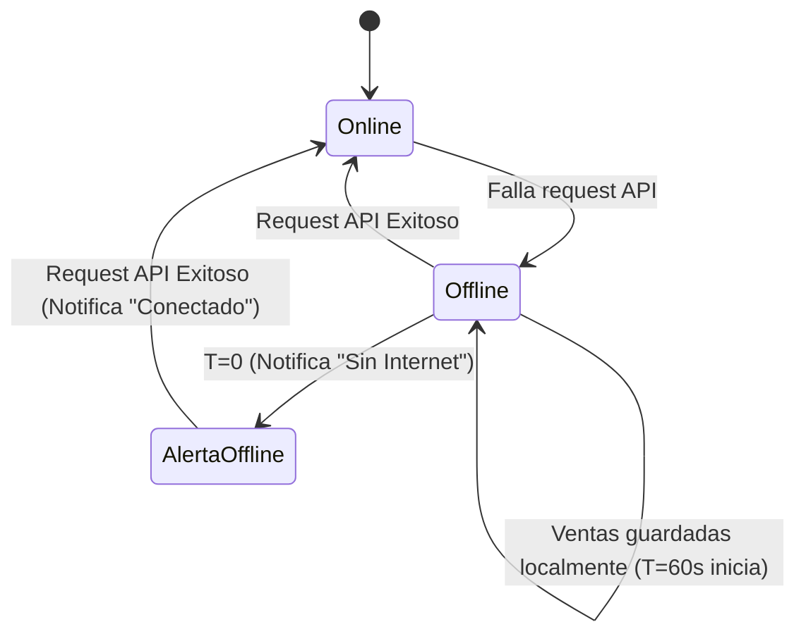

# SDD-011: Manejo de Errores y Resiliencia

## § Cabecera

- **FRDs de origen:** [FRD-011](../FRD/FRD_011_MANEJO_ERRORES.md)
- **Fase del Plan:** Fase 6 (Operaciones y Soporte)
- **Estado:** 🟡 Validado PAC-N (Auto-Auditado)
- **Políticas Aplicables:** 
  - **ARQ-002:** Reutilización Obligatoria de Funciones de Seguridad Centralizadas (uso estricto de `assert_store_access`).

## § 0. Contexto y Restricciones (Output del PAC)

- **Brechas de Nomenclatura (Bloque 2):** Ninguna. Las tablas requeridas `sales`, `employees` y `products` contienen las columnas operativas necesarias (`local_id`, `is_active`, `current_stock`).
- **Seguridad Centralizada (Bloque 3):** Es mandatorio el uso de `public.assert_store_access(p_store_id)` en la validación de cualquier operación de sincronización que actúe sobre la base de datos.
- **Impacto Cruzado (Bloque 4):** Se detectó que la firma actual `rpc_procesar_venta_v2` debe evolucionar (a `v3` o modificarse) para aceptar `local_id`. Esto inyecta un cambio obligatorio en el frontend del módulo de ventas, que deberá generar UUIDs locales.
- **Contratos Vecinos (Bloque 5):** Este es un módulo transversal; los contratos se integrarán como capas sobre los RPCs existentes sin violar sus reglas base.

## § Glosario Local

- **Identificador Único Local (`local_id`):** UUID generado criptográficamente por el cliente (Frontend) en el momento de crear el carrito, usado para garantizar idempotencia en la comunicación con el servidor.
- **Modo Offline:** Estado de contingencia donde las ventas se persisten en almacenamiento local (ej. IndexedDB) esperando a que la red sea restablecida (Caso A y B).

## § Diagrama de Secuencia

## § Diagrama de Estados

## § Especificación Detallada de Casos de Uso

### Caso A: Venta sin Conexión
- **Precondiciones:** Caja abierta, carrito con productos.
- **Reglas de Negocio:** RN-011-02 (Offline Automático).
- **Flujo Principal:**
  1. Vendedor confirma venta.
  2. Sistema intenta petición al servidor y falla (Timeout / Network Error).
  3. Sistema guarda la venta localmente incluyendo su `local_id`.
  4. Sistema activa temporizador de 60 segundos silenciosamente.
  5. Vencido el tiempo, muestra: "Estás trabajando sin internet".
- **Postcondiciones:** Venta almacenada de forma segura a nivel cliente.

### Caso B: Conexión Restablecida
- **Precondiciones:** Modo offline activo, notificación ya mostrada.
- **Reglas de Negocio:** RN-011-02.
- **Flujo Principal:**
  1. Un request en background (ping) responde exitosamente.
  2. Sistema notifica: "Conexión restablecida".
  3. Sistema itera las ventas locales y las envía al backend una por una.
  4. Sistema muestra: "X ventas sincronizadas".

### Caso C: Stock Agotado al Pagar
- **Precondiciones:** Carrito con productos.
- **Reglas de Negocio:** RN-011-04.
- **Flujo Principal:**
  1. Vendedor confirma venta.
  2. Backend detecta cantidad solicitada > `current_stock`.
  3. Backend aborta transacción y retorna código específico con el stock físico real.
  4. UI intercepta error, muestra: "Stock insuficiente de [Producto]. Disponible: [X]".
  5. UI ofrece ajustar el carrito al valor disponible.

### Caso D: Cuenta Desactivada Durante Operación
- **Precondiciones:** Empleado logueado.
- **Reglas de Negocio:** RN-011-05.
- **Flujo Principal:**
  1. Empleado ejecuta acción.
  2. Backend verifica `is_active = false` en `employees`.
  3. Backend lanza `ACCOUNT_DISABLED`.
  4. Interceptor UI global atrapa el error.
  5. UI cierra sesión local (destruye token y store) y redirige al Login.

## § Contrato de Interfaz

### Operación: Sincronización y Procesamiento de Venta (Actualización `rpc_procesar_venta`)
- **Entrada esperada:** 
  - Además de los parámetros base de la V2, requiere obligatoriamente `p_local_id` (Text).
- **Reglas de transformación / cálculo:**
  - **Idempotencia:** `IF EXISTS (SELECT 1 FROM sales WHERE local_id = p_local_id) THEN RETURN jsonb_build_object('success', true); END IF;`
  - **Validación Stock:** Capturar discrepancias aritméticas de inventario.
- **Salida esperada:**
  - Éxito: `{ "success": true, "sale_id": UUID }`
  - Error (Stock): `{ "error": "INSUFFICIENT_STOCK", "product_id": UUID, "available": Numeric }`
  - Error (Acceso): `{ "error": "ACCOUNT_DISABLED" }`

## § Análisis de Seguridad

- **Control de Acceso:** Absolutamente toda invocación a la sincronización debe validar el contexto del tenant mediante `assert_store_access(v_store_id)`. Se valida en BD la bandera lógica `is_active` del empleado invocador en cada petición de escritura.
- **Protección de Datos:** Las ventas offline almacenadas en IndexedDB pueden ser eliminadas (purga) si la reparación de datos locales falla (RN-011-06), primando la estabilidad del módulo sobre los datos corruptos irrecuperables.
- **Superficie de Amenazas:** 
  - *Vector:* Inyección repetida de la misma venta (Replay Attack).
  - *Mitigación:* El índice único o validación sobre `local_id` (`sales.local_id`) previene duplicación financiera.
- **Trazabilidad de Auditoría:** Si una cuenta fue desactivada, cualquier intento de escritura dejará registro en los logs de NGINX/Supabase con respuesta de error 403 o error manejado, pero no ensuciará la tabla de ventas real.

## § Modelo de Datos Lógico

*(Este módulo reutiliza entidades verificadas durante el PAC)*

| Atributo | Entidad | Restricciones Aplicables en Módulo | Descripción |
|---|---|---|---|
| `local_id` | `sales` | UNIQUE (junto con store_id) | Garantiza la idempotencia de sincronización offline. |
| `is_active` | `employees` | BOOLEAN | Disparador primario del Caso D (Cierre de sesión forzado). |
| `current_stock` | `products` | `>= 0` (Postgres CHECK) | Disparador primario del Caso C (Fallo de inventario físico). |
