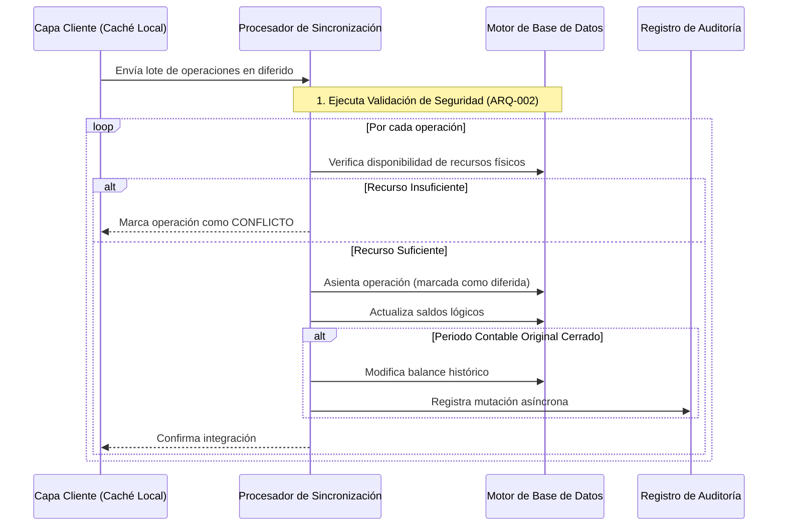

# SDD-012: Sincronización y Resolución de Conflictos Offline

## § Cabecera

- **FRDs de origen:** [FRD-012](../FRD/FRD_012_SINCRONIZACION_OFFLINE.md)
- **Fase del Plan:** Fase 7 (Resiliencia y Sincronización)
- **Estado:** 🟢 Validado
- **Políticas Aplicables:** 
  - **ARQ-002:** Reutilización obligatoria de seguridad centralizada.

## § Glosario Local

- **Cola de Resolución:** Estado transitorio lógico donde residen operaciones bloqueadas a la espera de un dictamen humano.
- **Sincronización Asíncrona:** Proceso de ingesta donde el servidor recibe un lote de operaciones ejecutadas temporalmente en el pasado.

## § Diagrama de Secuencia

## § Especificación Detallada de Casos de Uso

### Caso 1: Ingesta de Operación Diferida (Sin Conflictos)
- **Precondiciones:** La capa cliente posee registros asíncronos y recupera la conexión.
- **Reglas de Negocio Aplicables:** Validación estricta de saldos.
- **Flujo Principal:**
  1. El cliente transmite el lote de operaciones pendientes.
  2. El servidor valida la autoridad del solicitante.
  3. El servidor bloquea lógicamente los recursos (ej. inventario) para evitar condiciones de carrera.
  4. Al detectar suficiencia, el servidor asienta la operación con su fecha original y registra la fecha de integración.
  5. El servidor confirma la transacción.
- **Postcondiciones (Éxito):** La operación queda integrada en la contabilidad central.

### Caso 2: Conflicto de Recursos (Déficit)
- **Precondiciones:** Una operación diferida exige más recursos físicos (inventario) de los que posee el servidor actualmente.
- **Flujo Principal:**
  1. El servidor detecta el déficit durante el bloqueo de recursos.
  2. El servidor rechaza individualmente la operación infractora, integrando el resto del lote.
  3. El cliente traslada la operación a la Cola de Resolución.
- **Postcondiciones:** La operación queda suspendida localmente.

### Caso 3: Sincronización sobre Periodo Contable Cerrado
- **Precondiciones:** La operación asíncrona pertenece a un turno de caja que ya fue arqueado y cerrado.
- **Flujo Principal:**
  1. El servidor asienta la operación exitosamente.
  2. El servidor detecta que el periodo contable asociado está cerrado.
  3. El servidor muta los saldos consolidados de dicho periodo histórico.
  4. El servidor inyecta obligatoriamente un registro en auditoría reportando la alteración asíncrona.

## § Contrato de Interfaz

### Operación: Sincronización Asíncrona
- **Entrada esperada:** 
  - Identificador lógico del tenant (Requerido).
  - Colección de objetos transaccionales diferidos.
- **Reglas de transformación / cálculo:**
  - Los parámetros estructurales nuevos (indicador de diferido, fecha de integración, tipo de conflicto) DEBEN definirse como opcionales en el motor principal para no romper la compatibilidad con las operaciones en tiempo real.
  - NUNCA se admitirá un déficit físico automático.
- **Salida esperada:** Un arreglo de confirmaciones e identificadores de conflicto, permitiendo al cliente depurar su caché.

## § Análisis de Seguridad

- **Control de Acceso:** La operación invoca la validación centralizada inamoviblemente.
- **Protección de Datos:** Las operaciones diferidas no pueden reescribir operaciones ya asentadas.
- **Superficie de Amenazas:** 
  - *Amenaza:* Condiciones de carrera por múltiples dispositivos sincronizando simultáneamente.
  - *Mitigación:* Se exige un identificador único generado por el cliente y el uso de bloqueos exclusivos a nivel de fila durante la validación de recursos.
- **Trazabilidad de Auditoría:** Si la operación muta un periodo ya cerrado, es mandatorio asentar la acción en el registro inmutable para advertir a los administradores.

## § Modelo de Datos Lógico

El contrato requiere extender las entidades transaccionales (sin especificar nombres físicos) con atributos que indiquen:
- Indicador booleano de operación diferida.
- Marca temporal de integración al servidor.
- Estado lógico de la sincronización.
- Identificador del actor que resolvió un conflicto, si aplica.

---

## §8. Límites Estrictos del Sistema Offline (FRD-012-01)

### 8.1 Exclusividad del POS (RN-OFF-01)
El modo offline es un mecanismo defensivo de emergencia acoplado **exclusivamente al flujo de ventas POS (`CREATE_SALE`)**.
- **PROHIBIDO:** Operaciones de inventario (mermas, consumos, devoluciones), gastos operativos o cierres de caja en modo offline.
- Cualquier intento de encolar transacciones distintas a ventas es destruido por la cola de sincronización.

### 8.2 Validación Local Preventiva y Límite de Cola (RN-OFF-02 / RN-OFF-03)
- El cliente valida stock local y cupo de crédito local ANTES de encolar una venta offline. Si el stock es insuficiente o el cupo del cliente se excede, la venta se bloquea en origen.
- Se impone un límite máximo de transacciones encoladas. Al alcanzarlo, el botón de cobrar se deshabilita hasta reconectar y drenar la cola.

---

## §9. Remediación y Cola de Letras Muertas - DLQ (FRD-012-R)

### 9.1 Inmutabilidad de Ventas Offline y Manejo de Fallos (RN-OFF-04)
Una venta realizada offline bajo las reglas locales de ese momento es un **hecho histórico inmutable** (*POL-AUD-01*).
- El servidor NO rechaza la sincronización de una venta por cambios de inventario ocurridos durante el apagón.
- Los fallos de sincronización se restringen a **fallos técnicos** (red, timeout, 500, *Schema Drift*).
- Tras 3 reintentos fallidos de red o al detectar incompatibilidad de esquema, la transacción se traslada a la **Cola de Letras Muertas (DLQ)**.

### 9.2 Intervención en DLQ
En la DLQ, el Administrador tiene acceso exclusivamente a las acciones de **Reintentar** o **Eliminar** (para pruebas o ventas fantasma comprobadas), asegurando la preservación del historial financiero legítimo.

