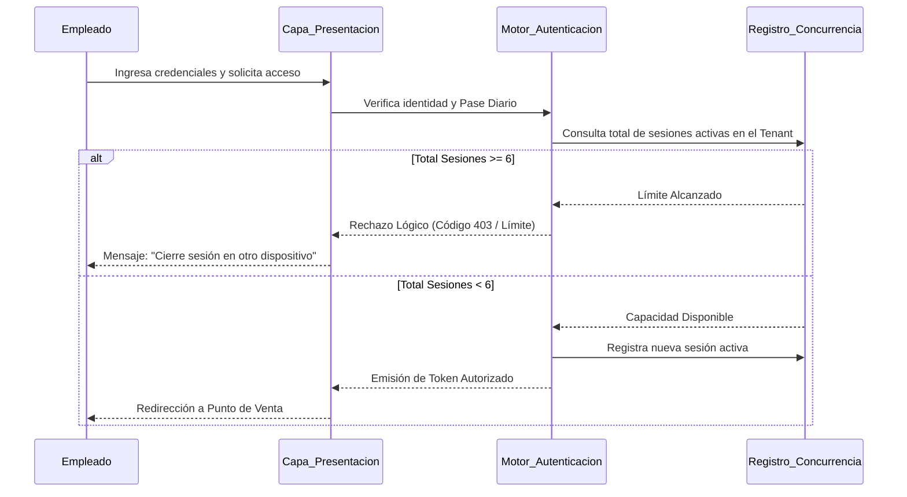
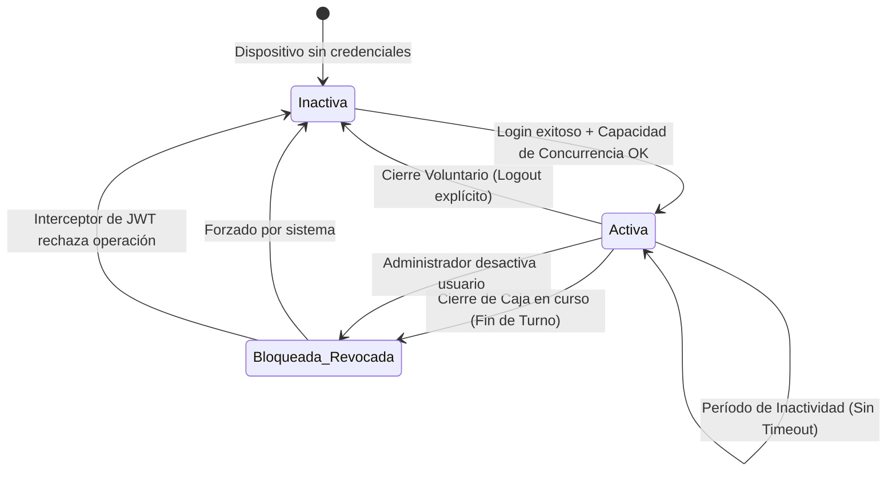

# SDD-013: Gestión de Sesiones

> **Asociado a:** [FRD-013](../FRD/FRD_013_GESTION_SESIONES.md)  
> **Fase del Plan:** Fase 5 (Seguridad y Sesiones)  
> **Estado:** 🟢 Consolidado (Auditoría PAC Ejecutada)  
> **Última Actualización:** 2026-08-05

---

## 0. Contexto y Restricciones Aplicables (PEA-N)

### 0.1 Políticas Globales Activadas
| Política | Impacto Específico en este SDD |
|----------|-------------------------------|
| **Persistencia de Caché** | El cierre de sesión voluntario exige preservar catálogos maestros (Inventario, Clientes) para optimizar el re-ingreso, purgando únicamente datos transaccionales (Carrito, Identidad). |
| **Control de Concurrencia** | Obligación lógica de limitar el uso a 6 terminales activas simultáneas por Tienda, imponiendo un cerrojo de estado compartido en el ecosistema. |

### 0.2 Resultados de Auditoría de Código (Brechas Identificadas)
Al auditar la infraestructura de identidades, se constató que la validación nativa del proveedor de autenticación carece de mecanismos para limitar sesiones simultáneas por entorno multi-inquilino (Tenant). El contrato lógico de este documento exige que dicha validación se construya como una capa interceptora antes de la emisión final del Pase Diario. Asimismo, se detectó que la revocación de un usuario debe forzarse activamente debido a la naturaleza autónoma de los tokens JWT emitidos.

---

## 1. Glosario Local
* **Sesión Autónoma:** Estado en el cual un dispositivo posee un token JWT válido y no requiere reconexión por inactividad.
* **Token Huérfano:** Credencial temporal que sigue viva en un navegador a pesar de que el usuario fue desactivado o el turno fue cerrado.

---

## 2. Diagrama de Secuencia (UML - Mermaid)

### Caso de Uso: Control de Concurrencia al Iniciar Sesión

---

## 3. Diagrama de Estados

### Ciclo de Vida de la Sesión de Empleado

---

## 4. Especificación Detallada de Casos de Uso

### 4.1 Cierre Voluntario de Sesión
- **Precondiciones:** Dispositivo con sesión activa autenticada.
- **Reglas de Negocio Aplicables:** Persistencia de Caché Maestro. Eliminación de Transacciones.
- **Flujo Principal:**
  1. El actor invoca la orden de cierre desde el menú principal.
  2. El sistema requiere confirmación explícita para evitar toques accidentales.
  3. Tras la confirmación, el sistema destruye el identificador de sesión local.
  4. El sistema destruye los datos de transacciones en curso (Carritos, Recibos pendientes).
  5. El sistema preserva íntegramente los datos maestros locales (Catálogo de Productos, Clientes).
  6. El sistema notifica al Registro de Concurrencia para liberar un cupo en el límite de 6 terminales.
  7. El dispositivo es redirigido a la pantalla de bienvenida.
- **Postcondiciones:** Dispositivo no autorizado. Datos pesados listos para próximo uso.

### 4.2 Desactivación Forzada en Tiempo Real
- **Precondiciones:** Un empleado mantiene una sesión activa operando en la caja. El Administrador, desde su panel, ordena la suspensión de la cuenta del empleado.
- **Reglas de Negocio Aplicables:** Revocación Cero Confianza.
- **Flujo Principal:**
  1. El Administrador revoca el acceso del empleado.
  2. El sistema marca la identidad del empleado como "Inactiva" a nivel de base de datos maestra.
  3. En la próxima milésima de segundo en que el dispositivo del empleado intente realizar una operación (ej. consultar un precio, guardar una venta), el interceptor central evalúa el estado.
  4. El interceptor central detecta la bandera "Inactiva", rechazando la operación.
  5. El dispositivo reacciona al rechazo destruyendo la sesión local inmediatamente e informando al empleado: "Cuenta desactivada por el administrador".
- **Postcondiciones:** Dispositivo bloqueado de manera reactiva. Imposibilidad de continuar el flujo de trabajo.

---

## 5. Contrato de Interfaz

### 5.1 Capa Backend: Operación `registrar_apertura_sesion_dispositivo`
- **Entrada esperada:** 
  - Identificador único del usuario solicitante.
  - Identificador único de la Tienda (Tenant).
  - Metadatos del dispositivo (opcional, para auditoría).
- **Reglas de transformación:** 
  - El sistema DEBE contar los registros activos de la Tienda actual.
  - Si el conteo es igual o superior a 6, se aborta la transacción incondicionalmente.
  - Si el conteo es menor a 6, se inserta la huella de la sesión activa vinculada al usuario.
- **Salida esperada:** 
  - **Éxito:** Conformidad de inserción, habilitando la entrega del JWT final.
  - **Fallo:** Error de regla de negocio (código indicando límite de concurrencia excedido).

### 5.2 Capa Frontend: Interceptor Global de Revocación
- **Entrada esperada:** 
  - Toda respuesta del servidor ante cualquier invocación operativa.
- **Reglas de transformación:** 
  - Analizar el estado de la respuesta.
  - Si el servidor retorna un código explícito de "Identidad Revocada" o "Pase Diario Expirado", el interceptor atrapa la señal ANTES de que llegue al componente visual que hizo la llamada.
  - Se purga el almacenamiento local transaccional y se fuerza el enrutamiento a la pantalla de bloqueo.
- **Salida esperada:** 
  - Interrupción del flujo natural y redirección defensiva.

---

## 6. Análisis de Seguridad

| Dimensión | Detalle Contractual |
|-----------|---------------------|
| **Control de Acceso** | El Administrador posee la capacidad absoluta de purgar sesiones remotas. Los empleados solo pueden operar sus propias sesiones o cerrar caja (lo que purga las sesiones del resto). |
| **Superficie de Amenazas** | **Amenaza:** Un dispositivo antiguo es olvidado en un cajón y luego encontrado por un tercero. Al no haber timeout, la sesión sigue viva.  **Mitigación:** La regla de "Cierre de Caja Diario" invalida los Pases Diarios. El dispositivo antiguo perderá su pase a la media noche, forzando un nuevo login al día siguiente. |
| **Protección de Datos** | La persistencia de caché excluye terminantemente datos financieros como saldos de caja o historiales de ventas ajenos. Solo se retienen diccionarios maestros (Productos). |
| **Trazabilidad** | El sistema debe registrar qué Administrador ordenó la desactivación forzada de una cuenta de empleado, junto con la marca temporal. |

---

## 7. Modelo de Datos Lógico (Impactado)

Para satisfacer la Regla RN-013-02 (Concurrencia), la arquitectura requerirá una entidad de persistencia ligera o transitoria.

### Entidad Propuesta: `device_sessions`
- **Propósito:** Tabla o registro efímero diseñado exclusivamente para contar la ocupación de "asientos" (límites de concurrencia) por tienda.
- **Atributos Lógicos Requeridos:**
  - `store_id`: Clave de agrupamiento para contar el límite de 6.
  - `user_id`: Dueño de la sesión, para permitir purgas en cascada si se desactiva al usuario.
  - `last_seen_at`: Marca temporal de último contacto, que permita implementar (si la arquitectura lo decide) la purga pasiva de sesiones "fantasma" que cerraron el navegador abruptamente sin ejecutar el flujo de cierre voluntario.
