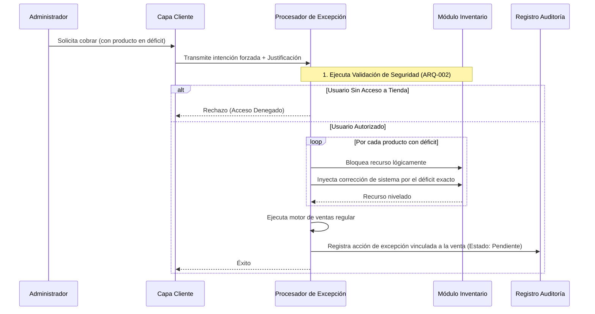

# SDD-014: Venta Forzada y Auditoría (Protocolo de Excepción)

> **Asociado a:** [FRD-014](../FRD/FRD_014_VENTA_FORZADA_Y_AUDITORIA.md)  
> **Fase del Plan:** Fase 5 (Seguridad y Sesiones)  
> **Estado:** 🟢 Auditado y Corregido (Manual QA)  
> **Políticas Aplicables:** 
  - **ARQ-002:** Reutilización obligatoria de seguridad centralizada.

---

## 0. Contexto y Restricciones Aplicables (PEA-N)

### 0.1 Políticas Globales Activadas
| Política | Impacto Específico en este SDD |
|----------|-------------------------------|
| **Independencia Logístico-Contable** | Queda terminantemente prohibido procesar una venta que deje el stock lógico en negativo. Toda Venta Forzada **DEBE** inyectar stock artificial (Corrección) de forma atómica antes de despachar el artículo. |
| **Auditoría Inviolable** | Al eludir una validación de déficit, la operación exige justificación obligatoria y registro inmutable en la bitácora de auditoría. |

### 0.2 Resultados de Auditoría
La auditoría inicial detectó vulnerabilidades críticas:
1. **Brecha Multi-Tenant:** El motor actual asume la tienda sin revalidarla contra el perfil del usuario, permitiendo ataques de escalada lateral.
2. **Condición de Carrera:** El cálculo del déficit no bloqueaba el recurso, exponiendo el sistema a inyecciones desfasadas de stock.

---

## 1. Glosario Local
* **Venta Forzada:** Acto administrativo de ignorar la validación de stock cero al cobrar un producto en mostrador, justificándose en una diferencia a favor en el inventario físico real.
* **Corrección de Sistema:** Movimiento automático generado por el servidor para compensar el faltante y evitar saldos negativos matemáticos.
* **Bloqueo Preventivo de Cierre:** Estado del cajón de dinero que impide finalizar el turno si existen ventas forzadas pendientes de visado.

---

## 2. Diagrama de Secuencia

### Caso de Uso: Protocolo de Inyección y Venta Atómica

---

## 3. Especificación Detallada de Casos de Uso

### 3.1 Ejecución de Venta Forzada
- **Precondiciones:** Dispositivo con sesión activa de administrador. Producto en carrito con stock lógico agotado pero existencia física comprobada.
- **Reglas de Negocio Aplicables:** Autorización estricta y auto-corrección atómica.
- **Flujo Principal:**
  1. El cliente detecta la anomalía de stock y verifica privilegios.
  2. El cliente solicita una justificación explícita al administrador.
  3. El cliente transmite el paquete al servidor hacia el circuito de excepción.
  4. El servidor verifica territorialidad y rol.
  5. El servidor asila los productos en déficit y bloquea su lectura concurrente.
  6. El servidor inyecta correcciones exactas para nivelar a cero el déficit.
  7. El servidor procesa la venta de forma regular.
  8. El servidor asienta el registro de auditoría en estado pendiente.
- **Postcondiciones:** Venta cobrada. Inventario final nivelado. Registro de auditoría aguardando revisión.

### 3.2 Revisión y Desbloqueo de Cierre
- **Precondiciones:** La tienda finaliza la jornada. Existen transacciones marcadas como forzadas sin visado.
- **Flujo Principal:**
  1. El usuario solicita finalizar el turno contable.
  2. El servidor interrumpe el flujo detectando registros pendientes.
  3. El cliente presenta un reporte de anomalías.
  4. El administrador analiza y otorga su conformidad (visado).
  5. El servidor levanta el bloqueo marcando los registros como revisados con fecha y autor.
  6. Procede el arqueo normal.
- **Postcondiciones:** Anomalías visadas, turno cerrado.

---

## 4. Contrato de Interfaz

### Operación: Despacho por Excepción
- **Entrada esperada:** 
  - Paquete estándar de venta (ítems, cantidades, canales).
  - Justificación textual obligatoria (mínimo 10 caracteres).
- **Reglas de transformación:** 
  - **Aislamiento Multi-Tenant:** DEBE invocar el validador central de seguridad.
  - **Atomicidad:** Todo el flujo debe ejecutarse en un bloque transaccional indivisible.
  - **Bloqueo Concurrente:** La evaluación de déficit DEBE incluir candados exclusivos de lectura para prevenir inyección de stock fantasma.
  - Todo registro logístico compensatorio usará la tipología estricta de corrección del sistema.
- **Salida esperada:** Mismo contrato de respuesta de una venta normal o excepción controlada.

---

## 5. Análisis de Seguridad

- **Control de Acceso:** El cliente es inseguro por naturaleza. El servidor no confiará en banderas de rol enviadas; validará la territorialidad para impedir forzados cruzados entre sucursales.
- **Protección de Datos:** La justificación es inmutable; ni siquiera un administrador puede borrarla una vez asentada la auditoría.
- **Superficie de Amenazas:** 
  - *Amenaza:* Condiciones de carrera (dos administradores forzando el mismo ítem simultáneamente).
  - *Mitigación:* Prevención mediante bloqueos de recurso a nivel de fila durante la inyección.
- **Trazabilidad de Auditoría:** El evento anómalo queda anclado bidireccionalmente al ticket de venta final para un rastreo absoluto del dinero involucrado.

---

## 6. Modelo de Datos Lógico

*(No aplica a nivel físico. Limita los contratos existentes de la siguiente forma):*
- El catálogo de movimientos logísticos debe admitir el concepto "Corrección de Sistema", aislado de facturas o proveedores.
- El registro de auditoría debe incluir obligatoriamente la dimensión temporal de visado (fecha) y la dimensión autoral (quién visó). La nulidad de estos campos activa el bloqueo de turno.
